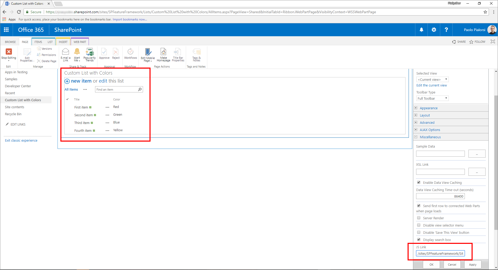
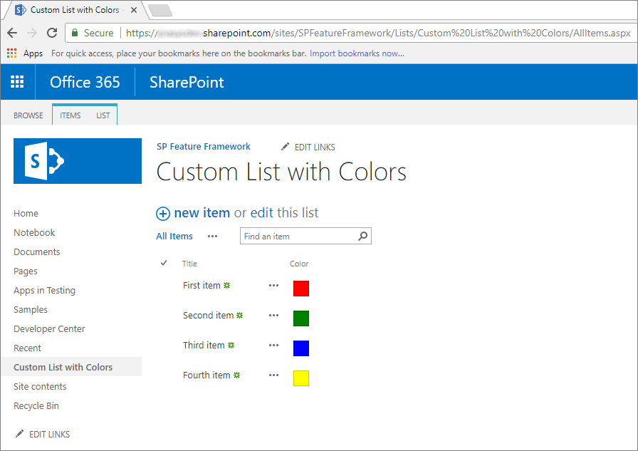
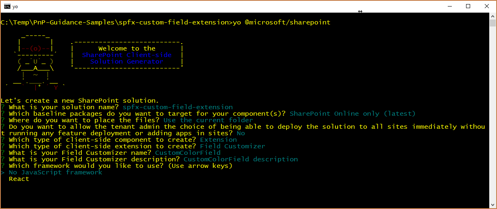
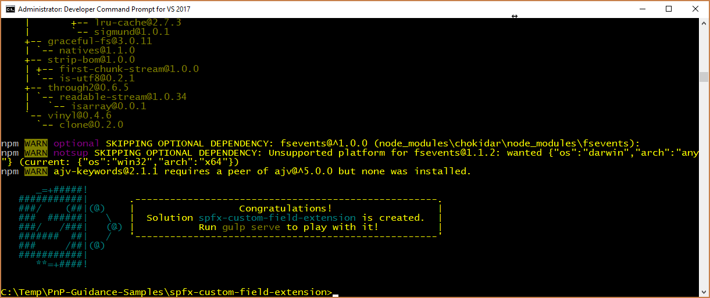
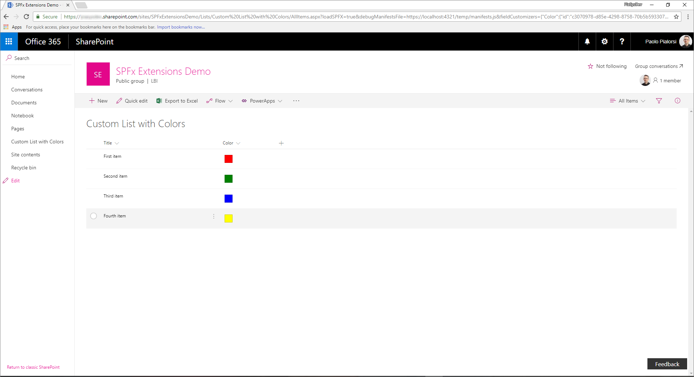
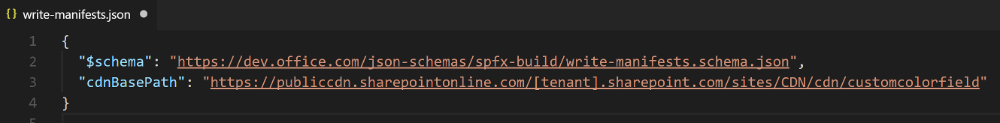
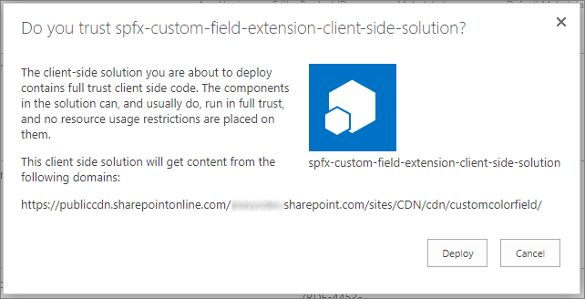
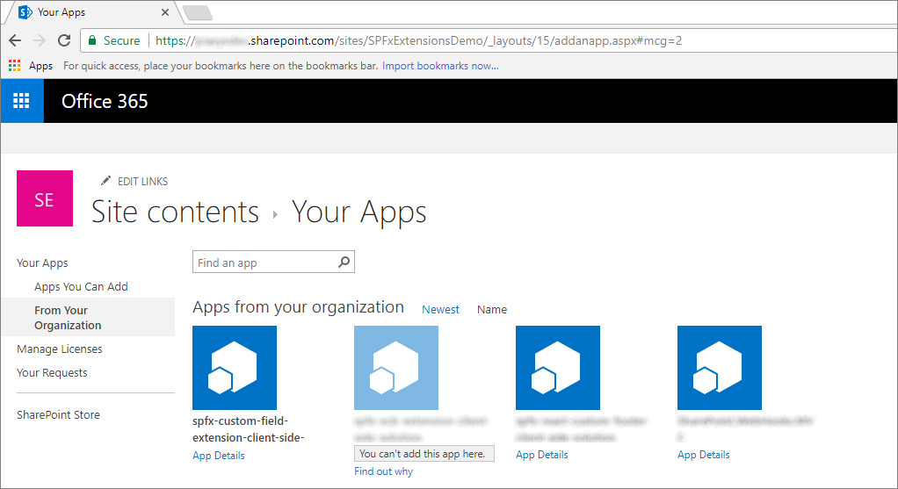
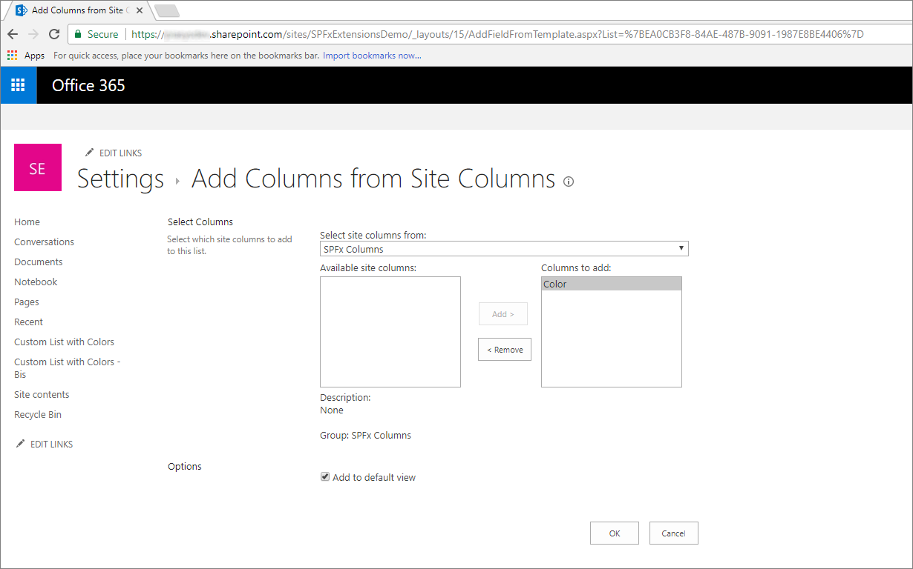
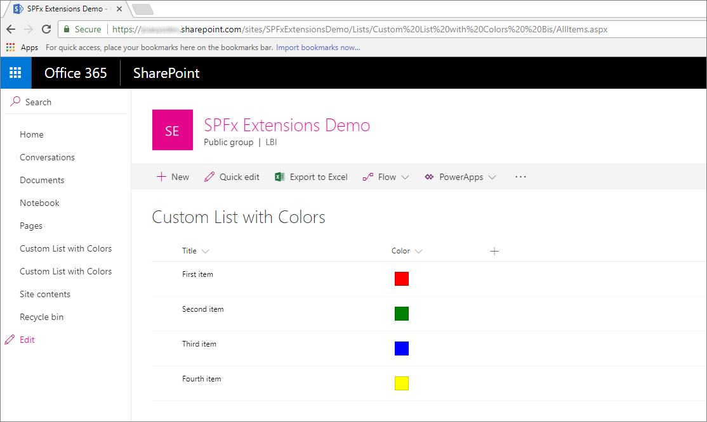

# Migrating from JSLink to SharePoint Framework Extensions

Since Microsoft SharePoint version 2013, most of the enterprise solutions built on top of Office 365 and SharePoint Online leveraged the _JSLink_ property of fields and list views to customize the rendering of fields. However nowdays, within the new "modern" UI of SharePoint Online, most of those customizations are no more available. Luckily, with the new SharePoint Framework Extensions you can now provide almost the same functionality in the "modern" UI. In this tutorial you will learn how to migrate from old "classic" customizations to the new model based on SharePoint Framework Extensions.

## Understanding SharePoint Framework Extensions

First of all, let's introduce the available options when developing SharePoint Framework Extensions:

* **Application Customizer**: extend the native "modern" UI of SharePoint Online by adding custom HTML elements and client-side code to pre-defined placeholders of "modern" pages. At the time of this writing, the available placeholders are the header and the footer of every "modern" page.
* **Command Set**: allow to add custom ECB menu items or custom buttons to the command bar of a list view for a list or a library. You can associate any JavaScript (TypeScript) action to these commands.
* **Field Customizer**: customize the rendering of a field in a list view using custom HTML elements and client-side code.

As you can argue from the above descriptions, the most useful one in our context is the "Field Customizer" extension.

> [!NOTE]
> For further details about how to build SharePoint Framework Extensions you can read the article ["Overview of SharePoint Framework Extensions"](https://docs.microsoft.com/en-us/sharepoint/dev/spfx/extensions/overview-extensions).

## Migrating a JSLink to an SPFx Field Customizer

Assume that you are in SharePoint Online, and you have a custom list with a custom field called "Color", which is of type _Choice_ and which can assume the following values: _Red_, _Green_, _Blue_, _Yellow_. Then, assume that you have custom value for the _JSLink_ property of the list view rendering web part of the custom list. In the following code snippet you can see the JavaScript code referenced by the _JSLink_ property (_customColorRendering.js_).

```JavaScript
// Define a namespace for the custom rendering code
var customJSLinkRendering = customJSLinkRendering || {}; 

// Define a function that declare the custom rendering rules for the target list view
customJSLinkRendering.CustomizeFieldRendering = function () {  

    // Define a custom object to configure the rendering template overrides
    var customRenderingOverride = {};
    customRenderingOverride.Templates = {};
    customRenderingOverride.Templates.Fields = 
    { 
        // Declare the custom rendering function for the 'View' of field 'Color'
        'Color': 
        { 
            'View': customJSLinkRendering.RenderColorField 
        } 
    }; 

    // Register the custom rendering template
    SPClientTemplates.TemplateManager.RegisterTemplateOverrides(customRenderingOverride); 
}; 

// Declare the custom rendering function for the 'View' of field 'Color'
customJSLinkRendering.RenderColorField = function (context)  
{ 
    var colorField = context.CurrentItem.Color; 

    // Declare a local variable to hold the output color
    var color = '';

    // Evaluate the values of the 'Color' field and render it accordingly
    switch (colorField)
    {
        case 'Red':
            color = 'red';
            break;
        case 'Green':
            color = 'green';
            break;
        case 'Blue':
            color = 'blue';
            break;
        case 'Yellow':
            color = 'yellow';
            break;
        default:
            color = 'white';
            break;
    }

    // Render the output for the 'Color' field
    return "<div style='float: left; width: 20px; height: 20px; margin: 5px; border: 1px solid rgba(0,0,0,.2);background:" + color + "' />"; 
}; 

// Invoke the custom rendering function
customJSLinkRendering.CustomizeFieldRendering();
```

Moreover, in the following screenshot you can see how the JSLink is configured in the list view web part.



If you uploaded the JavaScript file into the _"Site Assets"_ library, the value for the _JSLink_ property can be _"~site/SiteAssets/customColorRendering.js"_.
And here, for the sake of completeness, you can see how the custom rendering of the list works.



As you can see "Color" fields render a colored box filled with the color selected at the item level.

> [!NOTE]
> In order to provision this kind of solution in a "classic" site you can eventually use a PnP Provisioning Template, which can provision both the list with the custom field, and the JSLink at once.

In order to migrate the above solution to the SharePoint Framework, you will have to accomplish the following steps.

### Create a new SharePoint Framework solution

Once you have prepared you development environment to develop SharePoint Framework solutions, by following the instructions provided in the document ["Set up your SharePoint client-side web part development environment"](https://docs.microsoft.com/en-us/sharepoint/dev/spfx/set-up-your-development-environment), you can start creating a SharePoint Framework extension.

1. Open the command line tool of your choice (PowerShell, CMD.EXE, Cmder, etc.), create a new folder for the solution (call it _spfx-custom-field-extension_), and create a new SharePoint Framework solution by running the Yeoman generator with the following command:

```
yo @microsoft/sharepoint
```

When prompted by the tool, provide the following answers:
* Accept the default name (_spfx-custom-field-extension_) for your solution, and press Enter.
* Choose SharePoint Online only (latest), and press Enter.
* Choose Use the current folder, and press Enter.
* Choose N to require the extension to be installed on each site explicitly when it's being used.
* Choose Extension as the client-side component type to be created.
* Choose _"Field Customizer"_ as the extension type to be created.
* Provide "CustomColorField" as the name for your Field Customizer.
* Select to not use any specific JavaScript framework by selecting the _"No JavaScript framework"_ option.



At this point, Yeoman will install the required dependencies and scaffold the solution files and folders along with the _CustomColorField_ extension. This might take a few minutes.

When the scaffold is complete, you should see the following message indicating a successful scaffold:



2. To lock down the version of the project dependencies, run the following command:

```
npm shrinkwrap
```

3. Now start Visual Studio Code (or whatever else is the code editor of your choice) and start developing the solution. To start Visual Studio Code, you can execute the following statement.

```
code .
```

### Define the new Field Customizer with JavaScript

In order to reproduce the same behavior of the _JSLink_ custom field rendering, you simply need to implement the same logic using client-side code, within the new SharePoint Framework solution. To accomplish this task, complete the following steps.

1. First of all, open the file _CustomColorFieldFieldCustomizer.manifest.json_ under the _src/extensions/customColorField_ folder. Copy the value of the _id_ property and store it in a safe place, because you will need it later.

2. Now, open the _CustomColorFieldFieldCustomizer.ts_ file, still under the same folder as before and edit the content accordingly to the following code excerpt.

``` TypeScript
import { Log } from '@microsoft/sp-core-library';
import { override } from '@microsoft/decorators';
import {
  BaseFieldCustomizer,
  IFieldCustomizerCellEventParameters
} from '@microsoft/sp-listview-extensibility';

import * as strings from 'CustomColorFieldFieldCustomizerStrings';
import styles from './CustomColorFieldFieldCustomizer.module.scss';

/**
 * If your field customizer uses the ClientSideComponentProperties JSON input,
 * it will be deserialized into the BaseExtension.properties object.
 * You can define an interface to describe it.
 */
export interface ICustomColorFieldFieldCustomizerProperties {
  // This is an example; replace with your own property
  sampleText?: string;
}

const LOG_SOURCE: string = 'CustomColorFieldFieldCustomizer';

export default class CustomColorFieldFieldCustomizer
  extends BaseFieldCustomizer<ICustomColorFieldFieldCustomizerProperties> {

  @override
  public onInit(): Promise<void> {
    // Add your custom initialization to this method.  The framework will wait
    // for the returned promise to resolve before firing any BaseFieldCustomizer events.
    Log.info(LOG_SOURCE, 'Activated CustomColorFieldFieldCustomizer with properties:');
    Log.info(LOG_SOURCE, JSON.stringify(this.properties, undefined, 2));
    Log.info(LOG_SOURCE, `The following string should be equal: "CustomColorFieldFieldCustomizer" and "${strings.Title}"`);
    return Promise.resolve();
  }

  @override
  public onRenderCell(event: IFieldCustomizerCellEventParameters): void {

    var colorField = event.fieldValue; 
    
    // Declare a local variable to hold the output color
    var color = '';

    // Evaluate the values of the 'Color' field and render it accordingly
    switch (colorField)
    {
        case 'Red':
            color = 'red';
            break;
        case 'Green':
            color = 'green';
            break;
        case 'Blue':
            color = 'blue';
            break;
        case 'Yellow':
            color = 'yellow';
            break;
        default:
            color = 'white';
            break;
    }
    
    // Render the output for the 'Color' field
    event.domElement.innerHTML = "<div style='float: left; width: 20px; height: 20px; margin: 5px; border: 1px solid rgba(0,0,0,.2);background:" + color + "' />"; 
  }

  @override
  public onDisposeCell(event: IFieldCustomizerCellEventParameters): void {
    // This method should be used to free any resources that were allocated during rendering.
    // For example, if your onRenderCell() called ReactDOM.render(), then you should
    // call ReactDOM.unmountComponentAtNode() here.
    super.onDisposeCell(event);
  }
}
```

As you can see, the content of method _onRenderCell_ is almost the same of the previous _RenderColorField_ method in the _JSLink_ implementation.
The only differences are:
- To retrieve the current field value you need to read the _event.fieldValue_ property of the input argument of the _onRenderCell_ method.
- To return the custom HTML code to render the field, you need to assign a value to the _innerHTML_ property of the _event.domElement_ object, which represents the output HTML container of the field rendering.

Aside from these small changes, you can reuse almost the same JavaScript code as before.

In the following figure you can see the resulting output.



### Test the solution in debug mode

You are now ready to test your solution in debug mode. 

1. Go back to the console window and run the following command:

```
gulp serve --nobrowser
```

The above command will build the solution and run the local Node.js server to host it.

2. Now open your favorite browser and go to a "modern" list, which has a custom field with name _"Color"_ and type _Choice_ with the same value options as before (Red, Green, Blue, Yellow). You can eventually use the list you created in the "classic" site, just viewing it with the new "modern" experience. Now, append the following querystring parameters to the _AllItems.aspx_ page URL.

```
?loadSPFX=true&debugManifestsFile=https://localhost:4321/temp/manifests.js&fieldCustomizers={"Color":{"id":"c3070978-d85e-4298-8758-70b5b5933076"}}
```

In the above querystring, you will have to replace the GUID with the _id_ value you saved from the _CustomColorFieldFieldCustomizer.manifest.json_ file, and the _"Color"_ object name refers to the name of the field to customize. If you like, you can also provide a custom configuration object, serialized in JSON format, as an additional parameter for the field customizer construction.

Notice that, when executing the page request, you will be prompted with a warning message box with title "Allow debug scripts?", which asks your consent to run code from localhost, for security reasons. Of course, if you want to locally debug and test the solution, you will have to allow to "Load debug scripts".

### Define the new Field Customizer with TypeScript

You are now ready to replace the JavaScript code with TypeScript, in order to benefit of the fully typed approach of TypeScript.

1. Open the file _CustomColorFieldFieldCustomizer.module.scss_ under the _src/extensions/customColorField_ folder. This file, which is a Sassy CSS, represents the UI style for the field customizer. Replace the content of the SCSS file with the following one.

``` SCSS
.CustomColorField {
  .cell {
    float: left;
    width: 20px; 
    height: 20px; 
    margin: 5px; 
    border: 1px solid rgba(0,0,0,.2);
  }

  .cellRed {
    background: red;
  }

  .cellGreen {
    background: green;
  }

  .cellBlue {
    background: blue;
  }

  .cellYellow {
    background: yellow;
  }

  .cellWhite {
    background: white;
  }
}
```

2. Replace the implementation of the _onRenderCell_ method with the following code excerpt.

``` TypeScript
@override
public onRenderCell(event: IFieldCustomizerCellEventParameters): void {

// Read the current field value
let colorField: String = event.fieldValue; 

// Add the main style to the field container element
event.domElement.classList.add(styles.CustomColorField);

// Get a reference to the output HTML
let fieldHtml: HTMLDivElement = event.domElement.firstChild as HTMLDivElement;

// Add the standard style
fieldHtml.classList.add(styles.cell);

// Add the colored style
switch(colorField)
{
    case "Red":
    fieldHtml.classList.add(styles.cellRed);
    break;
    case "Green":
    fieldHtml.classList.add(styles.cellGreen);
    break;
    case "Blue":
    fieldHtml.classList.add(styles.cellBlue);
    break;
    case "Yellow":
    fieldHtml.classList.add(styles.cellYellow);
    break;
    default:
    fieldHtml.classList.add(styles.cellWhite);
    break;
}
}
```

Notice that the new method implementation uses a fully typed approach, and assigns the _"cell"_ CSS class to the _DIV_ element child of the current field element, together with another custom CSS class to define the target color of the _DIV_ based on the currently selected value for the field.

3. Run one more time in debug mode the field customizer and see the result.

### Package and host the solution

If you are happy with the result, you are now ready to package the solution and host it in a real hosting infrastructure.
Before building the bundle and the package, you need to declare an XML feature framework file to provision the extension.

#### Review feature framework elements
Within the code editor, open the _/sharepoint/assets_ sub-folder of the solution folder and edit the _elements.xml_ file.
In the following code excerpt you can see how the file should look like.

```XML
<?xml version="1.0" encoding="utf-8"?>
<Elements xmlns="http://schemas.microsoft.com/sharepoint/">
    <Field ID="{40475661-efaf-447a-a220-c992b20ec1c3}"
            Name="SPFxColor"
            DisplayName="Color"
            Title="Color"
            Type="Choice"
            Required="FALSE"
            Group="SPFx Columns"
            ClientSideComponentId="c3070978-d85e-4298-8758-70b5b5933076">
    </Field>
</Elements>
```

As you can see, it reminds a SharePoint Feature Framework file, it defines a custom _Field_ element with a field type _Choice_, which uses the _ClientSideComponentId_ attribute to reference the _id_ of the field customizer, and there could be a _ClientSideComponentProperties_ attribute, to configure the custom configuration properties required by the extension.

Now, open the _package-solution.json_ file under the _/config_ folder of the solution. Within the file you can see that there is a reference to the _elements.xml_ file, within the _assets_ section.

```JSON
{
  "$schema": "https://dev.office.com/json-schemas/spfx-build/package-solution.schema.json",
  "solution": {
    "name": "spfx-custom-field-extension-client-side-solution",
    "id": "ab0fbbf8-01ba-4633-8498-46cfd5652619",
    "version": "1.0.0.0",
    "features": [
      {
        "title": "Application Extension - Deployment of custom action.",
        "description": "Deploys a custom action with ClientSideComponentId association",
        "id": "090dc976-878d-44fe-8f8e-ac603d094aa1",
        "version": "1.0.0.0",
        "assets": {
          "elementManifests": [
            "elements.xml"
          ]
        }
      }
    ]
  },
  "paths": {
    "zippedPackage": "solution/spfx-custom-field-extension.sppkg"
  }
}
```

#### Enable the CDN in your Office 365 tenant

Now you need to host the extension in a hosting environment. Office 365 CDN is the easiest way to host SharePoint Framework solutions directly from your tenant while still taking advantage of the Content Delivery Network (CDN) service for faster load times of your assets.

1. Download the [SharePoint Online Management Shell](https://www.microsoft.com/en-us/download/details.aspx?id=35588) to ensure that you have the latest version.

2. Connect to your SharePoint Online tenant by using PowerShell:
    
    ```
    Connect-SPOService -Url https://[tenant]-admin.sharepoint.com
    ```
    
3. Get the current status of public CDN settings from the tenant level by executing the following commands one-by-one: 
    
    ```
    Get-SPOTenantCdnEnabled -CdnType Public
    Get-SPOTenantCdnOrigins -CdnType Public
    Get-SPOTenantCdnPolicies -CdnType Public
    ```
    
4. Enable public CDN in the tenant:
    
    ```
    Set-SPOTenantCdnEnabled -CdnType Public
    ```
    
    Public CDN has now been enabled in the tenant by using the default file type configuration allowed. This means that the following file type extensions are supported: CSS, EOT, GIF, ICO, JPEG, JPG, JS, MAP, PNG, SVG, TTF, and WOFF.

5. Open up a browser and move to a site collection where you'd like to host your CDN library. This could be any site collection in your tenant. In this tutorial, we will create a specific library to act as your CDN library, but you can also use a specific folder in any existing document library as the CDN endpoint.

6. Create a new document library on your site collection called _CDN_ and add a folder named _customcolorfield_ to it.
    
7. In the PowerShell console, add a new CDN origin. In this case, we are setting the origin as `*/cdn`, which means that any relative folder with the name of _cdn_ acts as a CDN origin.
    
    ```
    Add-SPOTenantCdnOrigin -CdnType Public -OriginUrl */cdn
    ```
    
8. Execute the following command to get the list of CDN origins from your tenant:
    
    ```
    Get-SPOTenantCdnOrigins -CdnType Public
    ```
    
Note that your newly added origin is listed as a valid CDN origin. Final configuration of the origin takes approximately 15 minutes, so we can continue provisioning the extension, which will be hosted from the origin after deployment is completed. 


When the origin is listed without the `(configuration pending)` text, it is ready to be used in your tenant. This indicates an on-going configuration between SharePoint Online and the CDN system. 

#### Update the solution settings and publish it on the CDN

Now, you need to update the solution in order to use the just created CDN as the hosting enviroment and you will need to publish the solution bundle to the CDN. To accomplish this task, just follow the upcoming steps.

1. Return to the previously created solution to perform the needed URL updates.
    
2. Update the _write-manifests.json_ file (under the _config_ folder) as follows to point to your CDN endpoint. Use `publiccdn.sharepointonline.com` as the prefix, and then extend the URL with the actual path of your tenant. The format of the CDN URL is as follows:
    
    ```
    https://publiccdn.sharepointonline.com/[tenant host name]/sites/[site]/[library]/[folder]
    ```
    
    

3. Save your changes.

4. Execute the following task to bundle your solution. This executes a release build of your project using the CDN URL specified in the _write-manifests.json_ file. The output of this command is located in the _./temp/deploy_ folder. These are the files that you need to upload to the SharePoint folder acting as your CDN endpoint. 
    
    ```
    gulp bundle --ship
    ```
    
5. Execute the following task to package your solution. This command creates an _spfx-custom-field-extension.sppkg_ package in the _sharepoint/solution_ folder and also prepares the assets in the _temp/deploy_ folder to be deployed to the CDN.
    
    ```
    gulp package-solution --ship
    ```
    
6. Upload or drag-and-drop the newly created client-side solution package to the app catalog in your tenant, and then select the _Deploy_ button.

    

7. Upload or drag-and-drop the files in the _temp/deploy_ folder to the _CDN/customcolorfield_ folder created earlier.

### Install and run the solution

You can now install the solution on any target "modern" site.

1. Open the browser and navigate to any target "modern" site.

2. Go to the _"Site Contents"_ page and select to add a new _App_.

3. Select to install a new app _"From Your Organization"_ to browse the solutions available in the _AppCatalog_.

4. Select the solution called _"spfx-custom-field-extension-client-side-solution"_ and istall it on the target site.

    

5. Once the application installation will be completed, create a new custom list, edit the list settings, and add a new column from already existing site columns. Select the group of columns called _"SPFx Columns"_ and add the _"Color"_ field.



6. Edit the just added field and configure some color values (like: Red, Green, Blue, Yellow) and save the field settings.

7. Add some items to the list and see the output in the list view. It should look like the one in the following screenshot.



Enjoy your new Field Customizer built using the SharePoint Framework extensions!
