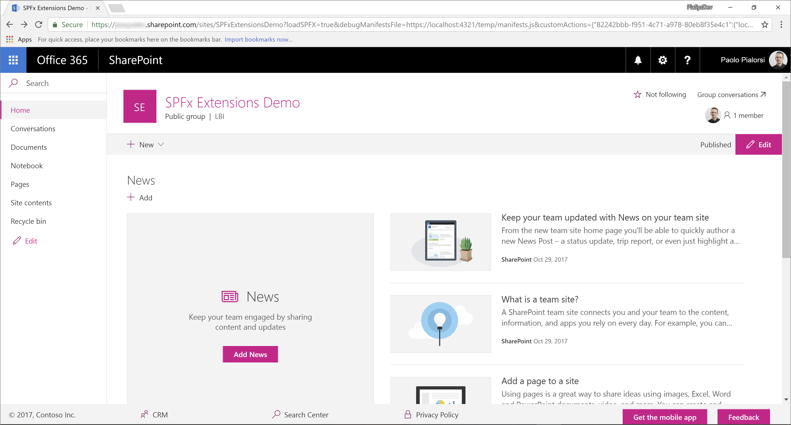

# Migrating from UserCustomAction to SharePoint Framework Extensions

During the last few years, most of the enterprise solutions built on top of Office 365 and SharePoint Online leveraged the site _CustomAction_ capability of the SharePoint Feature Framework to extend the UI of pages. However nowdays, within the new "modern" UI of SharePoint Online, most of those customizations are no more available. Luckily, with the new SharePoint Framework Extensions you can now provide almost the same functionality in the "modern" UI. In this tutorial you will learn how to migrate from old "classic" customizations to the new model based on SharePoint Framework Extensions.

## Understanding SharePoint Framework Extensions

First of all, let's introduce the available options when developing SharePoint Framework Extensions:

* **Application Customizer**: extend the native "modern" UI of SharePoint Online by adding custom HTML elements and client-side code to pre-defined placeholders of "modern" pages. At the time of this writing, the available placeholders are the header and the footer of every "modern" page.
* **Command Set**: allow to add custom ECB menu items or custom buttons to the command bar of a list view for a list or a library. You can associate any JavaScript (TypeScript) action to these commands.
* **Field Customizer**: customize the rendering of a field in a list view using custom HTML elements and client-side code.

As you can argue from the above descriptions, the most useful one in our context is the "Application Customizer" extension.

> [!NOTE]
> For further details about how to build SharePoint Framework Extensions you can read the article ["Overview of SharePoint Framework Extensions"](https://docs.microsoft.com/en-us/sharepoint/dev/spfx/extensions/overview-extensions).

## Migrating a UserCustomAction to an SPFx Application Customizer

Assume that you have a _CustomAction_ in SharePoint Online, in order to have a custom footer in all of the site's pages.
In the following code snippet you can see the XML code defining that _CustomAction_ using the SharePoint Feature Framework.

```XML
<?xml version="1.0" encoding="utf-8"?>
<Elements xmlns="http://schemas.microsoft.com/sharepoint/">
  <CustomAction Id="jQueryCDN"
                Title="jQueryCDN"
                Description="Loads jQuery from the public CDN"
                ScriptSrc="https://code.jquery.com/jquery-3.2.1.slim.min.js"
                Location="ScriptLink"
                Sequence="100" />
  <CustomAction Id="spoCustomBar"
                Title="spoCustomBar"
                Description="Loads a script to rendere a custom footer"
                Location="ScriptLink"
                ScriptSrc="SiteAssets/SPOCustomUI.js"
                Sequence="200" />
</Elements>
```

As you can see, the feature elements file defines a couple of elements of type _CustomAction_ to include in the pages of the target site both jQuery, loaded through the public CDN, and a custom JavaScript file that renders the custom footer.

Moreover and for the sake of completeness, here you can see the JavaScript code that renders a custom footer, whose menu items are pre-defined in code for the sake of simplicity.

```JavaScript
var SPOCustomUI = SPOCustomUI || {};

SPOCustomUI.setUpCustomFooter = function () {
    if ($("#SPOCustomFooter").length)
        return;

    var footerContainer = $("<div>");
    footerContainer.attr("id", "SPOCustomFooter");

    footerContainer.append("<ul>");

    $("#s4-workspace").append(footerContainer);
}

SPOCustomUI.addCustomFooterText = function (id, text) {
    if ($("#" + id).length)
        return;

    var customElement = $("<div>");
    customElement.attr("id", id);
    customElement.html(text);

    $("#SPOCustomFooter > ul").before(customElement);

    return customElement;
}

SPOCustomUI.addCustomFooterLink = function (id, text, url) {
    if ($("#" + id).length)
        return;

    var customElement = $("<a>");
    customElement.attr("id", id);
    customElement.attr("href", url);
    customElement.html(text);

    $("#SPOCustomFooter > ul").append($("<li>").append(customElement));

    return customElement;
}

SPOCustomUI.loadCSS = function (url) {
    var head = document.getElementsByTagName('head')[0];
    var style = document.createElement('link');
    style.type = 'text/css';
    style.rel = 'stylesheet';
    style.href = url;
    head.appendChild(style);
}

SPOCustomUI.init = function (whenReadyDoFunc) {
    // avoid executing inside iframes (used by Sharepoint for dialogs)
    if (self !== top) return;

    if (!window.jQuery) {
        // jQuery is needed for Custom Bar to run
        setTimeout(function () { SPOCustomUI.init(whenReadyDoFunc); }, 50);
    } else {
        $(function () {
            SPOCustomUI.setUpCustomFooter();
            whenReadyDoFunc();
        });
    }
}

// The following initializes the custom footer with some fake links
SPOCustomUI.init(function () {

    var currentScriptUrl;

    var currentScript = document.querySelectorAll("script[src*='SPOCustomUI']");
    if (currentScript.length > 0) {
        currentScriptUrl = currentScript[0].src;
    }
    if (currentScriptUrl != undefined) {
        var currentScriptBaseUrl = currentScriptUrl.substring(0, currentScriptUrl.lastIndexOf('/') + 1);
        SPOCustomUI.loadCSS(currentScriptBaseUrl + 'SPOCustomUI.css');
    }

    SPOCustomUI.addCustomFooterText('SPOFooterCopyright', '&copy; 2017, Contoso Inc.');
    SPOCustomUI.addCustomFooterLink('SPOFooterCRMLink', 'CRM', 'CRM.aspx');
    SPOCustomUI.addCustomFooterLink('SPOFooterSearchLink', 'Search Center', 'SearchCenter.aspx');
    SPOCustomUI.addCustomFooterLink('SPOFooterPrivacyLink', 'Privacy Policy', 'Privacy.aspx');
});
```

In the following figure you can see the output of the previous custom action, within the home page of a classic site.


In order to migrate the above solution to the "modern" UI, you will have to accomplish the following steps.

### Create a new SharePoint Framework solution

Once you have prepared you development environment to develop SharePoint Framework solutions, by following the instructions provided in the document ["Set up your SharePoint client-side web part development environment"](https://docs.microsoft.com/en-us/sharepoint/dev/spfx/set-up-your-development-environment), you can start creating a SharePoint Framework extension.

1. Open the command line tool of your choice (PowerShell, CMD.EXE, Cmder, etc.), create a new folder for the solution (call it _spfx-react-custom-footer_), and create a new SharePoint Framework solution by running the Yeoman generator with the following command:

```
yo @microsoft/sharepoint
```

When prompted by the tool, provide the following answers:
* Accept the default name (_spfx-react-custom-footer_) for your solution, and press Enter.
* Choose SharePoint Online only (latest), and press Enter.
* Choose Use the current folder, and press Enter.
* Choose N to require the extension to be installed on each site explicitly when it's being used.
* Choose Extension as the client-side component type to be created.
* Choose Application Customizer as the extension type to be created.
* Provide "CustomFooter" as the name for your Application Customizer.


At this point, Yeoman will install the required dependencies and scaffold the solution files and folders along with the _CustomFooter_ extension. This might take a few minutes.

When the scaffold is complete, you should see the following message indicating a successful scaffold:


2. To lock down the version of the project dependencies, run the following command:

```
npm shrinkwrap
```

3. Now start Visual Studio Code (or whatever else is the code editor of your choice) and start developing the solution. To start Visual Studio Code, you can execute the following statement.

```
code .
```

### Define the new UI elements

The UI elements of the custom footer will be rendered using React and a custom React component. Of course, you can create the UI elements of the sample footer with whatever technology you like. In this tutorial, we use React in order to leverage the Office UI Fabric components for React.

> [!NOTE]
> For further details about developing solutions with React, you can read the following tutorial: [Tutorial: Intro to React](https://reactjs.org/tutorial/tutorial.html).

1. First of all, open the file _CustomFooterApplicationCustomizer.manifest.json_ under the _src/extensions/customFooter_ folder. Copy the value of the _id_ property and store it in a safe place, because you will need it later.

2. Now, open the _CustomFooterApplicationCustomizer.ts_ file, still under the same folder as before and import the types _PlaceholderContent_ and _PlaceholderName_ from the package _'@microsoft/sp-application-base'_.
Moreover, at the very beginning of the file, add the import directives for React.

In the following code excerpt you can see the imports section of the _CustomFooterApplicationCustomizer.ts_ file.

``` TypeScript
import * as React from 'react';
import * as ReactDom from 'react-dom';

import { override } from '@microsoft/decorators';
import { Log } from '@microsoft/sp-core-library';
import {
  BaseApplicationCustomizer,
  PlaceholderContent,
  PlaceholderName
} from '@microsoft/sp-application-base';
import { Dialog } from '@microsoft/sp-dialog';

import * as strings from 'CustomFooterApplicationCustomizerStrings';
import CustomFooter from './components/CustomFooter';
```

3. Locate the definition of the class _CustomFooterApplicationCustomizer_ and declare a new private member called __bottomPlaceholder_ of type _PlaceholderContent | undefined_.
Now within the override of the _onInit_ method invoke a custom function called __renderPlaceHolders_, and define that function.

In the following code excerpt you can see the implementation of the custom footer application customizer class.

``` TypeScript
/** A Custom Action which can be run during execution of a Client Side Application */
export default class CustomFooterApplicationCustomizer
  extends BaseApplicationCustomizer<ICustomFooterApplicationCustomizerProperties> {

  // This private member holds a reference to the page's footer
  private _bottomPlaceholder: PlaceholderContent | undefined;

  @override
  public onInit(): Promise<void> {
    Log.info(LOG_SOURCE, `Initialized ${strings.Title}`);

    let message: string = this.properties.testMessage;
    if (!message) {
      message = '(No properties were provided.)';
    }

    // Call render method for rendering the needed html elements
    this._renderPlaceHolders();

    return Promise.resolve();
  }

  private _renderPlaceHolders(): void {

    // Handling the bottom placeholder
    if (!this._bottomPlaceholder) {
      this._bottomPlaceholder =
        this.context.placeholderProvider.tryCreateContent(
          PlaceholderName.Bottom);

      // The extension should not assume that the expected placeholder is available.
      if (!this._bottomPlaceholder) {
        console.error('The expected placeholder (Bottom) was not found.');
        return;
      }

      const element: React.ReactElement<{}> = React.createElement(CustomFooter);
    
      ReactDom.render(element, this._bottomPlaceholder.domElement);
    }
  }
}
```

First of all, the  __renderPlaceHolders_ method searches for the placeholder of type _Bottom_ and if any it renders its content.
In fact, at the very end of the __renderPlaceHolders_ method the code creates a new instance of a _CustomFooter_ React component, and renders it within the placeholder of the pages' bottom (i.e. where the footer should be rendered).

> [!NOTE]
> The React component will be the replacement, in the "modern" UI for the JavaScript file in the "classic" model. Of course, you can render the entire footer still using pure JavaScript code and reusing most of the code that you already have. However, it is better to consider to upgrade the implementation not only from a technology perspective, but also from a code perspective.

4. Add a new folder called components within the _src/extensions/customFooter_ folder. Create a new file within the new folder, call it _CustomFooter.tsx_.
In the following code excerpt you can see the component source file.

```TypeScript
import * as React from 'react';

import { CommandButton } from 'office-ui-fabric-react/lib/Button';

export default class CustomFooter extends React.Component<{}, {}> {

  public render(): React.ReactElement<{}> {

    return (
      <div className={`ms-bgColor-neutralLighter ms-fontColor-white`}>
        <div className={`ms-bgColor-neutralLighter ms-fontColor-white`}>
            <div className={`ms-Grid`}>
                <div className="ms-Grid-row">
                    <div className="ms-Grid-col ms-sm2 ms-md2 ms-lg2">
                        <CommandButton 
                            data-automation="CopyRight"
                            href={`CRM.aspx`}>&copy; 2017, Contoso Inc.</CommandButton>
                    </div>
                    <div className="ms-Grid-col ms-sm2 ms-md2 ms-lg2">
                    <CommandButton 
                            data-automation="CRM"
                            iconProps={ { iconName: 'People' } }
                            href={`CRM.aspx`}>CRM</CommandButton>
                    </div>
                    <div className="ms-Grid-col ms-sm2 ms-md2 ms-lg2">
                    <CommandButton 
                            data-automation="SearchCenter"
                            iconProps={ { iconName: 'Search' } }
                            href={`SearchCenter.aspx`}>Search Center</CommandButton>
                    </div>
                    <div className="ms-Grid-col ms-sm2 ms-md2 ms-lg2">
                        <CommandButton 
                            data-automation="Privacy"
                            iconProps={ { iconName: 'Lock' } }
                            href={`Privacy.aspx`}>Privacy Policy</CommandButton>
                    </div>
                    <div className="ms-Grid-col ms-sm4 ms-md4 ms-lg4">
                    </div>
                </div>
            </div>
        </div>
      </div>
    );
  }
}
```

Teaching you how to write a React component is out of scope for this document. Nevertheless, notice the _import_ statements at the beginning, where the component imports React, and the _CommandButton_ React component from the Office UI Fabric components library.
Moreover, in the _render_ method of the component, it is defined the output of the _CustomFooter_ with few instances of the _CommandButton_ component for the links in the footer.
All the HTML output is wrapped within a Grid layout of Office UI Fabric.
> [!NOTE]
> For further details about the grid layout of Office UI Fabric, you can read the document [Responsive Layout](https://developer.microsoft.com/en-us/fabric#/styles/layout).

In the following figure you can see the resulting output.



### Test the solution in debug mode

You are now ready to test your solution in debug mode. 

1. Go back to the console window and run the following command:

```
gulp serve --nobrowser
```

The above command will build the solution and run the local Node.js server to host it.

2. Now open your favorite browser and go to a "modern" page of any "modern" team site. Now, append the following querystring parameters to the page's URL.

```
?loadSPFX=true&debugManifestsFile=https://localhost:4321/temp/manifests.js&customActions={"82242bbb-f951-4c71-a978-80eb8f35e4c1":{"location":"ClientSideExtension.ApplicationCustomizer"}}
```

In the above querystring, you will have to replace the GUID with the _id_ value you saved from the _CustomFooterApplicationCustomizer.manifest.json_ file. Notice that, when executing the page request, you will be prompted with a warning message box with title "Allow debug scripts?", which asks your consent to run code from localhost, for security reasons. Of course, if you want to locally debug and test the solution, you will have to allow to "Load debug scripts".

### Package and host the solution

If you are happy with the result, you are now ready to package the solution and host it in a real hosting infrastructure.
Before building the bundle and the package, you need to declare an XML feature framework file to provision the extension.

#### Review feature framework elements

Within the code editor, open the _/sharepoint/assets_ sub-folder of the solution folder and edit the _elements.xml_ file.
In the following code excerpt you can see how the file should look like.

```XML
<?xml version="1.0" encoding="utf-8"?>
<Elements xmlns="http://schemas.microsoft.com/sharepoint/">
    <CustomAction
        Title="CustomFooter"
        Location="ClientSideExtension.ApplicationCustomizer"
        ClientSideComponentId="82242bbb-f951-4c71-a978-80eb8f35e4c1">
    </CustomAction>
</Elements>
```

As you can see, it reminds the SharePoint Feature Framework file that we saw in the "classic" model, but it uses the _ClientSideComponentId_ attribute to reference the _id_ of the custom extension. You can also add a _ClientSideComponentProperties_ attribute, if you need to provide custom settings to the extension, which is not the case in this tutorial.

Now, open the _package-solution.json_ file under the _/config_ folder of the solution. Within the file you can see that there is a reference to the _elements.xml_ file, within the _assets_ section.

```JSON
{
  "$schema": "https://dev.office.com/json-schemas/spfx-build/package-solution.schema.json",
  "solution": {
    "name": "spfx-react-custom-footer-client-side-solution",
    "id": "911728a5-7bde-4453-97b2-2eba59277ed3",
    "version": "1.0.0.0",
    "features": [
      {
        "title": "Application Extension - Deployment of custom action.",
        "description": "Deploys a custom action with ClientSideComponentId association",
        "id": "f16a2612-3163-46ad-9664-3d3daac68cff",
        "version": "1.0.0.0",
        "assets": {
          "elementManifests": [
            "elements.xml"
          ]
        }
      }
    ]
  },
  "paths": {
    "zippedPackage": "solution/spfx-react-custom-footer.sppkg"
  }
}
```

#### Enable the CDN in your Office 365 tenant
Now you need to host the extension in a hosting environment. Office 365 CDN is the easiest way to host SharePoint Framework solutions directly from your tenant while still taking advantage of the Content Delivery Network (CDN) service for faster load times of your assets.

1. Download the [SharePoint Online Management Shell](https://www.microsoft.com/en-us/download/details.aspx?id=35588) to ensure that you have the latest version.

2. Connect to your SharePoint Online tenant by using PowerShell:
    
    ```
    Connect-SPOService -Url https://[tenant]-admin.sharepoint.com
    ```
    
3. Get the current status of public CDN settings from the tenant level by executing the following commands one-by-one: 
    
    ```
    Get-SPOTenantCdnEnabled -CdnType Public
    Get-SPOTenantCdnOrigins -CdnType Public
    Get-SPOTenantCdnPolicies -CdnType Public
    ```
    
4. Enable public CDN in the tenant:
    
    ```
    Set-SPOTenantCdnEnabled -CdnType Public
    ```
    
    Public CDN has now been enabled in the tenant by using the default file type configuration allowed. This means that the following file type extensions are supported: CSS, EOT, GIF, ICO, JPEG, JPG, JS, MAP, PNG, SVG, TTF, and WOFF.

5. Open up a browser and move to a site collection where you'd like to host your CDN library. This could be any site collection in your tenant. In this tutorial, we will create a specific library to act as your CDN library, but you can also use a specific folder in any existing document library as the CDN endpoint.

6. Create a new document library on your site collection called _CDN_ and add a folder named _customfooter_ to it.
    
7. In the PowerShell console, add a new CDN origin. In this case, we are setting the origin as `*/cdn`, which means that any relative folder with the name of _cdn_ acts as a CDN origin.
    
    ```
    Add-SPOTenantCdnOrigin -CdnType Public -OriginUrl */cdn
    ```
    
8. Execute the following command to get the list of CDN origins from your tenant:
    
    ```
    Get-SPOTenantCdnOrigins -CdnType Public
    ```
    
Note that your newly added origin is listed as a valid CDN origin. Final configuration of the origin takes approximately 15 minutes, so we can continue provisioning the extension, which will be hosted from the origin after deployment is completed. 


When the origin is listed without the `(configuration pending)` text, it is ready to be used in your tenant. This indicates an on-going configuration between SharePoint Online and the CDN system. 

#### Update the solution settings and publish it on the CDN

Now, you need to update the solution in order to use the just created CDN as the hosting enviroment and you will need to publish the solution bundle to the CDN. To accomplish this task, just follow the upcoming steps.

1. Return to the previously created solution to perform the needed URL updates.
    
2. Update the _write-manifests.json_ file (under the _config_ folder) as follows to point to your CDN endpoint. Use `publiccdn.sharepointonline.com` as the prefix, and then extend the URL with the actual path of your tenant. The format of the CDN URL is as follows:
    
    ```
    https://publiccdn.sharepointonline.com/[tenant host name]/sites/[site]/[library]/[folder]
    ```
    
    

3. Save your changes.

4. Execute the following task to bundle your solution. This executes a release build of your project using the CDN URL specified in the _write-manifests.json_ file. The output of this command is located in the _./temp/deploy_ folder. These are the files that you need to upload to the SharePoint folder acting as your CDN endpoint. 
    
    ```
    gulp bundle --ship
    ```
    
5. Execute the following task to package your solution. This command creates an _spfx-react-custom-footer.sppkg_ package in the _sharepoint/solution_ folder and also prepares the assets in the _temp/deploy_ folder to be deployed to the CDN.
    
    ```
    gulp package-solution --ship
    ```
    
6. Upload or drag-and-drop the newly created client-side solution package to the app catalog in your tenant, and then select the _Deploy_ button.

    

7. Upload or drag-and-drop the files in the _temp/deploy_ folder to the _CDN/customfooter_ folder created earlier.

### Install and run the solution

You can now install the solution on any target "modern" site.

1. Open the browser and navigate to any target "modern" site.

2. Go to the _"Site Contents"_ page and select to add a new _App_.

3. Select to install a new app _"From Your Organization"_ to browse the solutions available in the _AppCatalog_.

4. Select the solution called _"spfx-react-custom-footer-client-side-solution"_ and istall it on the target site.

    

5. Once the application installation will be completed, refresh the page or go to the home page of the site. You should be able to see the custom footer in action.

Enjoy your new custom footer built using the SharePoint Framework extensions!
