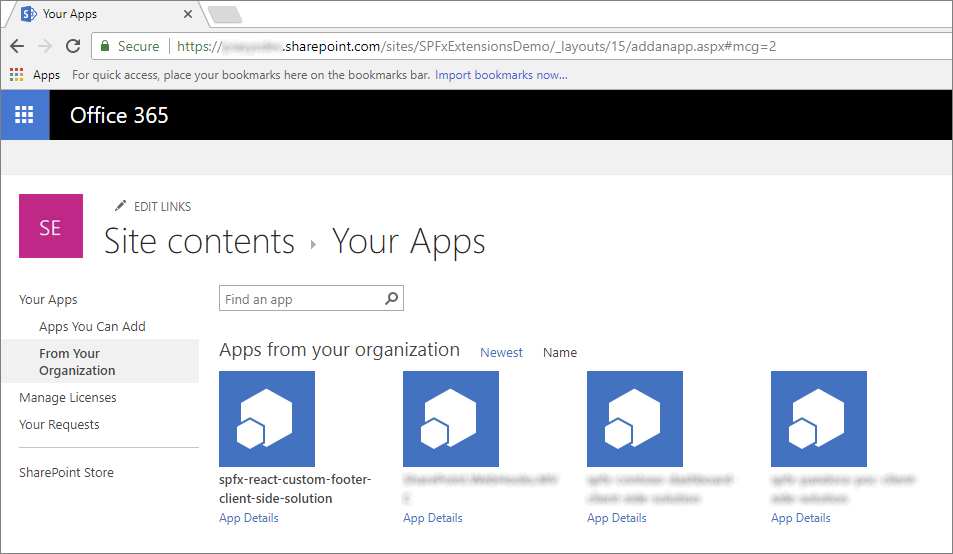

# Migrating from UserCustomAction to SharePoint Framework extensions

Many enterprise solutions built on top of Microsoft 365 and SharePoint Online leveraged the site *CustomAction* capability of the SharePoint Feature Framework to extend the UI of pages. In the current "modern" UI of SharePoint Server 2019 and SharePoint Online, most of those customizations are no longer available. Fortunately, with SharePoint Framework extensions, you can provide similar functionality in the "modern" UI.

In this tutorial, you learn how to migrate from the old "classic" customizations to the new model based on SharePoint Framework extensions.

First, let's introduce the available options when developing SharePoint Framework extensions:

- **Application Customizer**: Extend the native "modern" UI of SharePoint by adding custom HTML elements and client-side code to pre-defined placeholders of "modern" pages. For more information on application customizers, see [Build your first SharePoint Framework Extension (Hello World part 1)](../get-started/build-a-hello-world-extension.md).
- **Command Set**: Add custom Edit Control Block (ECB) menu items or custom buttons to the command bar of a list view for a list or a library. You can associate any client-side action to these commands. For more information on command sets, see [Build your first ListView Command Set extension](../get-started/building-simple-cmdset-with-dialog-api.md).
- **Field Customizer**: Customize the rendering of a field in a list view by using custom HTML elements and client-side code. For more information on field customizers, see [Build your first Field Customizer extension](../get-started/building-simple-field-customizer.md).

The most useful option in this context is the Application Customizer extension.

Assume that you have a *CustomAction* in SharePoint Online to have a custom footer in all of the site's pages.

In the following code snippet, you can see the XML code defining that *CustomAction* by using the SharePoint Feature Framework.

```XML
<?xml version="1.0" encoding="utf-8"?>
<Elements xmlns="http://schemas.microsoft.com/sharepoint/">
  <CustomAction Id="jQueryCDN"
                Title="jQueryCDN"
                Description="Loads jQuery from the public CDN"
                ScriptSrc="https://code.jquery.com/jquery-3.2.1.slim.min.js"
                Location="ScriptLink"
                Sequence="100" />
  <CustomAction Id="spoCustomBar"
                Title="spoCustomBar"
                Description="Loads a script to rendere a custom footer"
                Location="ScriptLink"
                ScriptSrc="SiteAssets/SPOCustomUI.js"
                Sequence="200" />
</Elements>
```

As you can see, the feature elements file defines a few elements of type *CustomAction* to include in the pages of the target site: jQuery, loaded through the public CDN, and a custom JavaScript file that renders the custom footer.

For the sake of completeness, you can see the JavaScript code that renders a custom footer, whose menu items are pre-defined in code for the sake of simplicity.

```JavaScript
var SPOCustomUI = SPOCustomUI || {};

SPOCustomUI.setUpCustomFooter = function () {
  if ($("#SPOCustomFooter").length)
    return;

  var footerContainer = $("<div>");
  footerContainer.attr("id", "SPOCustomFooter");

  footerContainer.append("<ul>");

  $("#s4-workspace").append(footerContainer);
}

SPOCustomUI.addCustomFooterText = function (id, text) {
  if ($("#" + id).length)
    return;

  var customElement = $("<div>");
  customElement.attr("id", id);
  customElement.html(text);

  $("#SPOCustomFooter > ul").before(customElement);

  return customElement;
}

SPOCustomUI.addCustomFooterLink = function (id, text, url) {
  if ($("#" + id).length)
    return;

  var customElement = $("<a>");
  customElement.attr("id", id);
  customElement.attr("href", url);
  customElement.html(text);

  $("#SPOCustomFooter > ul").append($("<li>").append(customElement));

  return customElement;
}

SPOCustomUI.loadCSS = function (url) {
  var head = document.getElementsByTagName('head')[0];
  var style = document.createElement('link');
  style.type = 'text/css';
  style.rel = 'stylesheet';
  style.href = url;
  head.appendChild(style);
}

SPOCustomUI.init = function (whenReadyDoFunc) {
  // avoid executing inside iframes (used by SharePoint for dialogs)
  if (self !== top) return;

  if (!window.jQuery) {
    // jQuery is needed for Custom Bar to run
    setTimeout(function () { SPOCustomUI.init(whenReadyDoFunc); }, 50);
  } else {
    $(function () {
      SPOCustomUI.setUpCustomFooter();
      whenReadyDoFunc();
    });
  }
}

// The following initializes the custom footer with some fake links
SPOCustomUI.init(function () {
  var currentScriptUrl;

  var currentScript = document.querySelectorAll("script[src*='SPOCustomUI']");
  if (currentScript.length > 0) {
    currentScriptUrl = currentScript[0].src;
  }
  if (currentScriptUrl != undefined) {
    var currentScriptBaseUrl = currentScriptUrl.substring(0, currentScriptUrl.lastIndexOf('/') + 1);
    SPOCustomUI.loadCSS(currentScriptBaseUrl + 'SPOCustomUI.css');
  }

  SPOCustomUI.addCustomFooterText('SPOFooterCopyright', '&copy; 2017, Contoso Inc.');
  SPOCustomUI.addCustomFooterLink('SPOFooterCRMLink', 'CRM', 'CRM.aspx');
  SPOCustomUI.addCustomFooterLink('SPOFooterSearchLink', 'Search Center', 'SearchCenter.aspx');
  SPOCustomUI.addCustomFooterLink('SPOFooterPrivacyLink', 'Privacy Policy', 'Privacy.aspx');
});
```

In the following figure you can see the output of the previous custom action, within the home page of a classic site.


To migrate the previous solution to the "modern" UI, see the following steps.

## Create a new SharePoint Framework solution

1. From the console, create a new folder for your project:

    ```console
    md spfx-react-custom-footer
    ```

1. Go to the project folder:

    ```console
    cd spfx-react-custom-footer
    ```

1. In the project folder, run the SharePoint Framework Yeoman generator to scaffold a new SharePoint Framework project:

    ```console
    yo @microsoft/sharepoint
    ```

1. When prompted, enter the following values (*select the default option for all prompts omitted below*):

    - **What is your solution name?**: spfx-react-custom-footer
    - **Which baseline packages do you want to target for your component(s)?**: SharePoint Online only (latest)
    - **Which type of client-side component to create?**: Extension
    - **Which type of client-side extension to create?** Application Customizer
    - **What is your Field Customizer name?** CustomFooter

    At this point, Yeoman installs the required dependencies and scaffolds the solution files and folders along with the **CustomFooter** extension. This might take a few minutes.

1. Start Visual Studio Code (or the code editor of your choice) and start developing the solution. To start Visual Studio Code, you can execute the following statement.

    ```console
    code .
    ```

## Define the new UI elements

The UI elements of the custom footer are rendered using React and a custom React component. You can create the UI elements of the sample footer with whatever technology you like. In this tutorial, we use React to leverage the Office UI Fabric components for React.

1. Open the file **./src/extensions/customFooter/CustomFooterApplicationCustomizer.manifest.json** folder. Copy the value of the `id` property and store it in a safe place because you need it later.
1. Open the file **./src/extensions/customFooter/CustomFooterApplicationCustomizer.ts**, and import the types `PlaceholderContent` and `PlaceholderName` from the package **\@microsoft/sp-application-base**.

    And, at the very beginning of the file, add the `import` directives for React.

    In the following code excerpt, you can see the imports section of the **CustomFooterApplicationCustomizer.ts** file.

    ```TypeScript
    import * as React from 'react';
    import * as ReactDom from 'react-dom';

    import { override } from '@microsoft/decorators';
    import { Log } from '@microsoft/sp-core-library';
    import {
      BaseApplicationCustomizer,
      PlaceholderContent,
      PlaceholderName
    } from '@microsoft/sp-application-base';
    import { Dialog } from '@microsoft/sp-dialog';

    import * as strings from 'CustomFooterApplicationCustomizerStrings';
    import CustomFooter from './components/CustomFooter';
    ```

1. Locate the definition of the class `CustomFooterApplicationCustomizer` and declare a new private member called `bottomPlaceholder` of type `PlaceholderContent | undefined`.
1. Within the override of the `onInit()` method, invoke a custom function called `renderPlaceHolders`, and define that function.

    In the following code excerpt, you can see the implementation of the custom footer Application Customizer class.

    ```TypeScript
    /** A Custom Action which can be run during execution of a Client Side Application */
    export default class CustomFooterApplicationCustomizer
    extends BaseApplicationCustomizer<ICustomFooterApplicationCustomizerProperties> {

      // This private member holds a reference to the page's footer
      private _bottomPlaceholder: PlaceholderContent | undefined;

      @override
      public onInit(): Promise<void> {
        Log.info(LOG_SOURCE, `Initialized ${strings.Title}`);

        let message: string = this.properties.testMessage;
        if (!message) {
          message = '(No properties were provided.)';
        }

        // Call render method for rendering the needed html elements
        this._renderPlaceHolders();

        return Promise.resolve();
      }

      private _renderPlaceHolders(): void {

        // Handling the bottom placeholder
        if (!this._bottomPlaceholder) {
          this._bottomPlaceholder =
            this.context.placeholderProvider.tryCreateContent(PlaceholderName.Bottom);

          // The extension should not assume that the expected placeholder is available.
          if (!this._bottomPlaceholder) {
            console.error('The expected placeholder (Bottom) was not found.');
            return;
          }

          const element: React.ReactElement<{}> = React.createElement(CustomFooter);

          ReactDom.render(element, this._bottomPlaceholder.domElement);
        }
      }
    }
    ```

    The `renderPlaceHolders()` method searches for the placeholder of type `Bottom`, and if any, it renders its content. In fact, at the very end of the `renderPlaceHolders()` method, the code creates a new instance of a `CustomFooter` React component, and renders it within the placeholder of the pages' bottom (that is, where the footer should be rendered).

    > [!NOTE]
    > The React component is the replacement in the "modern" UI for the JavaScript file in the "classic" model. Of course, you can render the entire footer by using pure JavaScript code and reusing most of the code that you already have. However, it is better to consider to upgrade the implementation not only from a technology perspective, but also from a code perspective.

1. Add a new folder named **components** in the **src/extensions/customFooter** folder.
1. Create a new file within the new folder, and name it **CustomFooter.tsx**.

    Add the following code to this file:

    ```TypeScript
    import * as React from 'react';
    import { CommandButton } from 'office-ui-fabric-react/lib/Button';

    export default class CustomFooter extends React.Component<{}, {}> {
      public render(): React.ReactElement<{}> {
        return (
          <div className={`ms-bgColor-neutralLighter ms-fontColor-white`}>
            <div className={`ms-bgColor-neutralLighter ms-fontColor-white`}>
              <div className={`ms-Grid`}>
                <div className="ms-Grid-row">
                  <div className="ms-Grid-col ms-sm2 ms-md2 ms-lg2">
                    <CommandButton
                        data-automation="CopyRight"
                        href={`CRM.aspx`}>&copy; 2017, Contoso Inc.</CommandButton>
                  </div>
                  <div className="ms-Grid-col ms-sm2 ms-md2 ms-lg2">
                    <CommandButton
                            data-automation="CRM"
                            iconProps={ { iconName: 'People' } }
                            href={`CRM.aspx`}>CRM</CommandButton>
                  </div>
                  <div className="ms-Grid-col ms-sm2 ms-md2 ms-lg2">
                    <CommandButton
                            data-automation="SearchCenter"
                            iconProps={ { iconName: 'Search' } }
                            href={`SearchCenter.aspx`}>Search Center</CommandButton>
                  </div>
                  <div className="ms-Grid-col ms-sm2 ms-md2 ms-lg2">
                    <CommandButton
                        data-automation="Privacy"
                        iconProps={ { iconName: 'Lock' } }
                        href={`Privacy.aspx`}>Privacy Policy</CommandButton>
                  </div>
                  <div className="ms-Grid-col ms-sm4 ms-md4 ms-lg4"></div>
                </div>
              </div>
            </div>
          </div>
        );
      }
    }
    ```

    Teaching you how to write a React component is out of scope for this document. Notice the `import` statements at the beginning, where the component imports React, and the `CommandButton` React component from the Office UI Fabric components library.

    In the `render()` method of the component, it defined the output of the `CustomFooter` with few instances of the `CommandButton` component for the links in the footer. All the HTML output is wrapped within a Grid layout of Office UI Fabric.

    > [!NOTE]
    > For more information about the grid layout of Office UI Fabric, see [Responsive Layout](https://developer.microsoft.com/fabric#/styles/layout).

    In the following figure, you can see the resulting output.

    

## Test the solution in debug mode

1. Go back to the console window and run the following command to build the solution and run the local Node.js server to host it.

    ```console
    gulp serve --nobrowser
    ```

1. Now open your favorite browser and go to a "modern" page of any "modern" team site. Now, append the following query string parameters to the page's URL.

    ```html
    ?loadSPFX=true&debugManifestsFile=https://localhost:4321/temp/manifests.js&customActions={"82242bbb-f951-4c71-a978-80eb8f35e4c1":{"location":"ClientSideExtension.ApplicationCustomizer"}}
    ```

    In this query string, replace the GUID with the `id` value you saved from the **CustomFooterApplicationCustomizer.manifest.json** file.

    Notice that when executing the page request, you're prompted with a warning message box with the title "Allow debug scripts?", which asks your consent to run code from localhost for security reasons. If you want to locally debug and test the solution, you have to allow it to "Load debug scripts."

    > [!NOTE]
    > Alternatively, you can create serve configuration entries in the `config/serve.json` file in your project to automate the creation of the debug query string parameters as outlined in this document: [Debug SharePoint Framework solutions on modern SharePoint pages](/sharepoint/dev/spfx/debug-modern-pages#debug-sharepoint-framework-extensions-on-modern-sharepoint-pages)

## Package and host the solution

If you're happy with the result, you're now ready to package the solution and host it in a real hosting infrastructure.

Before building the bundle and the package, you need to declare an XML Feature Framework file to provision the extension.

### Review Feature Framework elements

1. In the code editor, open the **/sharepoint/assets/elements.xml** file. In the following code excerpt, you can see how the file should look.

    ```XML
    <?xml version="1.0" encoding="utf-8"?>
    <Elements xmlns="http://schemas.microsoft.com/sharepoint/">
      <CustomAction
          Title="CustomFooter"
          Location="ClientSideExtension.ApplicationCustomizer"
          ClientSideComponentId="82242bbb-f951-4c71-a978-80eb8f35e4c1">
      </CustomAction>
    </Elements>
    ```

    As you can see, it reminds us of the SharePoint Feature Framework file that we saw in the "classic" model, but it uses the `ClientSideComponentId` attribute to reference the `id` of the custom extension. You can also add a `ClientSideComponentProperties` attribute, if you need to provide custom settings to the extension, which isn't the case in this tutorial.

1. Open the file **./config/package-solution.json** folder of the solution. Within the file, you can see that there's a reference to the **elements.xml** file within the `assets` section.

    ```JSON
    {
      "$schema": "https://developer.microsoft.com/json-schemas/spfx-build/package-solution.schema.json",
      "solution": {
        "name": "spfx-react-custom-footer-client-side-solution",
        "id": "911728a5-7bde-4453-97b2-2eba59277ed3",
        "version": "1.0.0.0",
        "features": [
        {
          "title": "Application Extension - Deployment of custom action.",
          "description": "Deploys a custom action with ClientSideComponentId association",
          "id": "f16a2612-3163-46ad-9664-3d3daac68cff",
          "version": "1.0.0.0",
          "assets": {
            "elementManifests": [
              "elements.xml"
            ]
          }
        }]
      },
      "paths": {
        "zippedPackage": "solution/spfx-react-custom-footer.sppkg"
      }
    }
    ```

### Bundle, package, and deploy the solution

Next, you need to bundle and package solution bundle to the app catalog. To accomplish this task, follow these steps.

Prepare and deploy the solution for SharePoint Online tenant:

1. Execute the following task to bundle your solution. This creates a release build of your project:

    ```console
    gulp bundle --ship
    ```

1. Execute the following task to package your solution. This command creates an **\*.sppkg** package in the **sharepoint/solution** folder.

    ```console
    gulp package-solution --ship
    ```

1. Upload or drag-and-drop the newly created client-side solution package to the app catalog in your tenant, and then select the **Deploy** button.

### Install and run the solution

1. Open the browser and navigate to any target "modern" site.
1. Go to the **Site Contents** page and select to add a new **App**.
1. Select to install a new app **From Your Organization** to browse the solutions available in the app catalog.
1. Select the solution called **spfx-react-custom-footer-client-side-solution** and install it on the target site.

    

1. After the application installation is completed, refresh the page or go to the home page of the site. You should see the custom footer in action.

Enjoy your new custom footer built by using the SharePoint Framework extensions!

## See also

- [Overview of SharePoint Framework extensions](../overview-extensions.md)
