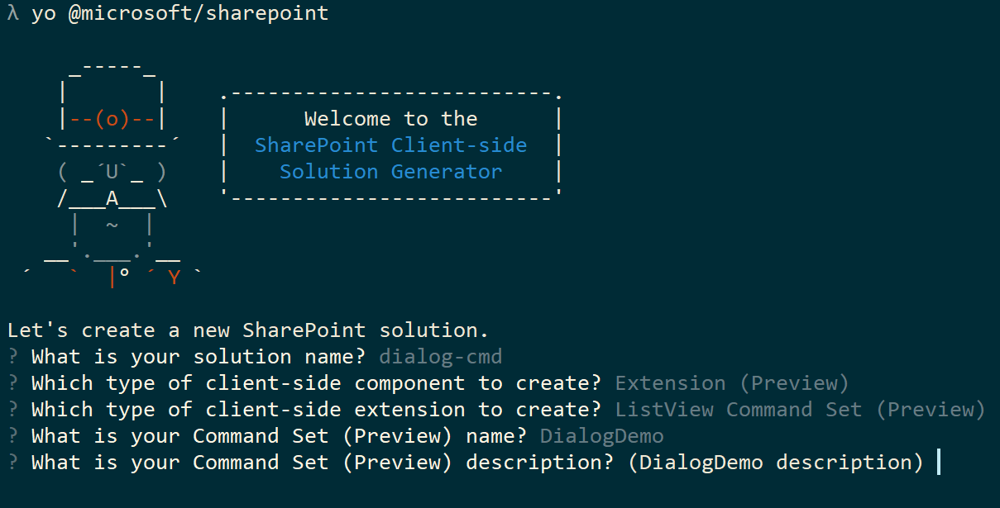
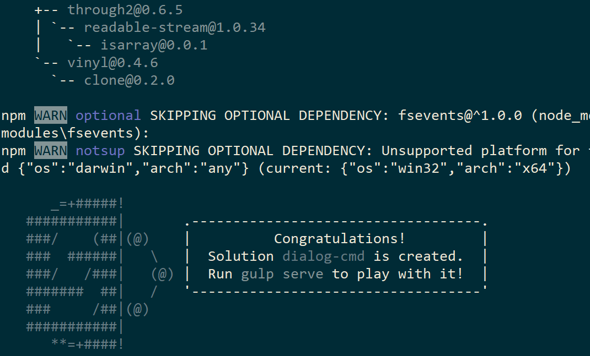
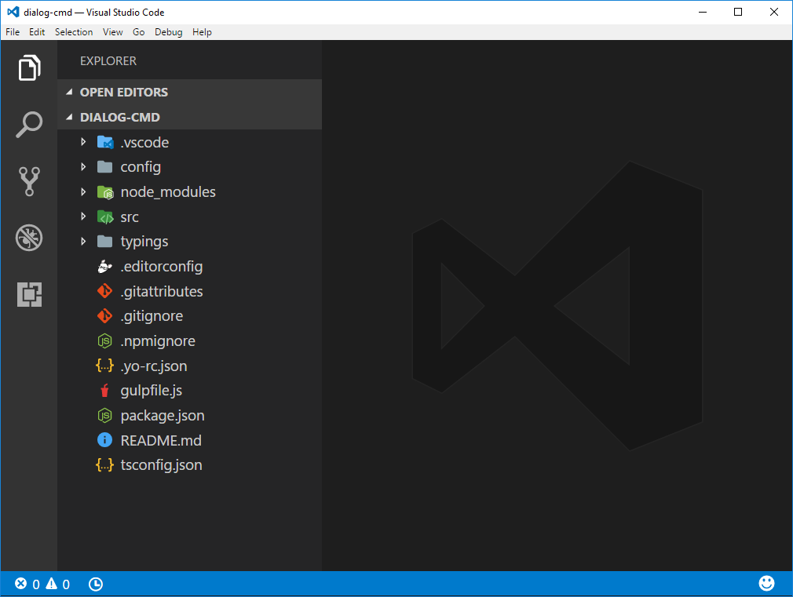
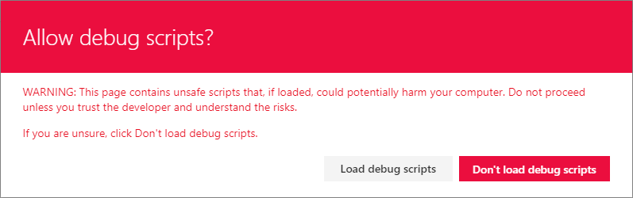
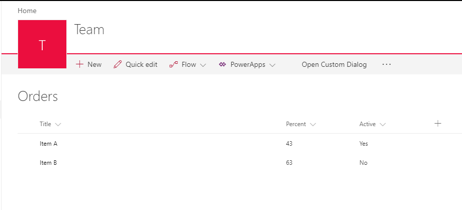
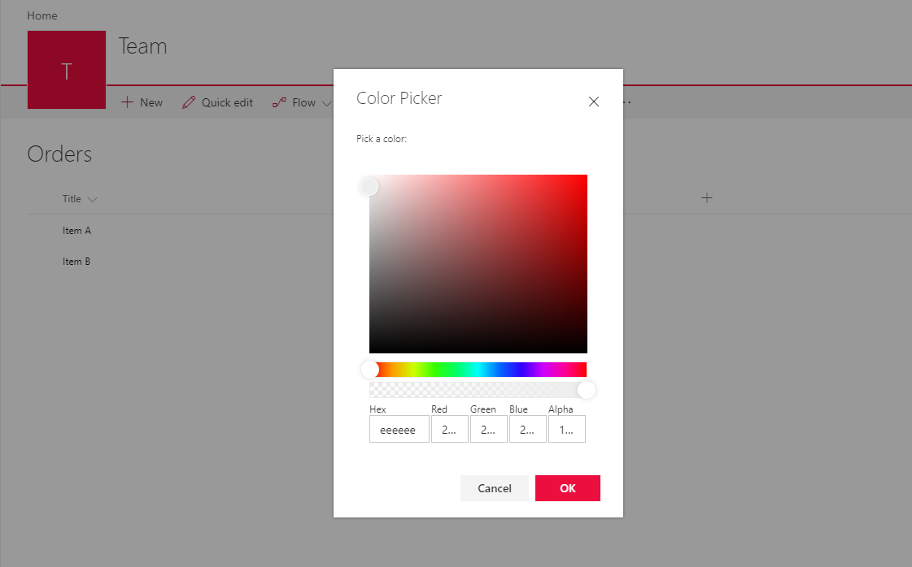

# Use custom dialog boxes with SharePoint Framework Extensions

You can use custom dialog boxes, available from the **@microsoft/sp-dialog** package, within the context of SharePoint Framework Extensions or client-side web parts. 

This article describes how to create a custom dialog box and use it within the context of a ListView Command Set extension.

>**Note:** The custom dialog box feature is currently in preview. We are looking for your feedback before we release. To provide feedback, [file an issue in our GitHub repo](https://github.com/SharePoint/sp-dev-docs/issues).

> Please note that debugging Custom ListView Command Sets in SharePoint Online is currently only available from the modern list experience within classic team sites hosted in a **developer tenant**.


You can access the sample code that this article is based on in the [](https://github.com/SharePoint/sp-dev-fx-extensions/tree/master/samples/react-command-dialog) repo.

## Set up your development environment

To create a custom dialog box, you'll need to follow the steps in the [Set up your development environment](https://dev.office.com/sharepoint/docs/spfx/set-up-your-development-environment). Make sure that you're using the latest SharePoint Framework Yeoman templates. 

To update your SharePoint Framework Yeoman templates, run the following command:

```sh
npm install -g @microsoft/generator-sharepoint`
```

## Create a new project

Create a new folder for the project using your console of choice:

```sh
md dialog-cmd
```

Then enter that folder:

```sh
cd dialog-cmd
```

Run the Yeoman generator for the SharePoint Framework:

```sh
yo @microsoft/sharepoint
```

When prompted:

* Accept the default value of **dialog-cmd** as your solution name and press **Enter**.
* Choose **Use the current folder** and press **Enter**.
* Choose **N** to require extension to be installed on each site explicitly when it's being used.
* Choose **Extension (Preview)** as the client-side component type to be created. 
* Choose **ListView Command Set (Preview)** as the extension type to be created.

The next set of prompts will ask for specific information about your extension:

* Use the value of **DialogDemo** as your extension name and press **Enter**.
* Accept the default value of **DialogDemo description** as your extension description and press **Enter**.



At this point, Yeoman will install the required dependencies and scaffold the solution files along with the *DialogDemo* extension. This might take a few minutes. 

When the scaffold is complete, you should see the following message indicating a successful scaffold:



>**Note:** For information about troubleshooting any errors, see [Known issues](../basics/known-issues).

When the scaffolding is complete, open your project folder in your code editor. This article uses Visual Studio Code in the steps and screenshots, but you can use any editor you prefer. To open the folder in Visual Studio Code, use the following command in the console:

```sh
code .
```



## Modify the extension manifest

In the extension manifest, configure the extension to have only one button. In the code editor, open the **./src/extensions/dialogDemo/DialogDemoCommandSet.manifest.json** file. Replace the commands section with the following JSON:

```json
{
  //...
  "items": {
    "COMMAND_1": {
      "title": { "default": "Open Custom Dialog" },
      "iconImageUrl": "icons/request.png",
      "type": "command"
    }
  }
}
```

## Add the sp-dialog package to the solution

Return to the console and run the following command to include the dialog API in your solution:

```sh
npm install @microsoft/sp-dialog --save
```

Because you're using the `--save` option, this dependency will be added to the **package.json** file. This ensures that it will be installed automatically when the `npm install` command runs (this is important when you restore or clone your project elsewhere).

Return to Visual Studio Code (or your preferred editor).

## Create a custom dialog box

Create a new file called **ColorPickerDialog.tsx** in the **./src/extensions/dialogDemo/** folder.

Add the following import statements at the top of the newly created file. You're creating your custom dialog box using the [Office UI Fabric React components](https://dev.office.com/fabric#/components), so the implementation will be in React. 


```ts
import * as React from 'react';
import * as ReactDOM from 'react-dom';
import { BaseDialog, IDialogConfiguration } from '@microsoft/sp-dialog';
import {
  autobind,
  ColorPicker,
  PrimaryButton,
  Button,
  DialogFooter,
  DialogContent
} from 'office-ui-fabric-react';

```

Add the following interface definition just below the import statements. This will be used to pass information and functions between your ListView Command Set extension and your custom dialog box.

```ts
interface IColorPickerDialogContentProps {
  message: string;
  close: () => void;
  submit: (color: string) => void;
  defaultColor?: string;
}
```

Add the following class just below the interface definition. This React class is responsible for rendering the UI experiences inside the custom dialog box. Notice that you use the Office UI Fabric React components for actual rendering and just pass the needed properties.  

```ts
class ColorPickerDialogContent extends React.Component<IColorPickerDialogContentProps, {}> {
  private _pickedColor: string;

  constructor(props) {
    super(props);
    // Default Color
    this._pickedColor = props.defaultColor || '#FFFFFF';
  }

  public render(): JSX.Element {
    return <DialogContent
      title='Color Picker'
      subText={this.props.message}
      onDismiss={this.props.close}
      showCloseButton={true}
    >
      <ColorPicker color={this._pickedColor} onColorChanged={this._onColorChange} />
      <DialogFooter>
        <Button text='Cancel' title='Cancel' onClick={this.props.close} />
        <PrimaryButton text='OK' title='OK' onClick={() => { this.props.submit(this._pickedColor); }} />
      </DialogFooter>
    </DialogContent>;
  }

  @autobind
  private _onColorChange(color: string): void {
    this._pickedColor = color;
  }
}
```
Add the following class definition for your custom dialog box under the `ColorPickerDialogContent` class that you just added. This is the actual custom dialog box that will be called from the ListView Command Set button click and is inherited from the `BaseDialog`.

```ts
export default class ColorPickerDialog extends BaseDialog {
  public message: string;
  public colorCode: string;

  public render(): void {
    ReactDOM.render(<ColorPickerDialogContent
      close={ this.close }
      message={ this.message }
      defaultColor={ this.colorCode }
      submit={ this._submit }
    />, this.domElement);
  }

  public getConfig(): IDialogConfiguration {
    return {
      isBlocking: false
    };
  }

  @autobind
  private _submit(color: string): void {
    this.colorCode = color;
    this.close();
  }
}
```

## Associate the custom dialog box with the ListView Command Set button click
To associate the custom dialog box with your custom ListView Command Set, add the code to initiate the dialog box within the button click operation.

In the code editor, open the **DialogDemoCommandSet.ts** file from the **./src/extensions/dialogDemo/** folder.

Add the following import statements under the existing **strings** import. These are for using the custom dialog box in the context of your ListView Command Set. 

```ts
import { Dialog } from '@microsoft/sp-dialog';
import ColorPickerDialog from './ColorPickerDialog';
```

Add the following `_colorCode` variable definition above the `onInit` function in the `DialogDemoCommandSet` class. This is used to store the color picker dialog box result.

```ts
  private _colorCode: string;
```

Update the `onExecute` function as follows. This code does the following:

* Initiates the custom dialog box.
* Passes a message for the dialog box, which is used for the title.
* Passed a color code for the dialog box with a default value, if not yet set.
* Shows the custom dialog box.
* Receives and stores the return value from the dialog box.
* Shows the received value in a default dialog box using the `Dialog.alert()` function.

```ts
  @override
  public onExecute(event: IListViewCommandSetExecuteEventParameters): void {
    switch (event.commandId) {
      case 'COMMAND_1':
        const dialog: ColorPickerDialog = new ColorPickerDialog();
        dialog.message = 'Pick a color:';
        // Use 'EEEEEE' as the default color for first usage
        dialog.colorCode = this._colorCode || '#EEEEEE';
        dialog.show().then(() => {
          this._colorCode = dialog.colorCode;
          Dialog.alert(`Picked color: ${dialog.colorCode}`);
        });
        break;
      default:
        throw new Error('Unknown command');
    }
  }
```

## Test the custom dialog box in your tenant

Open the **DialogDemoCommandSet.manifest.json** file in the **./src/extensions/dialogDemo/** folder and copy the **id** value, which will be used in the debug query parameter.

Return to the console and run the following command:

```sh
gulp serve --nobrowser
```

Notice that you use the `--nobrowser` option. You don't need to launch the local workbench because you currently cannot debug extensions locally.

This will start the bundling of your solution and will serve the resulting manifest from the `localhost` address.

To test your extension, go to a site in your SharePoint Online developer tenant.

Go to an existing custom list within the site that contains some items, or create a new list and add a few items to it for testing purposes. 

Append the following query string parameters to the URL. Notice that you will need to update the **id** to match your own extension identifier as listed in the **DialogDemoCommandSet.manifest.json** file:

```
?loadSpfx=true&debugManifestsFile=https://localhost:4321/temp/manifests.js&customActions={"8701f44c-8c81-4e54-999d-62763e8f34d2":{"location":"ClientSideExtension.ListViewCommandSet.CommandBar"}}
```

Accept the loading of Debug Manifests by choosing **Load debug scripts** when prompted.



Notice that the new button is visible in the toolbar of the list with the text *Open Custom Dialog box*.



Choose the *Open Custom Dialog box* button to see your custom dialog box rendered within the list view. 



Choose a color in the *Color Picker* and choose **OK** to test how the code is returning the selected value back to the caller. The selection is then shown using the default alert dialog box.


