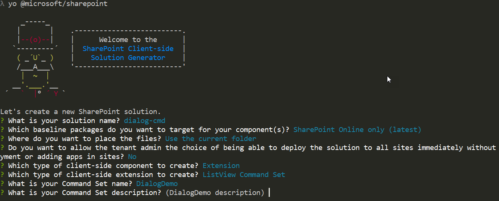
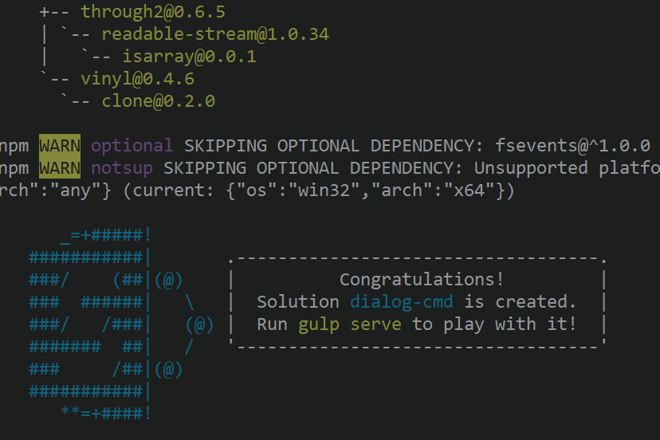
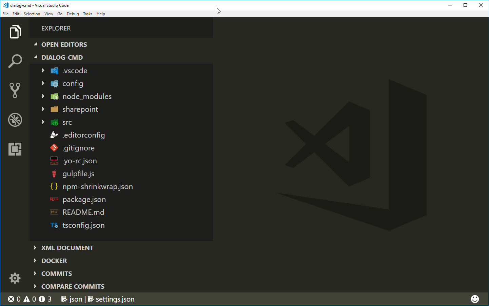
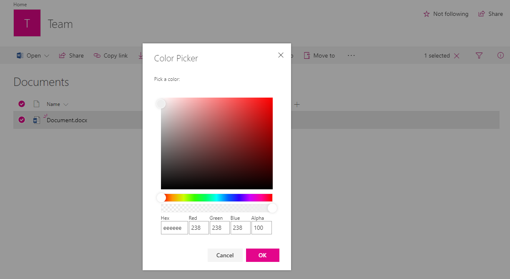
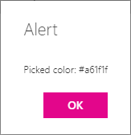

# Use custom dialog boxes with SharePoint Framework Extensions

You can use custom dialog boxes, available from the **[@microsoft/sp-dialog](https://www.npmjs.com/package/@microsoft/sp-dialog)** package, within the context of SharePoint Framework Extensions or client-side web parts. 

This article describes how to create a custom dialog box and use it within the context of a ListView Command Set extension.

You can access the sample code that this article is based on in the [sp-dev-fx-extensions](https://github.com/SharePoint/sp-dev-fx-extensions/tree/master/samples/react-command-dialog) repo.

## Set up your development environment

To create a custom dialog box, you need to follow the steps in [Set up your development environment](../../set-up-your-development-environment.md). Make sure that you're using the latest SharePoint Framework Yeoman templates.

## Create a new project

1. Create a new folder for the project by using your console of choice:

  ```sh
  md dialog-cmd
  ```

2. Enter that folder:

  ```sh
  cd dialog-cmd
  ```

3. Run the Yeoman generator for the SharePoint Framework:

  ```sh
  yo @microsoft/sharepoint
  ```

4. When prompted:

  * Accept the default value of **dialog-cmd** as your solution name, and then select Enter.
  * Select **SharePoint Online only (latest)**, and then select Enter.
  * Select **Use the current folder**, and then select Enter.
  * Select **N** to require the extension to be installed on each site explicitly when it's being used.
  * Select **Extension** as the client-side component type to be created. 
  * Select **ListView Command Set** as the extension type to be created.

5. The next set of prompts asks for specific information about your extension:

  * Use the value of **DialogDemo** as your extension name, and then select Enter.
  * Accept the default value of **DialogDemo description** as your extension description, and then select Enter.

  

  At this point, Yeoman installs the required dependencies and scaffolds the solution files along with the **DialogDemo** extension. This might take a few minutes.

  When the scaffold is complete, you should see the following message indicating a successful scaffold:

  

6. When initial scaffolding is completed, enter the following to explicitly install the 5.x version fo the Office UI Fabric to your solution:

  ```sh
  npm install office-ui-fabric-react@5.132.0  --save
  ```

  > [!NOTE]
  > Starting with SharePoint Framework 1.8, you can use either Office UI Fabric version 5 or version 6. In this case we are using specifically Office UI Fabric version 5.143.0, so we are adding the needed dependency on it. If you would be using Office UI Fabric version 6.x, you'd also need to update the used TypeScript version of the solution.

7. Open your project folder in your code editor. This article uses Visual Studio Code in the steps and screenshots, but you can use any editor that you prefer. To open the folder in Visual Studio Code, use the following command in the console:

  ```sh
  code .
  ```

  <br/>

  

## Modify the extension manifest

In the extension manifest, configure the extension to have only one button. In the code editor, open the **./src/extensions/dialogDemo/DialogDemoCommandSet.manifest.json** file. Replace the commands section with the following JSON:

```json
{
  //...
  "items": {
    "COMMAND_1": {
      "title": { "default": "Open Custom Dialog" },
      "iconImageUrl": "icons/request.png",
      "type": "command"
    }
  }
}
```

## Create a custom dialog box

1. Create a new file called **ColorPickerDialog.tsx** in the **./src/extensions/dialogDemo/** folder.

2. Add the following import statements at the top of the newly created file. You're creating your custom dialog box by using the [Office UI Fabric React components](https://developer.microsoft.com/en-us/fabric#/components), so the implementation is in React. 

  ```typescript
  import * as React from 'react';
  import * as ReactDOM from 'react-dom';
  import { BaseDialog, IDialogConfiguration } from '@microsoft/sp-dialog';
  import {
    autobind,
    ColorPicker,
    PrimaryButton,
    Button,
    DialogFooter,
    DialogContent
  } from 'office-ui-fabric-react';

  ```

3. Add the following interface definition just under the import statements. This is used to pass information and functions between your ListView Command Set extension and your custom dialog box.

  ```typescript
  interface IColorPickerDialogContentProps {
    message: string;
    close: () => void;
    submit: (color: string) => void;
    defaultColor?: string;
  }
  ```

4. Add the following class just under the interface definition. This React class is responsible for rendering the UI experiences inside the custom dialog box. Notice that you use the Office UI Fabric React components for actual rendering and just pass the needed properties.  

  ```typescript
  class ColorPickerDialogContent extends React.Component<IColorPickerDialogContentProps, {}> {
    private _pickedColor: string;

    constructor(props) {
      super(props);
      // Default Color
      this._pickedColor = props.defaultColor || '#FFFFFF';
    }

    public render(): JSX.Element {
      return <DialogContent
        title='Color Picker'
        subText={this.props.message}
        onDismiss={this.props.close}
        showCloseButton={true}
      >
        <ColorPicker color={this._pickedColor} onColorChanged={this._onColorChange} />
        <DialogFooter>
          <Button text='Cancel' title='Cancel' onClick={this.props.close} />
          <PrimaryButton text='OK' title='OK' onClick={() => { this.props.submit(this._pickedColor); }} />
        </DialogFooter>
      </DialogContent>;
    }

    @autobind
    private _onColorChange(color: string): void {
      this._pickedColor = color;
    }
  }
  ```

5. Add the following class definition for your custom dialog box under the `ColorPickerDialogContent` class that you just added. This is the actual custom dialog box that is called from the ListView Command Set button click and is inherited from the `BaseDialog`.

  ```typescript
  export default class ColorPickerDialog extends BaseDialog {
    public message: string;
    public colorCode: string;

    public render(): void {
      ReactDOM.render(<ColorPickerDialogContent
        close={ this.close }
        message={ this.message }
        defaultColor={ this.colorCode }
        submit={ this._submit }
      />, this.domElement);
    }

    public getConfig(): IDialogConfiguration {
      return {
        isBlocking: false
      };
    }
    
    protected onAfterClose(): void {
      super.onAfterClose();
      
      // Clean up the element for the next dialog
      ReactDOM.unmountComponentAtNode(this.domElement);
    }

    @autobind
    private _submit(color: string): void {
      this.colorCode = color;
      this.close();
    }
  }
  ```

## Associate the dialog box with the ListView Command Set button click

To associate the custom dialog box with your custom ListView Command Set, add the code to initiate the dialog box within the button click operation.

1. In the code editor, open the **DialogDemoCommandSet.ts** file from the **./src/extensions/dialogDemo/** folder.

2. Add the following import statements under the existing **strings** import. These are for using the custom dialog box in the context of your ListView Command Set. 

  ```typescript
  import ColorPickerDialog from './ColorPickerDialog';
  ```

3. Add the following `_colorCode` variable definition above the `onInit` function in the `DialogDemoCommandSet` class. This is used to store the color picker dialog box result.

  ```typescript
    private _colorCode: string;
  ```

4. Update the `onExecute` function as follows. This code does the following:

  * Initiates the custom dialog box.
  * Passes a message for the dialog box, which is used for the title.
  * Passes a color code for the dialog box with a default value, if not yet set.
  * Shows the custom dialog box.
  * Receives and stores the return value from the dialog box.
  * Shows the received value in a default dialog box by using the `Dialog.alert()` function.

  ```typescript
    @override
    public onExecute(event: IListViewCommandSetExecuteEventParameters): void {
      switch (event.itemId) {
        case 'COMMAND_1':
          const dialog: ColorPickerDialog = new ColorPickerDialog();
          dialog.message = 'Pick a color:';
          // Use 'EEEEEE' as the default color for first usage
          dialog.colorCode = this._colorCode || '#EEEEEE';
          dialog.show().then(() => {
            this._colorCode = dialog.colorCode;
            Dialog.alert(`Picked color: ${dialog.colorCode}`);
          });
          break;
        default:
          throw new Error('Unknown command');
      }
    }
  ```

## Test the dialog box in your tenant

1. Open the **serve.json** file in the **./config/** folder and update the current settings in the file. This file is used to make debugging on SharePoint Framework Extensions easier. You can update the file content to match your own tenant and site details where you want to test your extension. The key value to update is the `pageUrl` property in the json definition to match your own tenant.

2. Update `pageUrl` to point to a list URL where you want to test the dialog functionality.

  ```sh
    "serveConfigurations": {
      "default": {
        "pageUrl": "https://sppnp.sharepoint.com/sites/team/Shared%20Documents/Forms/AllItems.aspx",
        "customActions": {
          "9b98b919-fe5e-4758-ac91-6d62e582c4fe": {
            "location": "ClientSideExtension.ListViewCommandSet.CommandBar",
            "properties": {
              "sampleTextOne": "One item is selected in the list",
              "sampleTextTwo": "This command is always visible."
            }
          }
        }
      },
  ```

  > [!NOTE]
  > The unique identifier of your extension is automatically updated to this file during initial scaffolding. If you update the properties that your extension uses, you should update **serve.json** before you start debugging.

3. Return to the console and run the following command:

  ```sh
  gulp serve
  ```

  This starts the bundling of your solution and serves the resulting manifest from the `localhost` address. Due to the configuration in the **serve.json** file, it also opens up a browser in the specific URL and automatically sets the query parameters based on the solution configuration.

4. Accept the loading of debug manifests by selecting **Load debug scripts** when prompted.

  

  Notice that the new button is *not* visible in the toolbar by default because the default solution requires that you select one item from the list. If you do not have any items in the list or library, create an item or upload a document. 

5. Select an item from the list or library, and notice how the **Open Custom Dialog** button is visible in the toolbar.

  

6. Click the **Open Custom Dialog** button to see your custom dialog box rendered within the list view. 

  

7. Select a color in the **Color Picker**, and then select **OK** to test how the code is returning the selected value back to the caller. The selection is then shown by using the default alert dialog box.

  

> [!NOTE]
> If you find an issue in the documentation or in SharePoint Framework, report that to SharePoint engineering by using the [issue list at the sp-dev-docs repository](https://github.com/SharePoint/sp-dev-docs/issues). Thanks for your input in advance.

## See also

- [Overview of SharePoint Framework Extensions](../overview-extensions.md)
