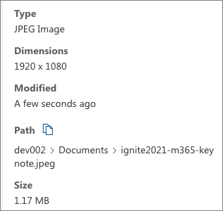
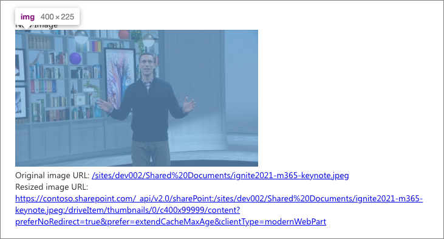

# Image Helper API

The **ImageHelper** static class (in **\@microsoft\/sp-image-helper**) has been added to allow SPFx developers runtime access to:

- Urls of auto-generated thumbnail images of pages and documents stored in SharePoint
- More optimized Urls to images stored in SharePoint

The helper method `ImageHelper.convertToImageUrl()` takes a Url to an asset on SharePoint, a width, and an optional height and will perform client-side operations to try to create an optimized Url.

The resulting Url will point to an image that is close to the requested size. The resulting Url will also include using other SharePoint media and graph services. If available for the requested asset, public or private CDN locations to serve the resized images and thumbnails.

> [!NOTE]
> The Image Helper API was introduced in the SharePoint Framework v1.14 release as a developer preview feature.

## Benefits to using this API

- The image may be delivered faster because it's potentially served out of a cache.
- The image will be sized appropriately as width is required and height is optional. This allows for customers to store high-resolution images in SharePoint but not pay the download time penalty when those images are used.
- The source Url maybe any filetype within SharePoint where a thumbnail can be generated. An image thumbnail Url would then be returned.

## Explained - ImageHelper.convertToImageUrl()

The `convertToImageUrl()` static method accepts a single argument of type **IImageHelperRequest**. This object has two required properties, `sourceUrl` & `width`, and one optional property `height`.

SharePoint's server-side image processing has a list of resolution breakpoints widths it supports, including: 200, 400, 960, 1600, & 2560.

While you can specify any width to resize the image to, SharePoint will pick the nearest largest resolution breakpoint. For example, if you specify `width: 250`, the resized image width will be 400 px.

If you specify the optional `height` property, SharePoint the width isn't adjusted to the nearest breakpoint. But if the `height property is omitted, SharePoint automatically determines the height of the resized image using the width & width breakpoint while maintaining the aspect ratio for the image.

> [!TIP]
> Omitting the `height` property provides the quickest response from the SharePoint

## Use the Image Helper API

To use the Image Helper API, you must first install it into your project:

```console
npm install @microsoft/sp-image-helper
```

Next, import it into your project where you plan to use the API:

```typescript
import { ImageHelper, IImageHelperRequest } from "@microsoft/sp-image-helper";
```

Next, use the API to obtain a thumbnail image of an existing file in SharePoint. In this case, we've uploaded a file from the [Microsoft News Image Gallery](https://news.microsoft.com/imagegallery) site. In this example, we're using a file that's 1.2 MB in size with a resolution of 1920x1080... not an ideal web friendly format:



The file exists in our site's default **Documents** library:

```typescript
const originalImageUrl = '/sites/dev002/Shared%20Documents/ignite2021-m365-keynote.jpeg';
```

Use the Image Helper API to resize the image and use the new link to display the resized & optimized image:

```typescript
const resizedImage = ImageHelper.convertToImageUrl(
  <IImageHelperRequest>{
    sourceUrl: originalImageUrl,
    width: 400
  }
);

this.domElement.innerHTML = `
  <div class="${ styles.helloWorld }">New Image</div>
  <div></div>
  <div>
    <div>Original image URL: <a href="${originalImageUrl}">${originalImageUrl}</a>
    <div>Resized image URL: <a href="${resizedImage}">${resizedImage}</a>
  </div>
`;
```



This resized image is only 30 kB in size with a resolution of 400x225, a significant improvement on the performance for the user. Notice the UrL of the resized image differs from the original Url we provided the helper method.

## Private CDN support

For the images to be available to be served from a private CDN, the following requirements must be met:

- the private CDN feature must be enabled
- the source file must be available within an origin to the CDN
- SharePoint's server-side preprocessing must know that the web part property is an image property

To make SharePoint's server-side processing aware of the image property, list the properties where image Urls are stored in the web part's **manifest.json** `imageLinkPropertyNames` property:

```json
{
  "id": "374a1893-9b4d-4c10-bbe3-9411d74093e9",
  "alias": "HelloWorldWebPart",
  "componentType": "WebPart",
  "supportedHosts": [ "SharePointWebPart" ],
  "imageLinkPropertyNames": [ "defaultBannerImage" ],
  "preconfiguredEntries": [{
    "title": { "default": "HelloWorld" },
    "properties: {
      "defaultBannerImage": "..."
    }
  }]
}
```

This allows for SharePoint's server-side rewrite logic to include the mapping of that file to private CDN when rendering the page to be sent to the client.
