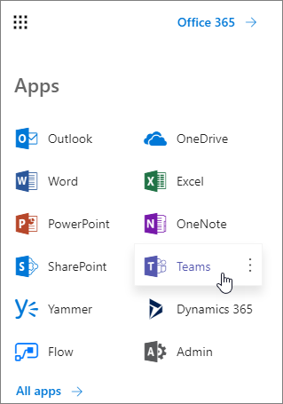
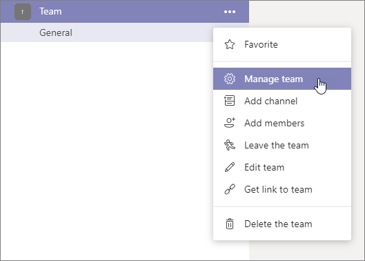

# Building Microsoft Teams Tabs using SharePoint Framework

> [!IMPORTANT]
> When you are planning to embed SharePoint sites in Microsoft Teams, please use the [Viva Connections model](/sharepoint/guide-to-setting-up-viva-connections) for the supported experience.

Starting with SharePoint Framework v1.8, you can build tabs for Microsoft Teams with the SharePoint Framework tooling and use SharePoint as a host for your solutions. As part of the SharePoint Framework v1.10 you can also publish your solution as Microsoft Teams personal app.

The benefits of using the SharePoint Framework as the platform for your Microsoft Teams tabs include the following:

- Development model is similar to SharePoint Framework web parts
- Any web part can be exposed as a tab or personal app in Microsoft Teams
- The different scoping options to expose a custom tab as a web part and tab in your tenant
- Your tab will be executed in the context of the underlying SharePoint site behind the specific team. This means that you can take advantage of any SharePoint-specific APIs or functionalities in your web part.

## Development process

You can start developing Microsoft Teams tabs simply by using the SharePoint Framework 1.8 or later packages. The high-level steps to get started are as follows:

> [!NOTE]
> Refer to the detailed steps to get started from the [Building Microsoft Teams tab using SharePoint Framework - Tutorial](web-parts/get-started/using-web-part-as-ms-teams-tab.md) that contains additional important details you must follow.

1. Create a SharePoint Framework solution with a client-side web part
1. Add `"TeamsTab"` to the `supportedHosts` property of the web part manifest to use it as a tab in a channel:

    ```json
    "supportedHosts": ["SharePointWebPart", "TeamsTab"],
    ```

1. Add `"TeamsPersonalApp"` to the `supportedHosts` property of the web part manifest to use it as a personal app:

    ```json
    "supportedHosts": ["SharePointWebPart", "TeamsPersonalApp"],
    ```

1. Deploy the web part using the tenant-scoped deployment option to your SharePoint app catalog
1. Activate the SharePoint Framework solution, which you deployed, and select **Sync to Teams** button in the App Catalog

## Deployment options

There are multiple options to deploy the Microsoft Teams tab or as a personal app. As both SharePoint and Microsoft Teams have their own app catalog, deployment requires operations on both services. The visibility of the new functionality can be controlled by the deployment steps taken.

### Tenant deployment

You can use the **Sync with Teams** button in the App Catalog ribbon that will automatically create the Microsoft Teams app manifest, and app package and install it in the Microsoft Teams store. This will make your solution available for all users in your tenant and Microsoft Teams teams.

Developers can also define the contents of the Microsoft Teams app manifest and app package. Refer to [Deployment options for SharePoint Framework solutions for Microsoft Teams](deployment-spfx-teams-solutions.md) for deployment options.

### Alternative deployment options

There's an alternative way to deploy your solution, which will for instance allow you to make a solution available only to one specific team in your tenant.

1. Build your SharePoint Framework solution the normal way:

    ```console
    gulp bundle --ship
    gulp package-solution --ship
    ```

1. Locate the **./teams** folder in your project folder:

    

1. Add the Microsoft Teams app package as described in [Deployment options for SharePoint Framework solutions for Microsoft Teams](deployment-spfx-teams-solutions.md#developer-provided-microsoft-teams-app-manifest--package) to the **./teams** folder.
1. Add your solution to the app catalog and make sure to select the option **Make this solution available to all sites in the organization** before selecting **Deploy**.

### Side loading of external apps in Teams

1. Move to your Microsoft Teams instance by selecting **Teams** in the app launcher:

    

1. Choose a Team that you want to use for testing the capability and select **Manage team** from the `...` menu:

    

1. Move to **Apps** tab.
1. Choose **Upload a custom app** from the bottom-right corner.

    > [!NOTE]
    > If this setting is not available, side loading is not enabled in the tenant that you are using. Double-check the settings from the tenant admin UIs.

1. Upload the Microsoft Teams app manifest file your created earlier from the **./teams** folder under your newly created solution and ensure that it's properly visible in the list of Apps. Notice how the custom image is visible with the description of the solution:

    

1. Move to a channel in the Team where you uploaded the solution. In the following image, notice we've activated the **General** channel in **Team**

    

1. Select **+** to add a new tab on the channel.
1. Select your custom tab named **MyFirstTeamTab** in the list:

    

1. Notice how you can customize the tab instance using the exposed properties on the web part. Select **Save**:

    

## Detecting if the web part is in Teams context

The page context in a web part contains a reference to the Teams JavaScript SDK so that you can easily get access on the Teams context when your web part is rendered as a tab.

```javascript
this.context.sdks.microsoftTeams.teamsJs.app.getContext()
```

> [!NOTE]
> For more information on the Microsoft Teams tab context, see [Microsoft Teams development documentation](/microsoftteams/platform/concepts/tabs/tabs-context).

> [!IMPORTANT]
> The process of obtaining the Microsoft Teams context with the SPFx API has changed a few times over time. For example, you may be familiar with the following properties that would return the Microsoft Teams context:
>
> - The property `this.context.microsoftTeams` was [deprecated in the SharePoint Framework v1.10 release](release-1.10.0.md).
> - The property `this.context.sdks.microsoftTeams` was [deprecated in the SharePoint Framework v1.16 release](release-1.16.md).

## What Teams JavaScript client SDK version to use?

The SharePoint Framework provides access to the Teams JavaScript client SDK instance and context using `sdks.microsoftTeams.teamsJs.app.getContext()` method in the [context's API](/javascript/api/sp-webpart-base/webpartcontext#@microsoft-sp-webpart-base-webpartcontext-sdks-member).

Using this API assures the supported version of Teams JavaScript client SDK is loaded and initialized.

Few details to keep in mind:

- Installing and initializing custom versions of Teams JavaScript client SDK is **unsupported**. This is applicable to any SPFx component, including web parts, extensions, adaptive cards, and libraries.
- Although Teams JavaScript client SDK types are tied to the SPFx version used in the solution, the actual version loaded to the tenant may differ. We guarantee backward compatibility on our end. For example, a solution built with SPFx 1.14 will have types from Teams JavaScript client SDK v1.10.0, and SPFx v1.15.2 will have types from Teams JavaScript client SDK v1.12.1, but the actual loaded version of the Teams JavaScript client can be v2.1.0.

## See also

- [Building Microsoft Teams tab using SharePoint Framework - Tutorial](web-parts/get-started/using-web-part-as-ms-teams-tab.md)
- [Upload an app package to Microsoft Teams](/microsoftteams/platform/concepts/apps/apps-upload)
- [Tenant-scoped solution deployment for SharePoint Framework solutions](tenant-scoped-deployment.md)
