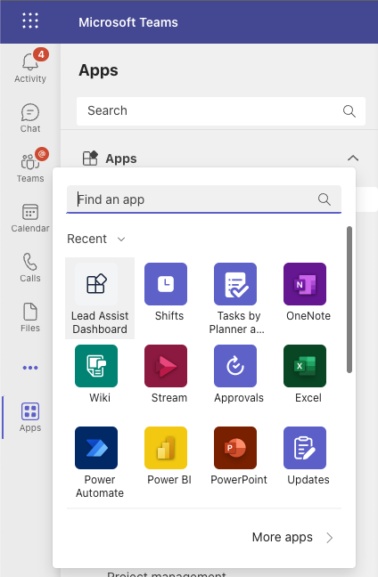

# Extend Outlook and Office with the SharePoint Framework

[!INCLUDE [spfx-release-beta](../../../includes/snippets/spfx-release-beta.md)]

The SharePoint Framework (SPFx) v1.16 release added support for the [Microsoft Teams JavaScript client SDK v2](/javascript/api/overview/msteams-client). The Microsoft Teams JavaScript client SDK v2 introduced the ability to enable [Teams apps to run in Outlook at Office, in addition to Microsoft Teams](/microsoftteams/platform/m365-apps/overview).

With this improvement in SPFx v1.16, developers can now use the SPFx to create apps for Outlook and Office using the [existing support for creating apps for Microsoft Teams](/sharepoint/dev/spfx/build-for-teams-overview).

> [!IMPORTANT]
> The ability to run Microsoft Teams apps in Outlook and Office is currently in beta with anticipated availability in the first half of calendar year 2023.

> [!IMPORTANT]
> Essential information required for user success
>
> To test using Microsoft Teams apps in Outlook and Office, including those created with the SPFx, you must configure your Microsoft 365 tenant's release preferences for *targetted release*. For more information on changing your organizations release preferences, see [Set up the Standard or Targeted release options](/microsoft-365/admin/manage/release-options-in-office-365).
>
> It takes 5 business days for your tenant's release preferences to take effect. In other words, change your tenant from the **standard release** track to the **target release** track on the 5th of the month, you won't be able to test your Microsoft Teams apps created with the SPFx in Outlook or Office until the 11th of the month.

## Create Microsoft Teams apps for Outlook and Office

To create a new Microsoft Teams app with SPFx for Outlook and Office, you start by first creating a new SPFx project using the Yeoman generator for SharePoint v1.16 or later the same way you'd create a new web part. For more information, see [Build your first SharePoint client-side web part](../web-parts/get-started/build-a-hello-world-web-part.md).

The Yeoman SharePoint Generator will prompt you with a series of questions. Follow the same guidance for creating a new SPFx web part when responding to these questions.

Once the project has been created, update the web part's `supportedHosts` property to indicate where it can be used. For example, add `TeamsTab` and/or `TeamsPersonalApp` to te `supportedHosts` property in the **./config/package-solution.json** file. For more information, see [Building Microsoft Teams Tabs using SharePoint Framework](../integrate-with-teams-introduction.md).

## Determine the current runtime host for your app

Your application may need to determine where it's currently running for various reasons. For example, should users see one experience if it's running in SharePoint, Microsoft Teams, Outlook, or another Office client?

Use the SPFx's `context` property on the web part's class and the Microsoft Teams JavaScript client to determine the hosting client. The `app.host.name` property on the Teams JavaScript client contains the name of the host if it's Microsoft Teams, Outlook, or Office. If the Microsoft Teams context object is `undefined`, then the web part is running in SharePoint.

```typescript
// if running in Microsoft Teams, Outlook, or Office...
if (!!this.context.sdks.microsoftTeams) {
  const teamsContext = await this.context.sdks.microsoftTeams.teamsJs.app.getContext();
  switch (teamsContext.app.host.name.toLowerCase()) {
    case 'teams':
      // RUNNING IN MICROSOFT TEAMS
    case 'office':
      // RUNNING IN OFFICE / OFFICE.COM
    case 'outlook':
      // RUNNING IN OUTLOOK
    default:
      throw new Error('Unknown host');
  }
} else {
  // RUNNING IN SHAREPOINT
}
```

## Create the Microsoft Teams app manifest & package

While the SharePoint Online App Catalog's **Sync to Teams** button can automatically create the Microsoft Teams app manifest, app package and install it in the Microsoft Teams store, this currently doesn't support the required Microsoft Teams app manifest file format. The Teams app manifest file must be v1.13 or later

The other option is to manually create the app manifest and app package yourself and include them in the SharePoint package uploaded to the App Catalog. When you select the **Sync To Teams** button in the App Catalog, SharePoint Online will use the Teams app package you created and have included in the SharePoint package.

> [!NOTE]
> For more information on manually creating Microsoft Teams app manifests and app packages, see [Deployment options for SharePoint Framework solutions for Microsoft Teams](../deployment-spfx-teams-solutions.md)

### Create the Microsoft Teams app manifest

The first step is to create the Microsoft Teams app manifest.

1. Create the following file in your SPFx project: **./teams/manifest.json**.
1. Follow the guidance in [Microsoft Teams: App manifest schema for Teams](/microsoftteams/platform/resources/schema/manifest-schema) and [SharePoint Framework: Deployment options for SharePoint Framework solutions for Microsoft Teams](../deployment-spfx-teams-solutions.md) to create a new app manifest file.
1. Take special note of the following properties in the **manifest.json** file:
    - `manifestVersion`: This must be set to **1.13** or higher
    - `staticTabs` and/or `configurableTabs`: Verify this follows the guidance for using a SPFx web part as a Microsoft Teams tab.

        For example, the `contentUrl` property, and any other property that references SPFx components, should use the dynamic tokens `{teamSiteDomain}`, `{teamSitePath}`, & `{locale}`. It should also reference the SPFx's component ID.

        > [!TIP]
        > For more information on these properties, see [SharePoint Framework: Deployment options for SharePoint Framework solutions for Microsoft Teams](../deployment-spfx-teams-solutions.md), specifically the section on **Dynamically reference the underlying SharePoint site URLs**.

> [!NOTE]
> To learn more about the Microsoft Teams app manifest file, see [Microsoft Teams: App manifest schema for Teams](/microsoftteams/platform/resources/schema/manifest-schema).

### Create the Microsoft Teams app package

Once you've created the Microsoft Teams app manifest, you need to manually create the app package. This will be included in your SharePoint package (**\*.sppkg**) file that you'll upload to your SharePoint tenant's App Catalog.

1. Compress the contents of the **./teams** folder in your project.
1. Rename the ZIP package to **TeamsSPFxApp.zip**.

> [!IMPORTANT]
> The Microsoft Teams app package must be named **TeamsSPFxApp.zip** and saved in the **./teams** folder for this option to work with the **Sync to Teams** button in the tenant's App Catalog.

## Deploy the SPFx based Microsoft Teams app

Once you've created the app package, the next step is to deploy and install it.

Deploy the app to your tenant's app catalog.

Then, select the app, select the **Files** tab from the ribbon, and then select the **Sync to Teams** button to deploy the app package to your tenant's Microsoft Teams store.

> [!NOTE]
> For more information on packaging & deploying SharePoint packages to the Microsoft Teams App Store, see **[SharePoint Framework: Deployment options for SharePoint Framework solutions for Microsoft Teams](../deployment-spfx-teams-solutions.md)**.

Now that you've deployed the app to SharePoint, you can add it as a web part to a page in your SharePoint sites:


The app can also be installed in Microsoft Teams. Once you're logged in, select the **Apps** option in the left vertical navigation.

Notice your apps are listed under the **Build for your org** section:


Once you install the app, it will appear in the left vertical navigation as a pinned app:




You can follow the same process to install the app in Outlook as you performed in Microsoft Teams.

> [!TIP]
> For more information, see the **[React Teams Lead Dashboard](https://github.com/pnp/sp-dev-fx-webparts/tree/main/samples/react-teams-lead-dashboard)** sample for a working example that uses the SPFx to create a Microsoft Teams app for Outlook and Office.
