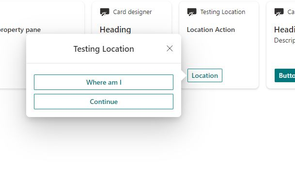
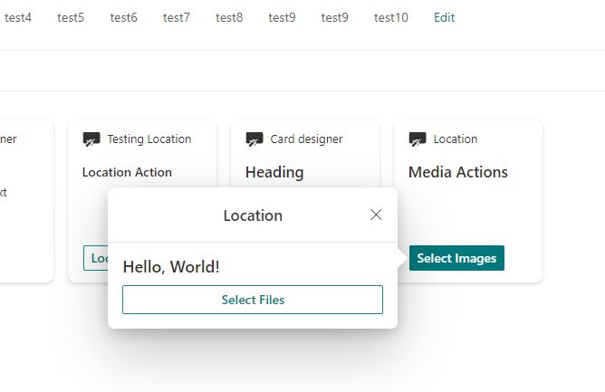
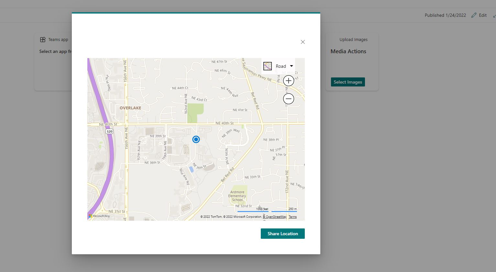
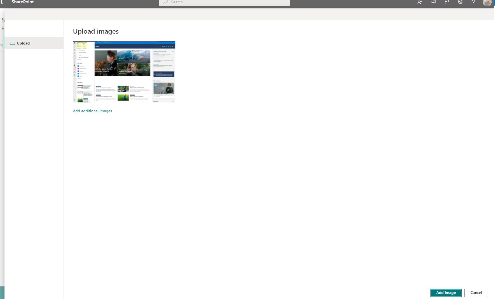

# SharePoint Framework v1.14 release notes

This release introduces updates across the features around Microsoft Viva, Microsoft Teams and SharePoint.

**Released:** February 17, 2022

[!INCLUDE [spfx-release-notes-common](../../includes/snippets/spfx-release-notes-common.md)]

## Upgrading projects from v1.13.1 to v1.14

In the project's **package.json** file, identify all SPFx v1.13.1 packages. For each SPFx package:

1. Uninstall the existing v1.13.1 package:

    ```console
    npm uninstall @microsoft/{spfx-package-name}@1.13.1
    ```

1. Install the new v1.14 package:

    ```console
    npm install @microsoft/{spfx-package-name}@1.14.0 --save --save-exact
    ```

[!INCLUDE [spfx-release-upgrade-tip](../../includes/snippets/spfx-release-upgrade-tip.md)]

## New features and capabilities

### Adaptive Card Extension updates for Viva Connections

#### Updated the ACE scaffolding for Viva Connections

Updated Adaptive Card Extensions scaffolding to be more succinct.

#### Get Current ViewNavigator for Adaptive Card Extension

```typescript
BaseAdaptiveCardExtension.navigator
```

If the current `renderType` is `Card` then returns `BaseAdaptiveCardExtension.cardNavigator`. If the current `renderType` is `QuickView` then returns `BaseAdaptiveCardExtension.quickViewNavigator`.

### List View Command Set Updates

#### Inform ListView on Command Set Changes

```typescript
BaseListViewCommandSet.raiseOnChange: () => void
```

Use this method to fire `onChange` event and initialize a reflow of the ListView.

#### Expanded List View Accessor State

`ListViewAccessor` provides expanded state of the current list view. **New** state properties are listed below.

- `rows` - currently rendered rows in the list view.
- `selectedRows` - selected rows in the list view.
- `list` - basic information about the list rendered by the list view.
- `view` - basic information about the view rendered by the list view.
- `folderInfo` - folder information for the list view.
- `appliedFilters` - filters applied to the list view.
- `sortField` - sort field name.
- `sortAscending` - specifies whether the list view is sorted ascending or descending.

#### List View State Changed Event

```typescript
ListViewAccessor.listViewStateChangedEvent: SPEvent<ListViewStateChangedEventArgs>
```

This event gets raised every time the list view state changes. The arguments contain type of occured event (see `ListViewAccessorStateChanges`) and previous state of the list view (see `IListViewAccessorState`).

#### List Command Set Command Disabled Property

```typescript
Command.disabled: boolean | undefined;
```

### Web Part specific updates

#### Predefined Web Part Picker Group for Web Parts in Development

```typescript
PredefinedGroup.Local = '8b7bf6f1-a56a-4aa3-8657-7eb6e7e6af61';
```

The group displays locally debugged web parts.

#### Callback to Clear DOM Element Before Loading Indicator or Error Element is Displayed

```typescript
IClientSideWebPartStatusRenderer.displayLoadingIndicator(domElement: Element, loadingMessage: string, timeout?: number, clearDomElementCallback?: ClearDomElementCallback): void;
IClientSideWebPartStatusRenderer.renderError(domElement: HTMLElement, error: Error | string, clearDomElementCallback?: ClearDomElementCallback);
```

Use `clearDomElementCallback` to clear the DOM node.

#### Web Part lifecycle method for theme changes

```typescript
BaseClientSideWebPart.onThemeChanged(theme: IReadonlyTheme | undefined): void;
```

When a theme is initialized or changed on a page, `onThemeChanged` will be invoked with the new
theme.

> [!IMPORTANT]
> `render` should not be invoked in `onThemeChanged`. Calling `render` can lead to unpredicted re-flow of the web part. `render` will automatically be invoked if needed.

#### Updated Web Part Templates

- No Framework, and React templates are updated with new user-friendly UI
- New "Minimal" template is added: allows to start development with the minimal amount of code provisioned.

### Other generic updates and changes

#### Changes to Scaffolding Options and Prompts

The next propmts were deprecated in favor to their defaults:

- Solution description
- Environment (SharePoint) version
- Tenant-wide deployment
- Isolated permissions
- Component description

#### Detect if a component is loading from localhost

```typescript
BaseComponentContext.isServedFromLocalhost(): boolean;
```

Any SPFx component can now check if it's currently running from code served locally.

#### Hide a Property Pane group name

```typescript
IPropertyPaneGroup.isGroupNameHidden?: boolean;
```

`isGroupNameHidden` can be used to skip the rendering of the Property Pane group name to avoid an
empty group header being displayed.

The default value of `isGroupNameHidden` is false.

#### ipAddress Property in serve.json

New property `ipAddress` has been added to `serve.json` configuration. This parameter is helpful when using Docker containers. For example, to set the serve host as '0.0.0.0'.
This property will be explicitly used to wind up the server, meaning all debug URLs and webpack configurations will not be affected.

## Preview Features and Capabilities

Following features are still in preview status as part of the 1.14 release and should not be used in production. We are looking into releasing them officially as part of the upcoming 1.15 release.

### Adaptive Card Extensions Card View caching

For improved performance, SPFx now supports local caching of your Adaptive Card Extension's
Card Views. The cached Card View will be immediately rendered when loading your Adaptive Card
Extension. After your Adaptive Card Extension loads, it can optionally update the Card View.

```typescript
interface ICacheSettings {
  /**
   * Whether cache is enabled. Default: true
   */
  isEnabled: boolean;
  /**
   * Expiry time in seconds. Default: 86400 seconds (24 hours)
   */
  expiryTimeInSeconds: number;

  /**
   * Returns the Card View used to generate the cached card.
   * By default, the currently rendered Card View will be used to cache the card.
   */
  cachedCardView?: () => BaseCardView;
}
BaseAdaptiveCardExtension.getCacheSettings(): Partial<ICacheSettings>;
```

By default caching is enabled with default settings. An Adaptive Card Extension can customize its
cache settings by overriding `getCacheSettings` to return the settings it wants to override.

When the last known Card View shouldn't be cached, you can provide a specific Card View to be
cached and displayed on the next page load through `ICacheSettings.cachedCardView`. This Card View
doesn't need to have been previously registered.

An Adaptive Card Extension can also locally cache its current state. By default no state is cached.

```typescript
BaseAdaptiveCardExtension.getCachedState(state: TState): Partial<TState>;
```

If `getCachedState` is overridden, then the cached values will be provided when the Adaptive Card
Extension is initialized on the next page load.

`onInit` has a new overload, which passes information about the cached card state. If the card wasn't
loaded from a cached Card View, then `cachedLoadParameters` will be `undefined`.

```typescript
interface ICachedLoadParameters {
    state: TState;
}
BaseAdaptiveCardExtension.onInit(cachedLoadParameters?: ICachedLoadParameters): Promise<void>;
```

Your Adaptive Card Extension's initial state can be seeded from the cached state. The cached state can also be used to determine if any further logic needs to be executed.

State caching and the cache expiry time can be used to determine when expensive remote calls need to be made by the Adaptive Card Extension.

Caching can help significantly improve the perceived performance for your Adaptive Card Extension.

### Error Handler Method. This method will be invoked when an Action throws an error

```typescript
BaseView.onActionError(error: IActionErrorArguments): void
```

Override this method to handle errors from Adaptive Card actions.

### New Action types for media and geolocation

> [!NOTE]
> These new actions are **only available in the browser** currently. Viva Connections desktop and Viva Connections mobile support will be enabled later.

After General Availability the support matrix for actions will look like:

Action       | Viva Connection Desktop | Viva Connections Mobile | Browser
------------- | ------------- | ------------- | -------------
Select Media  | Supported   | Supported | Supported
Get Location  | Not Supported | Supported | Supported
Show Location | Not Supported | Supported | Supported

```typescript

ISPFxAdaptiveCard.actions?: (
    | ISubmitAction
    | IOpenUrlAction
    | IShowCardAction
    | ISelectMediaAction // Raise a file picker or native media picker
    | IGetLocationAction // Get a location
    | IShowLocationAction // Show a location on a map
)[];
```

The SelectMedia and Location action can be configured as shown below:

```typescript
  actions: [
    {
      type: 'VivaAction.SelectMedia',
      id: 'Select File',
      parameters: {mediaType: MediaType.Image, allowMultipleCapture: true, maxSizePerFile : 200000, supportedFileFormats: ['jpg']},
      title: 'Select File'
    },
    {
      type: 'VivaAction.GetLocation',
      id: 'Get Location',
      parameters: {chooseLocationOnMap: true}
    }
    {
      type: 'VivaAction.ShowLocation',
      id: 'Show Location',
      parameters: parameters: {locationCoordinates: {latitude: 40, longitude: 40}}
    }
  ]
```

The actions  will be rendered as below

Location Action:



Select Media Action:



The Location Action can be used to get your current location, show your current or a custom location on a map, and choose your current location from a map. In the browser it uses Bing Maps as the mapping interface:



The Select Media Action can be used to select Images from your native device. In the browser it uses the file picker to help access relavant files:



#### Image Helper API

The **ImageHelper** static class (in @microsoft/sp-image-helper) has been added to allow SPFx developers runtime access to:

- Urls of auto-generated thumbnail images of pages and documents stored in SharePoint
- More optimized Urls to images stored in SharePoint

Learn more: [Image Helper API](image-helper-api.md)

## Deprecations and removed items in this release

> [!IMPORTANT]
> Any existing solution which is using removed APIs will keep on working without issues. Removal will mean that you cannot created any new solutions which are using these APIs.

- Deprecated APIs from `@microsoft/sp-listview-extensibility`:
  - `BaseListViewCommandSet.onListViewUpdated`
- Deprecated APIs from `@microsoft/sp-core-library`
  - `EnvironmentType.Local`
- Removed deprecated APIs from `@microsoft/sp-http`
  - `GraphHttpClient`
  - `GraphHttpClientConfiguration`
  - `GraphHttpClientResponse`
  - `IGraphHttpClientConfiguration`
  - `IGraphHttpClientConfigurations`
  - `IGraphHttpClientOptions`
- Removed preview APIs from `@microsoft/sp-webpart-base`
  - `ISDKs.office`
  - `IOffice`

## Fixed Issues

### November-February Timeframe

- [#5131](https://github.com/SharePoint/sp-dev-docs/issues/5131) - Theme tokens in SCSS files in SPFx 1.10.0 don't work anymore
- [#4808](https://github.com/SharePoint/sp-dev-docs/issues/4808) - SPFX and react-dnd
- [#4587](https://github.com/SharePoint/sp-dev-docs/issues/4587) - Will background sections be supported in domain isolated webparts (feature available for spfx 1.8.2 on wards)
- [#4550](https://github.com/SharePoint/sp-dev-docs/issues/4550) - Single Part App Page doesn't prevent navigation when there are unsaved changes
- [#5098](https://github.com/SharePoint/sp-dev-docs/issues/5098) - `this.context.propertyPane.open()` opens within an `<iframe>` on isolated webparts
- [#5227](https://github.com/SharePoint/sp-dev-docs/issues/5227) - QuickLaunch navigation (for SinglePageWebParts) fails
- [#6779](https://github.com/SharePoint/sp-dev-docs/issues/6779) - Application customizers appear in "Lists" team tab after adding item to the list
- [#5787](https://github.com/SharePoint/sp-dev-docs/issues/5787) - Check Fullmask Permission and the Bitwise JS Limit
- [#872](https://github.com/SharePoint/sp-dev-docs/issues/872) - SPFx: Can't view Install Errors
- [#6253](https://github.com/SharePoint/sp-dev-docs/issues/6253) - `pageContext` does not refresh in app customizers on inline navigation
- [#6102](https://github.com/SharePoint/sp-dev-docs/issues/6102) - Full bleed web part section do not render icons
- [#7536](https://github.com/SharePoint/sp-dev-docs/issues/7536) - ACE Teams Deep Link Not Navigating to Specific Tab
- [#6343](https://github.com/SharePoint/sp-dev-docs/issues/6343) - Preview is not displayed for web part in a single page mode
- [#7079](https://github.com/SharePoint/sp-dev-docs/issues/7079) - `Guid.tryParse()` not working
- [#7558](https://github.com/SharePoint/sp-dev-docs/issues/7558) - Default SPFx v1.13.1 project recommends unnecessary & deprecated VSCode extension
- [#6854](https://github.com/SharePoint/sp-dev-docs/issues/6854) - Calling `clearLoadingIndicator` removes entire WebPart
- [#3219](https://github.com/SharePoint/sp-dev-docs/issues/3219) - Adding Application Customizer to existing Web Part Project causes web parts to not be deployed
- [#3830](https://github.com/SharePoint/sp-dev-docs/issues/3830) - "Specified part does not exist in the package" when provisioning docx in `elementFiles`
- [#3840](https://github.com/SharePoint/sp-dev-docs/issues/3840) - Sorry something went wrong while deploying assets from spfx
- [#4294](https://github.com/SharePoint/sp-dev-docs/issues/4294) - `isGroupNameHidden` excluded from this release type
- [#4680](https://github.com/SharePoint/sp-dev-docs/issues/4680) - SPFx 1.9.1, office-ui-fabric-react and sp-property-pane
- [#6232](https://github.com/SharePoint/sp-dev-docs/issues/6232) - Getting errors about `<div>` cannot be nested in `<p>` when looking at web part data in workbench testing environment
- [#7386](https://github.com/SharePoint/sp-dev-docs/issues/7386) - Build fails when setting `skipFeatureDeployment` to true
- [#7691](https://github.com/SharePoint/sp-dev-docs/issues/7691) - 1.13.1 TypeError: Cannot read property 'toJson' of undefined when bundling/serving large project
