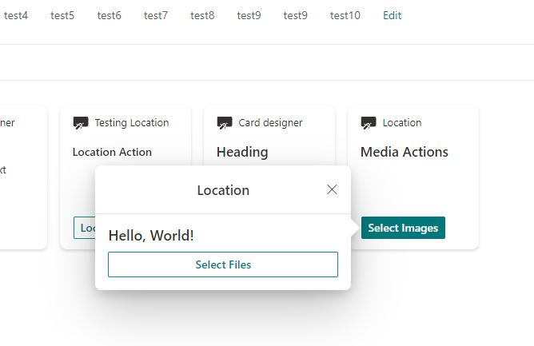

# SharePoint Framework v1.15 release notes

This release introduces updates across the features around Microsoft Viva, Microsoft Teams, and SharePoint.

**Released:** June 21, 2022

[!INCLUDE [spfx-release-notes-common](../../includes/snippets/spfx-release-notes-common.md)]

## Install the latest released version

Install the latest release of the SharePoint Framework (SPFx) by including the **@latest** tag:

```console
npm install @microsoft/generator-sharepoint@latest --global
```

## Upgrading projects from v1.14 to v1.15

In the project's **package.json** file, identify all SPFx v1.14 packages. For each SPFx package:

1. Uninstall the existing v1.14 package:

    ```console
    npm uninstall @microsoft/{spfx-package-name}@1.14
    ```

1. Install the new v1.15 package:

    ```console
    npm install @microsoft/{spfx-package-name}@latest --save --save-exact
    ```

[!INCLUDE [spfx-release-upgrade-tip](../../includes/snippets/spfx-release-upgrade-tip.md)]

## New features and capabilities

### Form Customizer Extension

The Form Customizer Extension allows developers to customize new, edit and display forms of the lists and document libraries.

* [Tutorial on creating your first form customizer](extensions/get-started/building-form-customizer.md)

> [!NOTE]
> You can see live demo of this feature from the following YouTube video - [Getting started on building custom list form components with SPFx v1.15](https://www.youtube.com/watch?v=LF5eQHBx10o).


### Node.js v16 Support

SharePoint Framework solutions now support Node.js v16 as the default Node.js version.


### Microsoft Graph JavaScript SDK v3 Support

The **MSGraphClientFactory** allows a developer to select the version of the Microsoft Graph JavaScript SDK to use.

> [!NOTE]
> Starting with SPFx 1.15 only v3 of the Microsoft Graph JavaScript SDK is supported. v1 support is removed for all new and updated solutions. Please update your code accordingly to get the right version.

```typescript
this.context.msGraphClientFactory.getClient('3');
```

### TypeScript v4 Support

SharePoint Framework solutions now support [TypeScript v4.5](https://www.typescriptlang.org/docs/handbook/release-notes/typescript-4-5.html).

### ESLint Support

SPFx solutions now support [ESLint](https://github.com/typescript-eslint/typescript-eslint) 8.x instead of the deprecated [TSLint](https://github.com/palantir/tslint).

### Updated Microsoft Teams JavaScript Client SDK

SharePoint Framework solutions now support [Microsoft Teams JavaScript Client SDK v1.12.1](https://github.com/OfficeDev/microsoft-teams-library-js).

### Updated Command Set Extension Template

The template was updated to use `listViewStateChanged` event instead of deprecated `onListViewUpdated` event.

### Changes to Scaffolding Options and Prompts

- new command line option: `--use-heft`. If specified, the solution will build the project using [Heft](https://rushstack.io/pages/heft/overview/).

### Image Helper API - General Availability

The **ImageHelper** static class (in **\@microsoft\/sp-image-helper**) has been added to allow SPFx developers runtime access to:

- Urls of auto-generated thumbnail images of pages and documents stored in SharePoint
- More optimized Urls to images stored in SharePoint

The helper method `ImageHelper.convertToImageUrl()` takes a Url to an asset on SharePoint, a width, and an optional height and will perform client-side operations to try to create an optimized Url.

The resulting Url will point to an image that is close to the requested size. The resulting Url will also include using other SharePoint media and graph services. If available for the requested asset, public or private CDN locations to serve the resized images and thumbnails.

### New Action types for geolocation

The support matrix for geolocation actions looks like:

Action       | Viva Connection Desktop | Viva Connections Mobile | Browser
------------- | ------------- | ------------- | -------------
Get Location  | Not Supported | Supported | Supported
Show Location | Not Supported | Supported | Supported

```typescript
    ISPFxAdaptiveCard.actions?: (
        | ISubmitAction
        | IOpenUrlAction
        | IShowCardAction
        | IGetLocationAction // Get a location
        | IShowLocationAction // Show a location on a map
    )[];
```

The location actions can be configured as shown below:

```json
  "actions": [
    {
      "type": "VivaAction.GetLocation",
      "id": "Get Location",
      "title": "Where am I",
      "parameters": {
        "chooseLocationOnMap": true
      }
    },
    {
      "type": "VivaAction.ShowLocation",
      "id": "Show Location",
      "title": "Continue",
      "parameters": {
        "locationCoordinates": {
          "latitude": 40,
          "longitude": 40
        }
      }
    }
  ]
```

The actions will be rendered as below:


__Location Action:__

The Location Action can be used to get your current location, show your current or a custom location on a map, and choose your current location from a map. In the browser it uses Bing Maps as the mapping interface:


## Preview Features and Capabilities

Following features are still in preview status as part of the 1.15 release and should not be used in production. We are looking into releasing them officially as part of the upcoming 1.16 release.

### Adaptive Card Extensions Card View caching

For improved performance, SPFx now supports local caching of your Adaptive Card Extension's
Card Views. The cached Card View will be immediately rendered when loading your Adaptive Card
Extension. After your Adaptive Card Extension loads, it can optionally update the Card View.

```typescript
interface ICacheSettings {
  /**
   * Whether cache is enabled. Default: true
   */
  isEnabled: boolean;

  /**
   * Expiry time in seconds. Default: 86400 seconds (24 hours)
   */
  expiryTimeInSeconds: number;

  /**
   * Returns the Card View used to generate the cached card.
   * By default, the currently rendered Card View will be used to cache the card.
   */
  cachedCardView?: () => BaseCardView;
}

BaseAdaptiveCardExtension.getCacheSettings(): Partial<ICacheSettings>;
```

By default caching is enabled with default settings. An Adaptive Card Extension can customize its
cache settings by overriding `getCacheSettings` to return the settings it wants to override.

When the last known Card View shouldn't be cached, you can provide a specific Card View to be
cached and displayed on the next page load through `ICacheSettings.cachedCardView`. This Card View
doesn't need to have been previously registered.

An Adaptive Card Extension can also locally cache its current state. By default no state is cached.

```typescript
BaseAdaptiveCardExtension.getCachedState(state: TState): Partial<TState>;
```

If `getCachedState` is overridden, then the cached values will be provided when the Adaptive Card
Extension is initialized on the next page load.

`onInit` has a new overload, which passes information about the cached card state. If the card wasn't
loaded from a cached Card View, then `cachedLoadParameters` will be `undefined`.

```typescript
interface ICachedLoadParameters {
    state: TState;
}

BaseAdaptiveCardExtension.onInit(cachedLoadParameters?: ICachedLoadParameters): Promise<void>;
```

Your Adaptive Card Extension's initial state can be seeded from the cached state. The cached state can also be used to determine if any further logic needs to be executed.

State caching and the cache expiry time can be used to determine when expensive remote calls need to be made by the Adaptive Card Extension.

Caching can help significantly improve the perceived performance for your Adaptive Card Extension.


### Error Handler Method

This method will be invoked when an Action throws an error.

```typescript
BaseView.onActionError(error: IActionErrorArguments): void
```

Override this method to handle errors from Adaptive Card actions.


### New Action type for media

After General Availability the support matrix for media action will be as follows:

Action       | Viva Connection Desktop | Viva Connections Mobile | Browser
------------- | ------------- | ------------- | -------------
Select Media  | Supported   | Supported | Supported


The SelectMedia can be configured as shown below:

```json
"actions": [
    {
      "type": "VivaAction.SelectMedia",
      "id": "Select Files",
      "parameters": {
        "mediaType": "MediaType.Image",
        "allowMultipleCapture": true,
        "maxSizePerFile": 200000,
        "supportedFileFormats": [
          "jpg"
        ]
      },
      "title": "Select Files"
    }
]
```

Select Media Action rendering:



The Select Media Action can be used to select Images from your native device. In the browser it uses the file picker to help access relavant files:


## Deprecations

- Deprecated **SPComponentLoader** `getManifests()` method due to runtime performance overhead.
- Removed API from `@microsoft/sp-http` - `MSGraphClientFactory.getClient()`

## Fixed Issues

### February-May Timeframe

- [#7680](https://github.com/SharePoint/sp-dev-docs/issues/7680) - Theme colors do not load (immediately) on SP listpage or site contents page
- [#6403](https://github.com/SharePoint/sp-dev-docs/issues/6403) - DynamicData.tryGetValue() should not fail if disposed
- [#5979](https://github.com/SharePoint/sp-dev-docs/issues/5979) - Problem popup when remove SPFx Teams Tab
- [#7679](https://github.com/SharePoint/sp-dev-docs/issues/7679) - Field customizer doesn't load consistently when searching
- [#7689](https://github.com/SharePoint/sp-dev-docs/issues/7689) - [SPFx-Heft-Plugins][SPFx 1.13.1] elementManifests path resolving differently on Windows and Linux when referencing external file path
- [#7771](https://github.com/SharePoint/sp-dev-docs/issues/7771) - SPFx v1.14.0: Image Helper API, exception in btoa, string contains characters outside of the Latin1 range
- [#7684](https://github.com/SharePoint/sp-dev-docs/issues/7684) - SPFx app inside Microsoft Teams authentication error (sso-getAdalSsoToken-receive)
- [#7739](https://github.com/SharePoint/sp-dev-docs/issues/7739) - CommandSet Extensions don't work in Document Library when navigating from LHN link on site home page
- [#7794](https://github.com/SharePoint/sp-dev-docs/issues/7794) - `listViewStateChangedEvent` does not trigger for grouped list views
- [#7805](https://github.com/SharePoint/sp-dev-docs/issues/7805) - SPFx is loading library component old version for some users
- [#7795](https://github.com/SharePoint/sp-dev-docs/issues/7795) - `this.context.pageContext.list.serverRelativeUrl` doesn't refresh
- [#7827](https://github.com/SharePoint/sp-dev-docs/issues/7827) - `deploy-azure-storage` command always creates container with Pubic Access Level of 'Private' instead of Blob
- [#7826](https://github.com/SharePoint/sp-dev-docs/issues/7826) - [SPFx 1.15.0-beta.1] package-solution fails when elements.xml file is referenced from external folder and sharepoint/assets doesn't exist
- [#6477](https://github.com/SharePoint/sp-dev-docs/issues/6477) - Subscribe to list notifications with transport error
- [#7845](https://github.com/SharePoint/sp-dev-docs/issues/7845) - `command.disabled` not always respected
- [#6807](https://github.com/SharePoint/sp-dev-docs/issues/6807) - SharePoint spfx webparts seem to be taking up all sessionStorage in the browser
- [#7950](https://github.com/SharePoint/sp-dev-docs/issues/7950) - `globalDependecies` in `config.json` don't work
- [#7949](https://github.com/SharePoint/sp-dev-docs/issues/7949) - `command.disabled` still not working
- [#7974](https://github.com/SharePoint/sp-dev-docs/issues/7974) - Property `folderInfo` is undefined if folder is loaded directly
