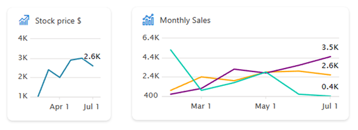

# SharePoint Framework v1.19 release notes

This release focuses on new features within the Viva Connections side and evolving existing capabilities within the other areas on building Microsoft 365 solutions with SharePoint Framework (SPFx).

**Released:** April 30, 2024

[!INCLUDE [spfx-release-notes-common](../../includes/snippets/spfx-release-notes-common.md)]

## Install the latest version

Install the latest official release of the SharePoint Framework (SPFx) by using the **@latest** tag

```console
npm install @microsoft/generator-sharepoint@latest --global
```

## Upgrading projects from the SPFx v1.18 to v1.19

In the project's **package.json** file, identify all SPFx v1.18.x packages. For each SPFx package:

1. Uninstall the existing v1.18.x package:

    ```console
    npm uninstall @microsoft/{spfx-package-name}@1.18.x
    ```

1. Install the new v1.19 package:

    ```console
    npm install @microsoft/{spfx-package-name}@latest --save --save-exact
    ```

[!INCLUDE [spfx-release-upgrade-tip](../../includes/snippets/spfx-release-upgrade-tip.md)]

## New features and capabilities

### New Data Visualization Card Template for Adaptive Card Extensions

We introduce a new data visualization Card View for Adaptive Card Extensions that is intended to be used for charting scenarios. Use new Data Visualization Card Template in the generator to get started.



Related updated documentation for the SPFx v1.19 release:

- **[Create a Data Visualization Adaptive Card Extension](viva/get-started/build-data-visualization-adaptive-card-extension.md)** (tutorial): Step-by-step guide on creating Data Visualization Adaptive Card Extension.
- **[Introducing new Viva Connections chart card layout option](https://www.youtube.com/watch?v=JOIb4KhiWAI)** (video) - This video focuses on the creation of ACE data visualization cards with SPFx and also showcases the future plans within this area. Example charts are also demonstrated in the context of example Viva Connections experience.

New samples showcasing the new data visualization ACE template:

- **[Chart Card - Page Creation](https://github.com/pnp/sp-dev-fx-aces/tree/main/samples/ChartCard-PageCreation)**: This Adaptive Card Extension displays a line chart showing pages and news creation history on the current SharePoint site.
- **[Chart Card - Three Series](https://github.com/pnp/sp-dev-fx-aces/tree/main/samples/ChartCard-ThreeSeries)**: Baseline example of the chart card rendering options, which was introduced as part of the SPFx 1.19 release. Chart card can be used to render simple charts directly in the Card View, so that you can include graphical details on your business situation directly in the Viva Connections dashboard.

### Webpack 5 support

The tooling was upgraded from Webpack 4 to Webpack 5.

> [!NOTE]
> If you have webpack configuration customizations in your project - reference the [official Webpack documentation](https://webpack.js.org/migrate/5/) for the migration details.

### Build time packages release is decoupled from the SPFx release

From this release forward, the build time packages are decoupled from the SPFx release. This means that the build time packages are released independently from the SPFx release. This change allows us to release new features and fixes to the build time packages without waiting for the next SPFx release.

This includes packages like `@microsoft/eslint-plugin-spfx`, `@microsoft/sp-module-interfaces`, and other similar build time packages.

### Optional footer for the Search Adaptive Card Extension

You can now skip `footer` for the Search adaptive card extension.

### `ariaLabel` property for the Property Pane's Checkbox control

`PropertyPaneCheckbox` now supports `ariaLabel` property.

### `imageAlt` property for the Property Pane's ChoiceGroup option

You can now specify `imageAlt` property for the Property Pane's choice group option.

### `ariaDescription` property for the Property Pane's Dropdown control

`PropertyPaneDropdown` now supports `ariaDescription` property.

### `disabled` property for the Property Pane's Icon Picker and Thumbnail Picker controls

`PropertyPaneIconPicker` and `PropertyPaneThumbnailPicker` now support `disabled` property.

### `inlineLabel` property for the Property Pane's Toggle control

`PropertyPaneToggle` now supports `inlineLabel` property that specifies whether the label (not the onText/offText) should be positioned inline with the toggle control. Left (right in RTL) side when on/off text provided vs. right (left in RTL) side when no on/off text.

> [!NOTE]
> When not providing on/off text user may get confused in differentiating the on/off states of the toggle.

## Deprecations

- Node.js v16 isn't supported with the SPFx v1.19 and forward.

## Fixed Issues

No new updates.

## Related guidance

We are also providing guidance on how to handle the font settings applied within the SharePoint Brand Center in the custom SPFx solutions. Please see following video as the demonstration on how you can use CSS custom properties within your solution to ensure that the custom solution is following the site level font settings.

- **[Using SharePoint Brand center font settings in custom SPFx solutions](https://www.youtube.com/watch?v=IP19PeHb0Zg)** (video) - This video focuses on making custom SPFx solution aware of the font settings applied from the [SharePoint Brand Center](/sharepoint/brand-center-overview).

## Feedback and issues

We're interested on your feedback around the release. Do let us know any findings or other feedback using the [SPFx issue list](https://github.com/SharePoint/sp-dev-docs/issues).

Happy coding! Sharing is caring! 🧡
