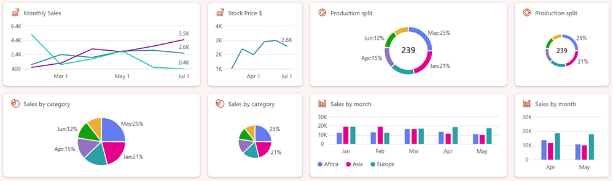

# SharePoint Framework v1.20 release notes

This release focuses primarily on the new features within the [Microsoft Viva Connections](./viva/overview-viva-connections.md) side with two key new capabilities: new data visualization options for Card Views and HTML Quick View option for Viva Connections Quick Views.

[!INCLUDE [spfx-release-beta](../../includes/snippets/spfx-release-beta.md)]

beta.0 **Released:** August 20, 2024

[!INCLUDE [spfx-release-notes-common](../../includes/snippets/spfx-release-notes-common.md)]

## Install the preview version

Install the preview release of the SharePoint Framework (SPFx) by using the **@next** tag

```console
npm install @microsoft/generator-sharepoint@next --global
```

## Upgrading projects from the SPFx v1.19 to v1.20 preview version

In the project's **package.json** file, identify all SPFx v1.19 packages. For each SPFx package:

1. Uninstall the existing v1.19 package:

    ```console
    npm uninstall @microsoft/{spfx-package-name}@1.19
    ```

1. Install the new v1.20 preview package:

    ```console
    npm install @microsoft/{spfx-package-name}@1.20.0-beta.0 --save --save-exact
    ```

[!INCLUDE [spfx-release-upgrade-tip](../../includes/snippets/spfx-release-upgrade-tip.md)]

## New features and capabilities

### New Data Visualization Card options for Viva Connections

As part of the 1.19 release, we provided new line chart card layout option and with the 1.20, we're introducing three new data visualization options: bar chart, pie chart and donat chart.



Related updated documentation for the SPFx v1.20 release:

- **[Create a Data Visualization Adaptive Card Extension](viva/get-started/build-data-visualization-adaptive-card-extension.md)** (tutorial): Step-by-step guide on creating Data Visualization Adaptive Card Extension - updated with the 1.20 release details
- **[Introduction to new data visualization components for Viva Connections](https://www.youtube.com/watch?v=zBLEEF6cC7I)** (video) - This video focuses on the creation of ACE data visualization cards with SPFx and also showcases the future plans within this area. Example charts are also demonstrated in the context of example Viva Connections experience.

New sample showcasing the new data visualization options for ACEs:

- **[Chart Card - Data Visualization Options](https://github.com/pnp/sp-dev-fx-aces/tree/main/samples/ChartCard-DataVisualizationOptions)**: Baseline example of the data visualization card rendering options, which was introduced as part of the SPFx 1.20 release.

### HTML Quick View support for Viva Connections cards

With the SPFx v1.20 version, we're introducing new option to use HTML to render the Viva Connection Adaptive Card Extension Quick Views. This enables more advanced user experiences. You can even use whatever suitable JavaScript web framework you prefer (that is: React etc.) in your Quick View experiences.

You can start using this option by updating your Quick View implementation to be inherited from xxx class, which will be automatically detected by the underlying platform.

Out-of-the-box OneDrive (files) card is using this rendering option as a reference point.


Related updated documentation for the SPFx v1.20 release:

- **[Build an HTML Quick View SharePoint Framework Adaptive Card Extension](./viva/get-started/build-html-quickview-adaptive-card-extension.md)** (tutorial): Step-by-step guide on creating an ACE with a custom HTML Quick View.
- **[Introduction to HTML Quick Views with SPFx in Viva Connections cards](https://youtu.be/kL6Nsx-K8Oo)** (video) - This video explains how you can create the Viva Connections card Quick Views using HTML. This enables more complex user interfaces for the Viva Connections vs the previously supported adaptive card option. Adaptive Cards will keep on being supported also as an option. You can use whatever JavaScript frameworks you'd like in the actual implementation, which provides more flexibility for developers.

New sample showcasing the new data visualization options for ACEs:

- **[Basic Card - HTML Quick View](https://github.com/pnp/sp-dev-fx-aces/tree/main/samples/BasicCard-HTML-QuickView)**: Baseline example of the data visualization card rendering options, which was introduced as part of the SPFx v1.20 release.


## Deprecations

No new updates.

## Fixed Issues

No new updates.

## Feedback and issues

We're interested on your feedback around the release. Do let us know any findings or other feedback using the [SPFx issue list](https://github.com/SharePoint/sp-dev-docs/issues).

Happy coding! Sharing is caring! 🧡
