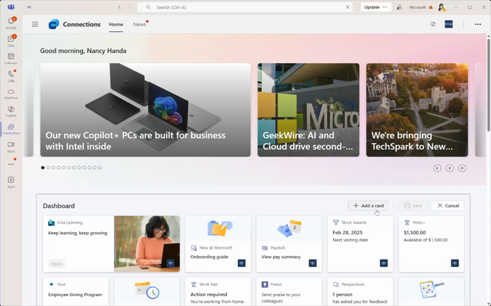

# SharePoint Framework v1.21 release notes

This release has updates on the Nodejs version and on other technical dependencies. It also contains updates for web parts in the context of flexible layouts in SharePoint and personalization option for cards.

> [!NOTE]
> [SharePoint Framework API Reference](https://learn.microsoft.com/en-us/javascript/api/overview/sharepoint?view=sp-typescript-latest) has been also updated to match the latest 1.21 version.

**Released:** April 23, 2025

[!INCLUDE [spfx-release-notes-common](../../includes/snippets/spfx-release-notes-common.md)]

## Install the latest version

Install the latest generally available release of the SharePoint Framework (SPFx) by using the **@latest** tag

```console
npm install @microsoft/generator-sharepoint@latest --global
```

## Upgrading projects from the SPFx v1.20 to v1.21 version

In the project's **package.json** file, identify all SPFx v1.20 packages. For each SPFx package:

1. Uninstall the existing v1.20 package:

    ```console
    npm uninstall @microsoft/{spfx-package-name}@1.20
    ```

1. Install the new v1.21 package:

    ```console
    npm install @microsoft/{spfx-package-name}@latest --save --save-exact
    ```

[!INCLUDE [spfx-release-upgrade-tip](../../includes/snippets/spfx-release-upgrade-tip.md)]

## New features and capabilities

### Node.js v22 support

Node.js support has been updated to version 22 with the 1.21 release.

> [!NOTE]
> Notice that Node.js version 22 is the only supported version with version 1.21.

### TypeScript 5.x support

TypeScript has been updated to TypeScript 5.x. Default scaffolded projects are using currently specifically 5.3.3 version by default.

### Flexible layout configuration options for web parts

New flexible layout sizing options are introduced for the web part manifest. These can be used to adjust the default behavior for the custom web parts as they're used within flexible layouts.

```json
  "flexibleLayoutSizing": {
    "supportsDynamicResizing": true,
    "defaultRowHeight": 10,
    "defaultColumnWidth": 10
  }
```

> [!NOTE]
> By default, all custom web parts are supported in the flexible layout option and don't require any code level changes.


### Viva Connections card personalization support

Viva Connections will start supporting end user configuration options for the dashboard. End users can add and remove cards from the dashboard based on their preference. Supported cards are explicitly enabled for this scenario and custom cards are supported.

By default, personalization isn't allowed for the custom Viva Connections cards.

```json
  "personalization": "Disallow"
```



### Updating Teams JS SDK

Default [Teams JavaScript SDK](https://github.com/OfficeDev/microsoft-teams-library-js) version for the SPFx powered solutions has been updated to version 2.32.

## Changes

Default debugging URL location was changed as part of the release. `debugManifestsFile` is updated as `https://localhost:4321/temp/build/manifests.js`. This might have impact on any tooling or scripts which have previously taken a dependency on this URL. Please update your those accordingly with this change.

*Previous versions*
```
[spfx-serve] To load your scripts, use this query string: ?debug=true&noredir=true&debugManifestsFile=https://localhost:4321/temp/manifests.js
```

*Updated debugManifestFile URL starting from 1.21 version*
```
[spfx-serve] To load your scripts, use this query string: ?debug=true&noredir=true&debugManifestsFile=https://localhost:4321/temp/build/manifests.js
```

## Deprecations

No new updates.

## Fixed Issues

No new updates.

## Feedback and issues

We're interested in your feedback about the release. Do let us know any findings or other feedback using the [SPFx issue list](https://github.com/SharePoint/sp-dev-docs/issues).

We will be doing some cleaning in the issue list after the 1.21 release to better focus on the latest issues and are more focused on helping you with any of your findings.

Happy coding! Sharing is caring! 🧡
