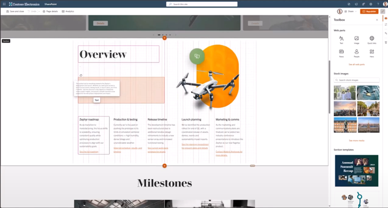

# SharePoint Framework v1.21 release notes

This release focuses primarily on the new features within the [Microsoft Viva Connections](./viva/overview-viva-connections.md) side with two key new capabilities: new data visualization options for Card Views and HTML Quick View option for Viva Connections Quick Views.

[!INCLUDE spfx-release-beta]

beta.0 **Released:** Feburary 25, 2025

[!INCLUDE [spfx-release-notes-common](../../includes/snippets/spfx-release-notes-common.md)]

## Install the latest version

Install the latest generally available release of the SharePoint Framework (SPFx) by using the **@next** tag

```console
npm install @microsoft/generator-sharepoint@next --global
```

## Upgrading projects from the SPFx v1.20 to v1.21 preview version

In the project's **package.json** file, identify all SPFx v1.20 packages. For each SPFx package:

1. Uninstall the existing v1.20 package:

    ```console
    npm uninstall @microsoft/{spfx-package-name}@1.20
    ```

1. Install the new v1.21 preview package:

    ```console
    npm install @microsoft/{spfx-package-name}@next --save --save-exact
    ```

[!INCLUDE [spfx-release-upgrade-tip](../../includes/snippets/spfx-release-upgrade-tip.md)]

## New features and capabilities

### Flexible layout configuration options for web parts

New flexible layout sizing options are introduced for the web part manifest. These cawn be used to adjust the default behaviour for the custom web parts as they are used within flexible layouts.

```json
  "flexibleLayoutSizing": {
    "supportsDynamicResizing": true,
    "defaultRowHeight": 10,
    "defaultColumnWidth": 10
  }
```

> [!NOTE]
> By default all custom web parts are supported in the flexible layout option and do not require any code level changes.



### Viva Connections card personalization support

Viva Connections will start supporting end user configuration options for the dashboard. End users can add and remove cards from the dasbhoard based on their preference. Supported cards are explictly enabled for this scenario and also custom cards are supported.

By default personalization is not allowed for the custom Viva Connections cards.

```json
  "personalization": [
    "Disallow"
  ]
```

### Updating Teams JS SDK

Default [Teams JavaScript SDK](https://github.com/OfficeDev/microsoft-teams-library-js) version for the SPFx powered solutions has been updated to version 2.32.

## Deprecations

No new updates.

## Fixed Issues

No new updates.

## Feedback and issues

We're interested on your feedback around the release. Do let us know any findings or other feedback using the [SPFx issue list](https://github.com/SharePoint/sp-dev-docs/issues).

Happy coding! Sharing is caring! 🧡
