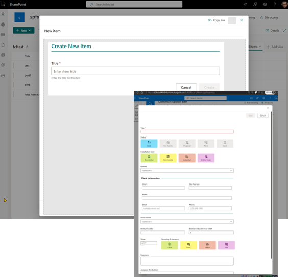

# SharePoint Framework v1.23.2 release notes

This is a _minor bump_ that addresses known npm vulnerabilities, fixes reported issues, and provides readiness for the list panel override on the client side.

> [!TIP]
> After the initial release of SPFx 1.23.0, we also released update 1.23.1. However, it was delisted due to regressions.

**Released:** June 30, 2026

[!INCLUDE [spfx-release-notes-common](../../includes/snippets/spfx-release-notes-common.md)]

## Install the latest version

Install the latest release of the SharePoint Framework (SPFx) by including the **@latest** tag:

```console
npm install @microsoft/generator-sharepoint@latest --global
```

## Upgrading projects from v1.23.0 to v1.23.2

In the project's **package.json** file, identify all SPFx v1.23.0 packages. For each SPFx package:

1. Uninstall the existing v1.23.0 package:

    ```console
    npm uninstall @microsoft/{spfx-package-name}@1.23.0
    ```

1. Install the new v1.23.2 package:

    ```console
    npm install @microsoft/{spfx-package-name}@latest --save --save-exact
    ```

[!INCLUDE [spfx-release-upgrade-tip](../../includes/snippets/spfx-release-upgrade-tip.md)]


## Readiness for list panel override

We're rolling out readiness for the Form Customizer panel override with this release. When enabled in the Form Customizer manifest, the extension is automatically rendered in the list panel without requiring a page transition. This enables complex panel extensions directly in the list panel with SPFx.

You can enable this support with the `isPanelExperienceEnabled` attribute in the extension's **manifest.js** file. When set to `true`, the Form Customizer is rendered inside the new, edit, or display panel in the list view instead of opening a separate page. When the attribute is absent, it defaults to `false` (the existing behavior).



Note that at the time of the 1.23.2 client-side package release, this feature isn't yet fully available on the server side. This means that even if you include this attribute in the manifest, the new experience will become visible by the end of July 2026.

## Addressing vulnerabilities

We have fixed all critical and high vulnerabilities with this release. However, there are a few known issues with external dependencies that are waiting for updates from their maintainers. These reported `moderate` vulnerabilities don't affect the runtime security of SPFx, and they'll be fixed once the external dependencies are updated.

The SharePoint Framework toolchain relies on server-side npm packages for build and debugging operations, but these packages are never included in the final sppkg package that runs in SharePoint Online or Microsoft 365. Because these packages only support the localhost experience and are not exposed to end users, they do not create risks in production environments.

This model ensures predictable updates, reduces unnecessary concern, and keeps npm audit reports clean when creating new SPFx solutions.

For more details about this model, see the following article:

* [Understanding npm audit vulnerabilities in SPFx projects](./npm-vulnerabilities.md)

## Fixed issues

Here's a list of specific issues fixed around SharePoint Framework since the previous public release.

- [#10831](https://github.com/SharePoint/sp-dev-docs/issues/10831) - [SPFx 1.23] CSS/SCSS source maps not working in development mode — regression from SPFx 1.20
- [#10832](https://github.com/SharePoint/sp-dev-docs/issues/10832) - [SPFx 1.22+] Undocumented breaking change: plain .scss and .css files generate typed CSS module declarations but webpack processes them as global CSS
- [#10833](https://github.com/SharePoint/sp-dev-docs/issues/10833) - SPFx scaffold template includes deprecated @import of Fluent UI SCSS variables — should be removed and documented
- [#10854](https://github.com/SharePoint/sp-dev-docs/issues/10854) - [SPFx 1.22→1.23] Sass import resolution changed — ~ breaks in meta.load-css(), bare specifiers and importIncludePaths no longer work (undocumented)
- [#10872](https://github.com/SharePoint/sp-dev-docs/issues/10872) - postcss-calc emits spurious warnings for relative color syntax and color-mix() channel keywords (SPFx 1.23)

## Feedback and issues

We're interested in your feedback about the release and if you find any issues, share them using the [sp-dev-docs repository issue list](https://aka.ms/spfx/issues). Thank you for your input advance.

Happy coding! Sharing is caring! 🧡
