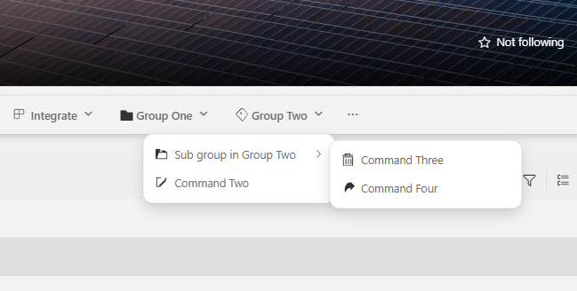

# SharePoint Framework v1.23 preview release notes

This is an early baseline version for the upcoming SharePoint 1.23 version with initial updates. We are introducing new capabilities as part of the following updates before the general availability of 1.23.

[!INCLUDE [spfx-release-beta](../../includes/snippets/spfx-release-beta.md)]

* rc.0 Released: April 8, 2026
* beta.2 Released: April 2, 2026
* beta.0 Released: March 23, 2026

[!INCLUDE [spfx-release-notes-common](../../includes/snippets/spfx-release-notes-common.md)]

## Install the latest version

Install the latest preview release of the SharePoint Framework (SPFx) by using the **@next** tag

```console
npm install @microsoft/generator-sharepoint@next --global
```

## Upgrading projects to v1.23 preview version

The upgrade steps required to convert a [gulp-based toolchain](toolchain/sharepoint-framework-toolchain.md) SPFx project to the [Heft-based toolchain](toolchain/sharepoint-framework-toolchain-rushstack-heft.md) are detailed in the following article: [Migrate from the Gulp Toolchain to Heft Toolchain](toolchain/migrate-gulptoolchain-hefttoolchain.md).

## New features and capabilities

### Grouping support for list view command sets

Starting with the SPFx 1.23, we will be also supporting grouping of list view command sets in the toolbar and in the context menu. This provides more control on how the list view commands are rendered in lists and libraries.



> This feature is currently in progress to rollout in production and will be enable in all tenants by early April.

See more details on this upcoming change from the following documentation:

- [Grouping in ListView Command Set extensions](./extensions/guidance/list-view-command-set-grouping.md)

### Preview of new SPFx CLI and open-sourced templates

We're excited to provide a first preview version of upcoming SPFx CLI (Command Line Interface) which will eventually replace the current usage of Yeoman generator. We're also open-sourcing the used solution templates that the SPFx CLI tool is using for the solution creation.

SPFx CLI can be used to scaffold SPFx solutions in the same way as SPFx Yeoman generator previously. Used templates are open-source and you can also configure the CLI to use alternative templates that you're storing in another location. This enables ecosystem to build replacement templates or project specific templates, optimized for the use case.

SPFx CLI and templates are available in [GitHub](https://github.com/SharePoint/spfx) as open-source solution and we welcome Pull Requests and suggestions on the needed changes.

We are in progress of publishing first version of the CLI to NPMjs in upcoming days and we will share more documentation on the usage at this time. Current schedule for General Availability of SPFx CLI is June 2026.

Install the preview version of the SPFx CLI using following command.

```console
npm install @microsoft/spfx-cli --global
```

and you can scaffold your first solution with following command.

```console
spfx create \
  --template webpart-react \
  --library-name my-spfx-library \
  --component-name "Hello World"
```

See more details and other options from the CLI [documentation](https://github.com/SharePoint/spfx/blob/main/apps/spfx-cli/README.md).

Your feedback is welcome. Let us know your first impressions and provide suggestions.

### Addressing npm audit issues

When installing the SharePoint Framework Yeoman generator or scaffolding solutions, we have worked on the reported `npm audit` issues. Addressing vulnerabilities is a moving target, which we keep on addressing with all releases.

We have identified issues on the npm audit still for the 1.23 release which will be addressed with the upcoming RC1 release before we are ready for General Availability of 1.23.

## Deprecations

No new updates.

## Feedback and issues

We're interested in your feedback about the release and if you find any issues, share them using the [sp-dev-docs repository issue list](https://aka.ms/spfx/issues). We're also tracking any other [discussions](https://github.com/SharePoint/sp-dev-docs/discussions) if you simply want to have a discussion with the engineering team on this release. Thank you for your input advance.

Happy coding! Sharing is caring! 🧡
