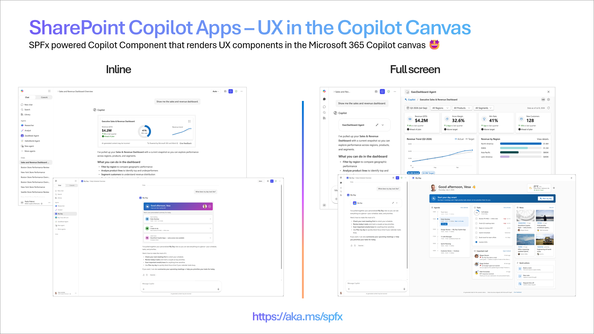

# SharePoint Framework v1.24 preview release notes

This releases focuses on providing a public preview for the SharePoint Copilot Apps, enabling SPFx components to be surfaces directly in the Copilot canvas and to participate on the discussion with the Copilot.

[!INCLUDE [spfx-release-beta](../../includes/snippets/spfx-prerelease-related.md)]

**beta.1 Released:** July 8, 2026

[!INCLUDE [spfx-release-notes-common](../../includes/snippets/spfx-release-notes-common.md)]

## Install the preview  version

Install the next preview of the SharePoint Framework (SPFx) by using the **@next** tag

```console
npm install @microsoft/generator-sharepoint@next --global
```

## New features and capabilities

### SharePoint Copilot Apps (Public Preview)

SharePoint Copilot Apps bring rich, interactive UX components directly into the Microsoft 365 Copilot canvas. Instead of returning text alone, your agent can render real, interactive experiences - charts, maps, KPIs, forms, approvals, and more - right where the conversation happens, so users move from intent to action without leaving Copilot.

Copilot Apps are built on the **SharePoint Framework (SPFx)** and implement the **MCP Apps** model. Components are hosted automatically in your Microsoft 365 tenant and you do not need to worry about the hosting or routing like typically with MCP Apps model. Developers can focus building the UX experience and define the metadata when those are activated. No complexity on the hosting or operations.



#### What's included in the 1.24 preview

- **Local development in Copilot Workbench** - build, run, and debug your Copilot App locally in the **Copilot Workbench**, the developer test environment. You get the same fast inner-loop workflow you already know from SPFx: scaffold, run locally, iterate, then deploy.
- **The same SPFx model you already know** - Copilot Apps use the same packaging, tooling, and project structure SPFx has used for years. If you've built web parts or extensions, you already understand how this works - there's no new platform or proprietary runtime to learn.
- **No Copilot license required to build** - during public preview, you can build and test Copilot Apps in any Microsoft 365 tenant with **no Microsoft 365 Copilot license requirement**. (Licensing is subject to change before general availability.)
- **Three starter templates** - just like the framework choices you know from web parts, the scaffolding offers three starting points:
  - **Minimal** - the leanest possible starting point, ideal for learning the model or building up from scratch.
  - **No framework** - plain TypeScript with no UI framework.
  - **React** - a React-based starting point for teams already building with React.

#### Getting started

1. Install the **SPFx 1.24 preview** from npm.
2. Scaffold a new Copilot App and pick a template (Minimal, No framework, or React).
3. Run and test it locally in the **Copilot Workbench**.
4. Deploy to your tenant and surface it in Copilot.

#### Known limitations and considerations

This is a public preview - please keep the following in mind:

- **Worldwide rollout in progress** - end-user availability is rolling out globally and will be fully functional worldwide by **July 20, 2026**. If some capabilities aren't visible in your tenant yet, they're on the way.
- **Copilot canvas only (for now)** - in this initial preview, components render only in the Copilot UX. Support for additional surfaces is in the works.
- **Duplicate tool names** - if two solutions register a tool with the **same name**, Copilot loads the first tool it finds. This is a known issue targeted for a fix in **August**, and it applies to the preview period only.
- **Store not supported** - distributing Copilot Apps through the store is **not supported** during public preview.
- **Preview software** - capabilities, APIs, and the "SharePoint Copilot Apps" working name may change before general availability. Build accordingly, and please share your feedback.

Please share any questions or findings on the SharePoint Copilot Apps through the [sp-dev-docs repository issue list](https://aka.ms/spfx/issues). We want to hear from you.

#### Assets on Copilot Apps

- [Overview documentation](./copilot/overview-copilot-apps.md)
- [Creating your first SharePoint Copilot App tutorial](#) – documentation
- [Going beyond text in Microsoft 365 Copilot: Introducing SharePoint Copilot Apps](https://devblogs.microsoft.com/microsoft365dev/going-beyond-text-in-microsoft-365-copilot-introducing-sharepoint-copilot-apps/) – Public announcement
- [Creating your first SharePoint Copilot App - Tutorial](https://www.youtube.com/watch?v=ofgERb5Zlbo) - video
- [Introduction to SharePoint Copilot Apps](https://www.youtube.com/watch?v=mpSVo47LDHE) – video
- [Introduction to SharePoint Copilot Apps developer experience](https://www.youtube.com/watch?v=ofgERb5Zlbo) – video
- [Build UX components for your Copilot agent – My Day scenario – SharePoint Copilot Apps](https://www.youtube.com/watch?v=VCkoAucaodw) – video
- [GitHub repository for samples](https://github.com/pnp/spfx-copilot-apps) - we'll start with 3 scenario samples with sample data - contributions welcome

### Addressing npm audit issues

When installing the SharePoint Framework Yeoman generator or scaffolding solutions, we have worked on the reported `npm audit` issues. Addressing vulnerabilities is a moving target, which we keep on addressing with all releases.

We are aware of the reported vulnarabilities with this version and are working with the needed teams to address them. These are not causing security issues for runtime or development time.

## Deprecations

None for now with 1.24 preview.

## Feedback and issues

We're interested in your feedback about the release and if you find any issues, share them using the [sp-dev-docs repository issue list](https://aka.ms/spfx/issues). We're also tracking any other [discussions](https://github.com/SharePoint/sp-dev-docs/discussions) if you simply want to have a discussion with the engineering team on this release. Thank you for your input advance.

Happy coding! Sharing is caring! 🧡