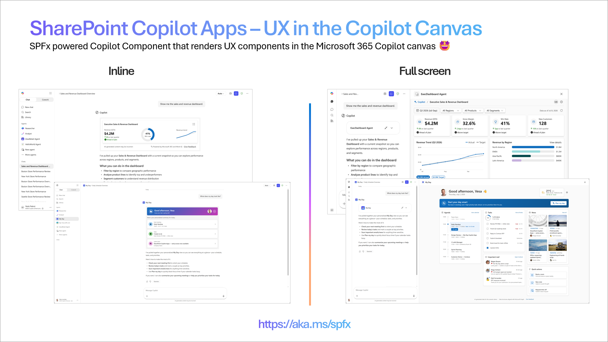

# SharePoint Framework v1.24 preview release notes

This preview update brings the long-requested React 18 support to SPFx solutions and continues to harden the Copilot Components experience based on the feedback we have received from the first preview.

[!INCLUDE [spfx-release-beta](../../includes/snippets/spfx-prerelease-related.md)]

- **beta.1 released:** July 8, 2026
- **beta.3 released:** August 27, 2026

[!INCLUDE [spfx-release-notes-common](../../includes/snippets/spfx-release-notes-common.md)]

## Install the preview version

Install the latest preview of the SharePoint Framework (SPFx) by using the **@next** tag:

```console
npm install @microsoft/generator-sharepoint@next --global
```

## New features and capabilities

### React 18 is here

The out-of-the-box React version used by SPFx solutions has been updated to React 18.x. This has been one of the most consistent asks from customers and partners, and it now lands in the 1.24 preview line so you can start validating your solutions against a modern React runtime well before general availability.

Please take this build for a spin and validate your solutions against React 18 — this is exactly the kind of change where broad, real-world testing before general availability makes the difference. If you run into anything unexpected, report it on our [issue list](https://aka.ms/spfx/issues) so we can address it in an upcoming preview.

### Copilot Components updates (Public Preview)

This capability was introduced as **SharePoint Copilot Apps** in the July public preview. Based on feedback and the direction of the capability, we will most likely call it **Copilot Components** going forward. The final naming decision for general availability will be announced soon.

Copilot Components bring rich, interactive UX components directly into the Microsoft 365 Copilot canvas. Instead of returning text alone, your agent can render real, interactive experiences - charts, maps, KPIs, forms, approvals, and more - right where the conversation happens, so users move from intent to action without leaving Copilot.

Copilot Components are built on the **SharePoint Framework (SPFx)** and implement the **MCP Apps** model. Components are hosted automatically in your Microsoft 365 tenant and you do not need to worry about the hosting or routing typically associated with the MCP Apps model. Developers can focus on building the UX experience and defining the metadata that determines when components are activated, without adding hosting or operational complexity.

You don't need a Microsoft 365 Copilot license to develop or test Copilot Components during the public preview. Licensing requirements for general availability have not yet been finalized; the final decision is coming soon.



#### Updates in beta.3

**Predictable default display mode:** Components can now rely on the default display mode declared in their manifest behaving consistently in the Copilot canvas: a freshly invoked component opens in its declared default mode, closing it returns the conversation to the inline view without the component reopening itself, and an explicit request from the user can reopen it in fullscreen. Previously, display-mode transitions could cause a component to snap back to its default sizing unexpectedly.

**No more version conflicts when updating a component:** When the content of a Copilot Component changes, the hotfix segment of its Teams manifest version is now bumped automatically if the author has not already updated it. This removes the confusing conflict error developers hit when adding or updating a component that still carried the same version number. Follow-up work will also surface clearer error messages in the admin center for this scenario.

**Declarative agent manifest validation at build time:** The build now validates your declarative agent manifest against the agent schema, so definitions that do not comply are caught while you build rather than failing at runtime in the Copilot canvas. Instead of deploying a solution and discovering that a component never loads or a tool never appears, you get a clear error up front, in the same inner-loop step where you can fix it. This is a meaningful reliability improvement for anyone iterating on Copilot Components, and it removes one of the more frustrating classes of "it built fine but does not work in Copilot" problems.

**Newly scaffolded Copilot Components target declarative agent manifest v1.8:** When you scaffold a new Copilot Component, the declarative agent manifest is now created at v1.8, up from v1.7. You start on the current schema version rather than having to hand-upgrade a freshly created project, and your agent picks up the capabilities and behaviors defined in the newer manifest version out of the box. Existing solutions are not changed automatically — update the manifest version in your own project when you are ready.

#### Getting started

1. Install the **SPFx 1.24 preview** from npm.
2. Scaffold a new Copilot Component and pick a template (Minimal, No framework, or React).
3. Run and test it locally in the **Copilot Workbench**.
4. Deploy to your tenant and surface it in Copilot.

#### Known limitations and considerations

This is a public preview. Keep the following in mind:

- **Copilot canvas only (for now):** In this initial preview, components render only in the Copilot UX. Support for additional surfaces is in the works.
- **Store not supported (yet):** Distributing Copilot Components through the store is **not supported** during public preview.
- **Preview software:** Capabilities and APIs may change before general availability. The capability was called "SharePoint Copilot Apps" in the July preview and will most likely be called "Copilot Components"; the final general availability decision is coming soon. Build accordingly, and please share your feedback.

Please share any questions or findings on Copilot Components through the [sp-dev-docs repository issue list](https://aka.ms/spfx/issues). We want to hear from you.

#### Copilot Components resources

- [Copilot Components overview](./copilot/overview-copilot-apps.md)
- [Build your first Copilot Component](./copilot/get-started/build-your-first-copilot-app.md) – documentation
- [Creating your first SharePoint Copilot App - Tutorial](https://www.youtube.com/watch?v=1TaK6osdvc0) - video
- [Going beyond text in Microsoft 365 Copilot: Introducing SharePoint Copilot Apps](https://devblogs.microsoft.com/microsoft365dev/going-beyond-text-in-microsoft-365-copilot-introducing-sharepoint-copilot-apps/) – Public announcement
- [Introduction to SharePoint Copilot Apps](https://www.youtube.com/watch?v=mpSVo47LDHE) – video
- [Introduction to SharePoint Copilot Apps developer experience](https://www.youtube.com/watch?v=ofgERb5Zlbo) – video
- [Build UX components for your Copilot agent – My Day scenario – SharePoint Copilot Apps](https://www.youtube.com/watch?v=VCkoAucaodw) – video
- [GitHub repository for samples](https://github.com/pnp/spfx-copilot-apps) - contributions are welcome

### Addressing npm audit issues

We continue to address the `npm audit` findings reported when installing the SharePoint Framework Yeoman generator or scaffolding solutions. Dependency vulnerabilities evolve over time, and we review them with every release.

We are aware of the findings reported for this preview and are working with the relevant teams to address them. Based on our current assessment, these findings don't affect the runtime or development-time security of SPFx solutions.

## Deprecations

None for now with 1.24 preview.

## Feedback and issues

We're interested in your feedback about the release. If you find any issues, share them using the [sp-dev-docs repository issue list](https://aka.ms/spfx/issues). You can also use [GitHub Discussions](https://github.com/SharePoint/sp-dev-docs/discussions) to start a conversation with the engineering team about this release. Thank you for your input in advance.

Happy coding! Sharing is caring! 🧡