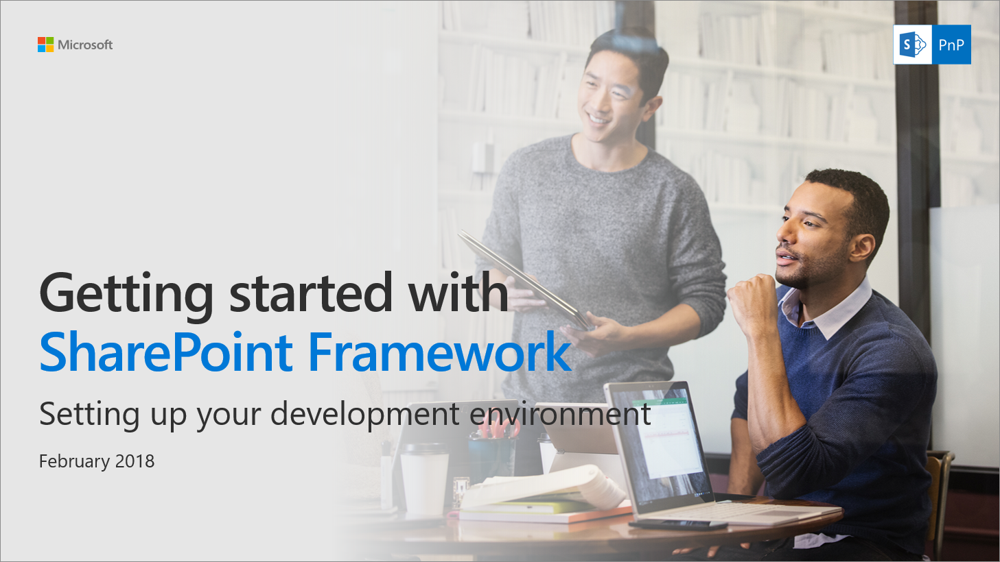

# Set up your SharePoint Framework development environment

You can use Visual Studio or your own custom development environment to build SharePoint Framework solutions. You can use a Mac, PC, or Linux.

> [!NOTE] 
> Before following the steps in this article, be sure to [Set up your Office 365 tenant](./set-up-your-developer-tenant.md).

You can also follow these steps by watching this video on the [SharePoint PnP YouTube Channel](https://www.youtube.com/watch?v=WX9FL0BjE0I&list=PLR9nK3mnD-OXvSWvS2zglCzz4iplhVrKq).

<a href="https://www.youtube.com/watch?v=WX9FL0BjE0I&list=PLR9nK3mnD-OXvSWvS2zglCzz4iplhVrKq">
    
</a>

## Install developer tools

### Install NodeJS

Install [NodeJS version 6.x](https://nodejs.org/download/release/latest-v6.x/). 

- If you are in Windows, you can use the msi installers in this link for the easiest way to set up NodeJS.
- If you have NodeJS already installed, check that you have the latest version by using `node -v`. It should return the current [LTS version](https://nodejs.org/en/download/). 
- If you are using a Mac, we recommend that you use [homebrew](http://brew.sh/) to install and manage NodeJS. 

> [!NOTE] 
> The SharePoint Framework build pipeline doesn't currently support the LTS version of Node.js. Instead, download [Node.js version 6.11.5](https://nodejs.org/download/release/latest-v6.x/). This installs npm 3.10.10. Note that if you have a v5.x version of npm, you need to downgrade to an older npm version by using the following command: `npm install -g npm@3`.

### Install a code editor

You can use any code editor or IDE that supports client-side development to build your web part, such as:

- [Visual Studio Code](https://code.visualstudio.com/)
- [Atom](https://atom.io)
- [Webstorm](https://www.jetbrains.com/webstorm)

The steps and examples in this documentation use [Visual Studio Code](https://code.visualstudio.com/), but you can use any editor of your choice.

### If you are using Ubuntu

You need to install compiler tools using the following command:

```sh
sudo apt-get install build-essential
```

### If you are using fedora

You need to install compiler tools using the following command:

```sh
sudo yum install make automake gcc gcc-c++ kernel-devel
```

## Install Yeoman and gulp

[Yeoman](http://yeoman.io/) helps you kick-start new projects, and prescribes best practices and tools to help you stay productive. SharePoint client-side development tools include a Yeoman generator for creating new web parts. The generator provides common build tools, common boilerplate code, and a common playground website to host web parts for testing.

Enter the following command to install Yeoman and gulp:

```sh
npm install -g yo gulp
```

## Install Yeoman SharePoint generator

The Yeoman SharePoint web part generator helps you quickly create a SharePoint client-side solution project with the right toolchain and project structure.

To install the SharePoint Framework Yeoman generator globally, enter the following command:

```sh
npm install -g @microsoft/generator-sharepoint
```

If you need to switch between the different projects created by using different versions of the SharePoint Framework Yeoman generator, you can install the generator locally as a development dependency in the project folder by executing the following command:

```sh
npm install @microsoft/generator-sharepoint --save-dev
```

## Optional tools

Following are some tools that might come in handy as well:

* [Fiddler](https://www.telerik.com/fiddler)
* [Postman plug-in for Chrome](https://www.getpostman.com/docs/postman/launching_postman/navigating_postman)
* [Cmder for Windows](http://cmder.net/)
* [Oh My Zsh for Mac](http://ohmyz.sh/)
* [Git source control tools](https://git-scm.com/)

## Next steps

You are now ready to [build your first client-side web part](web-parts/get-started/build-a-hello-world-web-part.md)!

> [!NOTE]
> If you find an issue in the documentation or in the SharePoint Framework, report that to SharePoint engineering by using the [issue list at sp-dev-docs repository](https://github.com/SharePoint/sp-dev-docs/issues). Thanks for your input in advance.