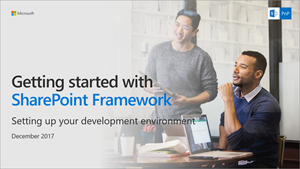

# Set up your SharePoint client-side web part development environment

You can use Visual Studio, or your own custom development environment to build SharePoint client-side web parts. You can use a Mac, PC, or Linux.

>**Note:** Before following the steps in this article, be sure to [Set up your Office 365 Tenant](./set-up-your-developer-tenant.md).

You can also follow these steps by watching the video on the [SharePoint PnP YouTube Channel](https://www.youtube.com/watch?v=_fxYexlUhe0&t=5s&list=PLR9nK3mnD-OXvSWvS2zglCzz4iplhVrKq&index=1).

<a href="https://www.youtube.com/watch?v=_fxYexlUhe0&t=5s&list=PLR9nK3mnD-OXvSWvS2zglCzz4iplhVrKq">
    
</a>

## Install developer tools

### NodeJS

Install [NodeJS](https://nodejs.org/en/) Long Term Support (LTS) version.

* If you have NodeJS already installed please check you have the latest version using `node -v`. It should return the current [LTS version](https://nodejs.org/en/download/). 
* If you are using a Mac, it is recommended you use [homebrew](http://brew.sh/) to install and manage NodeJS. 

*** We got a case today where the customer went and downloaded the latest version of Node and the walk through on https://docs.microsoft.com/en-us/sharepoint/dev/spfx/web-parts/get-started/build-a-hello-world-web-part did not work when he got to the last part "gulp serve."  The 8.9.0 version of Node went live 3 days ago, and the below paragraph suggests we support the latest version.  The paragraph is also confusing because it conflates NPM with Node in ways that many customer following this begining walkthrough won't understand.  It talks first about NPM. I suggest something like...***

> <i> Note, SPFx build pipeline does **NOT** currently support the LTS version of NodeJS.  Please downoad the appropriate 6.11.5 version from https://nodejs.org/download/release/latest-v6.x/.  This installs npm 3.10.10.  Note that if you have a v5.x version  of npm, you will need to dowwngrade to an older npm version with following command `npm install -g npm@3`.  We'll update this document when this document when there are changes to the supportability statement.</i>

*** Also, can I tell my customer when SPFx build will support current LTS of NodeJS? ***

> Notice that SPFx build pipeline does **NOT** currently support npm v5.x, so you'll need to use either v3 or v4. At the time of the writing, NodeJS LTS version (v6.11.0) installs npm v3.10.10. We'll update this section when there are changes in the supportability statement. You can downgrade to older npm version with following command `npm install -g npm@3`.

### Code Editors

Install a code editor. You can use any code editor or IDE that supports client-side development to build your web part, such as:

* [Visual Studio Code](https://code.visualstudio.com/)
* [Atom](https://atom.io)
* [Webstorm](https://www.jetbrains.com/webstorm)

The steps and examples in this documentation use [Visual Studio Code](https://code.visualstudio.com/), but you can use any editor of your choice.

### If you are using Ubuntu

You need to install compiler tools using the following command:

```sh
sudo apt-get install build-essential
```

### If you are using fedora

You need to install compiler tools using the following command:

```sh
sudo yum install make automake gcc gcc-c++ kernel-devel
```

## Install Yeoman and gulp

[Yeoman](http://yeoman.io/) helps you kick-start new projects, and prescribes best practices and tools to help you stay productive. SharePoint client-side development tools include a Yeoman generator for creating new web parts. The generator provides common build tools, common boilerplate code, and a common playground web site to host web parts for testing.

Enter the following command to install Yeoman and gulp:

```sh
npm install -g yo gulp
```

## Install Yeoman SharePoint generator

The Yeoman SharePoint web part generator helps you quickly create a SharePoint client-side solution project with the right toolchain and project structure.

To install the SharePoint Framework Yeoman generator globally, enter the following command:

```sh
npm install -g @microsoft/generator-sharepoint
```

If you need to switch between the different projects created using different versions of the SharePoint Framework Yeoman generator, you can install the generator locally as a development dependency in the project folder by executing the following command:

```sh
npm install @microsoft/generator-sharepoint --save-dev
```

## Optional tools

Here are some tools that might come in handy as well:

* [Fiddler](http://www.telerik.com/fiddler)
* [Postman plugin for Chrome](https://www.getpostman.com/docs/introduction)
* [Cmder for Windows](http://cmder.net/)
* [Oh My Zsh for Mac](http://ohmyz.sh/)
* [Git source control tools](https://git-scm.com/)

## Next steps

You are now ready to [build your first client-side web part](web-parts/get-started/build-a-hello-world-web-part.md)!
