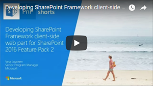

# SharePoint Framework development with SharePoint 2016 Feature Pack 2

SharePoint 2016 Feature Pack 2 support SharePoint Framework client-side web parts in classic SharePoint pages. 

Introduction to SharePoint Framework development in SharePoint 2016 Feature Pack is also covered in following video at [SharePoint PnP YouTube Channel](https://www.youtube.com/watch?v=LGLMxnmHk6U&list=PLR9nK3mnD-OXZbEvTEPxzIOMGXj_aZKJG). 

<a href="https://www.youtube.com/watch?v=LGLMxnmHk6U&list=PLR9nK3mnD-OXZbEvTEPxzIOMGXj_aZKJG">

</a>

## When to use which SharePoint Framework version?

Since SharePoint Online and SharePoint 2016 has different release cycle for the new capabilities, they do support different capabilities also for the SharePoint Framework. SharePoint Online is always using the latest version of the SharePoint Framework, but SharePoint 2016 will support the version, which is matching server-side dependencies of the deployed packages. 

SharePoint 2016 Feature Pack 2 has support for the SharePoint Framework client-side web parts hosted in the classic SharePoint pages with SharePoint Framework v1.0. This means that when you are targeting your customization to SharePoint 2016 platform, you'll need to use SharePoint Framework v1.0.2 version due server-side version dependency. 

If you are planning to use same client-side web parts in both SharePoint 2016 and in SharePoint Online, you will need to use the SharePoint Framework v1.0.2 as your baseline version to ensure that the web part works in both environments. 

## Installing SharePoint Framework version for SP2016 development

You should ensure that you are using the right version of SharePoint Framework in your development machine. You can check the currently globally installed SharePoint Framework Yeoman template package version by executing following command. 

```
npm list -g --depth 0
```

This will list the globally installed packages, including their versions. You can uninstall newer version by using following command.

```
npm uninstall -g @microsoft/generator-sharepoint
```

To install v1.0.2 version of the SharePoint Framework Yeoman templates, you can execute following command.

```
npm install -g @microsoft/generator-sharepoint@1.0.2
```

## Hosting your SharePoint Framework solution for on-premises deployment

Getting SharePoint Framework client-side web parts deployed to on-premises will require two distinct actions. 

- Deployment of the solution package to SharePoint app catalog
- Hosting JavaScript files in centralized location

You can host JavaScript files in any suitable location for you depending on the environment details. These files can be for example hosted in following locations.

- **Azure CDN** - Similar setup as with SharePoint Online. Does require end users to have Internet connectivity
- **Local server in corporate network** - Server hosting the JavaScript files for the corporate network. This can be using whatever technology as long as files are accessible with http requests.
- **SharePoint 2016** - You can also host your files in the local SharePoint farm. You can for example define a standardized site in your farm where all the SharePoint Framework assets are being hosted. Notice though that by default .json files are not allowed to be uploaded to SharePoint 2016 libraries, so farm level settings will need to be adjusted for this option.   

> You can find more details on the blocked file types in SharePoint 2016 from following support article: [Types of files that cannot be added to a list or library](https://support.office.com/en-us/article/Types-of-files-that-cannot-be-added-to-a-list-or-library-30be234d-e551-4c2a-8de8-f8546ffbf5b3#ID0EAADAAA=2016)

## Development environment considerations 

When you are developing SharePoint Framework client-side web parts, you should have normally Internet connectivity to access npm packages. This is required when solutions are being scaffold using SharePoint Framework Yeoman templates.

If Internet access is not available for the development machines, you can also setup local on-premises registry for needed npm packages. This does however require additional software and significant amount of work to operation and to update based on new versions and packages in actual npm gallery.

> [Team-based development on the SharePoint Framework](team-based-development-on-sharepoint-framework.md) guidance includes different options around the development environment setup also when you might need to support multiple SharePoint Framework versions. 

## How to determine which SharePoint Framework version was used for a solution?

If you have already existing SharePoint Framework solutions and you'd like to confirm the used SharePoint Framework version for them, you'll need to confirm this potentially from following locations. 

- **.yo-rc.json** file in solution root folder defines used SharePoint Framework Yeoman template version when the solution was created.
- **package.json** file in the solution root folder contains references to versions when the solution was created.
- **npm-shrinkwrap.json** file in the solution root folder will contain information on the exact versions, if you have used the `npm shrinkwrap` command for the solution to lock-down the exact versions.
-- **package.json** file in *node_modules\@microsoft/sp-webpart-base* folder contains a *version* attribute matching used SharePoint Framework version, if you have installed packages to your solution.