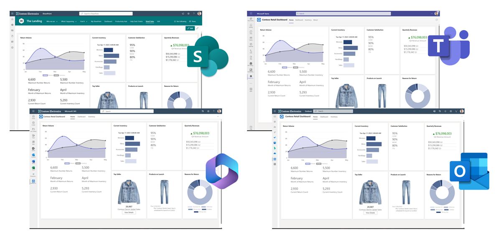
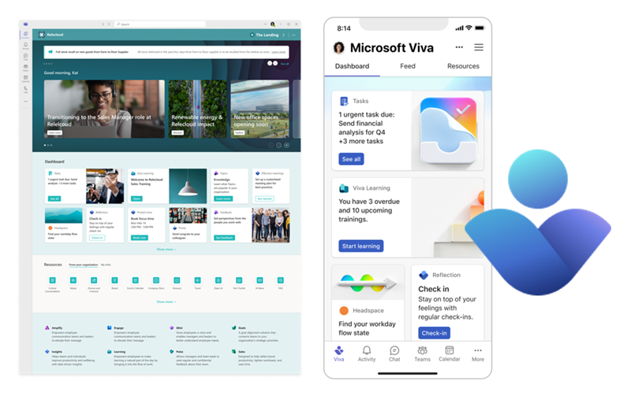

# Overview of the SharePoint Framework

The SharePoint Framework (SPFx) is a page and web part model that provides full support for client-side SharePoint development, easy integration with SharePoint data, and extending Microsoft Teams and Microsoft Viva. With the SharePoint Framework, you can use modern web technologies and tools in your preferred development environment to build productive experiences and apps that are responsive and mobile-ready.

[!INCLUDE [sp-add-in-deprecation](../../includes/snippets/sp-add-in-spfx.md)]

The SPFx is the recommended SharePoint customization and extensibility model for developers. Due to tight integration between SharePoint Online, Microsoft Teams, and Microsoft Viva Connections, developers can also use SPFx to customize and extend all of these products. In fact, the SPFx is the only extensibility and customization option for Viva Connections.

Write once and surface exactly the same code across [multiple applications](./office/overview.md). Below picture shows example case with a [reference solution](https://github.com/pnp/spfx-reference-scenarios/tree/main/samples/contoso-retail-demo/) available from GitHub.

Use SPFx to extend [Microsoft Viva Connections](./viva/overview-viva-connections.md) by building custom Adaptive Card Extensions.

In addition to Microsoft 365, the SPFx is supported and can be used to customize SharePoint on-premises deployments going back to SharePoint Server 2016.

To learn more about where developers can use SPFx, see [Supported extensibility platforms](supported-extensibility-platforms-overview.md).

## Key features of the SharePoint Framework

The following are some of the key features included as part of the SPFx:

- It runs in the context of the current user and connection in the browser. There are no iFrames for the customization (JavaScript is embedded directly to the page).
- The controls are rendered in the normal page DOM.
- The controls are responsive and accessible by nature.
- It enables the developer to access the lifecycle in addition to **render**, **load**, **serialize** and **deserialize**, **configuration changes**, and more.
- It's framework-agnostic. You can use any JavaScript framework that you like including, but not limited to, React, Handlebars, Knockout, Angular, and Vue.js.
- The developer toolchain is based on popular open-source client development tools such as NPM, TypeScript, Yeoman, webpack, and gulp.
- Performance is reliable.
- End users can use SPFx client-side solutions that are approved by the tenant administrators (or their delegates) on all sites, including self-service team, group, or personal sites.
- SPFx web parts can be added to both classic and modern pages.
- SPFx solutions can be used to extend Microsoft Teams.
- SPFx can be used to extend Microsoft Viva Connections.
- SPFx can be use to extend Outlook and Office 365 app (Office)

The runtime model improves on the Script Editor web part. It includes a robust client API, an HttpClient object that handles authentication to SharePoint and Microsoft 365, contextual information, easy property definition and configuration, and more.

If you work primarily with C#, you want to learn more about client-side JavaScript development. Most of your existing JavaScript knowledge related to SharePoint, however, is transferable, as the data models haven't changed, and you’ll use the same [REST services](../sp-add-ins/get-to-know-the-sharepoint-rest-service.md) depending on your requirements. If you're a C# developer, TypeScript is a nice transition into the JavaScript world. The choice of IDE is up to you. Many developers like to use the cross-platform IDE [Visual Studio Code](https://code.visualstudio.com).

> [!IMPORTANT]
> The SharePoint page [HTML DOM](https://www.w3.org/TR/WD-DOM/introduction.html) is not an API. You should avoid taking any dependencies on the page DOM structure or CSS styles, which are subject to change and potentially break your solutions. SharePoint Framework provides a rich API to customize the SharePoint experience in reliable ways and is the only supported means to interact with the SharePoint page HTML DOM.

> [!NOTE]
> All supported scenarios for SharePoint Framework are included in the documentation. Any scenario which is not covered in the documentation, is considered as unsupported. If you need to validate the supportability of your planned scenario, please use the available Microsoft support channels.

## SharePoint Framework license

The SharePoint Framework components are licensed under this [Microsoft EULA](https://aka.ms/spfx/license).

## Questions?

If you have any questions, post them on [SharePoint StackExchange](https://sharepoint.stackexchange.com/). Tag your questions and comments with [#spfx](https://sharepoint.stackexchange.com/tags/spfx/), [#spfx-webparts](https://sharepoint.stackexchange.com/tags/spfx-webparts/), and [#spfx-tooling](https://sharepoint.stackexchange.com/tags/spfx-tooling/).

You can also post issues, questions, or feedback about the docs at the following GitHub issue list [sharepoint/sp-dev-docs/issues](https://github.com/SharePoint/sp-dev-docs/issues).

## See also

- [Overview of SharePoint client-side web parts](./web-parts/overview-client-side-web-parts.md)
- [Overview of SharePoint Framework Extensions](./extensions/overview-extensions.md)
- [SharePoint development](/sharepoint/dev)
- [SharePoint glossary](../general-development/sharepoint-glossary.md)
