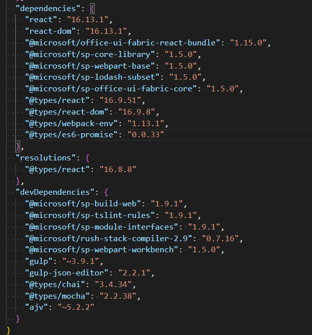
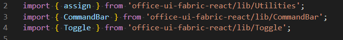
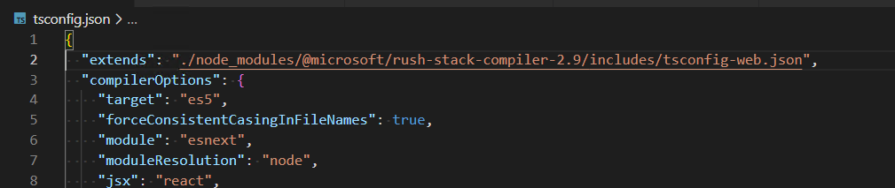

# Upgrade components in SharePoint Framework development with SharePoint Server Subscription Edition

SharePoint Server Subscription Edition supports SharePoint Framework client-side web parts in classic and modern pages, and extensions in modern pages.

When developing a client-side web part, you can only use the specific versions of components supported by the SharePoint Framework to make the web part compatible with your SharePoint Server.

To use more modern versions of the SharePoint Framework (SPFx) components, this article introduces some ways to upgrade individual components without upgrading the major version of SPFx.

> [!NOTE]
> Because the component-wide upgrades were not made as part of a broader update to SPFx, some manual configuration of the development environment might be completed in order to utilize them.

> [!IMPORTANT]
> Only SharePoint Server Subscription Edition (SE) supports the component-wide upgrades for the SPFx development since the [Version 23H2](/sharepoint/what-s-new/new-and-improved-features-in-sharepoint-server-subscription-edition-23h2-release#sharepoint-framework-spfx-component-upgrades) feature update. SharePoint Server 2019 and older SharePoint Server products do not support that.

## Upgrade React and Fluent UI React

The SharePoint Framework v1.4.1 natively supports React v15.8 and Fluent UI React ([formerly Office UI Fabric React](https://devblogs.microsoft.com/microsoft365dev/ui-fabric-is-evolving-into-fluent-ui/)) v5.17.

If you want to use React v16 or Fluent UI React v7 in your custom web parts developed for SharePoint Server with the SharePoint Framework v1.5.0, here are the instructions:

1. Modify the "dependencies" and "devDependencies" in the npm project:

    Use Yeoman to generate scaffold code, and modify the dependences in the **package.json**:

    - Change the **react** and **react-dom** versions to "16.13.1", the **@types/react** version to "16.9.51", and the **@types/react-dom** version to "16.9.8".

    - Add **@microsoft/office-ui-fabric-react-bundle**: "1.15.0" in the "dependencies" section.

    - Change the **@microsoft/sp-build-web** and **@microsoft/sp-module-interfaces** versions to "1.9.1" in the "devDependencies" section.

    - Add **gulp-json-editor**: "2.2.1", **@microsoft/sp-tslint-rules**: "1.9.1", and **@microsoft/rush-stack-compiler-2.9**: "0.7.16" to the "devDependencies" section.

    - Change the rest of the SPFx components from version "1.4.0" or "1.4.1" to "1.5.0".

    Here is an example of a modified **package.json** file:

    

    Re-run `npm install`.

1. Use React v16 and Fluent UI React v7 in the code level:

    To use React v16, do the same as the previous versions did: import React, and then you can use the new features from React v16.

    To use Fluent UI React v7:

    - If the component is exposed by **@microsoft/office-ui-fabric-react-bundle** with version "1.15.0", you can import the component from that package.

    - If the component has not been exposed by **@microsoft/office-ui-fabric-react-bundle**, you can directly import it from **office-ui-fabric-react**, for example:

        

    > [!NOTE]
    > The **office-ui-fabric-react** version is "7.185.7", and you do not need to declare it in **package.json**.

1. Perform a local test:

    Before running `gulp serve`, perform these prerequisite steps:

    1. Copy **react-16-bundle.js**, **react-dom-16-bundle.js**, **office-ui-fabric-7-react-bundle.js**, and **sp-load-themed-styles.js** from your SharePoint Server farm to a folder in your development environment.

        These **.js** files are located in `SharePoint_Setup_template_path\LAYOUTS\Next\spclient`, for example: `C:\Program Files\Common Files\microsoft shared\Web Server Extensions\16\TEMPLATE\LAYOUTS\Next\spclient`.

        > [!NOTE]
        > You can run `[Microsoft.SharePoint.Utilities.SPUtility]::GetGenericSetupPath("template")` in "SharePoint Management Shell" to get the `SharePoint_Setup_template_path`.

    1. Copy `SharePoint_Setup_template_path\LAYOUTS\Next\spclient\`**AdaptWorkbenchForReact16Fabric7.ps1** from your SharePoint Server farm to the root folder of the npm project.

    1. Run `AdaptWorkbenchForReact16Fabric7.ps1 [The path of the copied JS files]` in PowerShell.

    1. Add the following line to the **tsconfig.json** file:

        ```JSON
        "extends": "./node_modules/@microsoft/rush-stack-compiler-2.9/includes/tsconfig-web.json"
        ```

        For example:

        

    Run `gulp serve` to test in **workbench.aspx**.

1. Generate the **.sppkg** package:

    Perform the prerequisite steps:

    1. Copy `SharePoint_Setup_template_path\LAYOUTS\Next\spclient\`**gulpAdjustReact16GuidTask.js** from your SharePoint Server farm to the root folder of the npm project.

    1. Perform the #3-d step if you have not done it yet.

    Bundle the solution by running `gulp bundle --ship`.

    Adjust the settings of React v16 and Fluent UI React v7 by completing the following steps:

    1. Append the following lines in the **gulpfile.js** file:

        ```JavaScript
        const adjustReact16GuidTask = require('./gulpAdjustReact16GuidTask');
        adjustReact16GuidTask(require('gulp'), 'your_webpart_GUID');
        ```

        > [!NOTE]
        > You can find the corresponding GUID for "your_webpart_GUID" in the **manifest.json** file of your web part.

    1. Run `gulp adjustReact16Guid` in the root folder of the npm project.

    Package the solution by running `gulp package-solution --ship`.

## See also

- [SharePoint Framework Overview](sharepoint-framework-overview.md).
- [SharePoint Framework development with SharePoint Server 2019 and Subscription Edition](sharepoint-2019-and-subscription-edition-support.md).
- [Definitive guide for developers: SharePoint Framework for SharePoint Server SE](https://www.voitanos.io/blog/definitive-guide-sharepoint-framework-sharepoint-server-subscription-edition/).