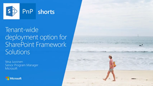
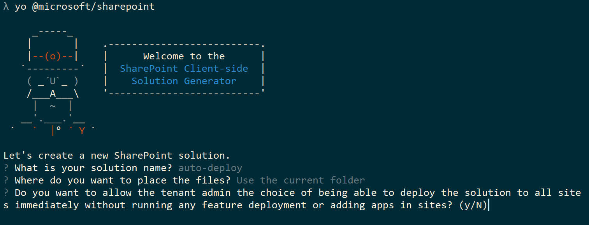
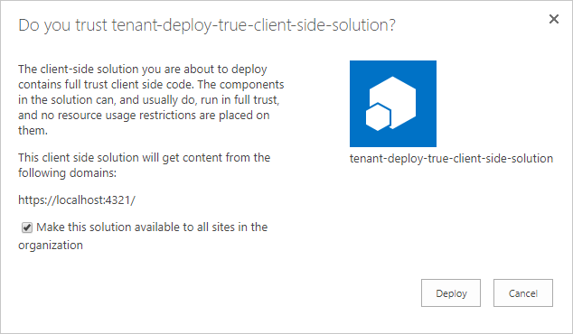

# Tenant-scoped solution deployment for SharePoint Framework solutions

You can configure your SharePoint Framework components to be immediately available across the tenant when the solution package is installed to the tenant App Catalog. This can be configured by using the **skipFeatureDeployment** attribute in the **package-solution.json** file.

When the solution has this attribute enabled, the tenant administrator is provided the option to enable the solution to be available automatically across all site collections and sites in the tenant when the solution package is installed to the tenant App Catalog. 

You can also see the tenant-wide deployment option demonstrated by watching the following video on the [SharePoint PnP YouTube Channel](https://www.youtube.com/watch?v=pemHOZCSwZI).

<a href="https://www.youtube.com/watch?v=pemHOZCSwZI&list=PLR9nK3mnD-OXZbEvTEPxzIOMGXj_aZKJG">

</a>

> [!NOTE] 
> You have to update to the latest SharePoint Framework Yeoman template version to be able to use this capability. You can update your global installation by executing `npm install -g @microsoft/generator-sharepoint`. 

## Solution specific requirements

When this option is used, any feature framework definitions in the SharePoint Framework solution are ignored. If the solution contains feature framework definitions, for example, for creating a custom list, you should not use this solution-specific option.

For more information, see [Provision SharePoint assets with your solution package](../toolchain/provision-sharepoint-assets.md).

> [!NOTE] 
> Solutions that are configured to be automatically deployed across tenants are not visible in the add-an-app capability at the site level. 

## Configure solution to be available across the tenant

The SharePoint Framework Yeoman template asks a specific question related to this option. This question impacts directly on the **skipFeatureDeployment** attribute in the **package-solution.json** file. 



<br/>

In following example configuration, **skipFeatureDeployment** is set to true, which indicates that the solution can be centrally deployed across the tenant. 

```json
{
  "solution": {
    "name": "tenant-deploy-client-side-solution",
    "id": "dd4feca4-6f7e-47f1-a0e2-97de8890e3fa",
    "version": "1.0.0.0",
    "skipFeatureDeployment": true
  },
  "paths": {
    "zippedPackage": "solution/tenant-deploy-true.sppkg"
  }
}

```

### Approving tenant-wide deployment in App Catalog

When the solution with the **skipFeatureDeployment** attribute set to **true** is deployed to the tenant App Catalog, the administrator is given an option to configure the solution to be deployed centrally across the tenant.

By default, the **Make this solution available to all sites in the organization** check box is not selected. If the check box is selected by the administrator, components in the solutions are automatically visible and available across the tenant. 



Notice that because the solution and site-specific upgrade actions are only available when you use the feature framework, there's no specific upgrade option for the centrally deployed solutions. These solutions can be updated by updating the solution-specific assets in the CDN and by updating the package in the App Catalog. This automatically updates all existing component instances across the tenant to use the latest component assets, such as JavaScript files and updated CSS files.

## Client-side web part visibility on SharePoint sites

Web parts included in solutions that have been centrally deployed are immediately visible in the web part picker in both classic and modern pages. 

## Impact of skipFeatureDeployment setting with Extensions

[SharePoint Framework Extensions](../extensions/overview-extensions.md) are immediately available to be used on SharePoint sites. This means that they can be associated with **ClientSideComponentId** properties in the specific SharePoint elements, such as **fields** and **user custom actions**. 

## See also

- [Overview of the SharePoint Framework](sharepoint-framework-overview.md)