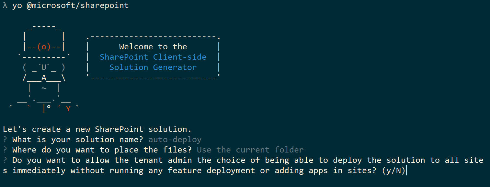

# Tenant-wide solution deployment for SharePoint Framework solutions

You can configure your SharePoint Framework components to be immediately available cross the tenant when solution package is installed to tenant app catalog. This can be configured by using **skipFeatureDeployment** attribute in the **package-solution.json** file.

When solution has this attribute enabled, tenant administrator will be provided option to enable the solution to be available automatically cross all site collections and sites in tenant, when the solution package is installed to the tenant app catalog. 

You can also see the tenant-wide deployment option demonstrated by watching following video on the [SharePoint PnP YouTube Channel](https://www.youtube.com/watch?v=pemHOZCSwZI).

<a href="https://www.youtube.com/watch?v=pemHOZCSwZI&list=PLR9nK3mnD-OXZbEvTEPxzIOMGXj_aZKJG">

</a>

> Notice. You have to update to latest SharePoint Framework Yeoman template version to be able to use this capability. You can update your global installation by executing `npm install -g @microsoft/generator-sharepoint`. 

## Solution specific requirements

When this option is used, any feature framework definitions in the SharePoint Framework solution will be ignored. If solution contains Feature Framework definitions, for example for creating a custom list, you should not use this solution specific option.

* [Provision SharePoint assets with your solution package](#)

> Notice. Solutions which are configured to be automatically deployed cross tenants are not visible in the add an app capability at the site level. 

## Configuring solution to be available cross tenant

SharePoint Framework Yeoman template will ask a specific question related on this option. This question will impact directly on the **skipFeatureDeployment** attribute in the **package-solution.json** file. 



In following example configuration, **skipFeatureDeployment** is set to true, which indicates that solution can be centrally deployed cross the tenant. 

```json
{
  "solution": {
    "name": "tenant-deploy-client-side-solution",
    "id": "dd4feca4-6f7e-47f1-a0e2-97de8890e3fa",
    "version": "1.0.0.0",
    "skipFeatureDeployment": true
  },
  "paths": {
    "zippedPackage": "solution/tenant-deploy-true.sppkg"
  }
}

```

### Approving tenant wide deployment in app catalog

When solution with **skipFeatureDeployment** attribute set to **true** is deployed to tenant app catalog, administrator is given an option to configure solution to be deployed centrally cross the tenant.

By default, "**Make this solution available to all sites in the organization**" checkbox is unchecked. If the checkbox is checked by the administrator, components in the solutions will be automatically visible and available cross the tenant. 


Notice that since the solution and site -specific upgrade actions are only available when you use feature framework, there's no specific upgrade option for the centrally deployed solutions. These solutions can be simply updated by updating solution specific assets in the CDN and by updating package in the app catalog. This will update automatically all existing component instances cross the tenant to use the latest component assets, like JavaScript files and updated CSS files.

## Client-side web part visibility in SharePoint sites

Web parts included in solutions which have been centrally deployed, will be immediately visible in the web part picker in both classic and modern pages. 

## Impact of skipFeatureDeployment setting with Extensions

SharePoint Framework extensions will be immediately available to be used in the SharePoint sites. This means that they can be associated to be used with **ClientSideComponentId** properties in the specific SharePoint elements, like *fields* and *user custom actions*. 

