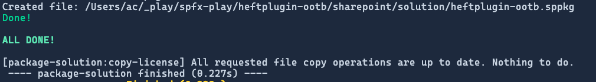
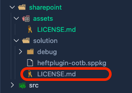

# Customize the build toolchain with Heft plugins

Developers commonly need to customize the build toolchain for various reasons such as copying or deleting files, running scripts, or setting environment variables in SharePoint Framework (SPFx) projects. The Heft-based toolchain supports customization scenarios through the use of plugins, tasks, and task configurations.

In this article, you'll learn how to use one of the plugins included in Heft to modify one of the Heft commands used in an SPFx project: **package-solution**.

> [!IMPORTANT]
> This article assumes you understand how Heft and the build toolchain work, as well as some basic architectural concepts like tasks, task configurations, plugins, phases, and rigs.
>
> Learn more in this overview: [Understanding the Heft-based toolchain (how it works)](customize-heft-toolchain-overview.md).

## Add fake licensing file

In this scenario, we're going to add a process that will copy a licensing file to the folder that contains our SharePoint package after the packaging process. Start by creating a new file **./sharepoint/assets/LICENSE.md** and add some random text to it to simulate a license file.

```text
Lorem ipsum dolor sit amet, consectetur adipiscing elit. Nullam in suscipit sapien. Praesent sed ligula a mauris dictum lobortis quis ac sem. Mauris ultricies nunc erat, at auctor metus facilisis at. Cras blandit tellus ac erat lacinia laoreet. Donec ut arcu eleifend, tristique orci sit amet, pharetra velit. Curabitur ac sagittis sem. Aenean condimentum felis in massa convallis, eu rhoncus massa congue. Sed ornare semper ante, id convallis sapien. Praesent ut leo ut ligula vehicula venenatis sit amet et dolor. Phasellus nec dui purus. Integer tortor sapien, congue ac ligula tincidunt, volutpat vulputate purus. Cras vel pharetra velit. Proin eget massa in nisl tempor placerat vitae eget quam. Nullam faucibus orci vel vehicula auctor.

Integer sit amet eleifend nulla. Nam ultrices urna lorem, nec pulvinar metus malesuada id. Suspendisse luctus odio vitae ullamcorper blandit. Nam viverra tristique imperdiet. Aliquam iaculis urna a augue mattis, vel placerat magna posuere. Duis in nisl arcu. Pellentesque gravida convallis fermentum.
```

## Customize SPFx Heft rig

The next step is to add a task to one of the existing phases defined in the SPFx build toolchain heft configuration. In our case, we want the **LICENSE.md** file to be copied into the same folder where the \***.SPPKG** file is created: **./sharepoint/solution**.

That means we will modify the existing **package-solution** Heft command, which is a phase that's defined in the SPFx build rig. The SPFx build rig definition is in the **@microsoft/spfx-web-build-rig** package (as specified in the **./config/rig** file) in the default profile. The configuration of the rig is defined in the **heft.json** file. That can be found in the following file in your project: **./node_modules/@microsoft/spfx-web-build-rig/profiles/default/config/heft.json**.

The **package-solution** phase is defined in the `phasesByName["package-solution"]` property:

```json
{
  ..
  "phasesByName": {
    "package-solution": {
      "phaseDescription": "Package the project into a SPPKG",
      "tasksByName": {
        "package-solution": {
          "taskPlugin": {
            "pluginPackage": "@microsoft/spfx-heft-plugins",
            "pluginName": "package-solution-plugin"
          }
        }
      }
    },
  }
  ..
}
```

Instead of updating this file, you can extend it within your own project. This is done in your project's **heft.json** file, but that file doesn't exist because the default SPFx project's Heft configuration is using the SPFx rig defined in the **rig.json** file.

### Add heft.json

To extend the existing SPFx rig configuration, start by adding a new file **./config/heft.json** to your project and add the following code to it:

```json
{
  "$schema": "https://developer.microsoft.com/json-schemas/heft/v0/heft.schema.json",
  "extends": "@microsoft/spfx-web-build-rig/profiles/default/config/heft.json",
}
```

> [!IMPORTANT]
> Even though we're defining the **./config/heft.json** and it extends the existing configuration of the SPFx rig, don't delete the **./config/rig.json** file as it is used by other parts of the Heft-based toolchain.

### Customize the SPFx package-solution phase

To customize the existing **package-solution** phase, add the property `phasesByName` with a single subproperty `package-solution` as shown in the following code. This allows us to attach our task to the **package-solution** phase in the default SPFx web rig configuration.

```json
"phasesByName": {
  "package-solution": {
  }
}
```

### Add new task to package-solution phase

Next, we're going to add the task. This is done by adding the `tasksByName` object that contains the name of our task. The name of the task is a user-defined name. In this case, name it `copy-license`.

Within the task, we then specify the plugin that we want to use for our task. To do this, use the `pluginPackage` & `pluginName` to use the [Copy Files Plugin](https://heft.rushstack.io/pages/plugins/copy-files/) included in the **@rushstack/heft** npm package:

```json
"tasksByName": {
  "copy-license": {
    "taskPlugin": {
      "pluginPackage": "@rushstack/heft",
      "pluginName": "copy-files-plugin",
      "options": {
        "copyOperations": [{
          "sourcePath": "./assets",
          "destinationFolders": ["./sharepoint/solution"],
          "includeGlobs": ["LICENSE.md"]
        }]
      }
    }
  }
}
```

The `options` property on the `taskPlugin` object enables you to configure the plugin. This is optional. Options can be defined here where the task is used, or they could exist in a separate JSON file in the **./config** folder, like **./config/sass.json** and **./config/typescript.json** files in the **config** folder set the configurations of the [Sass](https://heft.rushstack.io/pages/plugins/sass/) and [TypeScript](https://heft.rushstack.io/pages/plugins/typescript/) Heft plugins.

The final **heft.json** file should look like the following:

```json
{
  "$schema": "https://developer.microsoft.com/json-schemas/heft/v0/heft.schema.json",
  "extends": "@microsoft/spfx-web-build-rig/profiles/default/config/heft.json",
  "phasesByName": {
    "package-solution": {
      "tasksByName": {
        "copy-license": {
          "taskPlugin": {
            "pluginPackage": "@rushstack/heft",
            "pluginName": "copy-files-plugin",
            "options": {
              "copyOperations": [
                {
                  "sourcePath": "./sharepoint/assets",
                  "destinationFolders": ["./sharepoint/solution"],
                  "includeGlobs": ["LICENSE.md"]
                }
              ]
            }
          }
        }
      }
    }
  }
}
```

### Configure the task execution order

The **heft.json** file also enables you to control the order of how tasks are run. In our case, we want the new `copy-license` task to run after the `package-solution` task has completed. To do this, add a `taskDependencies` array with a list of all of the tasks that must complete before our task completes to our `copy-license` task.

```json
{
  ..
  "phasesByName": {
    "package-solution": {
      "tasksByName": {
        "copy-license": {
          "taskDependencies": ["package-solution"],
          "taskPlugin": { .. }
        }
      }
    }
  }
}
```

If you don't specify the `taskDependencies`, your task will run in parallel with all of the other tasks in the current phase.

If you want the `copy-license` task to run first, you'll need to replace the entire `package-solution` phase, and add the `copy-license` task as a `taskDependencies` to the `package-solution` phase. So to do this, copy the original `package-solution` phase from the SPFx rig and add `taskDependencies` property to it.

## Test your customizations

Save your changes and then run the **build** command followed by the **package-solution** command.

```console
heft build

heft package-solution --production
```

Notice the custom task appear in the console logging...



... and the file is in the **./sharepoint/solution** folder:



## See also

- [SharePoint Framework Toolchain: Rush Stack, Heft, & Webpack](sharepoint-framework-toolchain-rushstack-heft.md)
- [Migrate from the Gulp Toolchain to Heft Toolchain](migrate-gulptoolchain-hefttoolchain.md)
- [Understanding the Heft-based toolchain (how it works)](customize-heft-toolchain-overview.md)
- [Customize webpack with the Heft Webpack Patch plugin](customize-heft-toolchain-customize-webpack-config.md)
- [Customize the build with the Heft Run script plugin](customize-heft-toolchain-heft-script-plugin.md)
- [Ejecting the webpack configuration](customize-heft-toolchain-eject-webpack.md)
