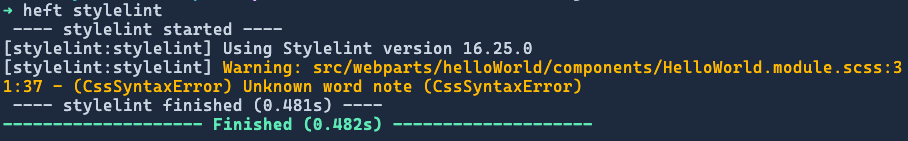

# Customize the build with the Heft Run script plugin

[!INCLUDE [spfx-prerelease-related](../../../includes/snippets/spfx-prerelease-related.md)]

Developers commonly need to customize the build toolchain for various reasons such as copying or deleting files, running scripts, or setting environment variables in SharePoint Framework (SPFx) projects. The Heft-based toolchain supports customization scenarios through the use of plugins, tasks, and task configurations.

Heft includes multiple plugins, but they won't address every possible scenario. In those cases, you can either create a custom plugin or run arbitrary code. One common build toolchain customization developers added to their SPFx project that used the Gulp-based toolchain was implementing the [Stylelint gulp task](https://www.npmjs.com/package/gulp-stylelint).

In this article, you'll learn how to use the [Run Script Plugin](https://heft.rushstack.io/pages/plugins/run-script/) included in Heft to add linting to the stylesheets used in your project.

> [!IMPORTANT]
> This article assumes you understand how Heft and the build toolchain work, as well as some basic architectural concepts like tasks, task configurations, plugins, phases, and rigs.
>
> Learn more in this overview: [Understanding the Heft-based toolchain (how it works)](customize-heft-toolchain-overview.md).

## Add Stylelint to project

Start by installing [Stylelint](https://github.com/stylelint/stylelint) and the popular community configuration as a dev dependency in your project:

```console
npm install stylelint stylelint-config-standard-scss --save-dev
```

Next, add a configuration file for Stylelint, **./.stylelintrc** that extends the community configuration with a few rules:

```json
{
  "extends": "stylelint-config-standard",
  "plugins": [ "stylelint-scss" ],
  "rules": {
    "at-rule-no-unknown": null,
    "scss/at-rule-no-unknown": true,
    "value-list-comma-space-after": "always-single-line",
    "declaration-empty-line-before": "never"
  }
}
```

The default stylesheet in a SPFx React web part project will trigger an error when the linter runs. Verify Stylelint is installed by executing the following command in the console from the root of your project.

```console
# run the installed CLI...
./node_modules/.bin/stylelint **/*.scss

# ... or use npx to run it globally without installing it...
npx stylelint **/*.scss
```

This should display a single error in a standard SPFx React web part project's SCSS file:

```text
src/webparts/helloWorld/components/HelloWorld.module.scss
  31:37  ✖  Unknown word note  CssSyntaxError

✖ 1 problem (1 error, 0 warnings)
```

## Create the Stylelint script

To add the Stylelint process to the build, we'll use the included Heft [Run Script Plugin](https://heft.rushstack.io/pages/plugins/run-script/). This plugin will run a script file that exports a single function `runAsync()` that will be invoked when the task is run.

### Add new script file

Start by creating a new JavaScript file in your project: **./config/run-script/stylelint.mjs**. While we could use Stylelint as a CLI in our script, we can also call it programmatically from our script. To do this, the file needs to be an ECMAScript Module (ESM) file (**\*.mjs**) due to [the deprecation of the Stylelint Node API support in the latest version](https://stylelint.io/migration-guide/to-16#significant-changes).

Add the following code to the file:

```javascript
#!/usr/bin/env node
import stylelint from 'stylelint';
import path from 'path';
import { fileURLToPath } from 'url';
import { createRequire } from 'module';

const __filename = fileURLToPath(import.meta.url);
const __dirname = path.dirname(__filename);
const require = createRequire(import.meta.url);

async function runStylelint() {
}

// support direct exec (outside of heft)
if (import.meta.url === `file://${process.argv[1]}`) {
  runStylelint().catch(e => {
    console.error('Error: ', e);
    process.exit(1);
  });
}
```

This script can be executed directly from the command line without using Heft:

```console
node ./config/run-script/stylelint.mjs
```

Including support to be called from the command line outside of Heft is not required, but we're adding it to demonstrate both scenarios.

### Export new `runAsync()` function

Next, update the script to enable it to be invoked from the Run Script plugin. Do this by adding a new function, `runAsync()`, to the file and exporting it to the caller.

Add the following code to the **stylelint.mjs** file.

```javascript
// support run as script (inside of heft)
export async function runAsync(options) {
  await runStylelint(options);
}
```

Notice the function receives a single parameter of type `IRunScriptOptions` that provides context on the current invocation of the script.

### Add utility logging functions

The **stylelint.mjs** file can be run either directly from the command line or by Heft using the Run Script plugin. When it's run from within Heft, it can take advantage of Heft's logging functions, but when it's run directly from the command line, it should use standard console logging methods.

To address both scenarios, add the following code to the **stylelint.mjs** file immediately after the existing `import` and `const` statements:

```javascript
const RESET = '\x1b[0m';
function log(message, terminal) {
  (terminal)
    ? terminal.writeLine(message)
    : console.log(message);
}
function warn(message, terminal) {
  (terminal)
    ? terminal.writeWarningLine(message)
    : console.warn(`\x1b[33m${message}${RESET}`);
}
function error(message, terminal) {
  (terminal)
    ? terminal.writeErrorLine(message)
    : console.error(`\x1b[31m${message}${RESET}`);
}
```

### Add stylelint version message

Let's now update the `runStylelint()` method to output the current version of Stylelint that's installed and used to lint stylesheets. This is similar to how Heft behaves when calling the TypeScript compiler and linting our code with ESLint.

Start by updating the function declaration by adding the `options` object and getting a reference to the `terminal` when invoked by the Run Script plugin. Then, output the version of Stylelint that's defined in our project's **package.json**'s `devDependencies`:

```javascript
async function runStylelint(options /* IRunScriptOptions */) {
  const terminal = (options)
    ? options.heftTaskSession.logger.terminal
    : undefined;

  try {
    const projectFolder = path.join(__dirname, './../..');

    const stylelintPkg = require('stylelint/package.json');
    log(`Using Stylelint version ${stylelintPkg.version}`, terminal);
  } catch (e) {
    error(`Error running stylelint: ${e.message}`, terminal);
  }
}
```

Verify the code works by executing the script from the command line:

```console
node ./config/run-script/stylelint.mjs
```

You should see the version number output to the console, similar to the following:

```text
Using Stylelint version 16.25.0
```

## Add Stylelint to the SPFx rig

With the script working, let's add it to the SPFx rig. Similar to how ESLint is run after the TypeScript compiler runs, we want stylelint to run after the Sass compiler runs. This should be part of the Heft **build** command.

That means we will modify the existing **build** Heft command, which is a phase that's defined in the SPFx build rig. The SPFx build rig definition is in the **@microsoft/spfx-web-build-rig** package (as specified in the **./config/rig** file) in the default profile. The configuration of the rig is defined in the **heft.json** file. That can be found in the following file in your project: **./node_modules/@microsoft/spfx-web-build-rig/profiles/default/config/heft.json**.

The **build** phase is defined in the `phasesByName["build"]` property. Within this, you'll find the list of tasks run as part of the `build` phase. The following snippet is a modified version of the actual `build` phase showing only the parts that are relevant to this article:

```json
{
  ..
  "phasesByName": {
    "build": {
      ..
      "tasksByName": {
        "set-browserslist-ignore-old-data-env-var": { .. },
        "sass": { .. },
        "typescript": { .. },
        "lint": { .. },
        "copy-javascript": { .. },
        ..
      }
    },
  }
  ..
}
```

Instead of updating this file, you can extend it within your own project. This is done in your project's **heft.json** file, but that file doesn't exist because the default SPFx project's Heft configuration is using the SPFx rig defined in the **rig.json** file.

### Add heft.json

To extend the existing SPFx rig configuration, start by adding a new file **./config/heft.json** to your project and add the following code to it:

```json
{
  "$schema": "https://developer.microsoft.com/json-schemas/heft/v0/heft.schema.json",
  "extends": "@microsoft/spfx-web-build-rig/profiles/default/config/heft.json",
}
```

> [!IMPORTANT]
> Even though we're defining the **./config/heft.json** and it extends the existing configuration of the SPFx rig, don't delete the **./config/rig.json** file as it is used by other parts of the Heft-based toolchain.

### Customize the SPFx build phase

To customize the existing **build** phase, add the property `phasesByName` with a single subproperty `build` as shown in the following code. This allows us to attach our task to the **build** phase in the default SPFx web rig configuration.

```json
"phasesByName": {
  "build": {
  }
}
```

### Add new task to build phase

Next, we're going to add the task. This is done by adding the `tasksByName` object that contains the name of our task. The name of the task is a user-defined name. In this case, name it `stylelint`.

Within the task, we then specify the plugin that we want to use for our task. To do this, use the `pluginPackage` & `pluginName` to use the [Run Script Plugin](https://heft.rushstack.io/pages/plugins/run-script/) included in the **@rushstack/heft** npm package:

```json
"tasksByName": {
  "stylelint": {
    "taskPlugin": {
      "pluginPackage": "@rushstack/heft",
      "pluginName": "run-script-plugin",
      "options": {
        "scriptPath": "./config/run-script/stylelint.mjs"
      }
    }
  }
}
```

The `options` property on the `taskPlugin` object enables you to configure the plugin. This is optional. Options can be defined here where the task is used, or they could exist in a separate JSON file in the **./config** folder, like **./config/sass.json** and **./config/typescript.json** files in the **config** folder set the configurations of the [Sass](https://heft.rushstack.io/pages/plugins/sass/) and [TypeScript](https://heft.rushstack.io/pages/plugins/typescript/) Heft plugins.

Let's also add the ability to call our script via a new command. Add a new phase, `stylelint`, that calls the same task with the same configuration.

The final **heft.json** file should look like the following:

```json
{
  "$schema": "https://developer.microsoft.com/json-schemas/heft/v0/heft.schema.json",
  "extends": "@microsoft/spfx-web-build-rig/profiles/default/config/heft.json",
  "phasesByName": {
    "build": {
      "tasksByName": {
        "stylelint": {
          "taskPlugin": {
            "pluginPackage": "@rushstack/heft",
            "pluginName": "run-script-plugin",
            "options": {
              "scriptPath": "./config/run-script/stylelint.mjs"
            }
          }
        }
      }
    },
    "stylelint": {
      "tasksByName": {
        "stylelint": {
          "taskPlugin": {
            "pluginPackage": "@rushstack/heft",
            "pluginName": "run-script-plugin",
            "options": {
              "scriptPath": "./config/run-script/stylelint.mjs"
            }
          }
        }
      }
    }
  }
}
```

### Configure the task execution order

The **heft.json** file also enables you to control the order of how tasks are run. In our case, we want the new `stylelint` task to run after the `sass` task has completed. To do this, add a `taskDependencies` array with a list of all of the tasks that must complete before our task completes to our `stylelint` task.

```json
{
  ..
  "phasesByName": {
    "build": {
      "tasksByName": {
        "stylelint": {
          "taskDependencies": [ "sass" ],
          "taskPlugin": { .. }
        }
      }
    }
  }
}
```

If you don't specify the `taskDependencies`, your task will run in parallel with all of the other tasks in the current phase.

If you want the `stylelint` task to run first, you'll need to replace the entire `build` phase, and add the `stylelint` task as a `taskDependencies` to the `build` phase. So to do this, copy the original `build` phase from the SPFx rig and add `taskDependencies` property to it.

### Test the Stylelint script in Heft

Save your changes and then run the **build** command followed by the **stylelint** command to see our script run both as part of the **build** command and as a stand alone command:

```console
# run as part of the "build" phase
heft build

# run as it's own "stylelint" phase
heft stylelint
```

The output of the **build** command includes the phase and task in the prefix of the log message:


The output of the **stylelint** command also includes the phase and task in the log prefix, but in this case, they have the same name:


## Execute Stylelint with config settings

Now let's update the script to execute the actual linting of our stylesheets. Add the following code to the end of the `try` block within the `runAsync()` function in the **stylelint.mjs** file to lint our stylesheets:

```javascript
const result = await stylelint.lint({
  files: 'src/**/*.scss',
  configFile: path.join(projectFolder, '.stylelintrc'),
  cwd: projectFolder
});
```

Next, add the following code to process the results. This code formats the results so the findings returned will have a similar format to what ESLint uses:

```javascript
if (result.errored || result.results.some(r => r.warnings.length > 0)) {
  for (const fileResult of result.results) {
    if (fileResult.warnings.length > 0) {
      for (const warning of fileResult.warnings) {
        const relativePath = path.relative(projectFolder, fileResult.source);
        const formattedWarning = `${relativePath}:${warning.line}:${warning.column} - (${warning.rule}) ${warning.text}`;

        warn(`Warning: ${formattedWarning}`, terminal);
      }
    }
  }
}
```

### Test the final Stylelint script

Let's test the final script.

Save your changes and then run the **build** command followed by the **stylelint** command to see our script run both as part of the **build** command and as a stand alone command:

```console
# run as part of the "build" phase
heft build

# run as it's own "stylelint" phase
heft stylelint

# run script directly
node ./config/run-script/stylelint.mjs
```

The output of the **build** command now reports the warning in the **build** phase...


... just as the **stylelint** command does...



... and when we run the script using Node!


## See also

- [SharePoint Framework Toolchain: Rush Stack, Heft, & Webpack](sharepoint-framework-toolchain-rushstack-heft.md)
- [Migrate from the Gulp Toolchain to Heft Toolchain](migrate-gulptoolchain-hefttoolchain.md)
- [Understanding the Heft-based toolchain (how it works)](customize-heft-toolchain-overview.md)
- [Customize webpack with the Heft Webpack Patch plugin](customize-heft-toolchain-customize-webpack-config.md)
- [Customize the build toolchain with Heft plugins](customize-heft-toolchain-heft-ootb-plugins.md)
- [Ejecting the webpack configuration](customize-heft-toolchain-eject-webpack.md)
