# Implement Continuous Integration and Continuous deployment using Azure Devops
Azure DevOps (Visual Studio Team Services / Team Foundation Server)  is a set of tools and services that will help a developer, or a team of developers, implement DevOps processes, Continuous Integration and Continuous Deployment for their development projects.  
When building SharePoint Framework solutions you can easily leverage Azure DevOps to automate builds, unit tests and deployment.  

## Continuous Integration
Continuous integration (CI) will help you do things like build, run unit tests and package the solution every time code changes are detected.  

### Creating the build definition
Start by creating a new build definition and link it to your repository.
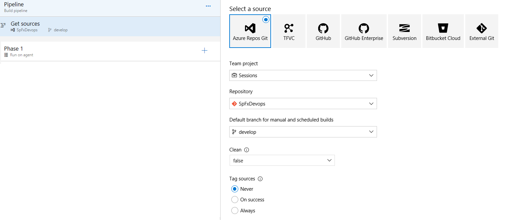
> [!NOTE] 
> Build definitions can be described as a process template. It is a set of configured task that will be executed one after another on the source code every time a build is triggered. Tasks can be grouped in phases, by default a build definition contains at least one phase. You can add new tasks to the phase by clicking on the big plus sign next to the phase name.

### Installing NodeJS version 10
For this first task you will begin by installing NodeJS version 10, the main reason for this it so spead up the modules installation process and benefit significant performance improvements the community has made.
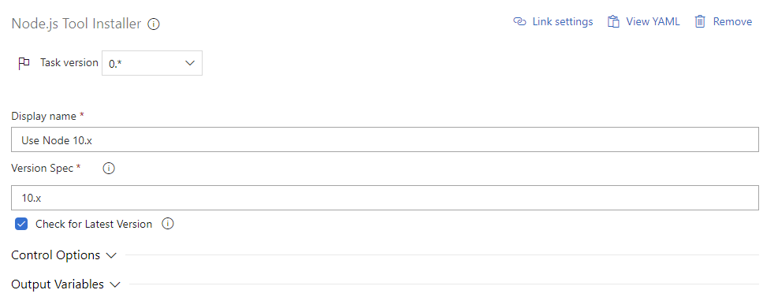

> [!NOTE] 
> Make sure you specify `10.x` in the `Version Spec` field.

### Restoring dependencies
Because third party dependencies are not stored in the source control, you need to restore those before starting to build the project. To do so add a `npm` task and set the command to `install`.
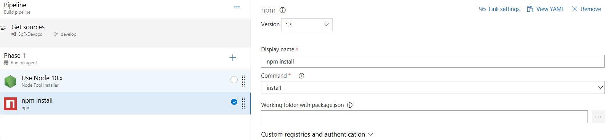

### Executing Unit Tests
The SharePoint Framework supports writing units tests using KarmaJS, Mocha, Chai and Sinon. These modules are already referenced for you and it is highly recommended to at least test the business logic of your code to get feedback on any potential issue or regression as soon as possible. To have Azure DevOps execute your unit tests, add a `gulp` task. Set the path to the `gulpfile` file and set the `Gulp Tasks` option to `test`.
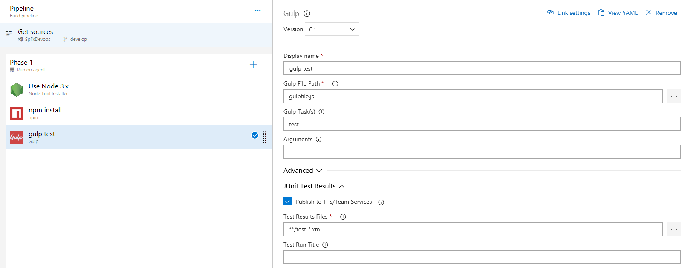
> [!NOTE] 
> Make sure you check `Publish to TFS/Team Services` under the `JUnit Test Results` section and set the `Test Result Files` to `**/test-*.xml`. This will instruct the task to report results with the build status in Azure DevOps.

By default SharePoint Framework projects do not include a reporter for JUnit. Reporters are plugins for KarmaJS that export the test results in a certain format. To install the necessary reporters, run the following commands in your project.

```shell
npm i karma-junit-reporter@1.X -D
```
You also need to configure karma to load an use the reporter, to do so create a file `config/karma.config.js` and add the following content.
```JS
"use strict";
var existingKarmaConfig = require('@microsoft/sp-build-web/lib/karma/karma.config');
var _ = require('lodash');
var junitReporter = require('karma-junit-reporter');

module.exports = function (config) {
  existingKarmaConfig(config);
  config.reporters.push('junit');

  config.set({
    basePath: './..',
  });

  config.junitReporter = {
    outputDir: 'temp/', // results will be saved as $outputDir/$browserName.xml
    outputFile: 'test-results.xml', // if included, results will be saved as $outputDir/$browserName/$outputFile
    suite: 'karma', // suite will become the package name attribute in xml testsuite element
    useBrowserName: true, // add browser name to report and classes names
  };
  var coberturaSubDir = 'cobertura';
  var coverageSubDir = 'lcov';
  var coberturaFileName = 'cobertura.xml';
  config.coverageReporter.reporters.push({type: 'cobertura', subdir: './' + coberturaSubDir, file: coberturaFileName});
  config.coverageReporter.reporters.push({
    type: 'lcov',
    subdir: './' + coverageSubDir + '/',
    file: 'lcov.info'
  });
  config.browserNoActivityTimeout = 60000;
  config.plugins.push(junitReporter);
};
```

Finally you need to modify the gulpfile to instruct it to leverage this new configuration. To do so edit `gulpfile.js` and add these lines after `build.initialize(gulp);`.
```JS
const _ = require('lodash');
var buildConfig = build.getConfig();
var karmaTask = _.find(buildConfig.uniqueTasks, (t) => t.name === 'karma');
karmaTask.taskConfig.configPath = './config/karma.config.js';
```
### Importing code coverage information
In order to get code coverage reported with the build status you need to add a task to import that information. Add the `publish code coverage results` tasks. Make sure you set the tool to `Cobertura`, `Summary files` to `$(Build.SourcesDirectory)/temp/coverage/cobertura/cobertura.xml` and `Report Directory` to `$(Build.SourcesDirectory)/temp/coverage/cobertura`.
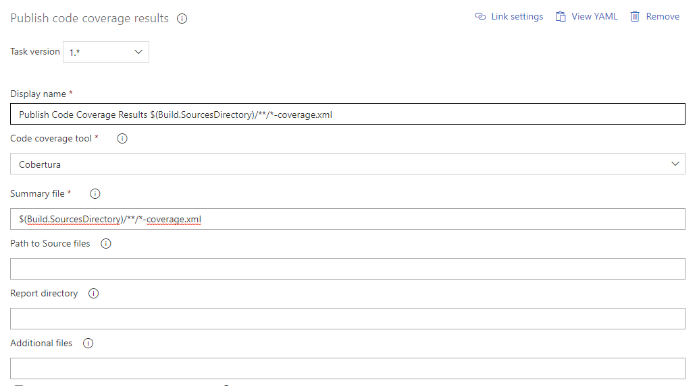

### Bundling the solution
You first need to bundle your solution in order to get static assets that can be understood by a web browser. For that add another `gulp` task, set the `gulpfile` path, set the `Gulp Tasks` field to bundle and add `--ship` in the `Arguments`.
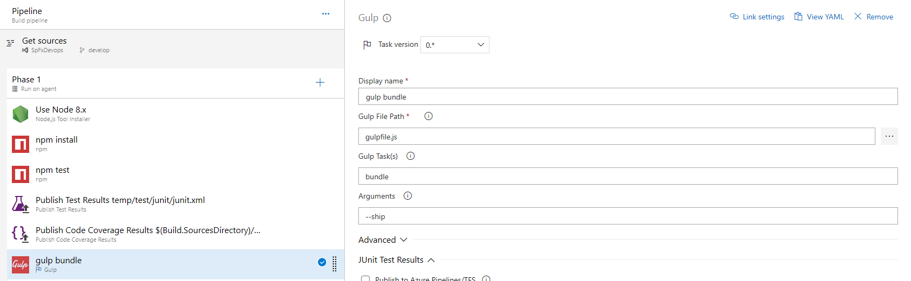

### Packaging the solution
Now that you have static assets, the next step is to package those into a package SharePoint will be able to deploy. Add another `gulp` task, set the `gulpfile` path, set the `Gulp Tasks` field to `package-solution` and add `--ship` in the `Arguments`.
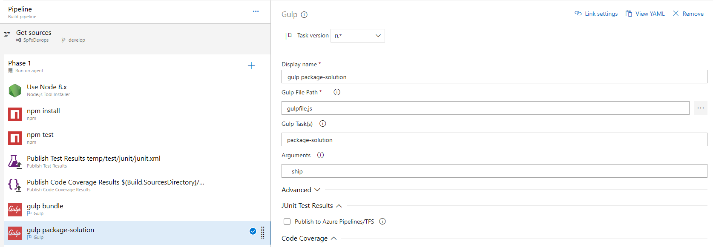

### Preparing the artifacts
By default a Azure DevOps build does not retain any files, you have to explicitly tell it to keep the files you will be needing for the release.  
Add a `Copy Files` task and set the `Contents` to `**\*.sppkg` (the SharePoint Package created with the previous task) and the target folder to `$(build.artifactstagingdirectory)/drop`.
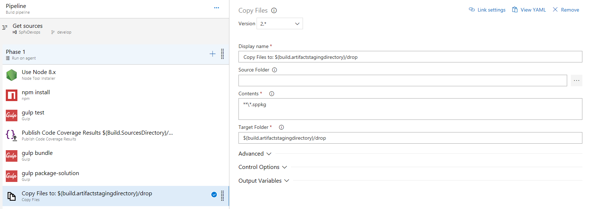

### Publishing the artifacts
Now that you have collected all the files needed for deployment in a special artifacts folder, you still need to instruct Azure DevOps to keep these files after the execution of the build. To do so add a `Publish artifacts` task and set the `Path to publish` to `$(build.artifactstagingdirectory)/drop` and the `Artifact name` to `drop`.
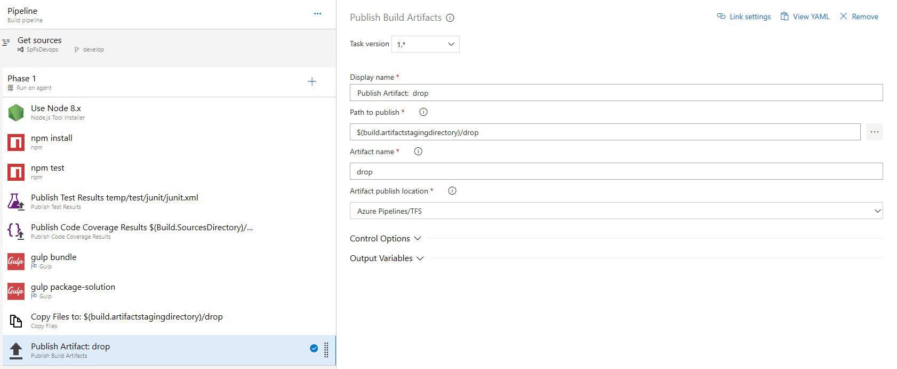


## Continuous Deployment
Continuous deployment helps you deploy your package to different environments and keep tracks of which versions are deployed to which environments.

### Creating the Release Definition
Start by creating a new release definition with an empty template. A release defition is a process model that defines which environments you are working with, as well at the deployment tasks to executes and which artifacts (from the builds) will be used.
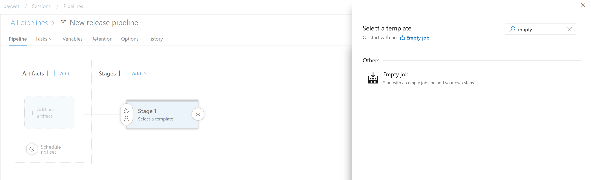

### Linking the build artifact
Click on `Add an artifact` and select the build definition you previously created, write down the `Source Alias` name you set as it will impact paths for the tasks later on.
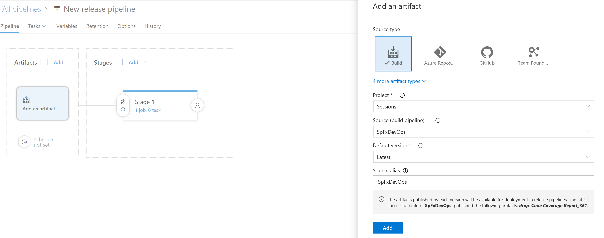

### Creating the environment
You can give a name to your environment, set up pre-deployment approvals, artificats filters (deploy only if the build comes from this or that branch) an much more by clicking on the buttons around the environment box or directly on the title.
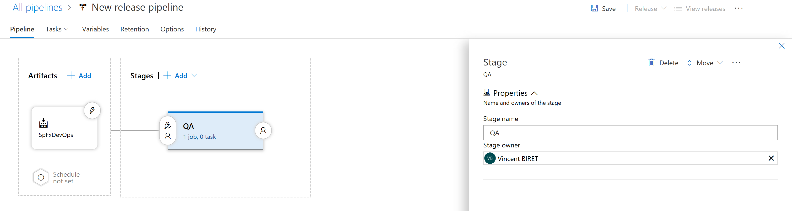

### Installing node 10
By click on `1 job, 0 tasks` you can access on the tasks configuration view, which works similarly to the build definition. That set of tasks will run only for this specific environment. 
Add a `Node tool installer` task and define `10.X` in the `Version Spec` field. 
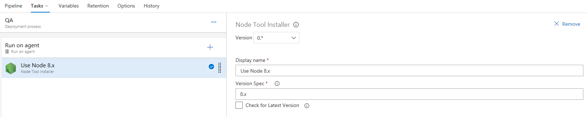

### Installing the Office 365 CLI
The Office 365 CLI is an open source project built by the PnP Community. This Release Definition will take advantage of commands available as part of the CLI to handle deployement, you need to install it first. Add a `npm` task, select a `Custom` command and type `install -g @pnp/office365-cli` in the `Command and Arguments` field.
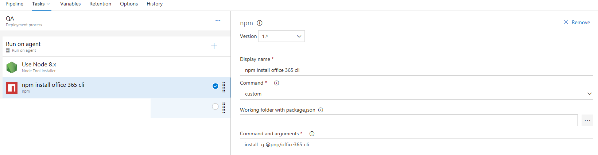
> [!NOTE] 
> Learn more about the [Office 365 CLI](https://pnp.github.io/office365-cli/)

### Connecting to the App Catalog
You first need to authenticate against the App Catalog of your tenant, add a `Command Line` task and paste in the following command into the `script` field `o365 spo connect https://$(tenant).sharepoint.com/$(catalogsite) --authType password --userName $(username) --password $(password)
`
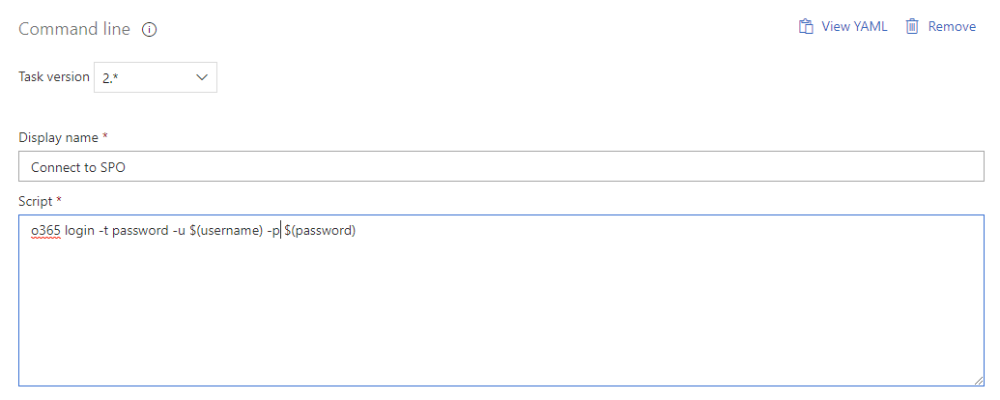

### Adding the solution package to the app catalog
Upload the solution package to your app catalog by adding another `Command Line` task and pasting the following command line in the `Script` field `o365 spo app add -p $(System.DefaultWorkingDirectory)/SpFxDevOps/drop/SharePoint/solution/sp-fx-devops.sppkg --overwrite`
> [!NOTE] 
> The path of the package depends on your solution name (see your project configuration) as well as the `Source Alias` you defined earlier, make sure they match.

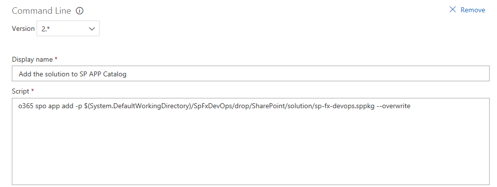

### Deploying the application
The next and last step is to deploy the application to the app catalog to make it available to all site collection within the tenant as it's latest version. Add another `Command Line` taks and paste the follwing command line in the `Script` field `o365 spo app deploy --name sp-fx-devops.sppkg --appCatalogUrl https://$(tenant).sharepoint.com/$(catalogsite)`
> [!NOTE] 
> Make sure you update the package name.

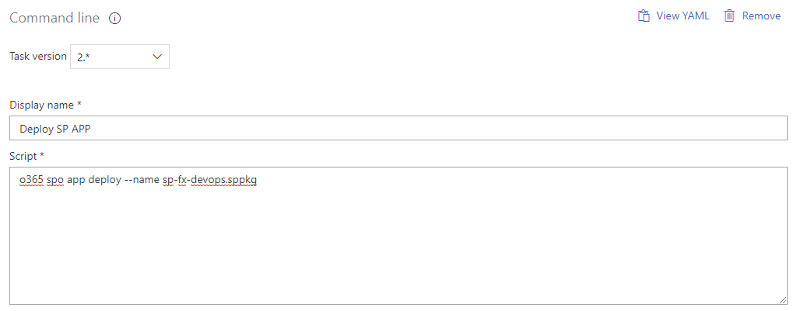

### Setting the variables for the environment
The tasks you configured right before rely on Azure DevOps process variables (easily identified with the `$(variableName)` syntax). You need to define those variables before being able to run the build definition. To do so, click on the `Variables` tab.  
Add the following variables
| Name | Value |
| ------ | ------ |
| catalogsite | Server relative Path of the App Catalog Site eg `sites/appcatalog` |
| password | Password of the user with administrative permissions on the tenant, do not forget to check the lockpad to mask it to other users |
| username | Username of the user with administrative permissions on the tenant |
| tenant | Tenant name in https://tenant.sharepoint.com eg `tenant` |


 > [!NOTE] Make sure you save your release definition.

## Testing
Go back to the `Builds` section in Azure DevOps, select your build definition and click on `Queue`. Select your branch, and click on `Queue`. Your build is created and will start building. 
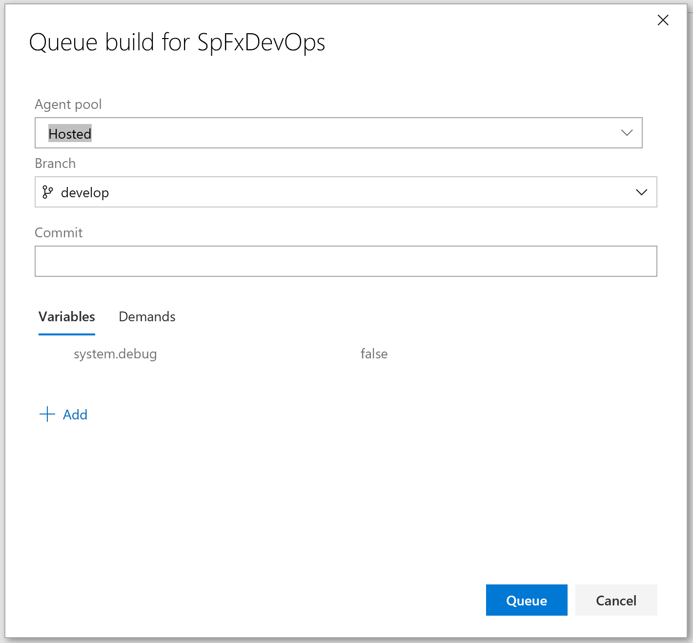
After a couple of minutes, your build should complete and show a result page like this one.  
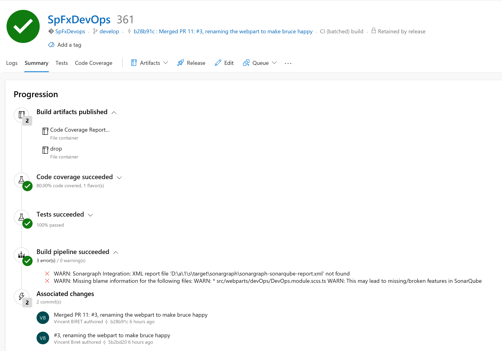
If you navigate to the `Release` section of Azure DevOps, a new release should have started automatically. After a few minutes your release should complete and your SharePoint Framework solution is deployed to your tenant.  
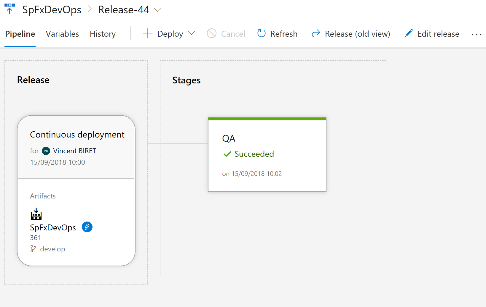

Your DevOps pipeline for your SharePoint Framework solution in Azure DevOps is now set up and ready to be customized further to your scenario. 

## See Also
- [SharePoint Framework Overview](../sharepoint-framework-overview.md)
- [Sample Project on GitHub](https://github.com/SharePoint/sp-dev-build-extensions/tree/master/samples/azure-devops-ci-cd-spfx)
- [Integrate Gulp Tasks in the build pipeline](./integrate-gulp-tasks-in-build-pipeline.md)
