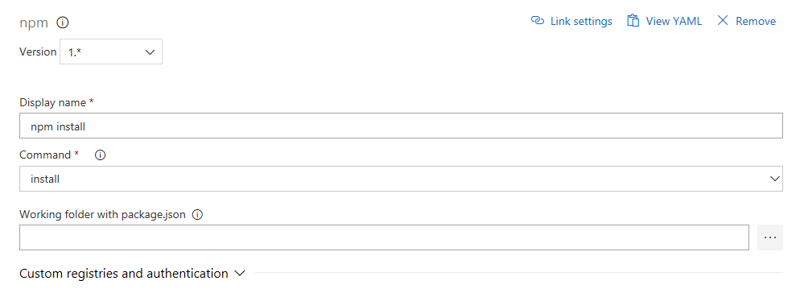
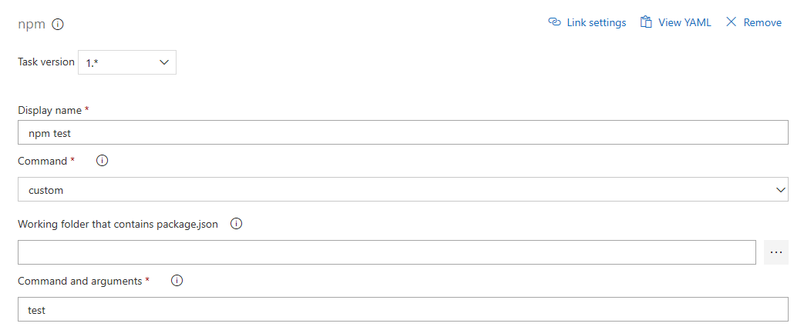
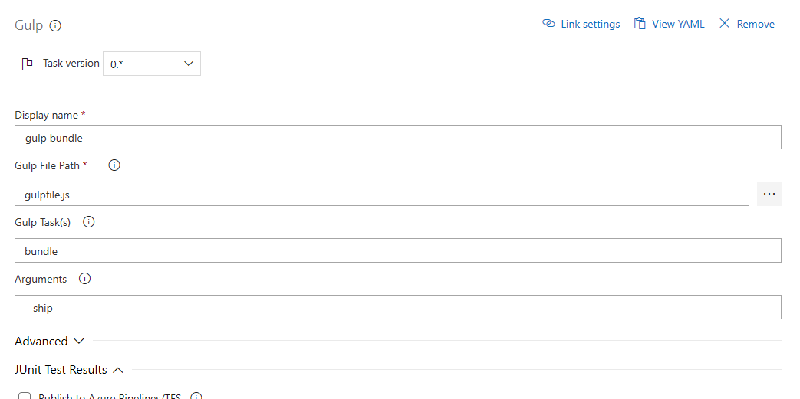
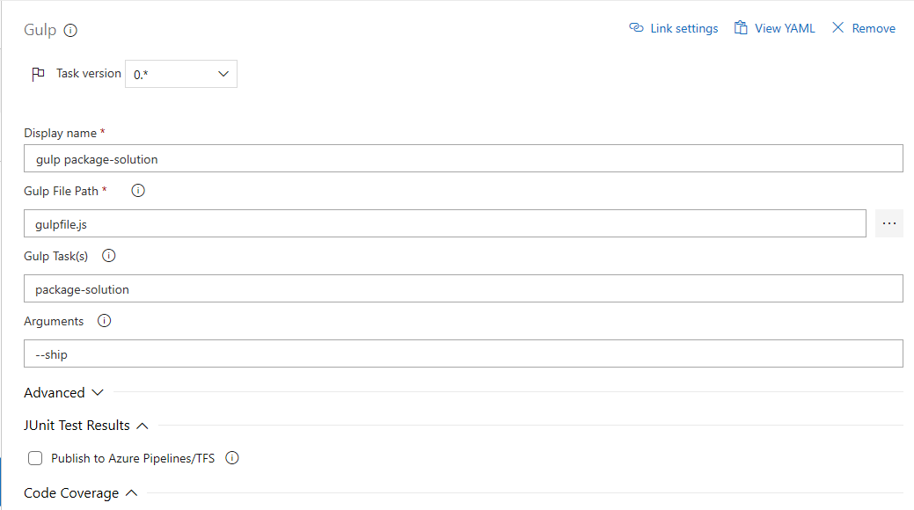
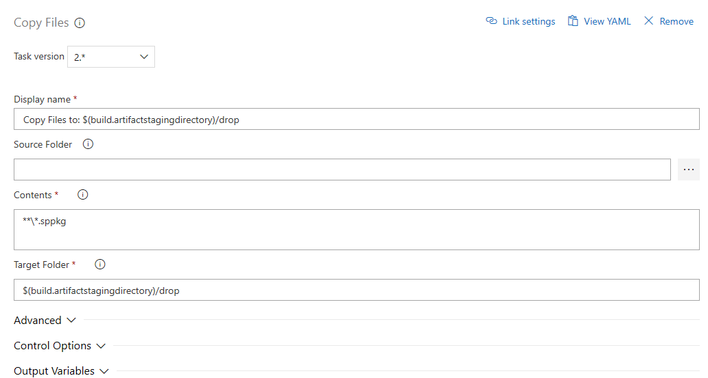
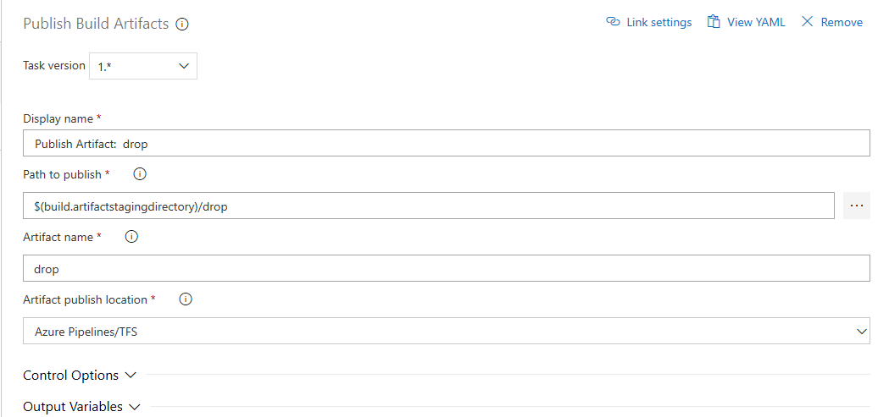
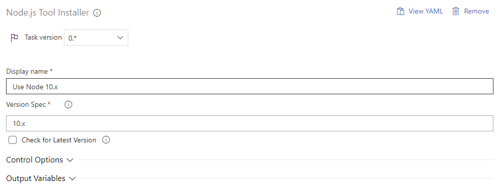
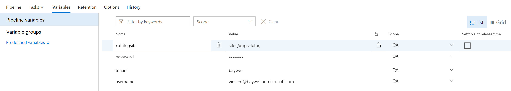

# Implement Continuous Integration and Continuous deployment using Azure DevOps
Azure DevOps (Visual Studio Team Services / Team Foundation Server) consists of a set of tools and services that help developers implement DevOps, Continuous Integration, and Continuous Deployment processes for their development projects.

This article explains the steps involved in setting up your Azure DevOps environment with with Continuous Integration and Continuous Deployment to automate your SharePoint Framework builds, unit tests, and deployment.

## Continuous Integration
Continuous Integration (CI) helps developers integrate code into a shared repository by automatically verifying the build using unit tests and packaging the solution each time new code changes are submitted.  

Setting up Azure DevOps for Continuous Integration with a SharePoint Framework solution requires the following steps:
1. Creating the Build Definition
2. Installing NodeJS
3. Restoring dependencies
4. Executing Unit Tests
5. Importing code coverage information
6. Bundling the solution
7. Packaging the solution
8. Preparing the artifacts
9. Publishing the artifacts

### Creating the Build Definition
The Build Definition, as its name suggests, includes all the definitions and their configurations for the build.  Start setting up your Continuous Integration by creating a new build definition and link it to your repository.

> [!NOTE] 
> Build definitions can be described as a process template. It is a set of configured tasks that will be executed one after another on the source code every time a build is triggered. Tasks can be grouped in phases, by default a build definition contains at least one phase. You can add new tasks to the phase by clicking on the big plus sign next to the phase name.

### Installing NodeJS version 8
Once the Build Definition has been created, the first thing you need to do is instal NodeJS.  Make sure to install version 8, as SharePoint Framework depends on it.


> [!NOTE] 
> Make sure you specify `8.x` in the `Version Spec` field.

### Restoring dependencies
Because third party dependencies are not stored in the source control, you need to restore those before starting to build the project. To do so add a `npm` task and set the command to `install`.


### Executing Unit Tests
The SharePoint Framework supports writing units tests using KarmaJS, Mocha, Chai and Sinon. These modules are already referenced for you and it is highly recommended at a minimum to test the business logic of your code to get feedback on any potential issues or regressions as soon as possible. To have Azure DevOps execute your unit tests, add a `gulp` task. Set the path to the `gulpfile` file and set the `Gulp Tasks` option to `test`.

> [!NOTE] 
> Make sure you check `Publish to TFS/Team Services` under the `JUnit Test Results` section and set the `Test Result Files` to `**/test-*.xml`. This will instruct the task to report results with the build status in Azure DevOps.

#### Configuring KarmaJS
By default SharePoint Framework projects do not include a reporter for JUnit. Reporters are plugins for KarmaJS that export the test results in a certain format. To install the necessary reporters, run the following commands in your project.

```shell
npm i karma-junit-reporter@1.X -D
```
You also need to configure KarmaJS to load an use the reporter, to do so create a file `config/karma.config.js` and add the following content.
```JS
"use strict";
var existingKarmaConfig = require('@microsoft/sp-build-web/lib/karma/karma.config');
var _ = require('lodash');
var junitReporter = require('karma-junit-reporter');

module.exports = function (config) {
  existingKarmaConfig(config);
  config.reporters.push('junit');

  config.set({
    basePath: './..',
  });

  config.junitReporter = {
    outputDir: 'temp/', // results will be saved as $outputDir/$browserName.xml
    outputFile: 'test-results.xml', // if included, results will be saved as $outputDir/$browserName/$outputFile
    suite: 'karma', // suite will become the package name attribute in xml testsuite element
    useBrowserName: true, // add browser name to report and classes names
  };
  var coberturaSubDir = 'cobertura';
  var coverageSubDir = 'lcov';
  var coberturaFileName = 'cobertura.xml';
  config.coverageReporter.reporters.push({type: 'cobertura', subdir: './' + coberturaSubDir, file: coberturaFileName});
  config.coverageReporter.reporters.push({
    type: 'lcov',
    subdir: './' + coverageSubDir + '/',
    file: 'lcov.info'
  });
  config.browserNoActivityTimeout = 60000;
  config.plugins.push(junitReporter);
};
```

Finally you need to modify the gulpfile to instruct it to leverage this new configuration. To do so edit `gulpfile.js` and add these lines after `build.initialize(gulp);`.
```JS
const _ = require('lodash');
var buildConfig = build.getConfig();
var karmaTask = _.find(buildConfig.uniqueTasks, (t) => t.name === 'karma');
karmaTask.taskConfig.configPath = './config/karma.config.js';
```
### Importing code coverage information
In order to get code coverage reported with the build status you need to add a task to import that information. To configure the code coverage information, add the `publish code coverage results` tasks. Make sure you set the tool to `Cobertura`, `Summary files` to `$(Build.SourcesDirectory)/temp/coverage/cobertura/cobertura.xml` and `Report Directory` to `$(Build.SourcesDirectory)/temp/coverage/cobertura`.


### Bundling the solution
You first need to bundle your solution in order to get static assets that can be understood by a web browser.  Add another `gulp` task, set the `gulpfile` path, set the `Gulp Tasks` field to bundle and add `--ship` in the `Arguments`.


### Packaging the solution
Now that you have static assets, the next step is to combine the assets into a package SharePoint will be able to deploy. Add another `gulp` task, set the `gulpfile` path, set the `Gulp Tasks` field to `package-solution` and add `--ship` in the `Arguments`.


### Preparing the artifacts
By default, an Azure DevOps build does not retain any files.  To ensure that the required files needed for the release are retained, you need to explicitly indicate which files should be kept.  
Add a `Copy Files` task and set the `Contents` to `**\*.sppkg` (the SharePoint Package created with the previous task) and the target folder to `$(build.artifactstagingdirectory)/drop`.


### Publishing the artifacts
Now that you have collected all the files needed for deployment in a special artifacts folder, you still need to instruct Azure DevOps to keep these files after the execution of the build. To do so add a `Publish artifacts` task and set the `Path to publish` to `$(build.artifactstagingdirectory)/drop` and the `Artifact name` to `drop`.



## Continuous Deployment
Continuous Deployment (CD) takes validated code packages from build process and deploys them into a staging or production environment.  Developers are able to track which deployments were successful or not and narrow down the issues to the particular package versions.    

Setting up Azure DevOps for Continuous Deployments with a SharePoint Framework solution requires the following steps:
1. Creating the Release Definition
2. Linking the Build Artifact
3. Creating the Environment
4. Installing NodeJS
5. Installing the Office 365 CLI
6. Connecting to the App Catalog
7. Adding the Solution Package to the App Catalog
8. Deploying the Application
9. Setting the Variables for the Environment

### Creating the Release Definition
Start by creating a new Release Definition with an empty template. A Release Defition is a process that is used to identify the following elements for the deployment:
- Environment
- Deployment tasks
- Build artifacts


### Linking the Build Artifact
Click on `Add an artifact` and select the build definition you previously created.  Write down the `Source Alias` name you set, as you will need to use it in subsequent tasks.


### Creating the Environment
When you create your continuous deployment environment, you can give a name and configure pre-deployment approvals, artificats filters (i.e. deploy only if the build comes from this or that branch), and much more by clicking on the buttons around the environment box or directly on the title.


### Installing NodeJS
By click on `1 job, 0 tasks` you can access the tasks configuration view, which works similarly to the build definition. Here, you can select the set of tasks that will run only for this specific environment.  This includes installing NodeJS version 8 or later.
Add a `Node tool installer` task and define `8.X` in the `Version Spec` field. 


### Installing the Office 365 CLI
The Office 365 Common Language Interface (CLI) is an open source project built by the OfficeDev PnP Community. In order to leverage the  CLI as part of your Release Definition, you first need to install it.  Then, you will be able to take advantage of commands available  to handle deployment. Add a `npm` task, select a `Custom` command and type `install -g @pnp/office365-cli` in the `Command and Arguments` field.

> [!NOTE] 
> Learn more about the [Office 365 CLI](https://pnp.github.io/office365-cli/)

### Connecting to the App Catalog
Before using the App Catalog in you deployment environment, you first need to authenticate against the App Catalog of your tenant.  To do so, add a `Command Line` task and paste in the following command into the `script` field `o365 spo login https://$(tenant).sharepoint.com/$(catalogsite) --authType password --userName $(username) --password $(password)
`


### Adding the Solution Package to the App Catalog
Upload the solution package to your App Catalog by adding another `Command Line` task and pasting the following command line in the `Script` field `o365 spo app add -p $(System.DefaultWorkingDirectory)/SpFxDevOps/drop/SharePoint/solution/sp-fx-devops.sppkg --overwrite`
> [!NOTE] 
> The path of the package depends on your solution name (see your project configuration) as well as the `Source Alias` you defined earlier, make sure they match.


### Deploying the Application
The final step in the setup is to deploy the application to the App Catalog to make it available to all site collections within the tenant as it's latest version. Add another `Command Line` taks and paste the follwing command line in the `Script` field `o365 spo app deploy --name sp-fx-devops.sppkg --appCatalogUrl https://$(tenant).sharepoint.com/$(catalogsite)`
> [!NOTE] 
> Make sure you update the package name.


### Setting the Variables for the Environment
The tasks you configured in the last step rely on Azure DevOps process variables (easily identified with the `$(variableName)` syntax). You need to define those variables before being able to run the build definition. To do so, click on the `Variables` tab.  
Add the following variables
| Name | Value |
| ------ | ------ |
| catalogsite | Server relative Path of the App Catalog Site eg `sites/appcatalog` |
| password | Password of the user with administrative permissions on the tenant, do not forget to check the lockpad to mask it to other users |
| username | Username of the user with administrative permissions on the tenant |
| tenant | Tenant name in https://tenant.sharepoint.com eg `tenant` |
  

> [!NOTE]
> Make sure you save your release definition.

## Testing
To test your newly created Continuous Deployment process, return to the `Builds` section in Azure DevOps, select your build definition and click on `Queue`. Select your branch, and click on `Queue`. A new build will be created and will start building. 

After a couple of minutes, your build should complete and show a result page like this one.  

If you navigate to the `Release` section of Azure DevOps, a new release should have started automatically. After a few minutes your release should complete and your SharePoint Framework solution is deployed to your tenant.  


Your DevOps pipeline for your SharePoint Framework solution in Azure DevOps is now set up and ready to be customized further to your scenario. 

## See Also
- [SharePoint Framework Overview](../sharepoint-framework-overview.md)
- [Sample Project on GitHub](https://github.com/SharePoint/sp-dev-build-extensions/tree/master/samples/azure-devops-ci-cd-spfx)
- [Integrate Gulp Tasks in the build pipeline](./integrate-gulp-tasks-in-build-pipeline.md)
