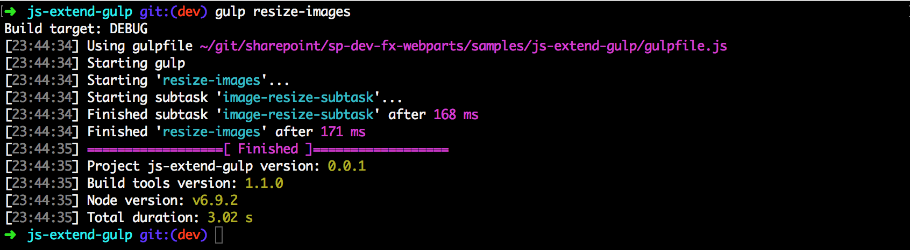

# Integrate gulp tasks in SharePoint Framework toolchain

SharePoint client-side development tools use [gulp](http://gulpjs.com/) as the build process task runner to:

* Bundle and minify JavaScript and CSS files.
* Run tools to call the bundling and minification tasks before each build.
* Compile LESS or Sass files to CSS.
* Compile TypeScript files to JavaScript.

One common task you can add to the SharePoint Framework toolchain is to integrate your custom gulp tasks in the build pipeline.

## Gulp tasks
Normally gulp tasks are defined in the `gulpfile.js` as:

```js
gulp.task('somename', function() {
  // Do stuff
});
```

<br/>

When working with the SharePoint Framework toolchain, it is necessary to define your tasks in the framework's build pipeline. After the task is defined and registered with the pipeline, it is added to the toolchain.

SharePoint Framework uses a [common build toolchain](sharepoint-framework-toolchain.md#common-build-tool-packages) that consists of a set of npm packages that share common build tasks. Hence, the default tasks are defined in the common package as opposed to your client-side project's `gulpfile.js`. To see the available tasks, you can execute the following command in a console within your project directory:

```js
gulp --tasks
```

<br/>

This command lists all the available tasks.


## Custom gulp tasks

To add your custom tasks, define the custom tasks in the `gulpfile.js`. 

Open the `gulpfile.js` in your code editor. The default code initializes the SharePoint Framework toolchain and the global `gulp` instance for the toolchain. Any custom tasks added should be defined before initializing the global `gulp` instance.

### Add your custom task

To add your custom gulp task, add a new subtask to the SharePoint Framework build pipeline by using the [`build.subTask`](https://github.com/Microsoft/web-build-tools/blob/master/core-build/gulp-core-build/README.md#defining-a-custom-task) function:

```js
let helloWorldSubtask = build.subTask('log-hello-world-subtask', function(gulp, buildOptions, done) {
  this.log('Hello, World!');   
  // use functions from gulp task here
  done();
});
```

<br/>

In the case of a stream, you return the stream:

```js
let helloWorldSubtask = build.subTask('log-hello-world-subtask', function(gulp, buildOptions, done) {
  return gulp.src('images/*.png')
             .pipe(gulp.dest('public'));
});
```

### Register your task with gulp command line
After the custom task is defined, you can register this custom task with the gulp command line by using the `build.task` function:

```js
// Register the task with gulp command line
let helloWorldTask = build.task('hello-world', helloWorldSubtask);
```

> [!NOTE] 
> Any custom tasks added should be defined before initializing the global `gulp` instance, that is, before the following line of code: `build.initialize(gulp);`

<br/>

Now you can execute your custom command in the command line as follows:

```js
gulp hello-world
```

> [!NOTE] 
> You cannot execute the subtask registered by using the `build.subTask` function directly from the command line. You can only execute the task registered by using the `build.task` function.

### Logging to the SharePoint Framework build process

To add your own logging messages to the SharePoint Framework build process, you can make use of the following methods within the custom task:

- `log(message: string)`: logs a message;
-	`logWarning(message: string)`: Logs a warning, and it also adds it to the warnings list which will lead the build fail;
-	`logError(message: string)`: Logs an error, and it also adds it to the errors list which will lead the build to fail.
-	`fileWarning(filePath: string, line: number, column: number, warningCode: string: message: string)`: This logs a warning related to a specific file and causes the build to fail
-	`fileError(filePath: string, line: number, column: number, warningCode: string: message: string)`: This logs an error related to a specific file and causes the build to fail.

Example:

```javascript
let helloWorldSubtask = build.subTask('log-hello-world-subtask', function(gulp, buildOptions, done) {
  this.log('Logs message'); 
  this.logWarning('Logs a warning'); 
  this.logError('Logs an error'); 

  done();
});
```


### Execute your custom task before or after available tasks
You can also add this custom task to be executed before or after certain available gulp tasks. The following gulp tasks allow you to inject your custom task before or after the task:

- Generic build task (that consists of all the available tasks)
- TypeScript task

The SharePoint Framework tasks are available in the default build rig. The build rig is a collection of tasks defined for a specific purpose, in our case, building client-side packages. You can access this default rig by using the `build.rig` object and then get access to the pre- and post-task functions:
 
```js
// execute before the TypeScript subtask
build.rig.addPreBuildTask(helloWorldTask);

// execute after TypeScript subtask
build.rig.addPostTypescriptTask(helloWorldTask);

// execute after all build tasks
build.rig.addPostBuildTask(helloWorldTask);
```

## Example: Custom image resize task

As an example, let's use the [image resize gulp task](https://www.npmjs.com/package/gulp-image-resize).  It's a simple task that allows you to resize images.

You can download the completed sample at [samples/js-extend-gulp/](https://aka.ms/spfx-extend-gulp-sample).

In the [image resize task's documentation](https://www.npmjs.com/package/gulp-image-resize#example), it shows how to use this custom task:

```js
var gulp = require('gulp');
var imageResize = require('gulp-image-resize');
 
gulp.task('default', function () {
  gulp.src('test.png')
      .pipe(imageResize({
        width : 100,
        height : 100,
        crop : true,
        upscale : false
      }))
      .pipe(gulp.dest('dist'));
});
```

<br/>

We use this information to add this task in our project by using the `build.subTask` and `build.task` functions:

```js
var imageResize = require('gulp-image-resize');

let imageResizeSubTask = build.subTask('image-resize-subtask', function(gulp, buildOptions, done){
    return gulp.src('images/*.jpg')
               .pipe(imageResize({
                   width: 100,
                   height: 100,
                   crop: false                   
               }))
               .pipe(gulp.dest(path.join(buildOptions.libFolder, 'images')))
});

let imageResizeTask = build.task('resize-images', imageResizeSubTask);
```

<br/>

Because we are defining the stream, we return the stream in the `build.subTask` function to the build pipeline. The build pipeline then asynchronously executes this gulp stream. 

Now, you can execute this task from the gulp command line as follows:

```js
gulp resize-images
```

<br/>



<br/>

You also see this `resize-images` task in the available tasks for your project when you execute `gulp --tasks`:


## See also

- [SharePoint Framework Overview](../sharepoint-framework-overview.md)


