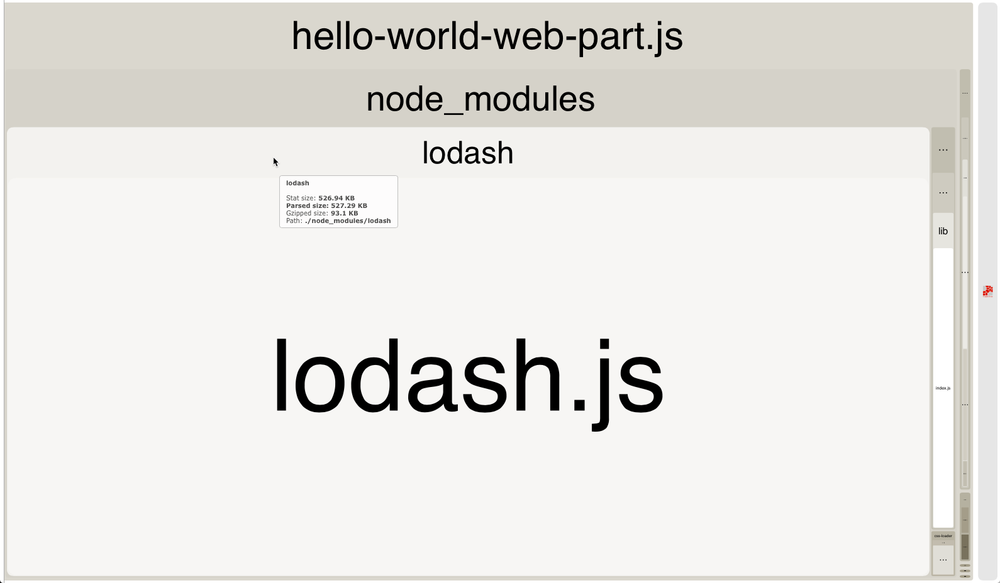
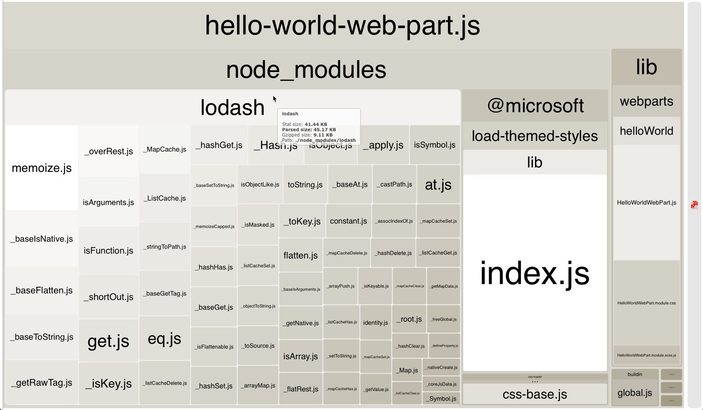

# Optimize SharePoint Framework builds for production

When deploying SharePoint Framework solutions to production you should always use a release build of your project that is optimized for performance. This article illustrates the main differences between debug and release builds and shows how you can optimize your bundle for use in production environments.

## Use release builds in production

When building a SharePoint Framework project, you can choose whether you want to build it in a debug or release mode. By default, SharePoint Framework projects are built in debug mode, which makes it easier for you to debug code. But when your code is finished and is working as expected, you should build it in release mode to optimize it for running in the production environment.

For more information about building your project in release mode, see [SharePoint Framework toolchain](./sharepoint-framework-toolchain.md).

The main difference between the output of a debug and release build is that the release version of the generated bundle is minified and significantly smaller in size than its debug equivalent. To illustrate the difference, compare the size of the debug and release version of a SharePoint Framework project with a web part using Angular.


The debug version of the bundle is 1255 KB while its release equivalent is only 177 KB. The difference in size between the debug and release version of the generated bundle differs depending on the libraries used in your project. Still, the release build is always significantly smaller than a debug build, which is why you should always deploy the output of release builds to production.

## Don't include third-party libraries in the bundle

When building SharePoint Framework solutions, you can benefit from many existing JavaScript libraries to solve common problems. Using existing libraries allows you to be more productive and lets you focus on the added value for your organization, instead of on developing generic functionality.

By default, when referencing third-party libraries in your project, SharePoint Framework includes them in the generated bundle. As a result, users working with your solution end up downloading the same library multiple times, once with each component. The total page size grows significantly, taking longer to load and leading to a poor user experience, particularly on slower networks.


When working with third-party libraries, you should always consider loading them from an external location: either a public CDN or a hosting location owned by your organization. This allows you to exclude the library from your bundle, significantly decreasing its size. 

Additionally, if the hosting location from which you are loading the library is optimized for serving static assets, users working with your solution need to load the library only once. On subsequent requests, or even when using your solution in the future, the web browser reuses the previously cached copy of the library rather than downloading it again. As a result, the page with your solution loads significantly faster.

## Verify the contents of your bundle

To better understand the size of the generated bundles, you can extend the Webpack configuration in your project and have the SharePoint Framework generate bundle statistics.

First, install the **webpack-bundle-analyzer** package in your project by executing the following in the command line:

```sh
npm install webpack-bundle-analyzer --save-dev
```

Next, change the contents of the **gulpfile.js** file in your project to:

```js
'use strict';

const gulp = require('gulp');
const path = require('path');
const build = require('@microsoft/sp-build-web');
const bundleAnalyzer = require('webpack-bundle-analyzer');

build.configureWebpack.mergeConfig({
  additionalConfiguration: (generatedConfiguration) => {
    const lastDirName = path.basename(__dirname);
    const dropPath = path.join(__dirname, 'temp', 'stats');
    generatedConfiguration.plugins.push(new bundleAnalyzer.BundleAnalyzerPlugin({
      openAnalyzer: false,
      analyzerMode: 'static',
      reportFilename: path.join(dropPath, `${lastDirName}.stats.html`),
      generateStatsFile: true,
      statsFilename: path.join(dropPath, `${lastDirName}.stats.json`),
      logLevel: 'error'
    }));

    return generatedConfiguration;
  }
});

build.initialize(gulp);
```

<br/>

The next time you bundle your project by using the `gulp bundle` task, you'll see the bundle stats files generated in the **temp/stats** folder in your project. One of the generated stats files is a treemap showing the different scripts included in the generated bundle. You can find this visualization in the **./temp/stats/[solution-name].stats.html** file.


Using the Webpack bundle analyzer treemap is a convenient way for you to verify that the generated bundle doesn't contain any unnecessary scripts and understand how the included scripts affect the total bundle size. Keep in mind that the displayed size reflects the debug build and is significantly smaller for a release build.

More detailed information used to generate the visualization is included in the **./dist/[solution-name].stats.json** file. By using this file, you can find out why a specific script has been included in the bundle or if a particular script is used in multiple bundles. With this information, you can optimize your bundles, improving the loading time of your solution.

## Choose your primary client-side library

If there are multiple components on the same page, or even on different pages across the portal, and they all use the same library loaded from the same URL, the web browser also reuses the copy it cached previously, which leads to the portal loading faster. 

This is exactly why it is essential for organizations to rationalize which libraries and versions they use and where they load from, not only for a specific project but for the whole organization. Such a policy allows users working with the different applications to be more productive by loading the applications faster. By reusing the previously downloaded assets, the load on the network is limited, freeing its bandwidth for other purposes.

For more information about working with external libraries, see [Use existing JavaScript libraries in SharePoint Framework client-side web parts](../web-parts/guidance/use-existing-javascript-libraries.md).

## Reference only the necessary components

Sometimes when working with external libraries, you might actually not need the whole library but only a small portion of it. Including the whole library unnecessarily adds to the size of your bundle, increasing its load time. Instead, you should always consider loading only the specific parts of the particular library that you actually need.

To illustrate this, take the [Lodash](https://lodash.com) library as an example. Lodash is a collection of utilities helping you to perform certain operations in your code. The odds are high that when working with Lodash, you only need a few specific methods rather than the complete library. 

However, if you referenced the whole library by using the following code, it adds 527 KB to your unoptimized bundle:

```ts
import * as _ from 'lodash';
```

<br/>



<br/>

Instead, if you referenced only the specific Lodash method by using the following code, it adds 45 KB to your unoptimized bundle:

```ts
const at: any = require('lodash/at');
```

<br/>



Specifically with regards to Lodash, but which could also be the case with other libraries, referencing specific methods instead of the whole library comes with a price. 

Currently, Lodash doesn't support loading specific methods inside of SharePoint Framework projects by using the **import** notation. Instead, you have to use a **require** statement, which doesn't offer you the typesafety capabilities that using the **import** statement does. Eventually, it is up to you to decide if loading significantly more code into your bundles is worth preserving the typesafety capabilities.

> [!NOTE] 
> Some of the Lodash methods are provided with the SharePoint Framework in the **@microsoft/sp-lodash-subset** library. Before using Lodash, verify if the method that you want to use isn't already available in the **@microsoft/sp-lodash-subset** library, which is already available as a part of the SharePoint Framework and does not need to be included in your bundle.

## See also

- [SharePoint Framework Overview](../sharepoint-framework-overview.md)