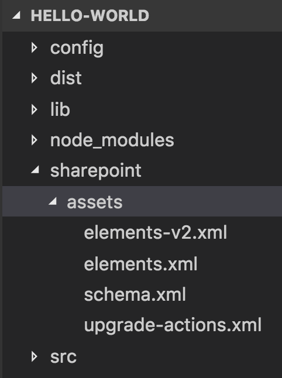

# Provision SharePoint assets with your solution package

At times, you may need to provision a SharePoint list or a document library along with your client-side solution package so that the list or library is available for your client-side components, such as web parts. SharePoint Framework toolchain allows you to package and deploy SharePoint items with your client-side solution package. These items are then provisioned when the client-side solution is installed on a site. 

You can also find details on the provisioning options in this SharePoint PnP webcast available on the SharePoint PnP YouTube Channel:

<br/>

> [!Video https://www.youtube.com/embed/r-UdJhhHlEQ]

<br/>


## Provision items using JavaScript code

While it is possible to create SharePoint items using JavaScript code in your component, such as web parts, it is limited to the context of the current user using that component. If the user doesn't have sufficient permissions to create or modify SharePoint items, the JavaScript code does not provision those items. In such cases, when you want to provision SharePoint items in an elevated context, you must package and deploy the items along with your solution package.

## Provision SharePoint items in your solution

The following SharePoint assets can be provisioned along with your client-side solution package:

* Fields
* Content types
* List instances
* List instances with custom schema

### Fields

A field or a site column represents an attribute, or piece of metadata, that the user wants to manage for the items in the list or content type to which they added the column. It is a reusable column definition, or template, that you can assign to multiple lists across multiple SharePoint sites. Site columns decrease rework and help you ensure consistency of metadata across sites and lists. 

For example, suppose you define a site column named Customer. Users can add that column to their lists and reference it in their content types. This ensures that the column has the same attributes—at least to start with—wherever it appears.

You can refer to the schema and attributes in the [Field Element (Field)](https://msdn.microsoft.com/en-us/library/aa979575(v=office.15).aspx) documentation to define a new field in your solution. 

Following is an example of a new DateTime field:

```xml
<Field ID="{1511BF28-A787-4061-B2E1-71F64CC93FD5}"
            Name="DateOpened"
            DisplayName="Date Opened"
            Type="DateTime"
            Format="DateOnly"
            Required="FALSE"
            Group="Financial Columns">
        <Default>[today]</Default>
    </Field>
```

### Content types

A content type is a reusable collection of metadata (columns), behavior, and other settings for a category of items or documents in a SharePoint list or document library. Content types enable you to manage the settings for a category of information in a centralized, reusable way.

For example, imagine a business situation in which you have three different types of documents: expense reports, purchase orders, and invoices. All three types of documents have some characteristics in common; for one thing, they are all financial documents and contain data with values in currency. Yet each type of document has its own data requirements, its own document template, and its own workflow. 

One solution to this business problem is to create four content types. The first content type, Financial Document, could encapsulate data requirements that are common to all financial documents in the organization. The remaining three, Expense Report, Purchase Order, and Invoice, could inherit common elements from Financial Document. In addition, they could define characteristics that are unique to each type, such as a particular set of metadata, a document template to be used in creating a new item, and a specific workflow for processing an item.

You can refer to the schema and attributes in the [ContentType Element (ContentType)](https://msdn.microsoft.com/en-us/library/aa544268.aspx) documentation to define a new content type in your solution. 

Following is an example of a content type:

```xml
<ContentType ID="0x010042D0C1C200A14B6887742B6344675C8B" 
    Name="Cost Center" 
    Group="Financial Content Types" 
    Description="Financial Content Type">
    <FieldRefs>
        <FieldRef ID="{1511BF28-A787-4061-B2E1-71F64CC93FD5}" />
        <FieldRef ID="{060E50AC-E9C1-4D3C-B1F9-DE0BCAC300F6}" /> 
    </FieldRefs>
</ContentType> 
```

### List instances

Lists are a key, underlying feature of a SharePoint site. They enable teams to gather, track, and share information. Many applications rely on lists created at the site for data storage to implement their behaviors. A list instance is a predefined SharePoint list that has a well-known identifier. You can customize and add items to these lists, create additional lists from the list templates that are already available, and create custom lists with just the settings and columns that you choose.

SharePoint provides several list templates such as contact list, calendar, task list, and more. You can use these templates to create new list instances for your web parts or other components. For example, you can define a list instance Finance Documents based on the Document Library template to store associated documents with your web part. 

You can refer to the schema and attributes in the [ListInstance Element (List Instance)](https://msdn.microsoft.com/en-us/library/office/ms476062.aspx) documentation to define a list instance in your solution.

Following is an example of a list instance definition:

```xml
<ListInstance 
    FeatureId="00bfea71-e717-4e80-aa17-d0c71b360101"
    Title="Finance Records" 
    Description="Finance documents"
    TemplateType="101"
    Url="Lists/FinanceRecords">
</ListInstance>
```

### List instances with custom schema

You can use a custom list schema definition to define your fields, content types, and views used in your list instance. You use the [CustomSchema](https://msdn.microsoft.com/en-us/library/office/ms476062.aspx#sectionSection0) attribute in the ListInstance element to reference a custom schema for the list instance. 

For example, you can define a list instance **Finance Documents** with a content type **Financial Document** that could encapsulate data requirements that are common to all financial documents in the organization. 

Following is an example of a list instance definition that uses a custom schema:

```xml
<ListInstance 
    CustomSchema="schema.xml"
    FeatureId="00bfea71-de22-43b2-a848-c05709900100"
    Title="Cost Centers" 
    Description="Cost Centers"
    TemplateType="100"
    Url="Lists/CostCenters">
</ListInstance>
```

<br/>

This is the custom schema definition that defines a content type for the list instance defined previously:

```xml
<List xmlns:ows="Microsoft SharePoint" Title="Basic List" EnableContentTypes="TRUE" FolderCreation="FALSE" Direction="$Resources:Direction;" Url="Lists/Basic List" BaseType="0" xmlns="http://schemas.microsoft.com/sharepoint/">
  <MetaData>
    <ContentTypes>
      <ContentTypeRef ID="0x010042D0C1C200A14B6887742B6344675C8B" />
    </ContentTypes>
    <Fields></Fields>
    <Views>
      <View BaseViewID="1" Type="HTML" WebPartZoneID="Main" DisplayName="$Resources:core,objectiv_schema_mwsidcamlidC24;" DefaultView="TRUE" MobileView="TRUE" MobileDefaultView="TRUE" SetupPath="pages\viewpage.aspx" ImageUrl="/_layouts/images/generic.png" Url="AllItems.aspx">
        <XslLink Default="TRUE">main.xsl</XslLink>
        <JSLink>clienttemplates.js</JSLink>
        <RowLimit Paged="TRUE">30</RowLimit>
        <Toolbar Type="Standard" />
        <ViewFields>
          <FieldRef Name="LinkTitle"></FieldRef>
          <FieldRef Name="SPFxAmount"></FieldRef>
          <FieldRef Name="SPFxCostCenter"></FieldRef>
        </ViewFields>
        <Query>
          <OrderBy>
            <FieldRef Name="ID" />
          </OrderBy>
        </Query>
      </View>
    </Views>
    <Forms>
      <Form Type="DisplayForm" Url="DispForm.aspx" SetupPath="pages\form.aspx" WebPartZoneID="Main" />
      <Form Type="EditForm" Url="EditForm.aspx" SetupPath="pages\form.aspx" WebPartZoneID="Main" />
      <Form Type="NewForm" Url="NewForm.aspx" SetupPath="pages\form.aspx" WebPartZoneID="Main" />
    </Forms>
  </MetaData>
</List>
```

## Create SharePoint items in your solution

The solution package uses [SharePoint Features](https://msdn.microsoft.com/en-us/library/ee537350(office.14).aspx) to package and provision the SharePoint items. A feature is a container that includes one or more SharePoint items to provision. A feature contains a Feature.xml file and one or more element manifest files. These XML files are also known as feature definitions. 

Typically, a client-side solution package contains one feature. This feature is activated when the solution is installed on a site. It is important to note that the site administrators install your solution package and not the feature. 

A feature is primarily constructed by using the following XML files.

### Element manifest file

The element manifest file contains the SharePoint item definitions and is executed when the feature is activated. For example, the XML definitions to create a new field, content type, or list instance is in the element manifest. 

Following is an example of an element manifest file that defines a new DateTime field.

```xml
<?xml version="1.0" encoding="utf-8"?>
<Elements xmlns="http://schemas.microsoft.com/sharepoint/">
    <Field ID="{1511BF28-A787-4061-B2E1-71F64CC93FD5}"
            Name="DateOpened"
            DisplayName="Date Opened"
            Type="DateTime"
            Format="DateOnly"
            Required="FALSE"
            Group="Financial Columns">
        <Default>[today]</Default>
    </Field>
  </Elements>
```

### Element file

Any supported files that accompany the element manifest are element files. For example, the list instance schema is an element file that is associated with a list instance that is defined in an element manifest. 

Following is an example of a custom list instance schema:

```xml
<List xmlns:ows="Microsoft SharePoint" Title="Basic List" EnableContentTypes="TRUE" FolderCreation="FALSE"
      Direction="$Resources:Direction;" Url="Lists/Basic List" BaseType="0" xmlns="http://schemas.microsoft.com/sharepoint/">
  <MetaData>
    <ContentTypes>
      <ContentTypeRef ID="0x010042D0C1C200A14B6887742B6344675C8B" />
    </ContentTypes>    
  </MetaData>
</List>
```

### Upgrade actions file

As its name suggests, this is the file that includes any upgrade actions when the solution is updated on the site. As part of the upgrade actions, the action could specify to include one or more element manifests as well. For example, if the upgrade requires a new field to be added, the field definition is available as an element manifest and is associated in the upgrade actions file. 

Following is an example of an upgrade actions file that applies an element manifest file during the upgrade:

```xml
<ApplyElementManifests>
      <ElementManifest Location="9c0be970-a4d7-41bb-be21-4a683586db18\elements-v2.xml" />
</ApplyElementManifests>
```

## Configure the SharePoint feature 

To include the XML files, you must first define the feature configuration in the *package-solution.json* configuration file under the *config* folder in your project. The *package-solution.json* contains the key metadata information about your client-side solution package and is referenced when you run the `package-solution` gulp task that packages your solution into an `.sppkg` file. 

```json
{
  "solution": {
    "name": "hello-world-client-side-solution",
    "id": "26364618-3056-4b45-98c1-39450adc5723",
    "version": "1.1.0.0",
    "features": [{
      "title": "hello-world-client-side-solution",
      "description": "hello-world-client-side-solution",
      "id": "d46cd9d6-87fc-473b-a4c0-db9ad9162b64",
      "version": "1.1.0.0",
      "assets": {        
        "elementManifests": [
          "elements.xml"
        ],
        "elementFiles":[
          "schema.xml"
        ],
        "upgradeActions":[
        	"upgrade-actions-v1.xml"
        ]
      }
    }]
  },  
  "paths": {
    "zippedPackage": "solution/hello-world.sppkg"
  }
}
``` 

<br/>

The `features` JSON object contains the metadata about the feature, as shown in the following table.

Property | Description 
-----|------
id|Unique identifier (GUID) of the feature
title|Title of the feature
description| Description of the feature
assets|An array of XML files used in the feature
elementManifests|Defined within the `assets` property, an array of element manifest files
elementFiles|Defined within the `assets` property, an array of element files
upgradeActions|Defined within the `assets` property, an array of upgrade action files

### Create the feature XML files

The toolchain looks for the XML files as defined in the configuration under a special folder, *sharepoint\assets*, in your client-side solution project. 



The configurations defined in the `package-solution.json` is what maps the XML files here to its appropriate feature XML file when the `package-solution` gulp task is executed.

## Package SharePoint items 

After you have defined your feature in the `package-solution.json` and created the respective feature XML files, you can use the following gulp task to package the SharePoint items along with your `.sppkg` package.

```js
gulp package-solution
```

This command packages one or more client-side component manifests, such as web parts, along with the feature XML files referenced in the `package-solution.json` configuration file.

> [!NOTE] 
> You can use the `--ship` flag to package minified versions of your components. 

## Upgrade SharePoint items

You may include new SharePoint items or update existing SharePoint items when you upgrade your client-side solution. Because provisioning SharePoint items uses features, you are using the feature [UpgradeActions](https://msdn.microsoft.com/en-us/library/office/ee537575(v=office.14).aspx) XML file to define a list of upgrade actions.

The `upgradeActions` JSON object array in the `package-solution.json` references the feature XML file(s) associated with the upgrade actions for your feature. At the least, an upgrade action file defines the element manifest XML file that is executed when upgrading the feature. 

When you are upgrading a SharePoint Framework solution, you must also update version attributes for both the solution and the feature where the upgrade actions have been included. A solution version increase indicates to SharePoint end users that there is a new version of the package available. A feature element version increase ensures that the tasks defined in the upgrade actions are being processed as part of the solution upgrade. 

Following is an example of an upgrade action file that applies an element manifest file during the upgrade:

```xml
<ApplyElementManifests>
      <ElementManifest Location="9c0be970-a4d7-41bb-be21-4a683586db18\elements-v2.xml" />
</ApplyElementManifests>
```

<br/>

This is the corresponding `element-v2.xml` that defines a new Currency field to be provisioned during the upgrade:

```xml
<?xml version="1.0" encoding="utf-8"?>
<Elements xmlns="http://schemas.microsoft.com/sharepoint/">
    <Field ID="{060E50AC-E9C1-4D3C-B1F9-DE0BCAC300F6}"
            Name="Amount"
            DisplayName="Amount"
            Type="Currency"
            Decimals="2"
            Min="0"
            Required="FALSE"
            Group="Financial Columns" />
</Elements>
```

<br/>

### Sub-elements

Upgrade actions in client-side solutions support the following sub-elements.

#### AddContentTypeField

Adds a new field to an existing provisioned content type. Propagates the change from the site content type to all child lists and content types within the site. For example:

```xml
<AddContentTypeField 
     ContentTypeId="0x010100A6F9CE1AFE2A48f0A3E6CB5BB770B0F7" 
     FieldId="{B250DCFD-9310-4e2d-85F2-BE2DA37A57D2}" 
     PushDown="TRUE" />
```

#### ApplyElementManifests

Adds a new element to an existing feature. When a feature is upgraded, provisions all non-declarative elements that are referenced in the specified element manifests.

#### VersionRange

Specifies a version range to which specified upgrade actions apply.


## See also
 
- [Tutorial - Provisioning SharePoint assets from your SharePoint client-side web part](../web-parts/get-started/provision-sp-assets-from-package.md)
- [SharePoint Framework Overview](../sharepoint-framework-overview.md)
