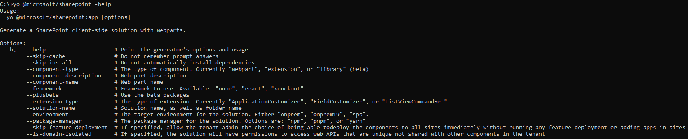

# Scaffold projects by using Yeoman SharePoint generator

[Yeoman](http://yeoman.io/) helps you to kickstart new projects, prescribing best practices and tools to help you stay productive. Using the Yeoman SharePoint generator, developers are able to scaffold new client-side solution projects to build, package, and deploy SharePoint solutions. The generator provides common build tools, boilerplate code, and a common playground website to host web parts for testing.

## Install the Yeoman SharePoint generator

Yeoman SharePoint generator is available as part of the framework as an [npm package](https://www.npmjs.com/package/@microsoft/generator-sharepoint). You can install the generator by executing the following command in a console:

```console
npm install @microsoft/generator-sharepoint -g
```

> [!NOTE]
> The Yeoman SharePoint generator is targeted to get deployed globally with the initial General Availability (GA) version. There are some known issues if it's installed locally to the project, which are planned to be addressed post-GA.

We recommend that you follow the [set up your development environment](../set-up-your-development-environment.md) instructions to configure your machine with the complete set of developer tools, including Yeoman SharePoint generator.

## Use the Yeoman SharePoint generator

After the generator is installed, you can invoke the generator by just typing the following command in a console:

```console
yo
```

The command lists all the generators available on your machine. Select **\@microsoft/sharepoint** to invoke the SharePoint generator and continue with the prompts to successfully create your client-side solution:


## Use available command-line options for the generator

You can use the command-line options available with the Yeoman SharePoint generator to scaffold projects in one command instead of going through the prompts. Execute the following command to see the list of command-line options available for the SharePoint generator:

```console
yo @microsoft/sharepoint --help
```



### Command-line options**

To view a list of the command line options, pass the `--help` argument when executing the generator:

```console
yo @microsoft/sharepoint --help
```

Following is an example of a command that creates a solution called "hello-world" with:

- A web part "HelloWorld"
- The "react" framework targeted only to SharePoint Online
- Tenant-scoped deployment optional enabled

Notice that some of the options have dependencies between each other. You cannot, for example, create an extension with an on-premises option.

```console
yo @microsoft/sharepoint
  --solution-name "hello-world"
  --framework "react"
  --component-type "webpart"
  --component-name "HelloWorld"
  --component-description "HelloWorld web part"
  --skip-install
  --environment "spo"
  --skip-feature-deployment
```

> [!NOTE]
> Using the `--skip-install` command scaffolds the project and skips installing dependencies. This means that to successfully build the project, you need to install the dependencies later after the project is scaffolded.
>
> If you try to build your project without installing the dependencies, you get the following error. This indicates that you need to install the dependencies before building the project:
>
> ```console
> Local gulp not found in ~/<project-name>
> Try running: npm install gulp
> ```
>
> You can execute the following command to install the dependencies:
>
> ```console
> npm install
> ```

## See also

- [SharePoint Framework toolchain](sharepoint-framework-toolchain.md)
- [SharePoint Framework development tools and libraries](../tools-and-libraries.md)
- [Set up your SharePoint Framework development environment](../set-up-your-development-environment.md)
- [SharePoint Framework Overview](../sharepoint-framework-overview.md)
