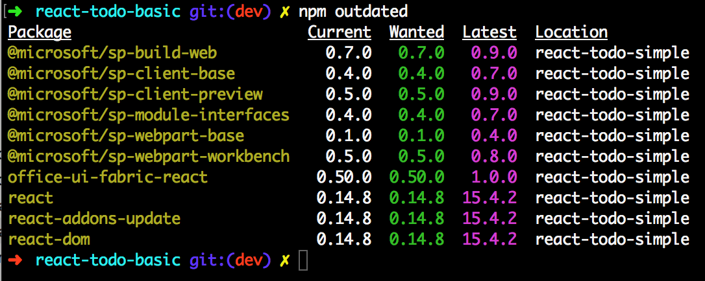
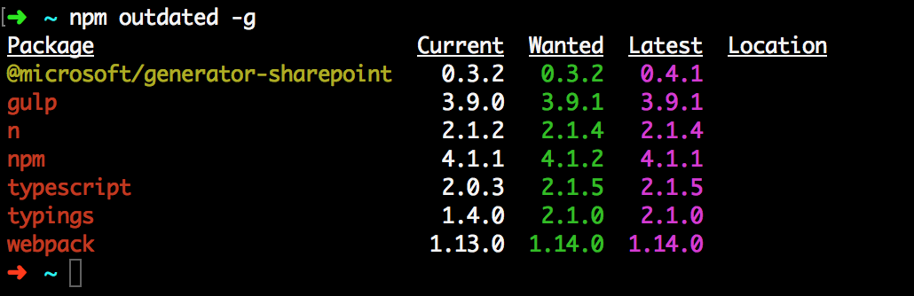

# Update SharePoint Framework packages

SharePoint client-side development tools use the [npm](https://www.npmjs.com/) package manager to manage dependencies and other required JavaScript helpers. npm is typically included as part of Node.js setup.

When you create a new client-side solution, the Yeoman generator for SharePoint fetches the latest SharePoint Framework packages required for your client-side project. As you build your project, your existing packages could be outdated because there could be new versions of one or more packages available. 

Based on the [release notes](https://aka.ms/spfx-release-notes) for a particular release or the latest package, you may decide to update your SharePoint Framework packages used in your project. SharePoint Framework packages include both the npm packages you have installed in your project, for example: [@microsoft/sp-core-library](https://www.npmjs.com/package/@microsoft/sp-core-library), and npm packages installed globally, for example: [@microsoft/generator-sharepoint](https://www.npmjs.com/package/@microsoft/generator-sharepoint). 

> [!TIP]
> While it may not be required, we recommend that you update the SharePoint Framework packages every so often so that you can get the latest changes and fixes that have been released.

## Find outdated packages in your project

To find the outdated packages in your client-side project, including SharePoint Framework and other packages your project depends on, run the following command in a console in the same directory as your project. 

```sh
npm outdated
```

The command lists the following information about the packages your project depends on. This information is looked up from the `package.json` file located in the root of your project directory and npm registry.

* Current version installed in your project
* Version requested by your project (available in `package.json`)
* Latest version available



To identify the SharePoint Framework packages, look for the package names that start with the following npm scope and prefix:

```text
@microsoft/sp-
```

Along with the framework packages, you may also need to update `react` and `office-ui-fabric-react` packages. Make sure you read the [release notes](https://aka.ms/spfx-release-notes) for that specific release to infer which packages require updates and plan accordingly.

### Using npm outdated with project targeting SharePoint 2016

Starting from Feature Pack 2, SharePoint 2016 supports SharePoint Framework solutions. SharePoint 2016 uses an older version of the SharePoint Framework than the version available in SharePoint Online. When scaffolding new projects, the SharePoint Framework Yeoman generator prompts you to choose if your solution should be using the latest version of the SharePoint Framework and be working only with SharePoint Online, or if it should use an older version of the SharePoint Framework and work with both SharePoint 2016 and SharePoint Online.

When you run the `npm outdated` command in a project targeting both SharePoint Online and SharePoint 2016, it shows you the latest versions of the SharePoint Framework packages. These versions, however, work only with SharePoint Online. If you update your solution to use these latest packages, it no longer works with SharePoint 2016.

When working with SharePoint Framework solutions compatible with SharePoint hosted on-premises, you should always verify which patch level the target SharePoint farm has and which version of the SharePoint Framework it supports.

## Update packages

When updating packages to newer versions, you should always use your package manager (npm or Yarn). You should not edit the `package.json` file manually. If you follow the recommended practice of using a lock file, your changes to the `package.json` file would be ignored.

Start with identifying which packages need updating and which newer version you want to use. Note that it might not always be possible for you to use the latest version of the given package because it might be incompatible with other SharePoint Framework dependencies, such as TypeScript.

For each package that you want to update, run the following command:

```sh
npm install mypackage@newversion --save
```

For example, if you were using AngularJS version v1.5.9 and wanted to update to version 1.6.5, you would run:

```sh
npm install angular@1.6.5 --save
```

Updating the package by using npm installs the specified version of the package in your project and updates the version number in the package.json file dependencies and the lock file used in your project.

After the packages are installed, execute the following command to clean up any old build artifacts:

```sh
gulp clean
```

## Update your code

Depending on breaking API changes, you may have to update your existing project code and config files. For each release, the [release notes](https://aka.ms/spfx-release-notes) highlight any such breaking changes and the modifications required to your existing code. You must make sure you update your code with those fixes.

You can always build the project to see if you have any errors and warnings by running the command in a console in your project directory:

```sh
gulp build
```

## Update Yeoman generator for SharePoint

If you have installed the SharePoint Framework Yeoman generator globally, you can find out if it requires updating by running the following command:

```sh
npm outdated -g
```

The command lists the following information about the packages installed globally on your machine. This information is looked up from the versions installed on your machine and the npm registry.

* Current version installed globally on your machine
* Version requested by you when you installed
* Latest version available



To identify the generator package, look for the following package name:

```sh
@microsoft/generator-sharepoint
```

### Update generator package

Open your favorite console and execute the following command to update the generator to its latest published version:

```sh
npm install @microsoft/generator-sharepoint@latest -g
```

The command updates the Yeoman generator for SharePoint to the latest published version along with its dependencies. You can validate this by executing the following command in the console:

```sh
npm ls @microsoft/generator-sharepoint -g --depth=0
```

## See also

- [Upgrading SharePoint Framework projects (Team-based development guidance)](../../team-based-development-on-sharepoint-framework.md#upgrading-sharepoint-framework-projects)
- [Upgrade SharePoint items (Provisioning SharePoint assets)](provision-sharepoint-assets.md#upgrade-sharepoint-items)
- [SharePoint Framework Overview](../../sharepoint-framework-overview.md)