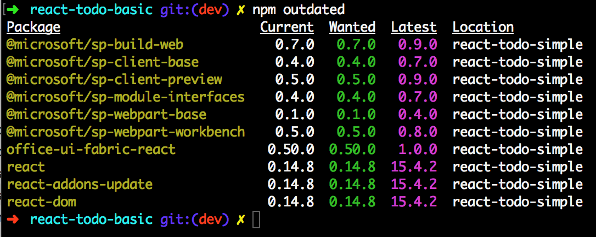
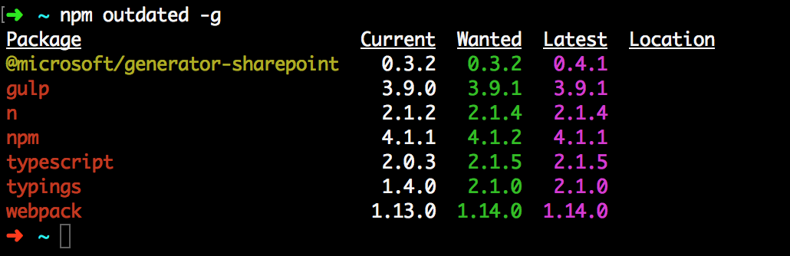

# Update SharePoint Framework packages 

SharePoint client-side development tools use the [npm](https://www.npmjs.com/) package manager to manage dependencies and other required JavaScript helpers. npm is typically included as part of Node.js setup.

When you create a new client-side solution, the yeoman generator for SharePoint fetches the latest SharePoint Framework packages required for your client-side project. As you build your project, your existing packages could be outdated as there could be new versions of one or more packages available. Based on the [release notes](https://aka.ms/spfx-release-notes) for a particular release or the latest package, you may decide to update your SharePoint Framework packages used in your project. SharePoint Framework packages include both the npm packages you have installed in your project, for example: [@microsoft/sp-core-library](https://www.npmjs.com/package/@microsoft/sp-core-library), and npm packages installed globally, for example: [@microsoft/generator-sharepoint](https://www.npmjs.com/package/@microsoft/generator-sharepoint). 

While it may not be required, it is recommended you update the SharePoint Framework packages every so often so that you can get the latest changes and fixes that have been released. 

## Find outdated packages in your project
To find the outdated packages in your client-side project, including SharePoint Framework and other packages your project depends on, run the following command in a console in the same directory as your project. 

```
npm outdated
```

The command will list the following information about the packages your project depends on. This information is looked up from the `package.json` file located in the root of your project directory and npm registry.

* Current version installed in your project
* Version requested by your project (available in `package.json`)
* Latest version available



To identify the SharePoint Framework packages, look for the package names that start with the following npm scope and prefix:

```
@microsoft/sp-
```
Along with the framework packages, you may also need to update `react` and `office-ui-fabric-react` packages. Make sure you read the [release notes](https://aka.ms/spfx-release-notes) for that specific release to infer which packages require updates and plan accordingly.

### Update packages
To update one or more packages to the latest version, you will need to edit the package(s) information in the `package.json` file and then fetch the latest packages.

#### Update package versions
Open your project in your favorite code editor and locate the `package.json` file in the root of your project directory.

In the `package.json` file, locate the package(s) under the `dependencies` and `devDependencies` section and update the version to the latest version available that was listed in the `npm outdated` command. For example, the image below highlights the version updates to SharePoint Framework packages, the left section referring to the old and the right section referring to the latest package versions.


Once you have updated the package versions, Save the `package.json` file.

#### Update packages
Open your favorite console and navigate to the root of your project directory. Follow the instructions below to successfully update the packages to its latest version.

Delete the `node_modules` folder. This is the folder where npm installs the packages locally for your project. Deleting this folder forces npm to fetch the latest and not duplicate existing packages.

If you are using a Mac or a Linux environment, then run the following command:

```
rm -rf node_modules/
```

If you are using a Windows environment, then run the following command:

```
 rd /s /q node_modules/
```

Now, execute the following command to fetch the latest packages from the npm registry:

```
npm install
```

This command will create the `node_modules` folder and install all the packages your project depends on and its dependencies based on the information available in the `package.json` file. As we updated the file with the latest versions, npm will now have the latest packages and their dependencies installed. 

Once the packages are installed, execute the following command to clean up any old build artifacts:

```
gulp clean
```

### Update your code
Depending on breaking API changes, you may have to update your existing project code and config files. For each release, the [release notes](https://aka.ms/spfx-release-notes) will highlight any such breaking changes and the modifications required to your existing code. You will need to make sure you update your code with those fixes.

You can always build the project to see if you have any errors and warnings by running the command in a console in your project directory:

```
gulp build
```

## Update yeoman generator for SharePoint
Unlike the npm packages that are installed to a specific client-side project, the yeoman generator for SharePoint is installed globally in your machine.

To find if the yeoman generator for SharePoint is out of date, run the following command in a console window. 

```
npm outdated -g
```

The command will list the following information about the packages installed globally in your machine. This information is looked up from the versions installed in your machine and the npm registry.

* Current version installed globally in your machine
* Version requested by you when you installed
* Latest version available



To identify the generator package, look for the following package name:

```
@microsoft/generator-sharepoint
```

### Update generator package
Open your favorite console and execute the following command to update the generator to its latest published version:

```
npm install @microsoft/generator-sharepoint@latest -g
```

The command will update the yeoman generator for SharePoint to the latest published version along with its depedencies. You can validate this by executing the following command in the console:

```
npm ls @microsoft/generator-sharepoint -g --depth=0
```


 
