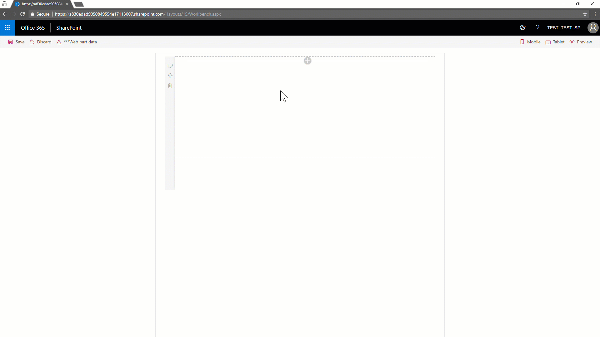
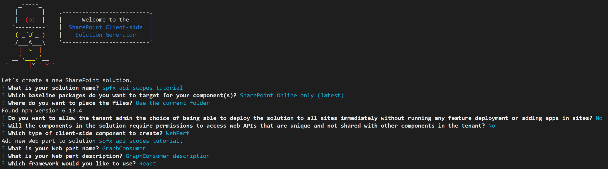
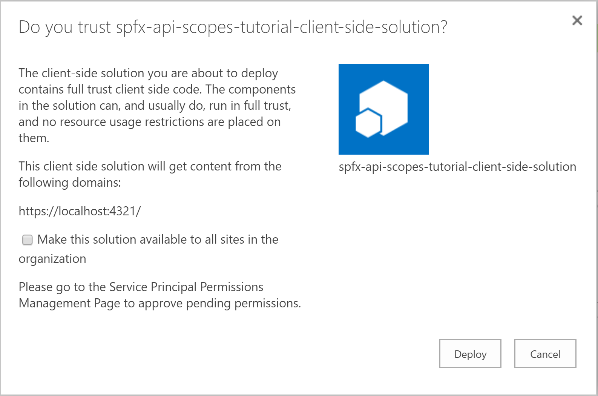
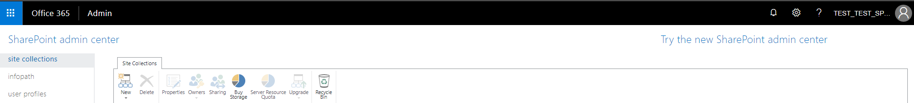
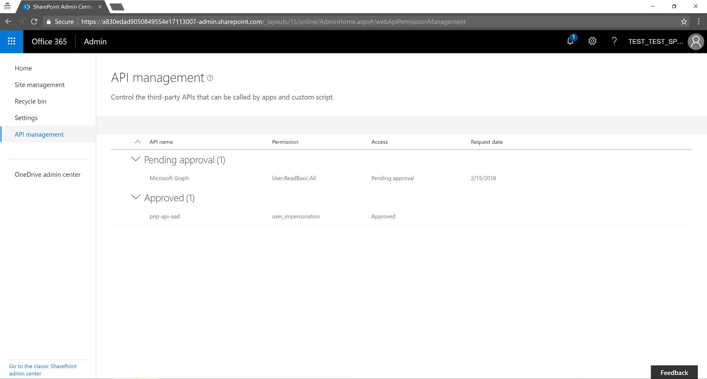
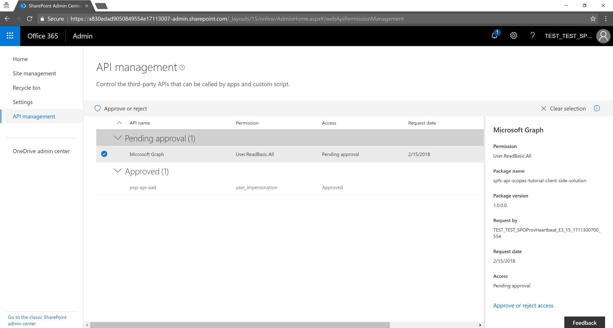
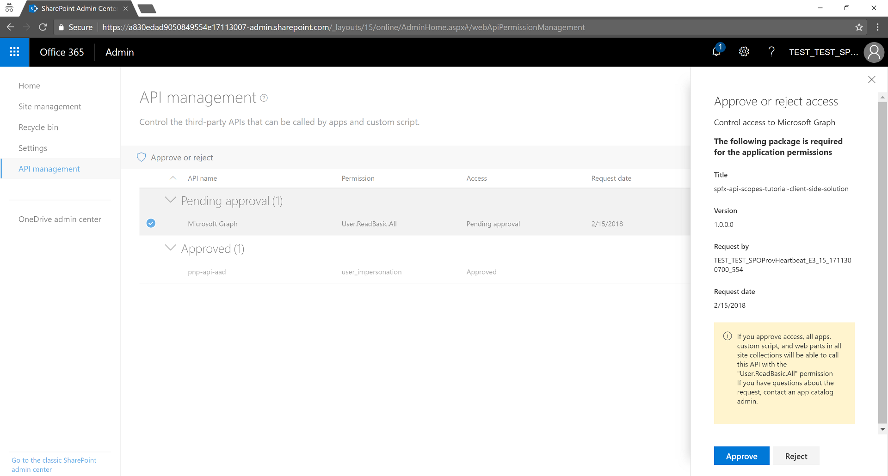

# Tutorial: Consuming APIs secured with Azure Active Directory within SharePoint Framework

A very common business scenario for enterprise-level and real-life solutions is to consume REST API secured with Azure Active Directory (AAD) and Open Authorization (OAuth 2.0) from within a SharePoint Framework solution, whether it is a client-side web part or an extension.
By using SharePoint Framework v.1.4.1 or later, you can leverage a set of out of the box capabilities to easily satisfy that business requirement, being able to consume either the Microsoft Graph, with a custom set of permission scopes, or any other REST API like a custom service registered in AAD.

> [!IMPORTANT]
> You can consume the Microsoft Graph with versions of SharePoint Framework older than v1.4.1, either using the native **graphHttpClient** member of the SharePoint Framework context, or with a manually implemented implicit flow of OAuth by using [ADAL JS](https://github.com/AzureAD/azure-activedirectory-library-for-js). However, the former approach is bound to a pre-defined set of permissions scopes, which allow you to do nothing more that what have been defined by Microsoft, and the latter is a bit complex from a development perspective. Nevertheless, for more information about the latter scenario, you can see the [Connect to API secured with Azure Active Directory](https://docs.microsoft.com/en-us/sharepoint/dev/spfx/web-parts/guidance/connect-to-api-secured-with-aad) article.

Reading this tutorial you will learn - through a step by step approach - how to create a SharePoint Framework solution that consumes the Microsoft Graph, with a custom set of permission scopes.

> [!NOTE]
> To better undestand the overall architecture of this capability, you can read the article [Connect to AAD-secured APIs in SharePoint Framework solutions](use-aadhttpclient.md).

## <a name="SolutionOverview"></a>Overview of the solution
Before digging into the detailed steps of developing the solution, let's have a quick overview of what you are going to build.
In the following screenshot, you can see the UI of a client-side web part that allows to search for users in the current tenant. The search is based on the Microsoft Graph and requires at least the *User.ReadBasic.All* permission.



As you can see, the client-side web part allows to search users based on their name, and provides all the matching users through a **DetailsList** component of Office UI Fabric. Moreover, the web part has a configurable option, available in the property pane, to select how to access the Microsoft Graph. In fact, starting from SharePoint Framework v.1.4.1 you can access the Microsoft Graph either using the native graph client (**MSGraphClient**), or the low level type to access any AAD-secured REST API (**AadHttpClient**).

> [!NOTE]
> You can find the full source code of the sample solution in the following GitHub repository [spfx-api-scopes-tutorial](#).

## <a name="CreatingTheSolution"></a>Creating the solution
In the following sections you will be able to build the solution with a step by step approach. Here are the main sections of the process:

* [Creating the initial solution](#CreatingInitialSolution)
* [Configuring the base web part elements](#ConfiguringBaseElements)
* [Configuring the API permissions requests](#ConfiguringApiPermissions)
* [Consuming the Microsoft Graph](#ConsumingTheGraph)
* [Solution deployment and permissions grant](#DeploymentAndPermissionsGrant)
* [Testing the solution](#SolutionTesting)

If you are already confident creating SharePoint Framework solutions, you can skip the introductory sections and go straight to [Configuring the API permissions requests](#ConfiguringApiPermissions).

### <a name="CreatingInitialSolution"></a>Creating the initial solution
First of all, if you have an old version of the SharePoint Framework generator, you need to update it to version 1.4.1 or newer. In order to do that, you can simply execute the following command:

```sh
npm install -g @microsoft/generator-sharepoint
```

to globally install the most updated version of the package.
Then, you need to create a new SharePoint Framework solution, going through the following steps:

* Create a folder in your file system, where you will store the source code of the solution and move the current path into that folder
* Execute the Yeoman generator to scaffold a new solution
```sh
yo @microsoft/sharepoint
```
* Select the following options
    * Provide a name for the solution (for example *spfx-api-scopes-tutorial*)
    * Target the solution for: *SharePoint Online only (latest)*
    * Use the current folder
    * It is up to you whether you want to globally deploy the solution onto the target tenant or not
    * Select to create a WebPart
    * Call the web part *GraphConsumer*
    * Provide a description
    * Select to use React as the development framework



* Start Visual Studio Code (or whatever else is your favorite code editor) within the context of the current folder
```sh
code .
```

### <a name="ConfiguringBaseElements"></a>Configuring the base web part elements
It's now time to configure the initial elements of the client-side web part.

#### <a name="ConfigureCustomProperties"></a>Configure the custom properties
Create a new source code file under the *src/webparts/graphConsumer/components* folder of the solution.
Call the new file *ClientMode.ts* and use it to declare a TypeScript *enum* with the available options for the "Client Mode" property of the web part.

```TS
export enum ClientMode {
    aad,
    graph,
}
```

Now, open the *GraphConsumerWebPart.ts* file in the *src/webparts/graphConsumer* folder of the solution.
Change the definition of the **IGraphConsumerWebPartProps** interface in order to accept a value of type **ClientMode**.

```TS
export interface IGraphConsumerWebPartProps {
  clientMode: ClientMode;
}
```

Now update the **getPropertyPaneConfiguration()** method of the client-side web part, in order to support the choice selection in the property pane. Here follows the new implementation of the method.

```TS
  protected getPropertyPaneConfiguration(): IPropertyPaneConfiguration {
    return {
      pages: [
        {
          header: {
            description: strings.PropertyPaneDescription
          },
          groups: [
            {
              groupName: strings.BasicGroupName,
              groupFields: [
                PropertyPaneChoiceGroup('clientMode', {
                  label: strings.ClientModeLabel,
                  options: [
                    { key: ClientMode.aad, text: "AadHttpClient"},
                    { key: ClientMode.graph, text: "MSGraphClient"},
                  ]
                }),              
              ]
            }
          ]
        }
      ]
    };
  }
```

Furthermore, you need to update the *render* method of the client-side web part, in order to create a properly configured instance of the React component for rendering. Here follows the update method definition.

```TS
  public render(): void {
    const element: React.ReactElement<IGraphConsumerProps > = React.createElement(
      GraphConsumer,
      {
        clientMode: this.properties.clientMode,
        context: this.context,
      }
    );

    ReactDom.render(element, this.domElement);
  }
```

Last but not least, in order to make the above code to work, you will need to add some *import* statements at the very beggining of the *GraphConsumerWebPart.ts* file. Here follows the update section of imports for that file.

```TS
import * as React from 'react';
import * as ReactDom from 'react-dom';
import { Version } from '@microsoft/sp-core-library';
import {
  BaseClientSideWebPart,
  IPropertyPaneConfiguration,
  PropertyPaneChoiceGroup
} from '@microsoft/sp-webpart-base';

import * as strings from 'GraphConsumerWebPartStrings';
import GraphConsumer from './components/GraphConsumer';
import { IGraphConsumerProps } from './components/IGraphConsumerProps';
import { ClientMode } from './components/ClientMode';
```

Notice the import for the **PropertyPaneChoiceGroup** control, as well as the import of the **ClientMode** enum.

#### <a name="UpdateResourceStrings"></a>Update the resource strings
In order to compile the solution, you will need to update the *mystrings.d.ts* file under the *src/webparts/graphConsumer/loc* folder of the solution. You will need to rewrite the interface defining the resources string with the following code excerpt:

```TS
declare interface IGraphConsumerWebPartStrings {
  PropertyPaneDescription: string;
  BasicGroupName: string;
  ClientModeLabel: string;
  SearchFor: string;
  SearchForValidationErrorMessage: string;
}
```

Now configure proper values for the newly created resource strings, by updating the *en-us.js* file within the same folder.

```TS
define([], function() {
  return {
    "PropertyPaneDescription": "Description",
    "BasicGroupName": "Group Name",
    "ClientModeLabel": "Client Mode",
    "SearchFor": "Search for",
    "SearchForValidationErrorMessage": "Invalid value for 'Search for' field"
  }
});
```

#### <a name="UpdateStyles"></a>Update the style for the client-side web part
As like as you did with the resource strings, you need to slightly update the SCSS style file, too. Thus, open the *GraphConsumer.module.scss* under the *src/webparts/graphConsumer/components* folder of the solution. Add the following style classes, right after the *.title* class:

```SCSS
  .form {
    @include ms-font-l;
    @include ms-fontColor-white;
  }

  label {
    @include ms-fontColor-white;
  }
```

#### <a name="UpdateReactComponent"></a>Update the React component rendering the web part
Now you can update the **GraphConsumer** React component under the *src/webparts/graphConsumer/components* folder of the solution.
First of all, you need to update the *IGraphConsumerProps.ts* file in order to accept the custom properties required by the web part implementation. Here you can see the updated content of the *IGraphConsumerProps.ts* file.

```TS
import { WebPartContext } from '@microsoft/sp-webpart-base';
import { ClientMode } from './ClientMode';

export interface IGraphConsumerProps {
  clientMode: ClientMode;
  context: WebPartContext;
}
```
Notice the import of the **ClientMode** enum definition, as well as the import of the **WebPartContext** type, that will be used later.

Create a new interface to hold the React component state. Create a new file in the *src/webparts/graphConsumer/components* folder and call it *IGraphConsumerState.ts*. Here is the interface definition.

```TS
import { IUserItem } from './IUserItem';

export interface IGraphConsumerState {
    users: Array<IUserItem>;
    searchFor: string;
  }
```

Define the **IUserItem** interface (within a file called *IUserItem.ts* stored in the *src/webparts/graphConsumer/components* folder). That interface is imported in the state file.

```TS
export interface IUserItem {
    displayName: string;
    mail: string;
    userPrincipalName: string;
  }
```

That interface will be used to define the outline of the users retrieved from the current tenant and bound to the DetailsList in the UI.

It's now time to update the *GraphConsumer.tsx* file. First of all, add some import statements to imports the types you defined early.

```TS
import * as React from 'react';
import styles from './GraphConsumer.module.scss';
import * as strings from 'GraphConsumerWebPartStrings';
import { IGraphConsumerProps } from './IGraphConsumerProps';
import { IGraphConsumerState } from './IGraphConsumerState';
import { ClientMode } from './ClientMode';
import { IUserItem } from './IUserItem';
import { escape } from '@microsoft/sp-lodash-subset';

import {
  autobind,
  PrimaryButton,
  TextField,
  Label,
  DetailsList,
  DetailsListLayoutMode,
  CheckboxVisibility,
  SelectionMode
} from 'office-ui-fabric-react';

import { AadHttpClient } from "@microsoft/sp-http";
import { MSGraphClient } from "@microsoft/sp-client-preview";
```

Notice the import for: **IGraphConsumerProps**, **IGraphConsumerState**, **ClientMode**, **IUserItem**. Moreover, there are some imports for the Office UI Fabric components used to render the UI of the React component.

Right after the imports, define the outline of the columns for the **DetailsList** component of Office UI Fabric.

```TS
// Configure the columns for the DetailsList component
let _usersListColumns = [
  {
    key: 'displayName',
    name: 'Display name',
    fieldName: 'displayName',
    minWidth: 50,
    maxWidth: 100,
    isResizable: true
  },
  {
    key: 'mail',
    name: 'Mail',
    fieldName: 'mail',
    minWidth: 50,
    maxWidth: 100,
    isResizable: true
  },
  {
    key: 'userPrincipalName',
    name: 'User Principal Name',
    fieldName: 'userPrincipalName',
    minWidth: 100,
    maxWidth: 200,
    isResizable: true
  },
];
```

The array defined above will be used in the settings of the **DetailsList** component, as you can see in the *render()* method of the React component, which you need to replace with the following code snippet.

```TS
  public render(): React.ReactElement<IGraphConsumerProps> {
    return (
      <div className={ styles.graphConsumer }>
        <div className={ styles.container }>
          <div className={ styles.row }>
            <div className={ styles.column }>
              <span className={ styles.title }>Search for a user!</span>
              <p className={ styles.form }>
                <TextField 
                    label={ strings.SearchFor } 
                    required={ true } 
                    value={ this.state.searchFor }
                    onChanged={ this._onSearchForChanged }
                    onGetErrorMessage={ this._getSearchForErrorMessage }
                  />
              </p>
              <p className={ styles.form }>
                <PrimaryButton 
                    text='Search' 
                    title='Search' 
                    onClick={ this._search } 
                  />
              </p>
              {
                (this.state.users != null && this.state.users.length > 0) ?
                  <p className={ styles.form }>
                  <DetailsList
                      items={ this.state.users }
                      columns={ _usersListColumns }
                      setKey='set'
                      checkboxVisibility={ CheckboxVisibility.hidden }
                      selectionMode={ SelectionMode.none }
                      layoutMode={ DetailsListLayoutMode.fixedColumns }
                      compact={ true }
                  />
                </p>
                : null
              }
            </div>
          </div>
        </div>
      </div>
    );
  }
```

Moreover, update the React component type declaration and add a constructor, by miming the following code excerpt.

```TS
export default class GraphConsumer extends React.Component<IGraphConsumerProps, IGraphConsumerState> {

  constructor(props: IGraphConsumerProps, state: IGraphConsumerState) {
    super(props);
    
    // Initialize the state of the component
    this.state = {
      users: [],
      searchFor: ""
    };
  }

```

There are some validation rules and handling events for the **TextField** component to collect the search criteria. Here are the methods implementations.

```TS
  @autobind
  private _onSearchForChanged(newValue: string): void {

    // Update the component state accordingly to the current user's input
    this.setState({
      searchFor: newValue,
    });
  }

  private _getSearchForErrorMessage(value: string): string {
    // The search for text cannot contain spaces
    return (value == null || value.length == 0 || value.indexOf(" ") < 0)
      ? ''
      : `${strings.SearchForValidationErrorMessage}`;
  }
```

The **PrimaryButton** fires a *_search()* function, which determines what client technology to use in order to consume the Microsoft Graph.

```TS
  @autobind
  private _search(): void {

    console.log(this.props.clientMode);

    // Based on the clientMode value search users
    switch (this.props.clientMode)
    {
      case ClientMode.aad:
        this._searchWithAad();
        break;
      case ClientMode.graph:
      this._searchWithGraph();
      break;
    }
  }
```

Lastly, as you can see, the **DetailsList** component instance is rendered in the *render()* method just in case there are items in the *users* property of the component's state.

### <a name="ConfiguringApiPermissions"></a>Configuring the API permissions requests

In order to being able to consume the Microsoft Graph, as well as any other third party REST API, you will need to explicitly declare in the manifest of your solution what are the permission requirements from an OAuth perspective.

In SharePoint Framework v.1.4.1 or later you can do that by configuring the *webApiPermissionRequests* property in the *package-solution.json* under the *config* folder of the solution. Here you can see a sample excerpt of that file for the current solution. You will simply need to copy the declaration of the *webApiPermissionRequests* property.

```JSON
{
  "$schema": "https://dev.office.com/json-schemas/spfx-build/package-solution.schema.json",
  "solution": {
    "name": "spfx-api-scopes-tutorial-client-side-solution",
    "id": "841cd609-d821-468d-a6e4-2d207b966cd8",
    "version": "1.0.0.0",
    "includeClientSideAssets": true,
    "skipFeatureDeployment": true,
    "webApiPermissionRequests": [
      {
        "resource": "Microsoft Graph",
        "scope": "User.ReadBasic.All"
      }
    ]
  },
  "paths": {
    "zippedPackage": "solution/spfx-api-scopes-tutorial.sppkg"
  }
}
```

Notice the *webApiPermissionRequests*, which is an array of *webApiPermissionRequest* items. Each item defines the *resource* and the *scope* of the permission request.
The *resource* can be the name or the ObjectId (in AAD) of the resource for which you want to configure the permission request. For the Microsoft Graph the name is "Microsoft Graph", while the ObjectId is not unique and varies on a per tenant basis.
The *scope* can be the name of the permission scope, or the unique ID of that permission scope. The former can be retrieved reading the documentation of the target API, while the latter can be retrieved reading the manifest file of the target API.

> [!NOTE]
> For the Microsoft Graph you can find all the available permission scopes in the [Microsoft Graph permissions reference](https://developer.microsoft.com/en-us/graph/docs/concepts/permissions_reference) document. By default, the service principal has no explicit permissions granted to access the Microsoft Graph. If you would however request an access token for the Microsoft Graph, you would get a token with the `user_impersonation` permission scope, that can be used for reading information about the users (i.e. `User.Read.All`). Additional permission scopes can be requested by developers and granted by tenant administrators. For more information see the guidance [article on using the AadHttpClient](use-aadhttpclient.md).


In order to search for users and to retrieve their *displayName*, *mail*, and *userPrincipalName* the *User.ReadBasic.All* permission will suffice.

Later you will package and deploy the solution, and you (or an admin) will have to grant the requested permissions to your solution, as you will learn in the section [Solution deployment and permissions grant](#DeploymentAndPermissionsGrant)

### <a name="ConsumingTheGraph"></a>Consuming the Microsoft Graph
You can now implement the methods to consume the Microsoft Graph. As you saw reading the [Overview of the solution](#SolutionOverview) you have two options to consume the Microsoft Graph:
* Using the **AadHttpClient** client object
* Using the **MSGraphClient** client object

The former is a client object useful to consume whatever REST API. Thus you can use it to consume the Microsoft Graph, as well as any other third party (or first party) REST API.
The latter is a client object that can consume the Microsoft Graph only. Internally it uses the **AadHttpClient** client object and supports the fluent syntax of the Microsoft Graph SDK.

#### <a name="AadHttpClient"></a>Using AadHttpClient
In order to consume any REST API using the **AadHttpClient** client object, you simply need to create a new instance of the **AadHttpClient** type, providing the *serviceScope* of the current context, and the URI of the target service.
The object created will provide you methods to make the following:
* *get*: makes an HTTP GET request
* *post*: makes an HTTP POST request
* *fetch*: makes any other kind of HTTP request, based on the *HttpClientConfiguration* and *IHttpClientOptions* arguments provided.

All these methods support the asynchronous development model of JavaScript/TypeScript and so you can handle their result with promises.

Here you can see a code excerpt of the *_searchWithAad()* method of the current sample solution.

```TS
  private _searchWithAad(): void {

    // Log the current operation
    console.log("Using _searchWithAad() method");

    // Using Graph here, but any 1st or 3rd party REST API that requires Azure AD auth can be used here.
    const aadClient: AadHttpClient = new AadHttpClient(
      this.props.context.serviceScope,
      "https://graph.microsoft.com"
    );

    // Search for the users with givenName, surname, or displayName equal to the searchFor value
    aadClient
      .get(
        `https://graph.microsoft.com/v1.0/users?$select=displayName,mail,userPrincipalName&$filter=(givenName%20eq%20'${escape(this.state.searchFor)}')%20or%20(surname%20eq%20'${escape(this.state.searchFor)}')%20or%20(displayName%20eq%20'${escape(this.state.searchFor)}')`,
        AadHttpClient.configurations.v1
      )
      .then(response => {
        return response.json();
      })
      .then(json => {

        // Prepare the output array
        var users: Array<IUserItem> = new Array<IUserItem>();

        // Log the result in the console for testing purposes
        console.log(json);

        // Map the JSON response to the output array
        json.value.map((item: any) => {
          users.push( { 
            displayName: item.displayName,
            mail: item.mail,
            userPrincipalName: item.userPrincipalName,
          });
        });

        // Update the component state accordingly to the result
        this.setState(
          {
            users: users,
          }
        );
      })
      .catch(error => {
        console.error(error);
      });
  }
```

As you can see, the *get()* method gets the URL of the OData request as the input argument, and in case of successful request will return a JSON object with the response.

#### <a name="MSGraphClient"></a>Using MSGraphClient
If you are targeting the Microsoft Graph, you can use the **MSGraphClient** client object, which provides you a more fluent syntax.
In the following code excerpt you can see the actual implementation of the *_searchWithGraph()* method of the current sample solution.

```TS
  private _searchWithGraph(): void {

    // Log the current operation
    console.log("Using _searchWithGraph() method");

    const graphClient: MSGraphClient = this.props.context.serviceScope.consume(
      MSGraphClient.serviceKey
    );

    // From https://github.com/microsoftgraph/msgraph-sdk-javascript sample
    graphClient
      .api("users")
      .version("v1.0")
      .select("displayName,mail,userPrincipalName")
      .filter(`(givenName eq '${escape(this.state.searchFor)}') or (surname eq '${escape(this.state.searchFor)}') or (displayName eq '${escape(this.state.searchFor)}')`)
      .get((err, res) => {  

        if (err) {
          console.error(err);
          return;
        }

        // Prepare the output array
        var users: Array<IUserItem> = new Array<IUserItem>();

        // Map the JSON response to the output array
        res.value.map((item: any) => {
          users.push( { 
            displayName: item.displayName,
            mail: item.mail,
            userPrincipalName: item.userPrincipalName,
          });
        });

        // Update the component state accordingly to the result
        this.setState(
          {
            users: users,
          }
        );
      });
  }
```

You create an instance of the **MSGraphClient** type by providing its service key to the *consume()* method of the current context's *serviceScope*.
Then, you simply use the fluent API of the Graph SDK to define the OData query that will be executed against the target Microsoft Graph endpoint.
The result will still be a JSON response that you will have to decode and map to the typed result.

> [!NOTE]
> You can even use a fully typed approach leveraging the [Microsoft Graph TypeScript types](https://github.com/microsoftgraph/msgraph-typescript-typings).

### <a name="DeploymentAndPermissionsGrant"></a>Solution deployment and permissions grant
You are now ready to build, bundle, package, and deploy the solution.
Run the gulp commands to accomplish this tasks.

```sh
gulp build
```

Just to see if the solution build properly.

```sh
gulp bundle
gulp package-solution
```

To bundle and package the solution.
Now, browse to the App Catalog of your target tenant and upload the solution package in there. You can find the solution package under the *sharepoint/solution* folder of your solution. It is the .sppkg file.
Once you upload the solution package, the App Catalog will prompt you with a dialog like the following one.



As you can see, there is a message in the lower area of the screen that informs you that the solution package requires permissions approval. That's because of the webApiPermissionRequests property in the *package-solution.json* file.

Open the SharePoint Admin Center of your tenant, and select to "Try the new SharePoint admin center", in the upper right corner of the screen.



In the new Admin Center select the *WebApiPermission management" menu item, in the left quick launch menu. You will see a page like the following one.



> [!NOTE]
> The asterisks in the UI of the new Admin Center imply that the functionalities are still under preview.

Using this page you (or any other admin of your SPO tenant) can Approve or Deny any pending permission request. Notice that here you don't see which solution package is requesting which permission, because the permissions are defined at tenant level and for a unique application. 

> [!NOTE]
> For further details about how the tenant-level permission scopes work internally, you can read the articles highlighted in the [See also](#SeeAlso) section.

Select the permission that you requested in the *package-solution.json* file of your solution, click on "Approve or reject access" and click "Approve", through the right-side panel that you see in the following screenshot.



You can also select thhe pending approval permission item, and click on the "Approve or reject" button in the toolbar.



And you are now ready to go!

### <a name="SolutionTesting"></a>Testing the solution
Run your solution by using the following gulp command:

```sh
gulp serve --nobrowser
```

Open the browser and browse to the SharePoint Framework Workbench page, which can be found at the following URL:

```TXT
https://<your-tenant>.sharepoint.com/_layouts/15/Workbench.aspx
```

Add the *GraphConsumer* client-side web part, configure the *Client Mode* and search for users.
The first request you will make, you will see a pop-up window popping out and then disappearing. That's the logon window used by ADAL JS, which is internally used by the SharePoint Framework to retrieve the Access Token from AAD using and OAuth implicit flow.


And that's it! Enjoy this capability building real-life enterprise-level solutions that levarage AAD-secured REST API.

<a name="SeeAlso"></a>

## See also
* [Connect to Azure AD-secured APIs in SharePoint Framework solutions](use-aadhttpclient.md)
* [Use the MSGraphClient to connect to Microsoft Graph](use-msgraph.md)
