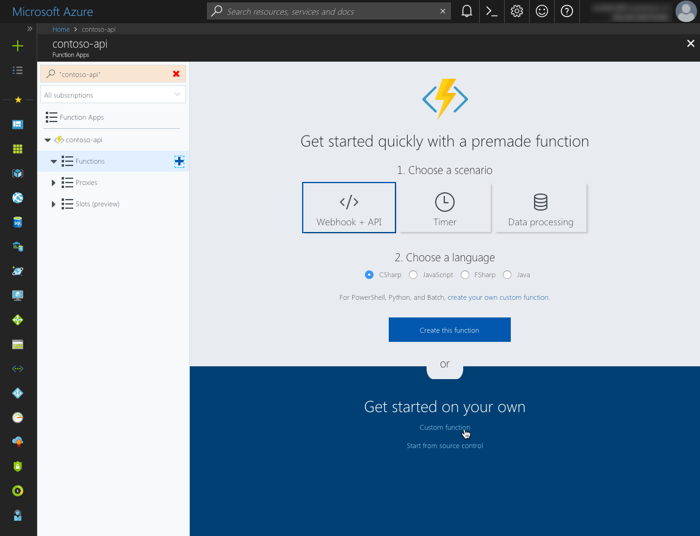
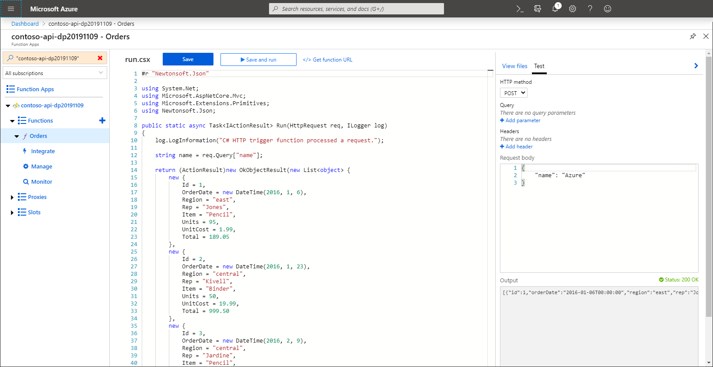
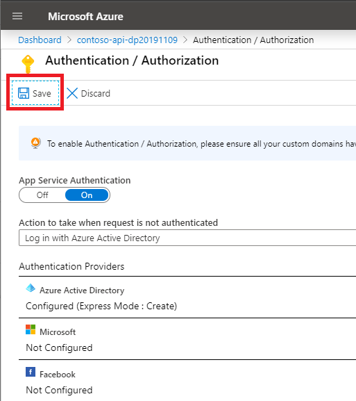
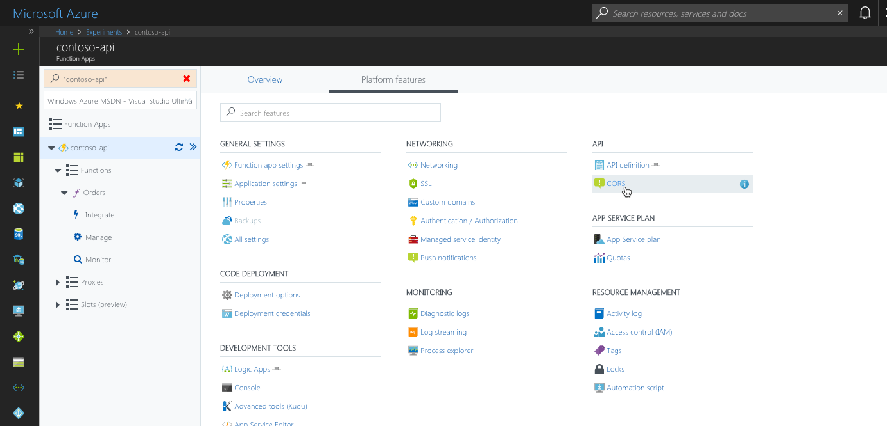

# Consume enterprise APIs secured with Azure AD in SharePoint Framework

> [!IMPORTANT]
> The `AadHttpClient` class is currently in preview and is subject to change. Do not use it in a production environment. Also note that the `webApiPermissionRequests` properties in `package-solution.json` are not supported in production tenants.

This article illustrates how you would connect to an enterprise API secured with Azure Active Directory from a SharePoint Framework solution. It covers both creating and securing the API as well building the SharePoint Framework solution.

## Create enterprise API secured with Azure AD

Start with creating an enterprise API secured with Azure Active Directory. While there are no restrictions how the API should be implemented from the SharePoint Framework point of view, in this tutorial, you will build the API using Azure Functions and secure it using Azure App Service Authentication.

> While your organization most likely already has specific APIs exposing their applications, this section is meant to give you a complete overview of the implementation and configuration steps.

### Create Azure function

In the Azure Portal (https://portal.azure.com), create a new Function App.

> For more information on creating Function Apps in Azure see the [Create a function app from the Azure portal](https://docs.microsoft.com/en-us/azure/azure-functions/functions-create-function-app-portal) help article.

In the Function App, create new HTTP-triggered function. In this example, you will build it using C#, but there is no restriction with regards to which programming language you can use.

In the Function App, choose the **Create new** button.


Next, choose on the **Custom function** link, to create a custom HTTP-triggered function.



From the list of available function types, choose **HTTP trigger**.


In the settings of the function, choose **C#** as the language, specify the function name and set the **Authorization level** to **Anonymous**.


Azure functions can be secured in a number of ways. Because you want to secure the function using Azure AD, rather than securing the function itself, you will secure the underlying Function App. This is why, at this stage, you set not to secure the function itself. Authentication settings applied to the Function App, apply to all functions inside that app.

To confirm your settings and create the function, choose the **Create** button.

Once the function is created, replace its contents with the following snippet:

```cs
using System.Net;

public static async Task<HttpResponseMessage> Run(HttpRequestMessage req, TraceWriter log)
{
    log.Info("C# HTTP trigger function processed a request.");

    return req.CreateResponse(HttpStatusCode.OK, new List<object> {
        new {
            Id = 1,
            OrderDate = new DateTime(2016, 1, 6),
            Region = "east",
            Rep = "Jones",
            Item = "Pencil",
            Units = 95,
            UnitCost = 1.99,
            Total = 189.05
        },
        new {
            Id = 2,
            OrderDate = new DateTime(2016, 1, 23),
            Region = "central",
            Rep = "Kivell",
            Item = "Binder",
            Units = 50,
            UnitCost = 19.99,
            Total = 999.50
        },
        new {
            Id = 3,
            OrderDate = new DateTime(2016, 2, 9),
            Region = "central",
            Rep = "Jardine",
            Item = "Pencil",
            Units = 36,
            UnitCost = 4.99,
            Total = 179.64
        },
        new {
            Id = 4,
            OrderDate = new DateTime(2016, 2, 26),
            Region = "central",
            Rep = "Gill",
            Item = "Pen",
            Units = 27,
            UnitCost = 19.99,
            Total = 539.73
        },
        new {
            Id = 5,
            OrderDate = new DateTime(2016, 3, 15),
            Region = "west",
            Rep = "Sorvino",
            Item = "Pencil",
            Units = 56,
            UnitCost = 2.99,
            Total = 167.44
        }
    });
}
```

Verify, that the function is working correctly, by chooseing the **Save and run** button.



If the function executed correctly, you should see a *Status: 200 OK* label and the list orders displayed in the test pane.

### Secure Azure function

Now that the Azure function is working, the next step is for you to secure it with Azure Active Directory so that in order to access it, you need to sign in with your organizational account.

On the Function App blade, from the side panel, select the function app.


In the top section, switch to the **Platform features** tab.


Next, from the **Networking** group, select the **Authentication / Authorization** link.


On the **Authentication / Authorization** blade, enable App Service Authentication by switching the **App Service Authentication** toggle button to **On**.


In the **Action to take when request not authenticated** drop down, change the value to *Login with Azure Active Directory*.


This setting ensures that anonymous requests to the API are not allowed.

Next, in the list of authentication providers select **Azure Active Directory**.


On the **Azure Active Directory Settings** blade, for the first **Management mode** option, choose *Express*. For the second **Management mode** option, choose *Create new AD App*.


> [!IMPORTANT]
> Before you continue, note the value in the **Create App** field. This value represents the name of the Azure AD application that you will use to secure the API, and which you will need later, to request permissions to access the API from the SharePoint Framework project.

Confirm your selection, by chooseing the **OK** button.

Update Function App authentication and authorization settings, by chooseing the **Save** button.



Confirm, that the API is correctly secured, by opening a new browser window in private mode and navigating to the API. If the authentication settings have been applied correctly, you should be redirected to the Azure AD login page.


### Get Azure AD application ID

To be able to request an access token to connect to the API, you will need the application ID of the Azure AD application used to secure that API.

In the Function App, navigate to the **Authentication** settings.


From the list of authentication providers, select **Azure Active Directory**.


On the **Azure Active Directory Settings** blade, choose the **Manage Application** button.


On the Azure AD application blade, copy the value of the **Application ID** property.


### Enable CORS

The Function App will be called from JavaScript running on a SharePoint page. Because the API is hosted on a different domain than the SharePoint portal, cross-domain security constraints will apply to the API call. By default, APIs implemented using Azure Function Apps cannot be called from other domains. You can change it, by adjusting the Function App's CORS settings.

In the Function App, switch to the **Platform features** tab.

From the **API** group, select the **CORS** link.



To the list of allowed origins, add the URL of your SharePoint tenant, eg. `https://contoso.sharepoint.com`.


Confirm your changes using the **Save** button.

## Consume enterprise API secured with Azure AD from the SharePoint Framework

With the API configured and working, the next step is to build the SharePoint Framework solution that will consume this API.

> Before you proceed, ensure that you have installed version 1.4.1 or higher of the SharePoint Framework Yeoman generator. If you have installed the generator globally, you can check the installed version by executing in the command line: `npm ls -g --depth=0`.

### Create new SharePoint Framework project

Start with creating a new SharePoint Framework project. In the command line create new folder for your project:

```sh
md contoso-api
```

Change the working directory by executing in the command line:

```sh
cd contoso-api
```

To create new project, execute the SharePoint Framework Yeoman generator:

```sh
yo @microsoft/sharepoint
```

When prompted, use the following values:

- **contoso-api** as the solution name
- **SharePoint Online only (latest)** as the baseline packages
- **Use the current folder** as the location to place files
- **Y** as the choice for enabling tenant-wide deployment
- **WebPart** as the type of component to create
- **Orders** as the name of the web part to create
- **Shows recent orders** as the web part description
- **No JavaScript framework** as the framework to use


After the project is created, open it in the code editor. In this tutorial you will use Visual Studio Code.


### Request permissions to the enterprise API

By default, SharePoint Framework has no access to enterprise APIs, even though they are registered in the same Azure Active Directory as Office 365. This is by design and allows organizations to consciously choose which APIs should be exposed to scripts and client-side solutions deployed to SharePoint. To get access to your enterprise APIs, you need to issue a permission request from the SharePoint Framework project that you're building.

In the code editor, open the **config/package-solution.json** file.


To the **solution** property, add a new section named `webApiPermissionRequests` with a reference to the Azure AD application used to secure your API:

```json
{
  "$schema": "https://dev.office.com/json-schemas/spfx-build/package-solution.schema.json",
  "solution": {
    "name": "contoso-api-client-side-solution",
    "id": "8cbc01fb-bab6-48fc-afec-2c2053759771",
    "version": "1.0.0.0",
    "includeClientSideAssets": true,
    "skipFeatureDeployment": true,
    "webApiPermissionRequests": [
      {
        "resource": "contoso-api",
        "scope": "user_impersonation"
      }
    ]
  },
  "paths": {
    "zippedPackage": "solution/contoso-api.sppkg"
  }
}
```

The value of the **resource** property refers to either the name or the ID of the Azure AD application used to secure the API. Using the name is more readable and easier to maintain over time. The value of the **scope** property specifies the permission scope that your solution needs in order to communicate with the API. In this tutorial, Azure AD is used only to secure the API, so `user_impersonation` is the scope that you will use.

> [!NOTE]
> If you want to connect to an enterprise API that has been created previously, contact your administrator to provide you with details for the Azure AD application used to secure it. You will need information such as the application ID, permissions the application exposes and the audience it's configured to.

### Connect to the enterprise API

The last part left is to implement the actual connection to the enterprise API.

In the code editor, open the **src\webparts\orders\OrdersWebPart.ts** file.


In the top section of the file, reference the **AadHttpClient** and **HttpClientResponse** classes, by adding the following code snippet:

```ts
import { AadHttpClient, HttpClientResponse } from '@microsoft/sp-http';
```

To the **OrdersWebPart** class, add a new class variable named `ordersClient`:

```ts
export default class OrdersWebPart extends BaseClientSideWebPart<IOrdersWebPartProps> {
  private ordersClient: AadHttpClient;

  // shortened for brevity
}
```

Next, in the **OrdersWebPart** class, override the **onInit** method to create an instance of the AadHttpClient:

```ts
export default class OrdersWebPart extends BaseClientSideWebPart<IOrdersWebPartProps> {
  private ordersClient: AadHttpClient;

  protected onInit(): Promise<void> {
    this.ordersClient = new AadHttpClient(this.context.serviceScope, '594e83da-9618-438f-a40a-4a977c03bc16');

    return Promise.resolve();
  }

  // shortened for brevity
}
```

The GUID passed as the second parameter of the **AadHttpClient** constructor, is the application ID of the Azure AD application used to secure the enterprise API.

Finally, extend the **render** method to load and display orders retrieved from the enterprise API:

```ts
export default class OrdersWebPart extends BaseClientSideWebPart<IOrdersWebPartProps> {
  private ordersClient: AadHttpClient;

  protected onInit(): Promise<void> {
    this.ordersClient = new AadHttpClient(this.context.serviceScope, '594e83da-9618-438f-a40a-4a977c03bc16');

    return Promise.resolve();
  }

  public render(): void {
    this.context.statusRenderer.displayLoadingIndicator(this.domElement, 'orders');

    this.ordersClient
      .get('https://contoso-apis.azurewebsites.net/api/Orders', AadHttpClient.configurations.v1)
      .then((res: HttpClientResponse): Promise<any> => {
        return res.json();
      })
      .then((orders: any): void => {
        this.context.statusRenderer.clearLoadingIndicator(this.domElement);
        this.domElement.innerHTML = `
          <div class="${ styles.orders}">
            <div class="${ styles.container}">
              <div class="${ styles.row}">
                <div class="${ styles.column}">
                  <span class="${ styles.title}">Orders</span>
                  <p class="${ styles.description}">
                    <ul>
                      ${orders.map(o => `<li>${o.Rep} $${o.Total}</li>`).join('')}
                    </ul>
                  </p>
                  <a href="https://aka.ms/spfx" class="${ styles.button}">
                    <span class="${ styles.label}">Learn more</span>
                  </a>
                </div>
              </div>
            </div>
          </div>`;
      }, (err: any): void => {
        this.context.statusRenderer.renderError(this.domElement, err);
      });
  }

  // shortened for brevity
}
```

### Deploy the solution to SharePoint app catalog

After completing the implementation of the SharePoint Framework solution, the next step is to deploy it to SharePoint.

First, build and package the project, by executing in the command line:

```sh
gulp bundle --ship && gulp package-solution --ship
```

Next, in the explorer, open the project folder and navigate to the **sharepoint/solution** folder.


In your web browser, navigate to the tenant app catalog in your Office 365 tenant.


Add the newly generated .sppkg file by dragging and dropping it from explorer to the tenant app catalog.


When prompted, select the **Make this solution available to all sites in the organization** checkbox. Also, take note of the remark, that you should go to the **Service Principal Permissions Management Page** to approve pending permission requests. Confirm the deployment by chooseing the **Deploy** button.


### Grant access to the enterprise API

In the web browser, navigate to the tenant admin site by choosing from the Office 365 app launcher, the **Admin** option.


In the menu, from the **Admin centers** group, choose **SharePoint**.


In the SharePoint admin center, navigating to the new SharePoint admin center preview using the **Try the new SharePoint admin center preview** link.


In the new admin center, from the menu, choose the **API management** option.


On the API management page, in the **Pending approval** group, select the newly added permission request to access the **contoso-api** API.


Next, from the toolbar, select the **Approve or reject** option.


In the side panel, grant the access to the API by chooseing the **Approve** button.


### Add the Orders web part to the page

To verify that everything is working as expected, add the previously created Orders web part to the page.

In the web browser, navigate to a site in your tenant. From the toolbar, select the **Edit** option.


In the canvas, select a section to add the web part to.


Select the **+** option to open the toolbox. In the search box type `Orders` to quickly find the **Orders** web part.


Select the **Orders** web part to add it to the page. You should see the list of orders retrieved from the enterprise API.

