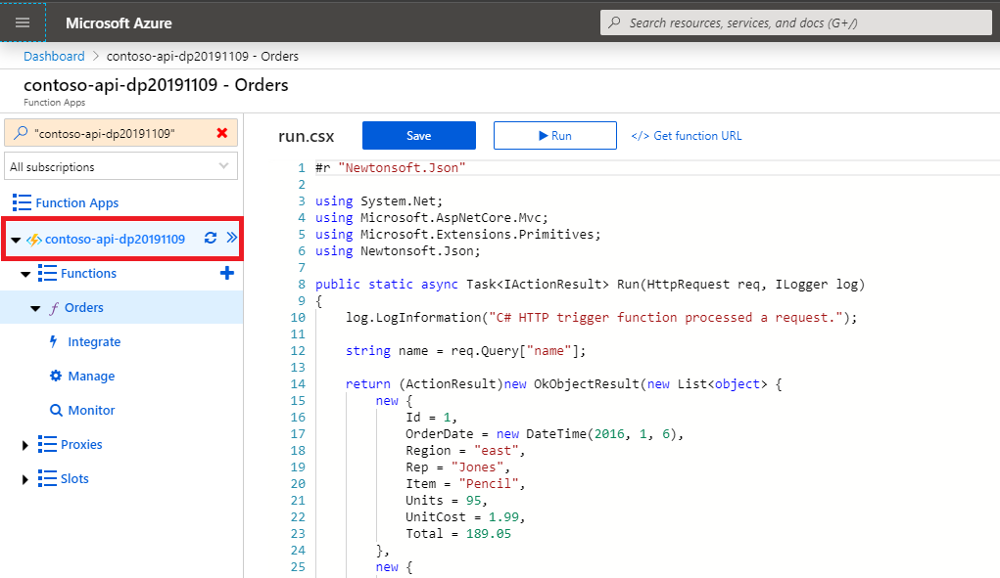
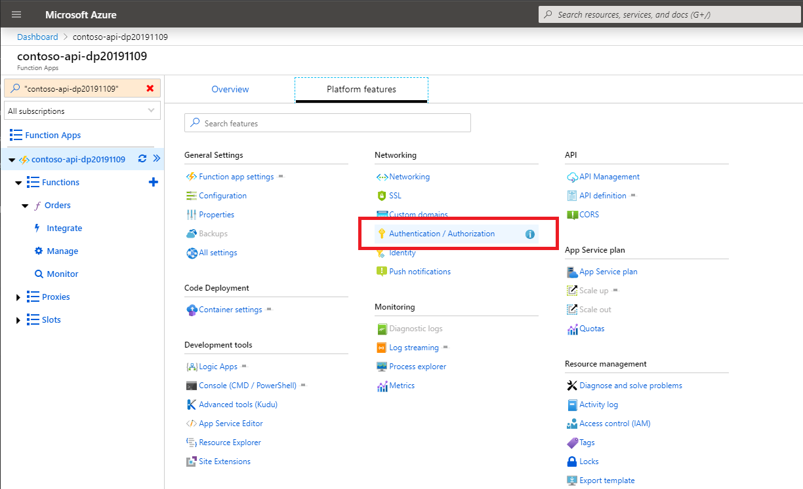
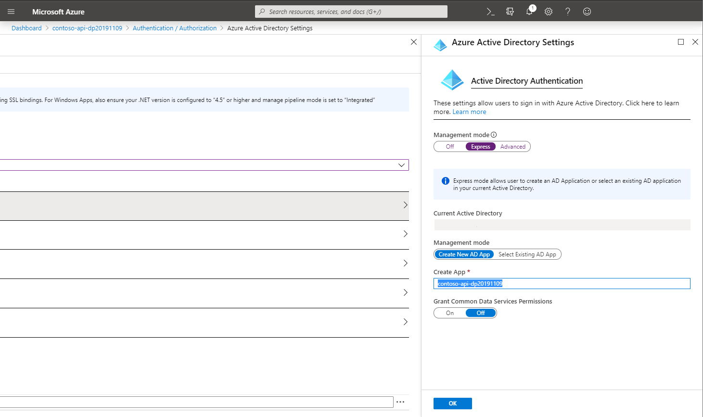
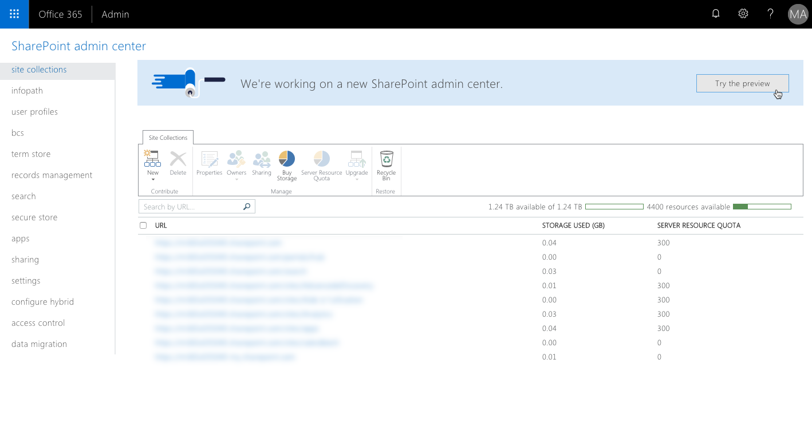

# Consume enterprise APIs secured with Azure AD in SharePoint Framework

This article illustrates how you would connect to an enterprise API secured with Azure Active Directory from a SharePoint Framework solution. It covers both creating and securing the API as well as building the SharePoint Framework solution.

## Create an enterprise API secured with Azure AD

Start with creating an enterprise API secured with Azure Active Directory. While there are no restrictions on how the API should be implemented from the SharePoint Framework point of view, in this tutorial, you'll build the API using Azure Functions and secure it using Azure App Service Authentication.

> While your organization most likely already has specific APIs exposing their applications, this section is meant to give you a complete overview of the implementation and configuration steps.

### Create an Azure Function

In the [Azure portal](https://portal.azure.com/), create a new Function App.

> For more information on creating Function Apps in Azure, see the [Create a function app from the Azure portal](https://docs.microsoft.com/azure/azure-functions/functions-create-function-app-portal) help article.

In the Function App, you'll create a new HTTP-triggered function. In this example, you'll build the function using C#, but, in general, there is no restriction on which programming language you must use.

In the Function App, press the **New Function** button:


From the list of templates, choose **HTTP trigger**:


In the New Function panel, specify the function name, set the **Authorization level** to **Anonymous**, and click the **Create** button:


>Azure Functions can be secured in a number of ways. Because you want to secure the function using Azure AD, rather than securing the function itself, you'll secure the underlying Function App. This is why, at this stage, you chose not to secure the function itself. Authentication settings applied to the Function App, apply to all functions inside that app.

Once the function is created, replace its contents with the following snippet:

```cs
#r "Newtonsoft.Json"

using System.Net;
using Microsoft.AspNetCore.Mvc;
using Microsoft.Extensions.Primitives;
using Newtonsoft.Json;

public static async Task<IActionResult> Run(HttpRequest req, ILogger log)
{
    log.LogInformation("C# HTTP trigger function processed a request.");

    return (ActionResult)new OkObjectResult(new List<object> {
        new {
            Id = 1,
            OrderDate = new DateTime(2016, 1, 6),
            Region = "east",
            Rep = "Jones",
            Item = "Pencil",
            Units = 95,
            UnitCost = 1.99,
            Total = 189.05
        },
        new {
            Id = 2,
            OrderDate = new DateTime(2016, 1, 23),
            Region = "central",
            Rep = "Kivell",
            Item = "Binder",
            Units = 50,
            UnitCost = 19.99,
            Total = 999.50
        },
        new {
            Id = 3,
            OrderDate = new DateTime(2016, 2, 9),
            Region = "central",
            Rep = "Jardine",
            Item = "Pencil",
            Units = 36,
            UnitCost = 4.99,
            Total = 179.64
        },
        new {
            Id = 4,
            OrderDate = new DateTime(2016, 2, 26),
            Region = "central",
            Rep = "Gill",
            Item = "Pen",
            Units = 27,
            UnitCost = 19.99,
            Total = 539.73
        },
        new {
            Id = 5,
            OrderDate = new DateTime(2016, 3, 15),
            Region = "west",
            Rep = "Sorvino",
            Item = "Pencil",
            Units = 56,
            UnitCost = 2.99,
            Total = 167.44
        }
    });
}
```

Verify that the function is working correctly, by pressing the **Save and run** button:


If the function executed correctly, you'll see a *Status: 200 OK* label and the list orders displayed in the test pane.

### Secure the Azure Function

Now that the Azure Function is working, the next step is to secure it with Azure Active Directory so that you'll need to sign in with your organizational account to access it.

On the Function App blade in the side panel select the function app:



In the top section, switch to the **Platform features** tab:


Next, from the **Networking** group, select the **Authentication / Authorization** link:



On the **Authentication / Authorization** blade, enable App Service Authentication by switching the **App Service Authentication** toggle button to **On**:


In the **Action to take when request not authenticated** drop-down, change the value to *Login with Azure Active Directory*. This setting ensures that anonymous requests to the API are not allowed:


Next, in the list of authentication providers, select **Azure Active Directory**:


In the **Azure Active Directory Settings** blade, set the **Management mode** option to *Express*. Set the second **Management mode** option to *Create new AD App*:



> [!IMPORTANT]
> Before you continue, note the value in the **Create App** field. This value represents the name of the Azure AD application that you'll use to secure the API, and which you'll need later to request permissions to access the API from the SharePoint Framework project.

Confirm your selection by pressing the **OK** button.

Back in the **Authentication / Authorization** blade, update the Function App's authentication and authorization settings by pressing the **Save** button:


Confirm that the API is correctly secured by opening a new browser window in private mode and navigating to the API. The URL for your Function App can be found in the **Overview** section of the Function App blade. If the authentication settings have been applied correctly, you should be redirected to the Azure AD login page:


### Get an Azure AD application ID

To request an access token to connect to the API, you'll need the application ID of the Azure AD application used to secure that API.

In the Function App, navigate to the **Authentication** settings. If the **Authentication** link isn't available under the **Configured features** header, press the **Refresh** button next to the Function App in the left panel:


From the list of authentication providers, select **Azure Active Directory**:


On the **Azure Active Directory Settings** blade, press the **Manage Application** button:


On the Azure AD application blade, copy the value of the **Application ID** property:


### Enable CORS

The Function App will be called from JavaScript running on a SharePoint page. Because the API is hosted on a different domain than the SharePoint portal, cross-domain security constraints will apply to the API call. By default, APIs implemented using Azure Function Apps cannot be called from other domains. You can change this by adjusting the Function App's CORS settings.

> [!IMPORTANT]
> If you're authenticating with the API using the SharePoint Online cookie instead of OAuth, you cannot configure CORS settings through the Azure portal. For the authentication to work, you have to clear all CORS settings in the Azure portal and specify them in your API instead.

In the Function App, switch to the **Platform features** tab.

From the **API** group, select the **CORS** link:


In the list of allowed origins, add the URL of your SharePoint tenant, for example, `https://contoso.sharepoint.com`:


Confirm your changes by pressing the **Save** button.

## Consume the enterprise API secured with Azure AD from the SharePoint Framework

With the API configured and working, the next step is to build the SharePoint Framework solution that will consume the API.

> Before you proceed, ensure that you have installed version 1.4.1 or higher of the SharePoint Framework Yeoman generator. If you have installed the generator globally, you can check the installed version by executing in the command line: `npm ls -g --depth=0`.

### Create a new SharePoint Framework project

Next, you'll create a new SharePoint Framework project to consume the API.

In the command line create a new folder for your project:

```console
md contoso-api
```

Change the working directory:

```console
cd contoso-api
```

To create a new project, launch the SharePoint Framework Yeoman generator:

```console
yo @microsoft/sharepoint
```

When prompted, use the following values:

- **What is your solution name?** contoso-api
- **Which baseline packages do you want to target for your component(s)?** SharePoint Online only (latest)
- **Where do you want to place the files?** Use the current folder
- **Do you want to allow the tenant admin the choice of being able to deploy the solution to all sites immediately without running any feature deployment or adding apps in sites?** Yes
- **Will the components in the solution require permissions to access web APIs that are unique and not shared with other components in the tenant?** No
- **Which type of client-side component to create?** WebPart
- **What is your Web part name?** Orders
- **What is your Web part description?** Show recent orders
- **Which framework would you like to use?** No JavaScript framework

After the project is created, open it in a code editor. In this tutorial, you'll use Visual Studio Code:


### Request permissions to the enterprise API

By default, SharePoint Framework has no access to enterprise APIs even though they're registered in the same Azure Active Directory as Office 365. This is by design and allows organizations to consciously choose which APIs should be exposed to scripts and client-side solutions deployed to SharePoint. To get access to your enterprise APIs, you need to issue a permission request from the SharePoint Framework project that you're building.

In the code editor, open the **config/package-solution.json** file:


In the `solution` property, add a new property named `webApiPermissionRequests` with a reference to the Azure AD application used to secure your API:

```json
{
  "$schema": "https://developer.microsoft.com/json-schemas/spfx-build/package-solution.schema.json",
  "solution": {
    "name": "contoso-api-client-side-solution",
    "id": "8cbc01fb-bab6-48fc-afec-2c2053759771",
    "version": "1.0.0.0",
    "includeClientSideAssets": true,
    "skipFeatureDeployment": true,
    "isDomainIsolated": false,
    "webApiPermissionRequests": [
      {
        "resource": "contoso-api-dp20191109",
        "scope": "user_impersonation"
      }
    ]
  },
  "paths": {
    "zippedPackage": "solution/contoso-api.sppkg"
  }
}
```

The value of the `resource` property must refer to the name of the Azure AD application used to secure the API. The value of the `scope` property specifies the permission scope that your solution needs in order to communicate with the API. In this tutorial, Azure AD is used only to secure the API, so `user_impersonation` is the scope that you'll use.

> [!NOTE]
> If you want to connect to an enterprise API that has been created previously, contact your administrator to provide you with details for the Azure AD application used to secure it. You will need information such as the application ID, permissions the application exposes, and the audience it's configured to.

### Connect to the enterprise API

The last part left is to implement the actual connection to the enterprise API.

In the code editor, open the **src\webparts\orders\OrdersWebPart.ts** file:


In the top section of the file, reference the `AadHttpClient` and `HttpClientResponse` classes, by adding the following code snippet:

```typescript
import { AadHttpClient, HttpClientResponse } from '@microsoft/sp-http';
```

To the `OrdersWebPart` class, add a new class variable named `ordersClient`:

```typescript
export default class OrdersWebPart extends BaseClientSideWebPart<IOrdersWebPartProps> {
  private ordersClient: AadHttpClient;

  // shortened for brevity
}
```

Next, in the `OrdersWebPart` class, override the `onInit()` method to create an instance of the AadHttpClient:

```typescript
export default class OrdersWebPart extends BaseClientSideWebPart<IOrdersWebPartProps> {
  private ordersClient: AadHttpClient;

  protected onInit(): Promise<void> {
    return new Promise<void>((resolve: () => void, reject: (error: any) => void): void => {
      this.context.aadHttpClientFactory
        .getClient('6bc8bca8-5866-405d-b236-9200bdbb73c0')
        .then((client: AadHttpClient): void => {
          this.ordersClient = client;
          resolve();
        }, err => reject(err));
    });
  }

  // shortened for brevity
}
```

The GUID passed as the second parameter of the `AadHttpClient` constructor, is the application ID of the Azure AD application used to secure the enterprise API.

Finally, extend the `render()` method to load and display orders retrieved from the enterprise API:

```typescript
export default class OrdersWebPart extends BaseClientSideWebPart<IOrdersWebPartProps> {
  private ordersClient: AadHttpClient;

  protected onInit(): Promise<void> {
    return new Promise<void>((resolve: () => void, reject: (error: any) => void): void => {
      this.context.aadHttpClientFactory
        .getClient('6bc8bca8-5866-405d-b236-9200bdbb73c0')
        .then((client: AadHttpClient): void => {
          this.ordersClient = client;
          resolve();
        }, err => reject(err));
    });
  }

  public render(): void {
    this.context.statusRenderer.displayLoadingIndicator(this.domElement, 'orders');

    this.ordersClient
      .get('https://contoso-api-dp20191109.azurewebsites.net/api/Orders', AadHttpClient.configurations.v1)
      .then((res: HttpClientResponse): Promise<any> => {
        return res.json();
      })
      .then((orders: any): void => {
        this.context.statusRenderer.clearLoadingIndicator(this.domElement);
        this.domElement.innerHTML = `
          <div class="${ styles.orders}">
            <div class="${ styles.container}">
              <div class="${ styles.row}">
                <div class="${ styles.column}">
                  <span class="${ styles.title}">Orders</span>
                  <p class="${ styles.description}">
                    <ul>
                      ${orders.map(o => `<li>${o.rep} $${o.total}</li>`).join('')}
                    </ul>
                  </p>
                  <a href="https://aka.ms/spfx" class="${ styles.button}">
                    <span class="${ styles.label}">Learn more</span>
                  </a>
                </div>
              </div>
            </div>
          </div>`;
      }, (err: any): void => {
        this.context.statusRenderer.renderError(this.domElement, err);
      });
  }

  // shortened for brevity
}
```

### Deploy the solution to the SharePoint app catalog

After completing the implementation of the SharePoint Framework solution, the next step is to deploy it to SharePoint.

First, build, and package the project using the command line:

```console
gulp bundle --ship && gulp package-solution --ship
```

Next, in file explorer, open the project folder and navigate to the **sharepoint/solution** folder:


In your web browser, navigate to the tenant app catalog in your Office 365 tenant:


Add the newly generated .sppkg file by dragging and dropping it from explorer to the tenant app catalog:


When prompted, select the **Make this solution available to all sites in the organization** checkbox. Also, take note of the remark that you should go to the **Service Principal Permissions Management Page** to approve pending permission requests. Confirm the deployment by pressing the **Deploy** button.

### Grant access to the enterprise API

In the web browser, navigate to the tenant admin site by choosing the **Admin** option in the Office 365 app launcher:


In the menu, from the **Admin centers** group choose **SharePoint**:


In the SharePoint admin center, navigate to the new SharePoint admin center preview using the **Try the new SharePoint admin center preview** link:



In the new admin center, from the menu, choose the **API management** option:


On the API management page, in the **Pending approval** group, select the newly added permission request to access the **contoso-api** API (Your API name will be displayed):


Next, from the toolbar, press the **Approve or reject** button:


In the side panel, grant the access to the API by pressing the **Approve** button:


> [!NOTE]
> It is possible to create a domain isolated web part that connects to the API secured with AAD. In this case, the CORS for the API has to be re-configured appropriately, because each instance of domain isolated web part execute in dedicated app web with unique domain.

### Add the Orders web part to the page

To verify that everything is working as expected, add the previously created Orders web part to a page.

In the web browser, navigate to a site in your tenant. From the toolbar, select the **Edit** option:


In the canvas, select a section to add the web part to:


Select the **+** option to open the toolbox. In the search box type **Orders** to quickly find the **Orders** web part:


Select the **Orders** web part to add it to the page. You should see the list of orders retrieved from the enterprise API:


> If you receive an error with the technical details of "Failed to open pop-up window", you have a pop-up blocker enabled. You will need to disable the browser's pop-up blocker for your site in order to show the page correctly.
