# Connect to Azure AD-secured APIs in SharePoint Framework solutions

When building SharePoint Framework solutions, you might need to connect to an API secured by using Azure Active Directory (Azure AD). SharePoint Framework allows you to specify which Azure AD applications and permissions your solution requires, and a tenant administrator can grant the necessary permissions if they haven't yet been granted. By using the **AadHttpClient**, you can easily connect to APIs secured by using Azure AD without having to implement the OAuth flow yourself.

## Web API permissions overview

Azure AD secures a number of resources, from Office 365 to custom line-of-business applications built by the organization. To connect to these resources, applications must obtain a valid access token that grants them access to a particular resource. Applications can obtain an access token as part of the [OAuth authorization flow](https://docs.microsoft.com/en-us/azure/active-directory/develop/active-directory-protocols-oauth-code).

Client-side applications that are incapable of storing a secret, such as SharePoint Framework solutions, use a specific type of OAuth flow named [OAuth implicit flow](https://docs.microsoft.com/en-us/azure/active-directory/develop/active-directory-dev-understanding-oauth2-implicit-grant).

Developers building client-side solutions are responsible for implementing authorization by using the OAuth implicit flow in their application. In SharePoint Framework solutions, that's already done as part of the framework through **MSGraphClient** and **AadHttpClient**, both of which are introduced in SharePoint Framework v1.4.1.

> [!NOTE]
> If you build solutions on a version of the SharePoint Framework earlier than v1.4.1, you can still connect to resources secured with Azure AD. In this case, you need to implement the OAuth implicit flow by using [ADAL JS](https://github.com/AzureAD/azure-activedirectory-library-for-js). For more information, see [Connect to API secured with Azure Active Directory](./web-parts/guidance/connect-to-api-secured-with-aad.md).

As part of the SharePoint Framework, a specific process is defined for how developers can request permissions and tenant administrators can manage permissions to resources secured with Azure AD. The following schema illustrates this process.

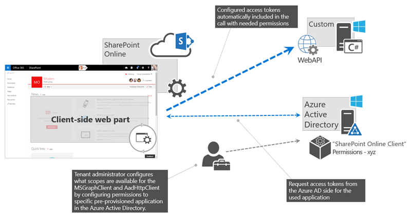

Developers building a SharePoint Framework solution that requires access to specific resources secured with Azure AD list these resources along with the required permission scopes in the solution manifest. When deploying the solution package to the app catalog, SharePoint creates permission requests and prompts the administrator to manage the requested permissions. For each requested permission, tenant administrators can decide whether they want to grant or deny the specific permission.

All permissions are granted to the whole tenant and not to a specific application that has requested them. When the tenant administrator grants a specific permission, it is added to the **SharePoint Online Client Extensibility** Azure AD application, which is provisioned by Microsoft in every Azure AD and which is used by the SharePoint Framework in the OAuth flow to provide solutions with valid access tokens.

## Discover available applications and permissions

The target Azure AD that secures your Office 365 tenant determines which applications you can request permissions for in your solution. The list of available applications might depend on the Office 365 license that the organization is using and which line-of-business applications they registered in Azure AD. If you have sufficient permissions, there are several ways that you can see which applications and permission scopes are available in your tenant.

### Use Azure portal or Azure AD admin center

One way to see the available applications in Azure AD is by navigating to the [Azure portal](https://ms.portal.azure.com/) or to the [Azure AD admin center](https://aad.portal.azure.com).

1. In the Azure AD admin center, in the left navigation, choose the **Enterprise applications** link.

  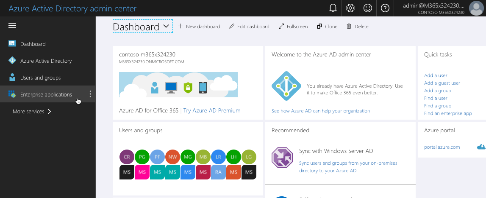

2. On the **Enterprise applications** blade, in the **Manage** group, choose the **All applications** link.

  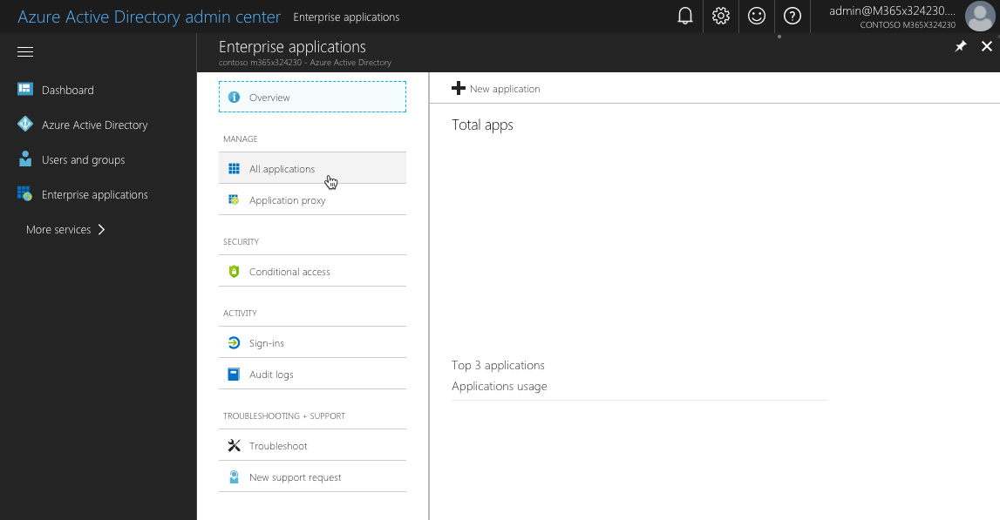

3. To quickly find the application to which you want to connect, you can filter the overview either by application type (_Microsoft Applications_ or _Enterprise Applications_), or you can search for it by using its name or ID.

  For example, if you want to request additional permissions to the Microsoft Graph, in the search box you would search for `graph`.

  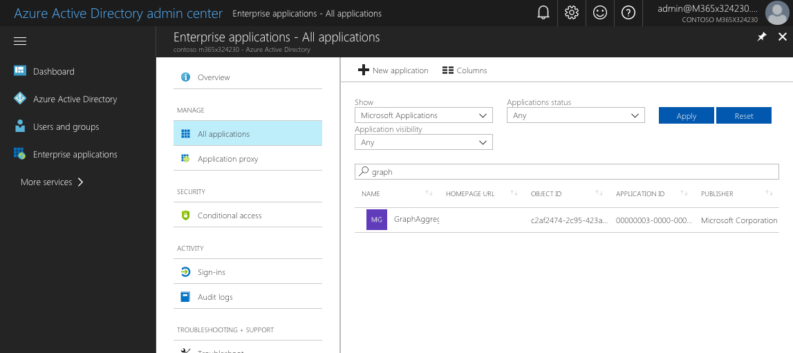

4. After you find the application, choose it to get additional information. On the application's blade, in the **Manage** group, choose **Properties** to open the application's properties.

  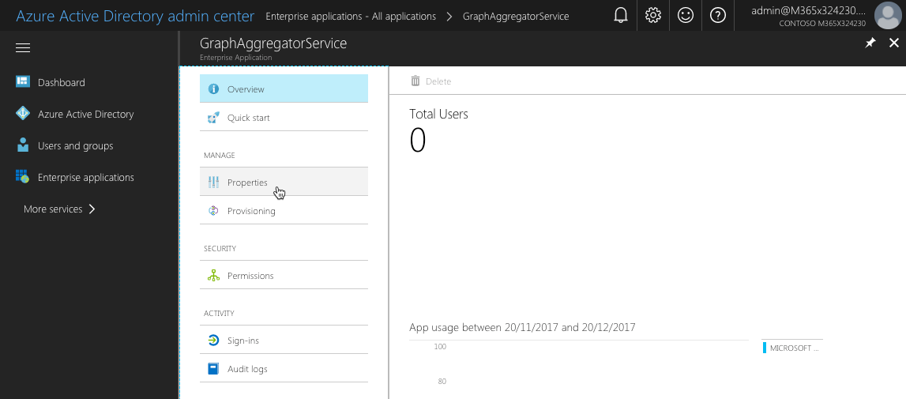

5. From the list of properties, copy the value of the **Object ID** property, which you need to request additional permission scopes to the Microsoft Graph. Alternatively, you can copy the application's **Name** and use it in the permission request instead.

  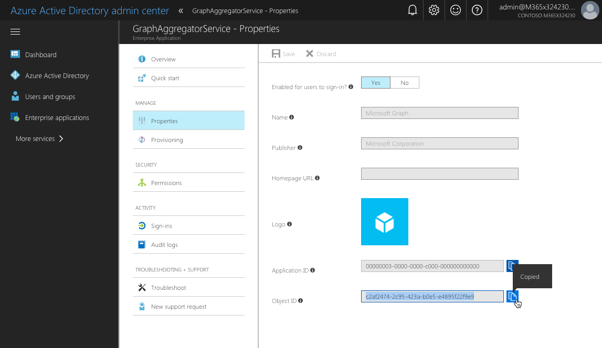

 > [!NOTE]
 > While the **Object ID** is unique for each tenant, the application's **Name** is the same across all tenants. If you want to build your solution once and deploy it to different tenants, you should use the application's **Name** when requesting additional permissions in your solution.

### Use Azure PowerShell

> [!NOTE]
> Before you can execute the following steps, you must install [Azure PowerShell](https://docs.microsoft.com/powershell/azure/install-az-ps). Alternatively, you can execute the cmdlets mentioned in this section in the Azure Cloud Shell PowerShell.

1. Sign in to your Azure subscription by executing in PowerShell (this is not necessary if you're using the Azure Cloud Shell):

  ```powershell
  Login-AzureRmAccount
  ```

2. Enter the following to list the applications available in your tenant:

  ```powershell
  Get-AzureRmADServicePrincipal | sort DisplayName | ft DisplayName, Id
  ```

  Running this cmdlet lists all applications available in your tenant. For each application, its display name and object ID are displayed, which you can use in your SharePoint Framework solution to request application permissions.

### Use Azure CLI

> [!NOTE]
> Before you can execute the following steps, you must install the [Azure CLI](https://docs.microsoft.com/en-us/cli/azure/install-azure-cli?view=azure-cli-latest). Alternatively, you can run the Azure CLI through the [Azure Cloud Shell](https://docs.microsoft.com/en-us/azure/cloud-shell/overview?view=azure-cli-latest) or as a [Docker container](https://hub.docker.com/r/microsoft/azure-cli/).

1. If you're running the CLI on your machine or in a Docker container, start by connecting to your Azure subscription by executing:

  ```sh
  azure login
  ```

2. After you're connected, execute the following command to list all available Azure AD applications:

  ```sh
  azure ad sp list --query "sort_by([*].{displayName: displayName, objectId: objectId}, &displayName)" -o table
  ```

  Running this command lists all Azure AD applications available in your tenant, sorted by displayName. For each application, the command displays its displayName and objectId. Additionally, the output is formatted as a table.

### Get the list of permission scopes exposed by the application

Each Azure AD application exposes a number of permission scopes. These permission scopes often relate to specific resources or operations inside the application. To get the list of permissions available for the application you would like to connect to, consult its documentation. For the list of permission scopes available in the Microsoft Graph, see [Microsoft Graph permissions reference](https://developer.microsoft.com/en-us/graph/docs/concepts/permissions_reference).

## Request permissions to an Azure AD application

If your SharePoint Framework solution requires permissions to specific resources secured with Azure AD, such as Microsoft Graph or enterprise applications, you can specify these resources along with the necessary permissions in the configuration of your solution.

1. In your SharePoint Framework project, open the **config/package-solution.json** file.

2. To the **solution** property, add the **webApiPermissionRequests** property that lists all the resources and corresponding permissions that your solution needs.

  Following is an example of a SharePoint Framework solution requesting access to read user calendars by using the Microsoft Graph:

  ```json
  {
    "$schema": "https://dev.office.com/json-schemas/spfx-build/package-solution.schema.json",
    "solution": {
      "name": "spfx-graph-client-side-solution",
      "id": "5d16587c-5e87-44d7-b658-1148988f212a",
      "version": "1.0.0.0",
      "includeClientSideAssets": true,
      "skipFeatureDeployment": true,
      "webApiPermissionRequests": [
        {
          "resource": "Microsoft Graph",
          "scope": "Calendars.Read"
        }
      ]
    },
    "paths": {
      "zippedPackage": "solution/spfx-graph.sppkg"
    }
  }
  ```

  > [!NOTE]
  > For the value of the **resource** property, you need to specify the **displayName** of the application to which you want to request permissions. If you specify the resource using its **objectId**, you will get an error when trying to approve the permission request.

3. If you want to request multiple permission scopes for the given resource, specify each scope in a separate entry, for example:

  ```json
  {
    "$schema": "https://dev.office.com/json-schemas/spfx-build/package-solution.schema.json",
    "solution": {
      "name": "spfx-graph-client-side-solution",
      "id": "5d16587c-5e87-44d7-b658-1148988f212a",
      "version": "1.0.0.0",
      "includeClientSideAssets": true,
      "skipFeatureDeployment": true,
      "webApiPermissionRequests": [
        {
          "resource": "Microsoft Graph",
          "scope": "Calendars.Read"
        },
        {
          "resource": "Microsoft Graph",
          "scope": "User.ReadBasic.All"
        }
      ]
    },
    "paths": {
      "zippedPackage": "solution/spfx-graph.sppkg"
    }
  }
  ```

4. When this solution is deployed to the SharePoint app catalog, it prompts the administrator to verify the requested permissions and either grant or deny them.

 > [!NOTE]
 > No matter if the administrator denies or approves the requested permissions, the solution can be deployed and used on sites. When building solutions that require additional permissions, you should never assume that the requested permissions have been granted.

## Manage permission requests

When deploying SharePoint Framework solutions that request permissions to Azure AD applications, administrators are prompted to manage the permission request provided with the solution. Permission requests can be managed in several ways.

### Manage permissions in the Office 365 Admin portal

Office 365 tenant administrators can manage permission grants and requests through the web UI from the modern SharePoint admin center.

1. Open the modern SharePoint admin center by navigating to the [Office 365 portal landing page](https://portal.office.com).  Sign in with your organizational account.

2. From the list of apps, choose **Admin**.

3. In the Office 365 Admin center, in the **Admin centers** group, choose **SharePoint**.

4. In the SharePoint admin center, choose the **Try the new SharePoint admin center** link.

<br/>

Following are some ways that Office 365 tenant administrators can manage permission grants and requests through the web UI from the modern SharePoint admin center.

- To **view pending permission requests**, in the modern SharePoint admin center, in the left pane, choose **WebApiPermission management** (**API management** in the screenshot).

  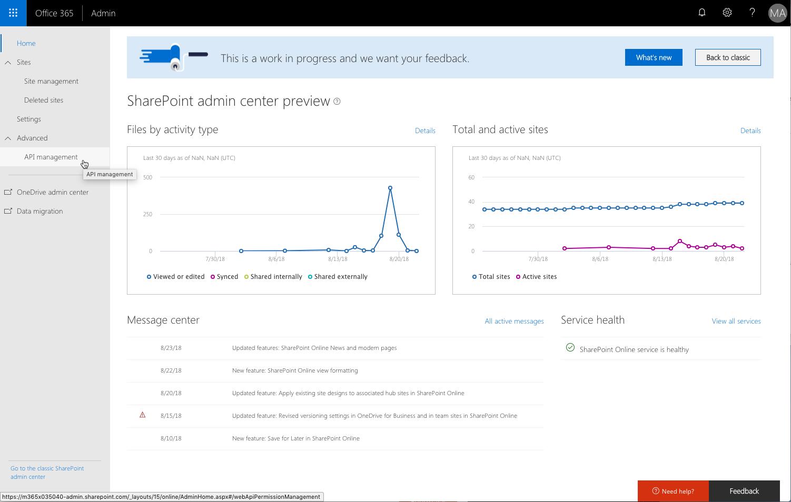

  All pending permissions requests will be highlighted in the list of web API permissions.

  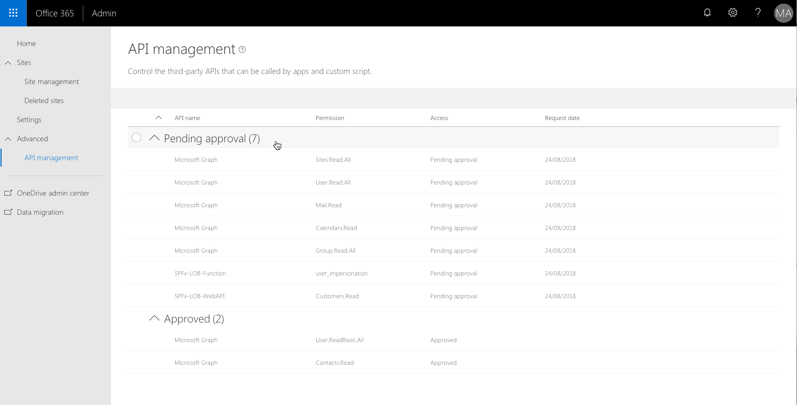

- To **approve a pending permission request**, select the request in the list of permissions, and on the toolbar, choose **Approve or reject**. In the **Approve or reject access** pane, choose **Approve**.

  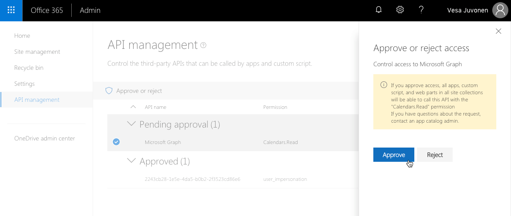

  After the request has been approved, the permission changes in the list, indicating that it has been granted.

  > [!NOTE]
  > If you try to approve a permission request for a resource that already has some permissions granted (for example, granting additional permissions to the Microsoft Graph), the requested scopes are added to the previously granted permissions.

- To **reject a pending permission request**, select the request in the list of permissions, and on the toolbar, choose **Approve or reject**. In the **Approve or reject access** pane, choose **Reject**.

  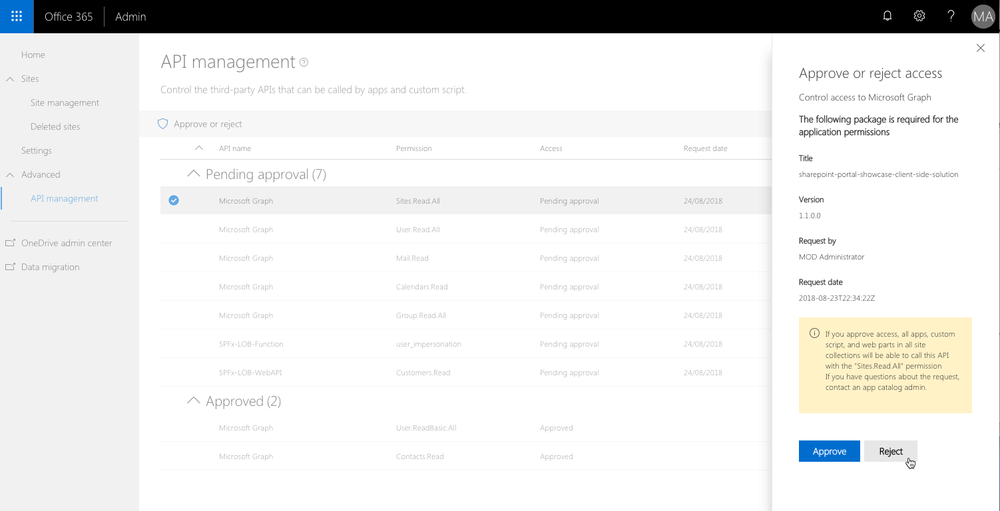

  After the request has been rejected, it is no longer visible in the list of web API permissions.

  > [!NOTE]
  > Rejecting a permission request issued by a solution deployed in the app catalog doesn't affect that solution, and it remains deployed in the app catalog. Because the requested permissions have been denied, the solution might not be working as expected. Developers should never assume that all requested permissions have been granted and should fail gracefully if this is not the case.

- To **revoke a previously granted set of permissions**, select the grant in the list of permissions, and on the toolbar, choose **Remove access**. In the **Remove access** pane, choose **Remove**.

  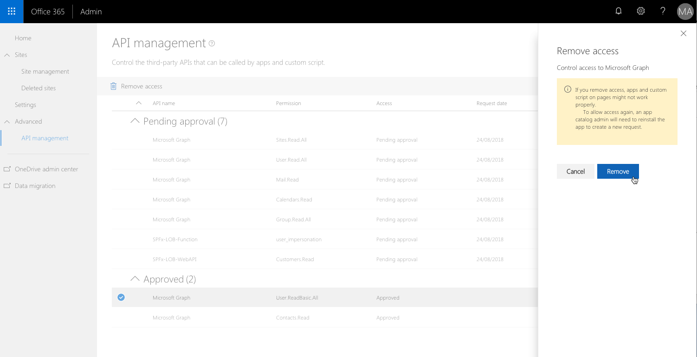

  After the grant has been removed, it is no longer visible in the list of web API permissions.

  > [!NOTE]
  > Removing a previously granted set of permissions could yield errors in all solutions used in your tenant that rely on those permissions unless they handle it gracefully. Before removing the specific permission grant, you should closely examine the impact that it will have on your tenant. If you accidentally removed a permission grant, you can restore it by issuing a new permission request with the same resource and scope.
  >
  > Revoking granted permissions doesn't invalidate previously issued access tokens. Instead, they remain valid until they expire.

- To **view all previously granted permissions**, in the modern SharePoint admin center, in the left pane, choose **API management**. All granted permissions are displayed in the **Approved** section.

  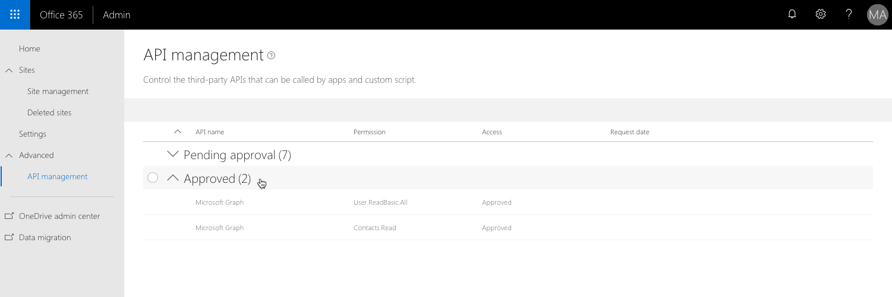

### Manage permissions with PowerShell

SharePoint tenant administrators can use the SharePoint Online Management Shell to manage permissions and permission requests in SharePoint Online.

- To **view all pending permission requests**, use the `Get-SPOTenantServicePrincipalPermissionRequests` cmdlet. For each permission request, the cmdlet lists its ID (required to either approve or deny the request), the resource for which permissions have been requested, and the requested permissions.

  > [!NOTE]
  > SharePoint doesn't verify if the requested permissions have already been granted or not, so before approving or rejecting a permission request, check which permissions have already been granted in your tenant.

- To **approve the specific permission request**, use the `Approve-SPOTenantServicePrincipalPermissionRequest -RequestId <Guid>` cmdlet, specifying the ID of the permission request that you want to approve.

  > [!NOTE]
  > If you try to approve a request for a permission that has already been granted, you get an error.

- To **deny a permission request** (if the requested permission has already been granted, or the request is against your organizational policies), use the `Deny-SPOTenantServicePrincipalPermissionRequest -RequestId <Guid>` cmdlet, specifying the ID of the permission request that you want to deny.

  > [!NOTE]
  > Denying a permission request issued by a SharePoint Framework application doesn't prevent that application from being deployed in the app catalog and installed on sites.

- To **view which permissions have been granted** in your tenant, use the `Get-SPOTenantServicePrincipalPermissionGrants` cmdlet. For each grant, the cmdlet displays the following information:

  - **ClientId**: The objectId of the service principal granted consent to impersonate the user when accessing the resource (represented by the resourceId).
  - **ConsentType**: Whether consent was provided by the administrator on behalf of the organization or whether consent was provided by an individual. The possible values are "AllPrincipals" or "Principal".
  - **ObjectId**: The unique identifier for the permission grant.
  - **Resource**: The resource to which access has been granted.
  - **ResourceId**: The objectId of the resource service principal to which access has been granted.
  - **Scope**: The value of the scope claim that the resource application should expect in the OAuth 2.0 access token.

- To **revoke a previously granted permission**, use the `Revoke-SPOTenantServicePrincipalPermission -ObjectId <String>` cmdlet. In the `ObjectId` parameter, you should specify the objectId of the grant that you want to revoke, which you can obtain by using the `Get-SPOTenantServicePrincipalPermissionGrants` cmdlet.

  > [!NOTE]
  > Revoking a permission doesn't trigger any changes to the app catalog or any of the deployed applications. The only consequence of revoking a permission is that any application used in the tenant will not be able to connect to the resources for which the permission has been revoked.

### Manage permissions using the Office 365 CLI

SharePoint tenant administrators can use the [Office 365 CLI](https://aka.ms/o365cli) to manage permissions and permission requests in SharePoint Online.

- To **view all pending permission requests**, use the [spo serviceprincipal permissionrequest list](https://pnp.github.io/office365-cli/cmd/spo/serviceprincipal/serviceprincipal-permissionrequest-list/) command. For each permission request, the command lists its ID (required to either approve or deny the request), the resource for which permissions have been requested, and the requested permissions.

  > [!NOTE]
  > SharePoint doesn't verify if the requested permissions have already been granted or not, so before approving or rejecting a permission request, check which permissions have already been granted in your tenant.

- To **approve a specific permission request**, use the [spo serviceprincipal permissionrequest approve](https://pnp.github.io/office365-cli/cmd/spo/serviceprincipal/serviceprincipal-permissionrequest-approve/) command, specifying the ID of the permission request that you want to approve.

  > [!NOTE]
  > If you try to approve a request for a permission that has already been granted, you get an error.

- To **deny a permission request** (if the requested permission has already been granted, or the request is against your organizational policies), use the [spo serviceprincipal permissionrequest deny](https://pnp.github.io/office365-cli/cmd/spo/serviceprincipal/serviceprincipal-permissionrequest-deny/) command, specifying the ID of the permission request that you want to deny.

  > [!NOTE]
  > Denying a permission request issued by a SharePoint Framework application doesn't prevent that application from being deployed in the app catalog and installed on sites.

- To **view which permissions have been granted** in your tenant, use the [spo serviceprincipal grant list](https://pnp.github.io/office365-cli/cmd/spo/serviceprincipal/serviceprincipal-grant-list/) command. For each grant, the command displays the following information:

  - **ObjectId**: The unique identifier for the permission grant.
  - **Resource**: The resource to which access has been granted.
  - **ResourceId**: The objectId of the resource service principal to which access has been granted.
  - **Scope**: The value of the scope claim that the resource application should expect in the OAuth 2.0 access token.

- To **revoke a previously granted permission**, use the [spo serviceprincipal grant revoke](https://pnp.github.io/office365-cli/cmd/spo/serviceprincipal/serviceprincipal-grant-revoke/) command. In the `grantId` parameter, specify the objectId of the grant that you want to revoke, which you can obtain by using the `spo serviceprincipal grant list` command.

  > [!NOTE]
  > Revoking a permission doesn't trigger any changes to the app catalog or any of the deployed applications. The only consequence of revoking a permission is that any application used in the tenant will not be able to connect to the resources for which the permission has been revoked.

## Connect to Azure AD applications using the AadHttpClient

Starting from version 1.4.1, SharePoint Framework simplifies connecting to APIs secured with Azure AD. Using the new **AadHttpClient**, you can easily connect to APIs secured with Azure AD without having to implement authentication and authorization yourself.

Internally, the **AadHttpClient** implements the Azure AD OAuth flow using ADAL JS by using the **SharePoint Online Client Extensibility** service principal to obtain a valid access token. The **SharePoint Online Client Extensibility** service principal is provisioned by Microsoft and is available in the Azure AD of all Office 365 tenants.

1. To use the **AadHttpClient** in your SharePoint Framework solution, add the following `import` clause in your main web part file:

  ```typescript
  import { AadHttpClient, HttpClientResponse } from '@microsoft/sp-http';
  ```

2. Get a new instance of the **AadHttpClient**, passing the resource to which you want to connect as parameters:

  ```typescript
  export default class HelloWorldWebPart extends BaseClientSideWebPart<IHelloWorldWebPartProps> {
    public render(): void {
      // ...

      this.context.aadHttpClientFactory
        .getClient('09c4b84d-13c4-4451-9350-3baedf70aab4')
        .then((client: AadHttpClient): void => {
          // connect to the API
        });
    }

    // ...
  }
  ```

  > [!NOTE]
  > Each instance of the **AadHttpClient** is linked to the specific resource, which is why you need to create a new instance of the client for each resource that you want to connect to.

3. After you instantiate the **AadHttpClient** for your resource, you can issue a web request to communicate with your API; in this example, the API returns a list of orders represented by the custom **Order** interface defined elsewhere in the project:

  ```typescript
  export default class HelloWorldWebPart extends BaseClientSideWebPart<IHelloWorldWebPartProps> {
    public render(): void {
      // ...

      this.context.aadHttpClientFactory
        .getClient('09c4b84d-13c4-4451-9350-3baedf70aab4')
        .then((client: AadHttpClient): void => {
          client
            .get('https://contoso.azurewebsites.net/api/orders', AadHttpClient.configurations.v1)
            .then((response: HttpClientResponse): Promise<Order[]> => {
              return response.json();
            })
            .then((orders: Order[]): void => {
              // process data
            });
        });
    }

    // ...
  }
  ```

## Considerations

Following are some considerations that you should take into account when working with web API permissions.

### Request permissions via SharePoint Framework solutions

At this moment, it's only possible to request additional permissions through a SharePoint Framework solution. The request is initiated when the solution package (.sppkg) containing a permissions request is deployed in the app catalog. After the request is initiated, it can be approved or denied by the tenant administrator.

### Granted permissions apply to all solutions

Although permissions to Azure AD resources are being requested by a SharePoint Framework solution, once granted, they apply to the whole tenant and can be leveraged by any solution in that tenant.

### Removing solution doesn't revoke permissions

Removing the solution that initially requested the particular permission doesn't revoke the granted permission. Tenant administrators have to manually revoke permissions granted through SharePoint Framework application requests.

### Revoking previously granted permissions doesn't invalidate issued access tokens

Revoking previously granted permissions doesn't invalidate access tokens issued to users. Instead, these access tokens remain valid until they expire.

### Permission request doesn't affect solution deployment

No matter if the administrator denies or approves permissions requested by the solution, the solution can be deployed and used on sites. When building solutions that require additional permissions, you should never assume that the requested permissions have been granted.

### Control the SharePoint Online Client service principal

All permissions granted through web API requests are stored with the **SharePoint Online Client Extensibility** Azure AD application. If tenant administrators don't want developers to use the web API request model and the **MSGraphClient** and **AadHttpClient** in their solutions, they can disable the **SharePoint Online Client Extensibility** service principal through PowerShell by using the `Disable-SPOTenantServicePrincipal` cmdlet.

The service principal can be re-enabled by using the `Enable-SPOTenantServicePrincipal` cmdlet. Alternatively, it's also possible to enable and disable the **SharePoint Online Client Extensibility** service principal through the Office 365 CLI by using the [spo serviceprincipal set](https://pnp.github.io/office365-cli/cmd/spo/serviceprincipal/serviceprincipal-set/) command.

