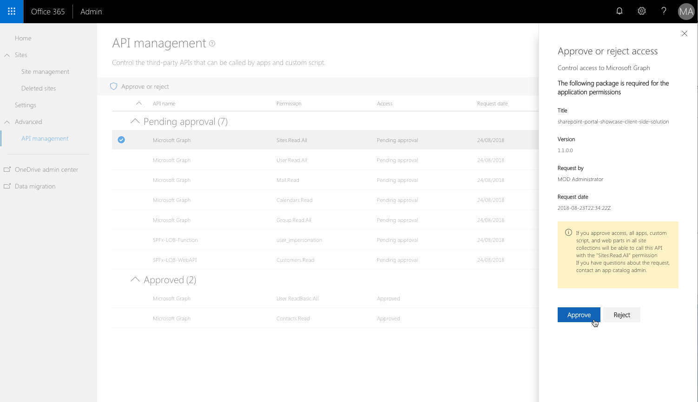

# Connect to AAD-secured APIs in SharePoint Framework solutions

When building SharePoint Framework solutions, you might need to connect to an API secured with Azure Active Directory. SharePoint Framework allows you to specify which Azure AD applications and permissions your solution requires, and tenant administrator can grant the necessary permissions if they haven't yet been granted. Using the **AadHttpClient** you can easily connect to APIs secured with AAD without having to implement the OAuth flow yourself.

## Web API permissions - concept overview

Azure Active Directory secures a number of resources: from Office 365 itself, to custom line of business applications built by the organization. In order to connect to these resources, applications must obtain a valid access token granting them access to the particular resource. Applications can obtain an access token as a part of the [OAuth authorization flow](https://docs.microsoft.com/en-us/azure/active-directory/develop/active-directory-protocols-oauth-code). Client-side applications, such as SharePoint Framework solutions, which are incapable of storing a secret, use a specific type of OAuth flow, named [OAuth implicit flow](https://docs.microsoft.com/en-us/azure/active-directory/develop/active-directory-dev-understanding-oauth2-implicit-grant).

Developers building client-side solutions are responsible for implementing authorization using the OAuth implicit flow in their application. In SharePoint Framework solutions that's already done as a part of the framework through the **MSGraphClient** and **AadHttpClient** both introduced in SharePoint Framework v1.4.1.

> [!NOTE]
> If you build solutions on a version of the SharePoint Framework older than v1.4.1 you can still connect to resources secured with AAD. In that case you need to implement the OAuth implicit flow using [ADAL JS](https://github.com/AzureAD/azure-activedirectory-library-for-js) yourself. For more information see the [Connect to API secured with Azure Active Directory](https://docs.microsoft.com/en-us/sharepoint/dev/spfx/web-parts/guidance/connect-to-api-secured-with-aad) article.

As a part of the SharePoint Framework, there is a specific process defined for how developers can request- and tenant administrators can manage permissions to resources secured with Azure AD. The following schema illustrates this process.


Developers building a SharePoint Framework solution, that requires access to specific resources secured with AAD, list these resources along with the required permission scopes in the solution manifest (1). When deploying the solution package to the app catalog, SharePoint will create permission requests and will prompt the administrator to manage the requested permissions (2). For each requested permission, tenant administrators can decide whether they want to grant or deny the specific permission (3).

All permissions are granted to the whole tenant and not to a specific application that has requested them. When tenant administrator grants a specific permission, it is added to the **SharePoint Online Client Extensibility** Azure AD application, which is provisioned by Microsoft in every Azure Active Directory and which is used by the SharePoint Framework in the OAuth flow to provide solutions with valid access tokens.

## Discover available applications and permissions

For which applications you can request permissions in your solution, depends on the target Azure Active Directory which secures your Office 365 tenant. The list of available application might depend on the Office 365 license the organization is using and which line of business applications they registered in their AAD. Assuming you have sufficient permissions, there are a number of ways in which you can see which applications and permission scopes are available in your tenant.

### Azure Portal

One way to see the list of applications available in your Azure Active Directory, is by navigating to the Azure Portal at [https://portal.azure.com](https://portal.azure.com) or the Azure Active Directory admin center at [https://aad.portal.azure.com](https://aad.portal.azure.com).

Once in the portal, from the menu click the **Enterprise applications** link.


On the **Enterprise applications** blade, from the **Manage** group, click the **All applications** link.


To quicker find the application to which you want to connect, you can filter the overview either by application type (_Microsoft Applications_ or _Enterprise Applications_) or you can search for it using its name or ID.

Assuming you wanted to request additional permissions to the Microsoft Graph, in the search box you would search for `graph`.


Once you find the application, click on it, to get its additional information. Once on the application blade, from the **Manage** group, click the **Properties** link, to open application's properties.


From the list of properties, copy the value of the **Object ID** property which you need to request additional permission scopes to the Microsoft Graph. Alternatively, you can copy the application's **Name** and use it in the permission request instead.


> [!NOTE]
> While the **Object ID** is unique for each tenant, the application's **Name** is the same across all tenants. If you want to build your solution once and deploy it to different tenants, you should use the application's **Name** when requesting additional permissions in your solution.

### PowerShell

> [!NOTE]
> Before you can execute the following steps, you have to install [Azure PowerShell](https://docs.microsoft.com/en-us/powershell/azure/install-azurerm-ps?view=azurermps-5.1.1). Alternatively, you can execute the cmdlets mentioned in this section in the Azure Cloud Shell PowerShell.

Start, by logging in to your Azure subscription by executing in PowerShell (this is not necessary if you're using the Azure Cloud Shell):

```powershell
Login-AzureRmAccount
```

Next, type the following to list the applications available in your tenant:

```powershell
Get-AzureRmADServicePrincipal | sort DisplayName | ft DisplayName, Id
```

Running this cmdlet will list all applications available in your tenant, and for each application will display its display name and object ID, that you can use in your SharePoint Framework solution to request application permissions.

### Azure CLI

> [!NOTE]
> Before you can execute the following steps, you have to install the [Azure CLI](https://docs.microsoft.com/en-us/cli/azure/install-azure-cli?view=azure-cli-latest). Alternatively, you can run the Azure CLI through the [Azure Cloud Shell](https://docs.microsoft.com/en-us/azure/cloud-shell/overview?view=azure-cli-latest) or as a [Docker container](https://hub.docker.com/r/microsoft/azure-cli/).

If you're running the CLI on your machine or in a Docker container, start by connecting to your Azure subscription, by executing:

```sh
azure login
```

Once connected, execute the following command, to list all available Azure AD applications:

```sh
azure ad sp list --query "sort_by([*].{displayName: displayName, objectId: objectId}, &displayName)" -o table
```

Running this command will list all Azure AD applications available in your tenant sorted by displayName. For each application, the command will display its displayName and objectId. Additionally, the output will be formatted as a table.

### Get the list of permission scopes exposed by the application

Each Azure AD application exposes a number of permission scopes. These permission scopes often relate to specific resources or operations inside the application. To get the list permissions available for the application you would like to connect to, consult its documentation. For the list of permission scopes available in the Microsoft Graph see: [https://developer.microsoft.com/en-us/graph/docs/concepts/permissions_reference](https://developer.microsoft.com/en-us/graph/docs/concepts/permissions_reference).

## Request permissions to an Azure Active Directory application

If your SharePoint Framework solution requires permissions to specific resources secured with Azure Active Directory, such as Microsoft Graph or enterprise applications, you can specify these resources along with the necessary permissions in the configuration of your solution. To do this, in your SharePoint Framework project, open the **config/package-solution.json** file and to the **solution** property, add the **webApiPermissionRequests** property listing all resources and corresponding permissions your solution needs. Following is an example of a SharePoint Framework solution requesting access to read user calendars using the Microsoft Graph:

```json
{
  "$schema": "https://dev.office.com/json-schemas/spfx-build/package-solution.schema.json",
  "solution": {
    "name": "spfx-graph-client-side-solution",
    "id": "5d16587c-5e87-44d7-b658-1148988f212a",
    "version": "1.0.0.0",
    "includeClientSideAssets": true,
    "skipFeatureDeployment": true,
    "webApiPermissionRequests": [
      {
        "resource": "Microsoft Graph",
        "scope": "Calendars.Read"
      }
    ]
  },
  "paths": {
    "zippedPackage": "solution/spfx-graph.sppkg"
  }
}
```

> [!NOTE]
> As the value of the **resource** property you can specify either the **displayName** or the **objectId** of the application to which you want to request permissions. Using the displayName is not only more readable but it also allows you to build your solution once and reuse it across multiple tenants. Where the **objectId** of an AAD application is different on each tenant, the **displayName** stays the same.

If you want to request multiple permission scopes for the given resource, specify each scope in a separate entry, for example:

```json
{
  "$schema": "https://dev.office.com/json-schemas/spfx-build/package-solution.schema.json",
  "solution": {
    "name": "spfx-graph-client-side-solution",
    "id": "5d16587c-5e87-44d7-b658-1148988f212a",
    "version": "1.0.0.0",
    "includeClientSideAssets": true,
    "skipFeatureDeployment": true,
    "webApiPermissionRequests": [
      {
        "resource": "Microsoft Graph",
        "scope": "Calendars.Read"
      },
      {
        "resource": "Microsoft Graph",
        "scope": "User.ReadBasic.All"
      }
    ]
  },
  "paths": {
    "zippedPackage": "solution/spfx-graph.sppkg"
  }
}
```

When this solution is deployed to SharePoint app catalog, it will prompt the administrator to verify the requested permissions and either grant or deny them.

> [!NOTE]
> No matter if the administrator denies or approves the requested permissions, the solution can be deployed and used in sites. When building solutions that require additional permissions, you should never assume that the requested permissions have been granted.

## Manage permission request

When deploying SharePoint Framework solutions that request permissions to Azure AD applications, administrators are prompted to manage the permission request provided with the solution. Permission requests can be managed in a number of ways.

### Manage permissions in the Office 365 Admin portal

> [!NOTE]
> Screenshots included in this section are based on the prerelease version of this capability and will change when it becomes generally available. One of the limitations of the prerelease version of the administration UI, is that it doesn't report errors. If you performed an action and the UI doesn't seem to respond to it, it is possible that an error has occurred. You can verify that by, opening the developer tools in your web browser and examining the console and the issued web requests.

Office 365 tenant administrators can manage permission grants and requests through the web UI from the modern SharePoint admin center. To open the modern SharePoint admin center:

Navigate to the Office 365 portal landing page at https://portal.office.com and sign in with your organizational account.


From the list of apps, select **Admin**.


In the Office 365 Admin center, from the **Admin centers** group, click the **SharePoint** link.


In the SharePoint admin center, click the **Try the new SharePoint admin center** link.


#### View pending permission requests

To view pending permission requests, in the modern SharePoint admin center, from the menu, click the **WebApiPermission management** link.


All pending permissions requests will be highlighted in the list of web API permissions.


#### Approve permission request

To approve a pending permission request, select the request in the list of permissions, from the toolbar click the **Approve or reject** button and in the **Approve or reject access** panel, click the **Approve** button.



After the request has been approved, the permission will change in the list indicating that it has been granted.

> [!NOTE]
> If you try to approve a permission request for a resource that already has some permissions granted (for example, granting additional permissions to the Microsoft Graph), the requested scopes will be added to the previously granted permissions.

#### Reject permission request

To reject a pending permission request, select the request in the list of permissions, from the toolbar click the **Approve or reject** button and in the **Approve or reject access** panel, click the **Reject** button.


After the request has been rejected, it will no longer be visible in the list of web API permissions.

> [!NOTE]
> Rejecting a permission request issued by a solution deployed in the app catalog, doesn't affect that solution and it remains deployed in the app catalog. Because the requested permissions have been denied, the solution won't be working as expected and you should remove it from the app catalog immediately after rejecting the permission request.

#### Revoke granted permission

To revoke a previously granted set of permissions, select the grant in the list of permissions, from the toolbar click the **Remove access** button and in the **Remove access** panel, click the **Remove** button.


After the grant has been removed, it will no longer be visible in the list of web API permissions.

Removing a previously granted set of permissions will yield errors in all solutions used in your tenant that rely on those permissions. Before removing the specific permission grant, you should closely examine the impact that it will have on your tenant. If you accidentally removed a permission grant, you can restore it, by issuing a new permission requests with the same resource and scope.

Revoking granted permissions doesn't invalidate previously issued access tokens. Instead, they will remain valid until they expire.

#### View granted permissions

To view all previously granted permissions, in the modern SharePoint admin center, from the menu, click the **API management** link. All granted permissions will be displayed in the **Approved** section.


### Manage permissions with PowerShell

SharePoint tenant administrators can use the SharePoint Online Management Shell to manage permissions and permission requests in SharePoint Online.

#### View pending permission requests

To view all pending permission request, use the `Get-SPOTenantServicePrincipalPermissionRequests` cmdlet. For each permission request, the cmdlet will list its ID (required to either approve or deny the request), the resource for which permissions have been requested and the requested permissions.

> [!NOTE]
> SharePoint doesn't verify if the requested permissions have already been granted or not, so before approving or rejecting a permission request, check which permissions have already been granted in your tenant.

#### Approve permission request

To approve the specific permission request, use the `Approve-SPOTenantServicePrincipalPermissionRequest -RequestId <Guid>` cmdlet, specifying the ID of the permission request that you want to approve.

> [!NOTE]
> If you try to approve request for a permission that has already been granted, you will get an error.

#### Deny permission request

If the requested permission has already been granted, or the request is against your organizational policies, you can deny a permission request using the `Deny-SPOTenantServicePrincipalPermissionRequest -RequestId <Guid>` cmdlet, specifying the ID of the permission request that you want to deny.

> [!NOTE]
> Denying a permission request issued by a SharePoint Framework application, doesn't prevent that application from being deployed in the app catalog and installed in sites.

#### View granted permissions

To view which permissions have been granted in your tenant use the `Get-SPOTenantServicePrincipalPermissionGrants` cmdlet. For each grant the cmdlet will display the following information:

- ClientId: The objectId of the service principal granted consent to impersonate the user when accessing the resource (represented by the resourceId).
- ConsentType: Whether consent was provided by the administrator on behalf of the organization or whether consent was provided by an individual. The possible values are "AllPrincipals" or "Principal".
- ObjectId: The unique identifier for the permission grant.
- Resource: The resource to which access has been granted.
- ResourceId: The objectId of the resource service principal to which access has been granted.
- Scope: The value of the scope claim that the resource application should expect in the OAuth 2.0 access token.

#### Revoke granted permission

If you need to revoke a previously granted permission, you can do that using the `Revoke-SPOTenantServicePrincipalPermission -ObjectId <String>` cmdlet. In the `ObjectId` parameter you should specify the ObjectId of the grant that you want to revoke, which you can obtain using the `Get-SPOTenantServicePrincipalPermissionGrants` cmdlet.

> [!NOTE]
> Revoking a permission doesn't trigger any changes to the app catalog or any of the deployed applications. The only consequence of revoking a permission is, that any application used in the tenant will not be able to connect to the resources for which the permission has been revoked.

### Manage permissions using the Office 365 CLI

SharePoint tenant administrators can use the [Office 365 CLI](https://aka.ms/o365cli) to manage permissions and permission requests in SharePoint Online.

#### View pending permission requests

To view all pending permission request, use the [spo serviceprincipal permissionrequest list](https://sharepoint.github.io/office365-cli/cmd/spo/serviceprincipal/serviceprincipal-permissionrequest-list/) command. For each permission request, the command will list its ID (required to either approve or deny the request), the resource for which permissions have been requested and the requested permissions.

> [!NOTE]
> SharePoint doesn't verify if the requested permissions have already been granted or not, so before approving or rejecting a permission request, check which permissions have already been granted in your tenant.

#### Approve permission request

To approve the specific permission request, use the [spo serviceprincipal permissionrequest approve](https://sharepoint.github.io/office365-cli/cmd/spo/serviceprincipal/serviceprincipal-permissionrequest-approve/) command, specifying the ID of the permission request that you want to approve.

> [!NOTE]
> If you try to approve request for a permission that has already been granted, you will get an error.

#### Deny permission request

If the requested permission has already been granted, or the request is against your organizational policies, you can deny a permission request using the [spo serviceprincipal permissionrequest deny](https://sharepoint.github.io/office365-cli/cmd/spo/serviceprincipal/serviceprincipal-permissionrequest-deny/) command, specifying the ID of the permission request that you want to deny.

> [!NOTE]
> Denying a permission request issued by a SharePoint Framework application, doesn't prevent that application from being deployed in the app catalog and installed in sites.

#### View granted permissions

To view which permissions have been granted in your tenant use the [spo serviceprincipal grant list](https://sharepoint.github.io/office365-cli/cmd/spo/serviceprincipal/serviceprincipal-grant-list/) command. For each grant the command will display the following information:

- ObjectId: The unique identifier for the permission grant.
- Resource: The resource to which access has been granted.
- ResourceId: The objectId of the resource service principal to which access has been granted.
- Scope: The value of the scope claim that the resource application should expect in the OAuth 2.0 access token.

#### Revoke granted permission

If you need to revoke a previously granted permission, you can do that using the [spo serviceprincipal grant revoke](https://sharepoint.github.io/office365-cli/cmd/spo/serviceprincipal/serviceprincipal-grant-revoke/) command. In the `grantId` parameter you should specify the ObjectId of the grant that you want to revoke, which you can obtain using the `spo serviceprincipal grant list` command.

> [!NOTE]
> Revoking a permission doesn't trigger any changes to the app catalog or any of the deployed applications. The only consequence of revoking a permission is, that any application used in the tenant will not be able to connect to the resources for which the permission has been revoked.

## Connect to Azure AD applications using the AadHttpClient

Starting from version 1.4.1, SharePoint Framework simplifies connecting to APIs secured with AAD. Using the new **AadHttpClient** you can easily connect to APIs secured with AAD, without having to implement authentication and authorization yourself. Internally, the **AadHttpClient** implements the Azure AD OAuth flow using ADAL JS using the **SharePoint Online Client Extensibility** service principal to obtain a valid access token. The **SharePoint Online Client Extensibility** service principal is provisioned by Microsoft and available in the Azure Active Directory of all Office 365 tenants.

To use the **AadHttpClient** in your SharePoint Framework solution, add the following `import` clause in your main web part file:

```ts
import { AadHttpClient, HttpClientResponse } from '@microsoft/sp-http';
```

Next, create a new instance of the **AadHttpClient** passing the current service scope and the resource, to which you want to connect, as parameters:

```ts
export default class HelloWorldWebPart extends BaseClientSideWebPart<IHelloWorldWebPartProps> {
  public render(): void {
    // ...

    const contosoApiClient: AadHttpClient = new AadHttpClient(this.context.serviceScope, 'https://contoso.onmicrosoft.com/orders');
  }

  // ...
}
```

> [!NOTE]
> Each instance of the **AadHttpClient** is linked to the specific resource, which is why you need to create a new instance of the client for each resource you want to connect to.

Once you've instantiated the **AadHttpClient** for your resource, you can issue a web request to communicate with your API:

```ts
export default class HelloWorldWebPart extends BaseClientSideWebPart<IHelloWorldWebPartProps> {
  public render(): void {
    // ...

    const contosoApiClient: AadHttpClient = new AadHttpClient(this.context.serviceScope, 'https://contoso.onmicrosoft.com/orders');
    contosoApiClient
      .get('https://contoso.azurewebsites.net/api/orders', AadHttpClient.configurations.v1)
      .then((response: HttpClientResponse): Promise<Order[]> => {
        return response.json();
      })
      .then((orders: Order[]): void => {
        // process data
      });
  }

  // ...
}
```

In this example, the API returns a list of orders represented by the custom **Order** interface defined elsewhere in the project.

## Considerations

Following are some considerations that you should take into account when working with web API permissions.

### Request permissions via SharePoint Framework solutions

At this moment, it's only possible to request additional permissions through a SharePoint Framework solution. The request is initiated, when the solution package (.sppkg) containing permissions request is deployed in the app catalog. Once the request is initiated, it can be approved or denied by the tenant administrator.

### Granted permissions apply to all solutions

Although permissions to Azure AD resources are being requested by a SharePoint Framework solution, once granted, they apply to the whole tenant and can be leveraged by any solution in that tenant.

### Removing solution doesn't revoke permissions

Removing the solution, that initially requested the particular permission, doesn't revoke the granted permission. Tenant administrators have to manually revoke permissions granted through SharePoint Framework application requests.

### Revoking previously granted permissions doesn't invalidate issued access tokens

Revoking previously granted permissions, doesn't invalidate access tokens issued to users. Instead, these access tokens will remain valid until they expire.

### Permission request doesn't affect solution deployment

No matter if the administrator denies or approves permissions requested by the solution, the solution can be deployed and used in sites. When building solutions that require additional permissions, you should never assume that the requested permissions have been granted.

### Control the SharePoint Online Client service principal

All permissions granted through web API requests are stored with the **SharePoint Online Client Extensibility** Azure AD application. If tenant administrators don't want developers to use the web API request model and the **MSGraphClient** and **AadHttpClient** in their solutions, they can disable the **SharePoint Online Client Extensibility** service principal through PowerShell using the `Disable-SPOTenantServicePrincipal` cmdlet. The service principal can be re-enabled using the `Enable-SPOTenantServicePrincipal` cmdlet. Alternatively, it's also possible to enable and disable the **SharePoint Online Client Extensibility** service principal through the Office 365 CLI using the [spo serviceprincipal set](https://sharepoint.github.io/office365-cli/cmd/spo/serviceprincipal/serviceprincipal-set/) command.

### Access to the Microsoft Graph

Even if you don't explicitly grant the access to the Microsoft Graph, solutions will be able to request an access token for it. The **SharePoint Online Client Extensibility** service principal will issue an access token with the `user_impersonation` scope which allows scripts to access the basic information about the current user.