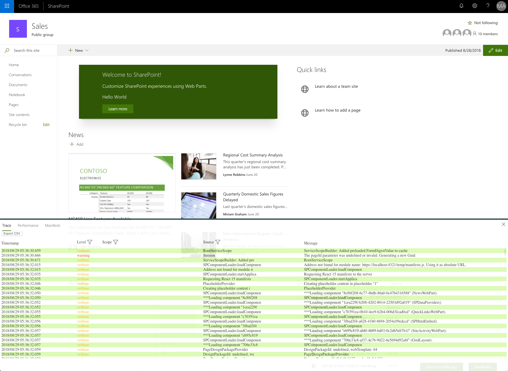
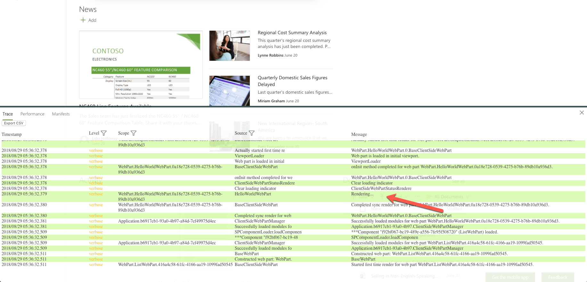

# Use the developer dashboard

When debugging your SharePoint Framework components, you can get additional information about how they work and interact with other components on the page using the developer dashboard.



Developer dashboard is available on modern SharePoint pages as well as on the hosted and local SharePoint Workbench.

## Open developer dashboard

To open the dashboard, on the keyboard press **CTRL+F12**. When the dashboard is open, to close it, press **CTRL+F12** again.

> The **CTRL+F12** hotkey is the same on all operating systems.

## Information available in the developer dashboard

The developer dashboard provides you with additional information about all SharePoint Framework components present on the page. This information helps you solve performance- and other problems in your SharePoint Framework solutions.

### Trace

When building SharePoint Framework components, you can use the built-in logger to log information in your code. Logged messages will appear on the **Trace** tab in the developer dashboard.


Following, is how you would log a verbose message to the SharePoint Framework developer dashboard:

```ts
// [...] shortened for brevity
import { Log } from '@microsoft/sp-core-library';

const LOG_SOURCE: string = 'HelloWorldWebPart';

export default class HelloWorldWebPart extends BaseClientSideWebPart<IHelloWorldWebPartProps> {
  public render(): void {
    Log.verbose(LOG_SOURCE, 'Rendering...', this.context.serviceScope);
    // [...] shortened for brevity
  }
}
```

The logged message will appear in the developer dashboard.



Using the built-in logger, you can log verbose (`Log.verbose()`), information (`Log.info()`), warning (`Log.warn()`) and error (`Log.error()`) messages.

> [!IMPORTANT]
> Messages logged using the built-in SharePoint Framework logger are visible only in the developer dashboard and are lost after the page is refreshed. If you need a logging solution for use in production, consider using other solutions such as Application Insights.

### Performance

The **Performance** tab in the developer dashboard displays timing information for all SharePoint Framework components on the current page.


For each component, the developer dashboard shows how much time was spent on waiting on the response from the server, loading the module, intializing the component, retrieving the data and rendering the component. If the page loads slower after adding your component to the page, you can use this information to verify if any particular stage in the lifecycle of your component is slowing down the page.

### Manifests

The **Manifests** page in the developer dashboard shows information about the manifests of all SharePoint Framework components present on the current page.


Using the information from the manifests you can verify what components are present on the page, which version of each component is being loaded and from which URL. This information is helpful if you need to ensure that your component was correctly updated and is loading from the right location with the right properties.