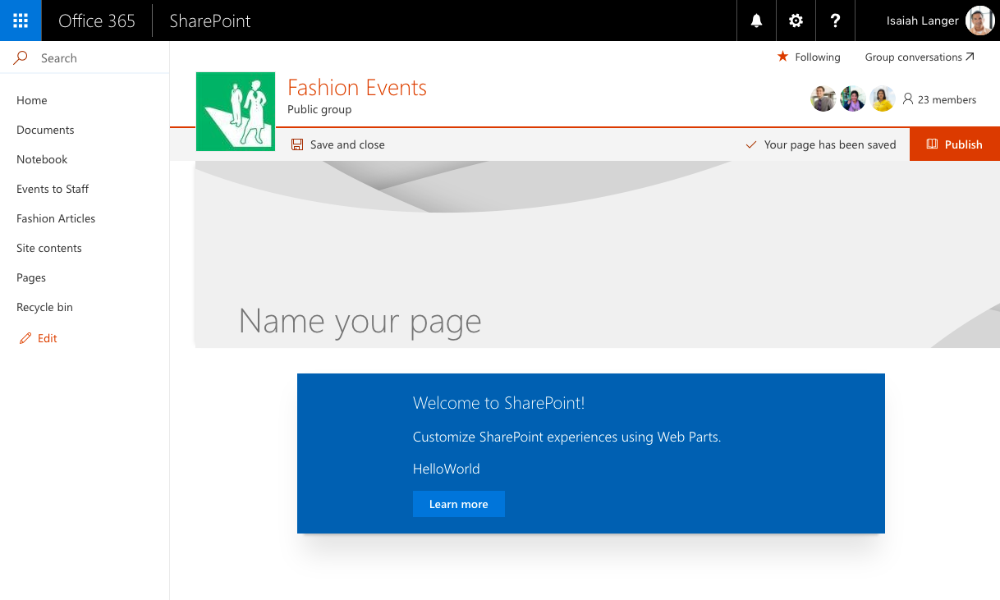
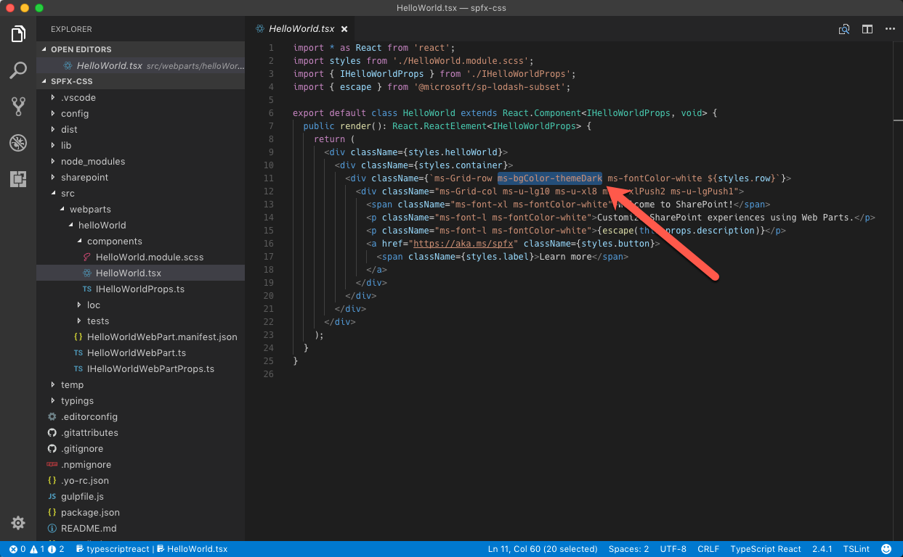
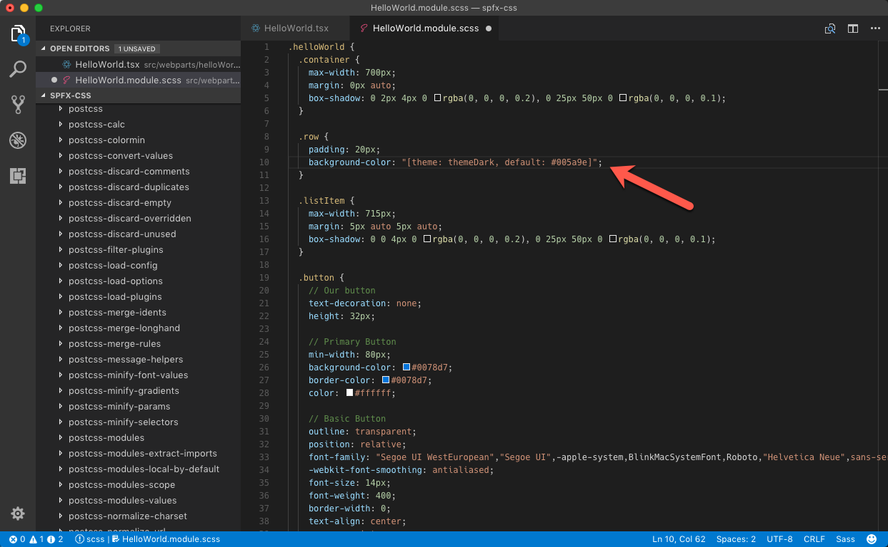
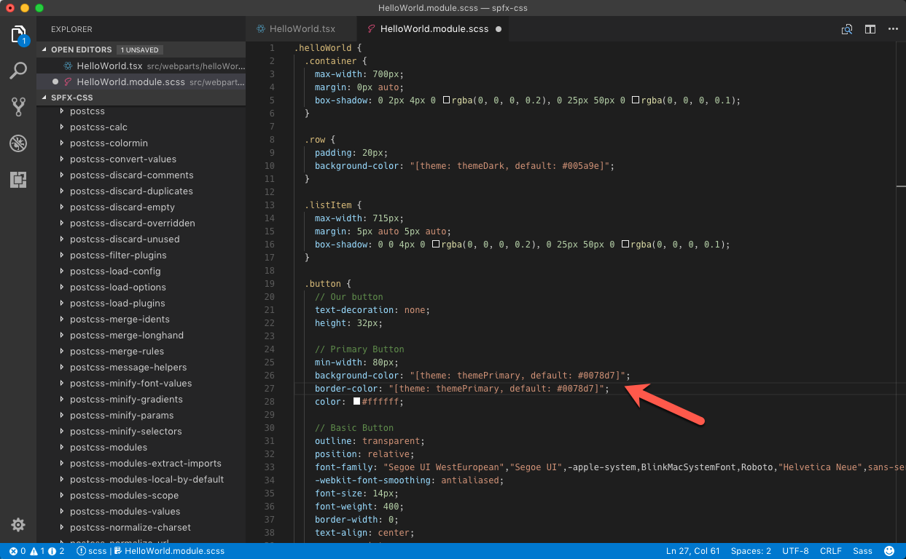
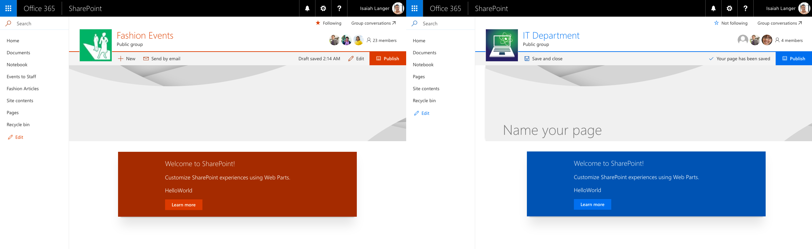
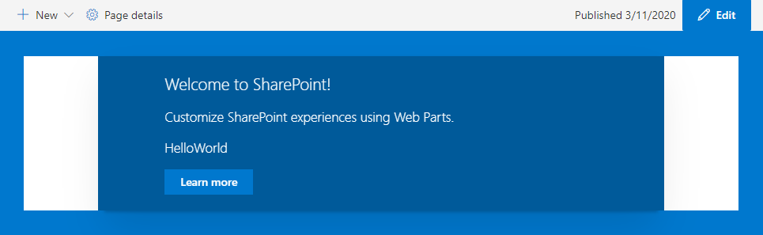
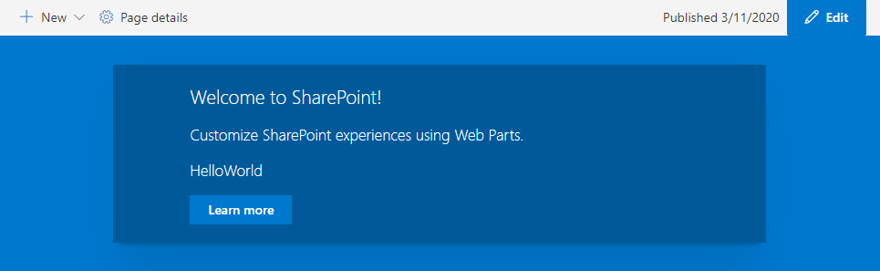

# Use theme colors in your SharePoint Framework customizations

When building SharePoint Framework customizations, you should use theme colors so that your customizations look like a part of the site. This article explains how can you refer to the theme colors of the context site in your SharePoint Framework solution.

> [!NOTE]
> Although this article uses a SharePoint Framework client-side web part as an example, the described techniques apply to all types of SharePoint Framework customizations.

## Fixed colors vs. theme colors

When you scaffold a new SharePoint Framework client-side web part, it uses a fixed blue palette. When you add such a web part on a modern site by using a different color scheme, it stands out and doesn't look like a part of the site.



When using fixed colors, you decide upfront which colors you want to use for which elements. This can lead to a situation like the one just illustrated, where a blue web part is displayed on a red team site, standing out unnecessarily. In most cases, you should strive to leverage the theme colors of the context site so that your solution doesn't stand out but looks like a part of the site.

Instead of using fixed colors, SharePoint Framework allows you to refer to the theme colors of the context site. As a result, if your web part is placed on a site that uses a red theme, it uses the red palette as well, and if it's placed on a site that uses the blue theme, it automatically adjusts itself to use the blue palette. All of this is done automatically without any changes to the web part code in between.

## Use theme colors in the SharePoint Framework

When working with fixed colors, you specify them in CSS properties, for example:

```css
.button {
  background-color: #0078d7;
}
```

To use a theme color instead, replace the fixed color with a theme token:

```css
.button {
  background-color: "[theme: themePrimary, default: #0078d7]";
}
```

When your SharePoint Framework customization is loading on the page, the **\@microsoft/load-themed-styles** package, which is a part of the SharePoint Framework, looks for theme tokens in CSS files and tries to replace them with the corresponding color from the current theme. If the value for the specified token is not available, SharePoint Framework uses the value specified by using the **default** parameter instead, which is why it's important that you always include it.

## Use theme colors in your customizations

When you scaffold a new SharePoint Framework client-side web part, by default, it uses the fixed blue palette. The following steps describe the necessary adjustments to have the web part use theme colors instead.

> [!NOTE]
> The following steps apply to a SharePoint Framework client-side web part named _HelloWorld_ built by using React. For web parts built using different libraries and other types of customizations, you might need to adjust the modifications accordingly.

### To use theme colors

1. In the code editor, open the **./src/webparts/helloWorld/components/HelloWorld.tsx** file, and from the div with class **ms-Grid-row**, remove the **ms-bgColor-themeDark** class.

    

1. In the same folder, open the **HelloWorld.module.scss** file. Change the `.row` selector to:

    ```css
    .row {
      padding: 20px;
      background-color: "[theme: themeDark, default: #005a9e]";
    }
    ```

    

1. In the `.button` selector, change the `background-color` and `border-color` properties to:

    ```css
    .button {
      /* ... */
      background-color: "[theme: themePrimary, default: #0078d7]";
      border-color: "[theme: themePrimary, default: #0078d7]";
      /* ... */
    }
    ```

    

1. When you add the web part to a site, the colors used by the web part automatically adapt to the theme colors used by the current site.

    

### Support section backgrounds

A customziation utilizing theme colors may still stand out if it doesn't respond to section background changes via theme variants support. See [Supporting Section Backgrounds](./web-parts/guidance/supporting-section-backgrounds.md) for more information.

A web part without theme variants support uses a white background regardless of the selected section background color.



A web part configured to support theme variants can apply the section background to the web part background.



## Available theme tokens and their occurances

In the context of modern SharePoint sites, the values associated with theme tokens have numerous occurances within front-end, system page, and SharePoint web part UI. To best match your customizations to the general look and feel, consideration should be made to using appropriate theme tokens.

The following theme tokens are available for you to use:

> [!NOTE]
> Default values below correspond to the defaults on a modern team site when using the **red palette**.

| Token                  | Default                  | Remarks                                                                                                                                                                                                                                                                                                                                                                                                                             |
| ---------------------- | ------------------------ | ----------------------------------------------------------------------------------------------------------------------------------------------------------------------------------------------------------------------------------------------------------------------------------------------------------------------------------------------------------------------------------------------------------------------------------- |
| `themeDark`            | `#7c1d21`                | Some button onclick and link color (e.g., “Return to classic SharePoint”). Header “Follow” star icon if the third header background color option is used. System pages: OK button border and hover.                                                                                                                                                                                                                                 |
| `themeDarkAlt`         | `#932227`                | Many icons (e.g., in the command bar), some borders, button/link hovers, spinner background, range element focus, checkbox background hover, web parts and lists, button hover, range element focus, add web part icon when the third section background color is selected.                                                                                                                                                         |
| `themeDarker`          | `#5b1519`                | Hover color for some links. System pages: Visited link color.                                                                                                                                                                                                                                                                                                                                                                       |
| `themeLight`           | `#e3afb2`                | Range selector hover and focus background. Loading spinner background color in site contents view.                                                                                                                                                                                                                                                                                                                                  |
| `themeLighter`         | `#f0d3d4`                | Navigation edit menu background color, add web part panel hover background color, image background color in some web parts when the third section background color option is selected. System pages: Navigation hover background, cancel button hover background.                                                                                                                                                                   |
| `themeLighterAlt`      | `#fbf4f4`                | One of the section background options. Cogwheel menu hover background in site contents view.                                                                                                                                                                                                                                                                                                                                        |
| `themePrimary`         | `#a4262c`                | Some button and checkbox backgrounds, links, texts, borders and icons, icon and link hovers. Also the footer background color, and one of the section background options. System pages: OK button background, link texts.                                                                                                                                                                                                           |
| `themeSecondary`       | `#ae383e`                | The suite bar text in site contents view. Hover color for some links. Image background color in some web parts when the fourth section background color is selected. The second color in the palette icon in the “Change the look panel” (hence the token name)                                                                                                                                                                     |
| `themeTertiary`        | `#c86c70`                | Add web part icon when the fourth selection background color is selected. The third color in the palette icon in the “Change the look panel” (hence the token name)                                                                                                                                                                                                                                                                 |
| `neutralDark`          | `#212121`                | Some button, link and border hover text, some icons. System pages: page breadcrumb, header texts.                                                                                                                                                                                                                                                                                                                                   |
| `neutralLight`         | `#eaeaea`                | Some web part borders, command bar action hover, command bar background when a list item is selected, list view category header background when an item is selected, button hover. System pages: Ribbon tab background, OK button border, selected navigation element background, disabled text box border. Divider web part. Image background color in some web parts when the second section background color option is selected. |
| `neutralLighter`       | `#f4f4f4`                | Some menu backgrounds (e.g., the command bar), selected left navigation element, some button backgrounds, one option for a section background color.                                                                                                                                                                                                                                                                                |
| `neutralLighterAlt`    | `#f8f8f8`                | Left navigation hover background, list info panel text background, image background color in some webparts when the first section background color is selected, some icons and texts when editing web parts. System pages: Cancel button background, disabled text box background.                                                                                                                                                  |
| `neutralPrimary`       | `#333333`                | Site header texts, texts in navigation menux, command bar, buttons and web parts, web part related icon backgrounds when the page is in edit mode, add web part panel icons and texts, web part settings panel texts. System pages: dropdown arrow color, some texts.                                                                                                                                                               |
| `neutralPrimaryAlt`    | `#3c3c3c`                | The suite bar background in site contents view.                                                                                                                                                                                                                                                                                                                                                                                     |
| `neutralSecondary`     | `#666666`                | Some menu texts, empty library text, some icon hover backgrounds, some texts in web parts, command bar arrows, range selector. System pages: link color, some icons, and borders.                                                                                                                                                                                                                                                   |
| `neutralTertiary`      | `#a6a6a6`                | Some button texts, some web part titles, some web part setting texts, some web part icons, border hover in some web parts, dashed section border in edit mode, web part settings panel control border. Most visible when editing web parts. System pages: text box, dropdown, and button border color.                                                                                                                              |
| `neutralTertiaryAlt`   | `#c8c8c8`                | Some texts, e.g., in web part property pane, some icons in web parts, range selector background, some button onclick background, yes/no toggle control background, change section background color setting border.                                                                                                                                                                                                                  |
| `neutralQuaternary`    | `#d0d0d0`                | Command bar action hover background when a list item is selected. System pages: Borders                                                                                                                                                                                                                                                                                                                                             |
| `black`                | `#000000`                | Web part settings panel dropdown text, carousel controls, site contents tab text hover, “Change  the look” panel texts.                                                                                                                                                                                                                                                                                                             |
| `white`                | `#ffffff`                | Primary body background, search input background, some button text, hub navigation text if the themePrimary header background is selected, one of the available section background colors. System pages: Body background                                                                                                                                                                                                            |
| `neutralQuaternaryAlt` | `#dadada`                | Info icon and selected ellipses background in lists, some web part element backgrounds when in edit mode, web part property pane dropdown item background, selected list item background.                                                                                                                                                                                                                                           |
| `accent`*              | `#ca5010`                | The fourth color in the palette in the “Change the look” panel.                                                                                                                                                                                                                                                                                                                                                                     |
| `whiteTranslucent40`*  | `"rgba(255,255,255,.4)"` | Covers the rest of page when a modal dialog is opened.                                                                                                                                                                                                                                                                                                                                                                              |
| `blackTranslucent40`*  | `"rgba(0,0,0,.4)"`       | Covers the rest of page during certain mobal dialog states, i.e.: when the web part search dialog is expanded                                                                                                                                                                                                                                                                                                                       |
| `backgroundOverlay`*   | (empty)                  | Site contents primary background, some borders, i.e.: between hub and site navigation                                                                                                                                                                                                                                                                                                                                               |
| `primaryBackground`*   | `#ffffff`                | Some backgrounds when editing web part settings, some text field backgrounds                                                                                                                                                                                                                                                                                                                                                        |

*Not included in [theme generator](https://aka.ms/themedesigner).

Occurance of theme tokens within SharePoint UI may differ depending upon selected background colors (i.e., theme token, `white` is used for header navigation links if a dark header background is selected, otherwise `neutralSecondary` is used). See [Designing for section backgrounds using semantic slots](../design/semantic_slots.md) for more information.

> [!NOTE]
> There are more tokens registered with the SharePoint Framework, although only the subset mentioned above are assignable in custom themes on modern SharePoint sites (the rest being generated automatically by the theming engine). For the complete list of available tokens, see the value of the `window.__themeState__.theme` property by using the console in your web browser's developer tools.

### Customizing theme colors

In order to customize theme colors, a custom theme should be created and added to a SharePoint tenant for selection on a target site or hub. See [SharePoint site theming](https://docs.microsoft.com/en-us/sharepoint/dev/declarative-customization/site-theming/sharepoint-site-theming-overview) for more information.

## See also

- [SharePoint themes and colors](../design/themes-colors.md)
- [Designing for section backgrounds using semantic slots](../design/semantic_slots.md)
- [SharePoint section backgrounds](./webparts/guidance/supporting-section-backgrounds.md)
- [How to use Theme Colors in SPFX web parts](https://n8d.at/blog/how-to-use-theme-colors-in-spfx-web-parts/) by Stefan Bauer (Office Development MVP)
- [How to Create a Multicolored Theme for a Modern SharePoint Online Site](https://laurakokkarinen.com/how-to-create-a-multicolored-theme-for-a-modern-sharepoint-online-site/) by Laura Kokkarinen (SharePoint PnP Core MVP)
