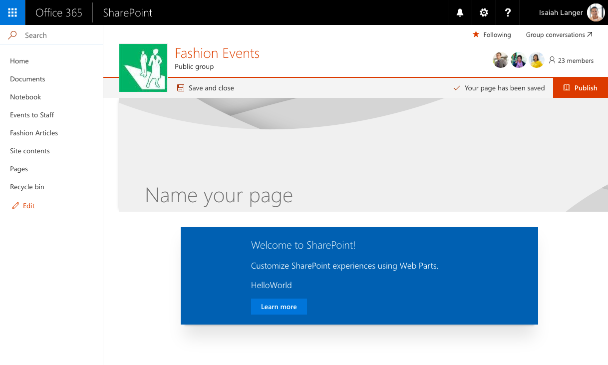
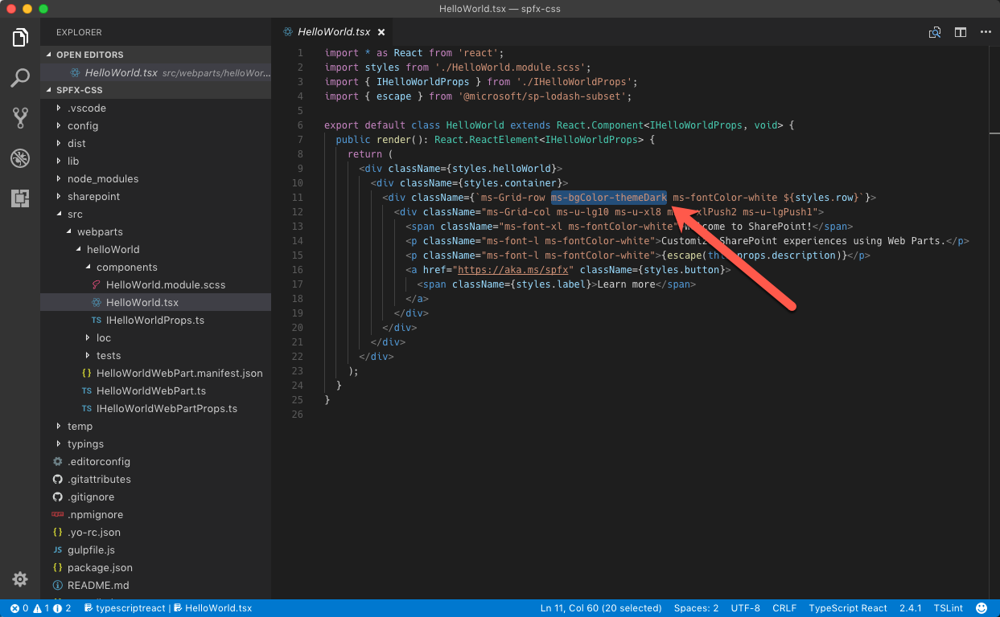
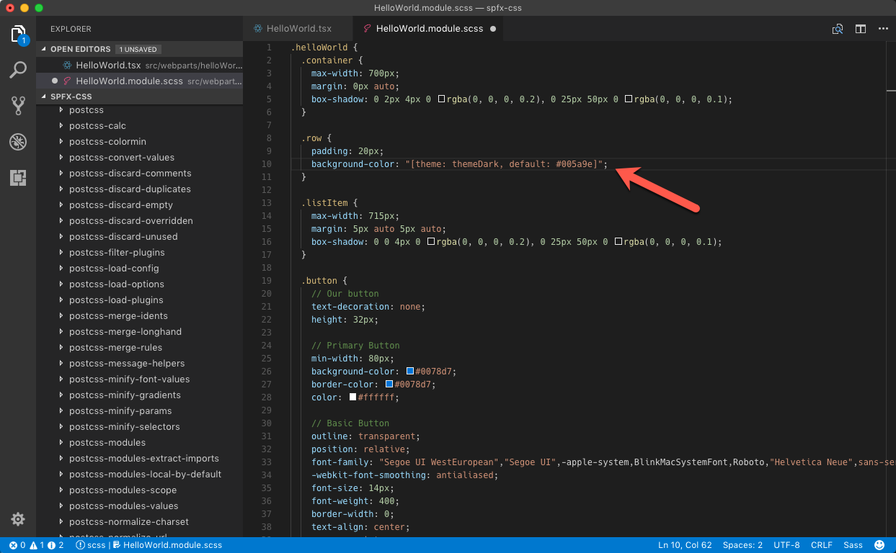
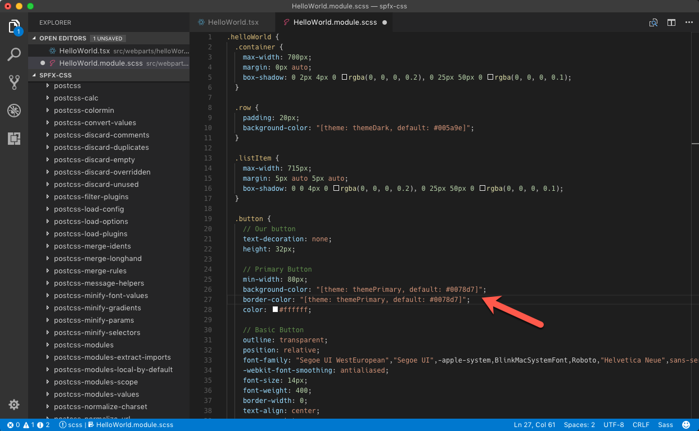
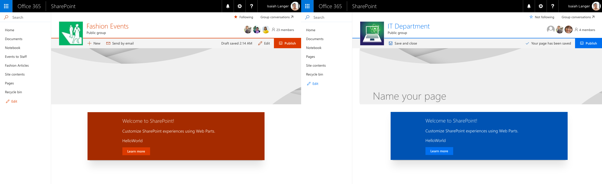

# Use theme colors in your SharePoint Framework customizations

When building SharePoint Framework customizations you should use theme colors, so that your customizations looks like a part of the site. This article explains how can you refer to the theme colors of the context site in your SharePoint Framework solution.

> **Note:** although this article uses SharePoint Framework client-side web part as example, the described techniques apply to all types of SharePoint Framework customizations.

## Fixed colors vs. theme colors

When you scaffold a new SharePoint Framework client-side web part, it uses a fixed blue palette. When you add such web part on a modern site, using a different color scheme, it stands out and doesn't look like a part of the site.



When using fixed colors, you decide upfront which colors you want to use for which elements. This can lead to a situation like the one just illustrated, where a blue web part is displayed on a red team site, standing out unnecessarily. In most cases, you should strive to leverage the theme colors of the context site, so that your solution doesn't stand out but looks like a part of the site.

Instead of using fixed colors, SharePoint Framework allows you to refer to theme colors of the context site. As a result, if your web part is placed on a site using red theme, it will use the red palette as well, and if it's placed on a site using the blue theme, it will automatically adjust itself to use the blue palette. All of this is done automatically without any changes to the web part code in between.

## Using theme colors in the SharePoint Framework

When working with fixed colors, you specify them in CSS properties, for example:

```css
.button {
    background-color: #0078d7;
}
```

To use a theme color instead, replace the fixed color with a theme token:

```css
.button {
    background-color: "[theme: themePrimary, default: #0078d7]";
}
```

When your SharePoint Framework customization is loading on the page, the **@microsoft/load-themed-styles** package, which is a part of the SharePoint Framework, will look for theme tokens in CSS files and try to replace them with the corresponding color from the current theme. If the value for the specified token is not available, SharePoint Framework will use the value specified using the **default** parameter instead, which is why it's important that you always include it.

Following theme tokens are available for you to use:

Token|Default value on a modern team site using the red palette|Remarks
-----|--------------------------------|-----------
`backgroundImageUri`|`none`|
`themeAccent`|`#ee0410`|
`themeAccentTranslucent10`|`rgba(238, 4, 16, 0.10)`|
`themeDark`|`#b3030c`|Used for action icons in the command bar and as hover color
`themeDarkAlt`|`#b3030c`|
`themeDarker`|`#770208`|
`themeLight`|`#fd969b`|
`themeLightAlt`|`#fd969b`|
`themeLighter`|`#fecacd`|
`themeLighterAlt`|`#fecacd`|
`themePrimary`|`#ee0410`|Primary theme color. Used for icons and default buttons
`themeSecondary`|`#fc6169`|
`themeTertiary`|`#fd969b`|
`themeTertiaryAlt`|`#fd969b`|

> **Note:** there are more tokens registered with the SharePoint Framework. While all of them have values specified on classic sites, only the subset mentioned earlier has values on modern SharePoint sites. For the complete list of available tokens, see the value of the `window.__themeState__.theme` property using the console in your web browser's developer tools.

## Use theme colors in your customizations

When you scaffold a new SharePoint Framework client-side web part, by default, it uses the fixed blue palette. Following steps describe the necessary adjustments to have the web part use theme colors instead.

> **Note:** the following steps apply to a SharePoint Framework client-side web part named _HelloWorld_ built using React. For web parts built using different libraries and other types of customizations, you might need to adjust the modifications accordingly.

In the code editor open the **./src/webparts/helloWorld/components/HelloWorld.tsx** file and from the div with class **ms-Grid-row** remove the **ms-bgColor-themeDark** class.



Next, in the same folder, open the **HelloWorld.module.scss** file. Change the `.row` selector to:

```css
.row {
    padding: 20px;
    background-color: "[theme: themeDark, default: #005a9e]";
}
```



In the `.button` selector, change the `background-color` and `border-color` properties to:

```css
.button {
    /* ... */
    background-color: "[theme: themePrimary, default: #0078d7]";
    border-color: "[theme: themePrimary, default: #0078d7]";
    /* ... */
}
```



When you add the web part to a site, the colors used by the web part will automatically adapt to the theme colors used by the current site.



## More information

* [How to use Theme Colors in SPFX Web Parts](http://www.n8d.at/blog/how-to-use-theme-colors-in-spfx-web-parts/) by Stefan Bauer (Office Development MVP)