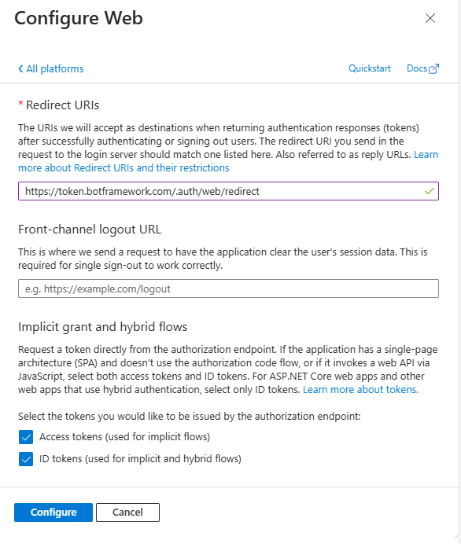
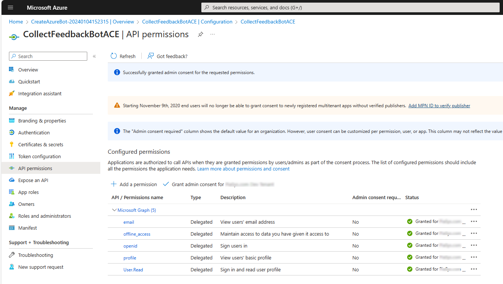
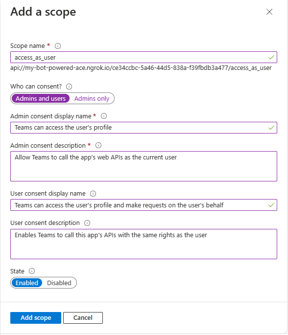
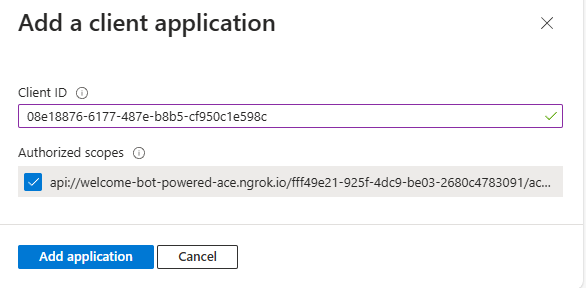
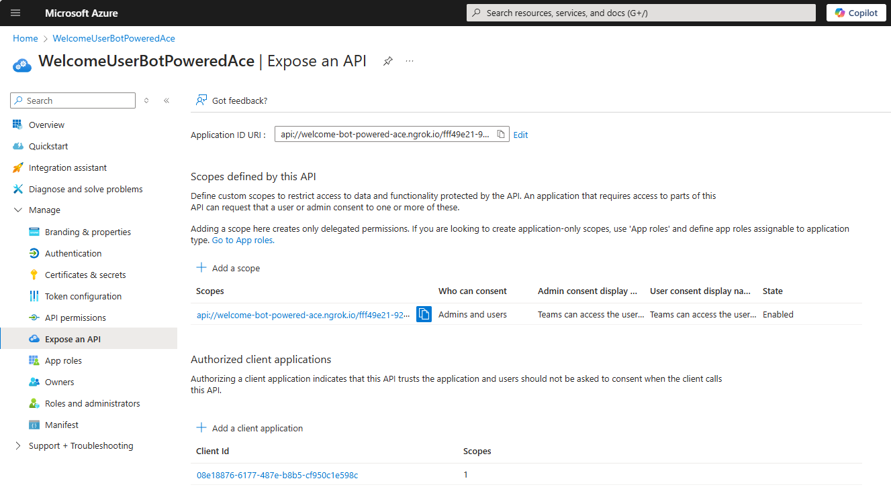
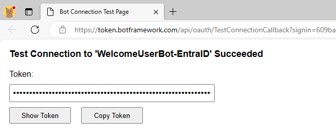

# Building Bot Powered Adaptive Card Extensions with Microsoft Entra ID and Single Sign-on (SSO)

Securing a Bot Powered Adaptive Card Extension (ACE) with Microsoft Entra ID and Single Sign-on (SSO) requires some configuration steps on Microsoft Azure and some custom logic in the code base.

In this document, you find step-by-step guidance that will help you accomplish this task.

## Understanding the sample scenario

Let's assume that you want to create a Bot Powered ACE to write a welcome message for users, writing their name and the user principal name in a Card View. You want to authenticate users via OAuth with Microsoft Entra ID. In the following picture, you can see how the Adaptive Card Extension looks like in the Viva Connections desktop experience.


In the following picture, you can see what the Adaptive Card Extension looks like in the Viva Connections mobile experience.


From a developer point of view, you build the ACE once and you benefit from it in both desktop and mobile experiences.

The whole source code of the .NET sample is available in the following GitHub repository: [Welcome User Bot Powered ACE SSO](https://github.com/pnp/viva-dev-bot-powered-aces/tree/main/samples/dotnet/WelcomeUserBotPoweredAce-SSO).

## Developing a Secured Bot Powered ACE with Microsoft .NET and Microsoft Entra ID SSO

First of all, you should create a Bot Powered ACE following the guidance provided in the article [Building your first Bot Powered Adaptive Card Extension](./Building-Your-First-Bot-Powered-ACE.md), stopping before the section [Implement the actual Bot Powered ACE](./Building-Your-First-Bot-Powered-ACE.md#implement-the-actual-bot-powered-ace).

For the sake of simplicity, assume that the Bot Powered ACE project name is **WelcomeUserBotPoweredAce** and register the Azure Bot according to the guidance. 

## Configuring security for the Bot Powered ACE

Before starting to develop the actual Bot Powered ACE, you need to enrich the configuration of the Azure Bot and of the Microsoft App behind the scenes of the Azure Bot.
To access the Microsoft App backing the Azure Bot, open the **Configuration** panel of the Azure Bot and select the **Manage Password** link. 

Now, select the **Authentication** panel of the Microsoft App, and under the **Platform configurations** section, select **Add a platform** and select to add a *Web* platform. Then configure the following value for the **Redirect URIs** setting field.

```http
https://token.botframework.com/.auth/web/redirect
```

You should also enable **Implicit grant and hybrid flows** by selecting the options to issue **Access tokens** and **ID tokens**. Select the **Configure** button and your new Web platform is configured.



Now, select the **API permissions** panel and configure the app with the following delegated permissions:

* email
* offline_access
* openid
* profile
* User.Read

Select the **Grant admin consent for ...** button, to grant the permissions at the tenant level.



Now, move to the **Expose an API** panel and configure a unique URI for your application by selecting the **Add** link just beside the **Application ID URI** label. Here you need to configure a value for the **Application ID URI** that matches the following rule:

```http
api://<your-ngrok-reverse-proxy-name>.ngrok.io/<App-Client-ID>
```

For example, if you plan to use the name *welcome-bot-powered-ace* with ngrok, and the Client ID of your application is *fff49e21-925f-4dc9-be03-2680c4783091* the **Application ID URI** should be:

```http
api://welcome-bot-powered-ace.ngrok.io/fff49e21-925f-4dc9-be03-2680c4783091
```

> [!NOTE]
> Mind the `api://` moniker at the beginning of the Application ID URI value, and be careful to not use `http://` or `https://` unless you want to use a verified domain of the organization or its subdomain.

Now in the **Scopes defined by this API** section add a new scope by selecting the **Add a scope** button. Provide the following settings for the new scope:

* Scope name: *access_as_user*.
* Who can consent?: Admins and users.
* Admin consent display name: Teams can access the user's profile.
* Admin consent description: Allows Teams to call the app's web APIs as the current user.
* User consent display name: Teams can access the user's profile and make requests on the user's behalf.
* User consent description: Enables Teams to call this app's APIs with the same rights as the user.
* State: Enabled.



Lastly, in the **Authorized client applications** section, you need to configure the client ID of the **SharePoint Online Web Client Extensibility** application. You also need to authorize that client application to consume your Microsoft App, so that users shouldn't be asked to consent when the Viva Connections client calls your API. The client ID of the **SharePoint Online Web Client Extensibility** application is the following one:

* 08e18876-6177-487e-b8b5-cf950c1e598c

While adding it to the list of **Authorized client applications**, select the permission scope that you configured for the API.



At the end of this stage, the **Expose an API** panel should look like in the following picture.



## Configuring the OAuth connection for the Azure Bot

Then you need to configure an OAuth connection for the Azure Bot. To configure the OAuth connection, go back to the **Configuration** panel of the Azure Bot and select the **Add OAuth Connection Settings** button.


You're prompted with a panel to configure the name of the new OAuth connection and the service provider that you want to use. The name can be whatever text you like, but you need to save it in a safe place because you need it later. Let's name the connection **WelcomeUserBot-EntraID**. The service provider configuration field defines the Identity Provider to use for the actual OAuth connection. There are plenty of options. To rely on Microsoft Entra ID, select **Azure Active Directory v2**.

After selecting the service provider, you have to configure it. For **Azure Active Directory v2** you have to provide:

* **Client ID**: the client ID of the Microsoft App behind the scenes of your Azure Bot. It's the value that you get while registering the Azure Bot.
* **Client secret**: the client secret of the Microsoft App behind the scenes of your Azure Bot. It's the value that you get while registering the Azure Bot.
* **Token exchange URL**: the URL to retrieve an OAuth token for your Microsoft App. For a multitenant application, it should be like: `https://login.microsoftonline.com/common/oauth2/v2.0/token`. Notice the *common* part, which for a single-tenant application should be replaced with the actual tenant ID of the target tenant.
* **Tenant ID**: the tenant ID of the Microsoft App behind the scenes of your Azure Bot. For a multitenant application, it should be *common*. For a single-tenant application, it's the tenant ID of the target tenant.
* **Scopes**: space-separated list of delegated permission scopes that you want to have in the OAuth Access Token when the user signs in to your ACE. They must be configured and granted in the "API permissions" panel of the Microsoft App behind the scenes of your Azure Bot.

Once configured the new OAuth connection, select the **Save** button, and eventually select also the **Test Connection** button to test the connection. The following picture shows the OAuth connection panel properly configured.


If you select the **Test Connection** button, you can get a preview of an OAuth Access Token for your Azure Bot for the current user. The following picture shows how the "Test Connection" functionality gives you access to the Access Token.



If you select the **Copy Token** button, you can then open the [https://jwt.ms](https://jwt.ms) website in a web browser, paste the token value, and have a look at its content for learning and debugging purposes only.

> [!NOTE]
> If you inspect the claims of the token, you can see the `aud` (Audience, which is the Client ID of the Microsoft Graph) `app_displayname` (App display name), `iss` (Token issuer), `appid` (Client ID), `tid` (Tenant ID), `scp` (Permission scopes). You can also double-check that they refer to the application that you just configured.

## Implementing security in your Bot

Go back to the Visual Studio project that you created before. Open the **appsettings.json** file and add a new setting called **ConnectionName** and set its value to the name of the OAuth connection that you created. Here you can see what the settings file should look like.

```JSON
{
  "MicrosoftAppType": "MultiTenant",
  "MicrosoftAppId": "<App-Client-ID>",
  "MicrosoftAppPassword": "<Client-Secret>",
  "MicrosoftAppTenantId": "<Tenant-ID>",
  "ConnectionName": "<Connection-Name>"
}
```

To have the latest types needed to support the security infrastructure of the Bot Powered ACE, upgrade the NuGet package with name **Microsoft.Bot.Builder.Integration.AspNet.Core** to version 4.22.9 or higher.

Rename the **EmptyBot.cs** file into **WelcomeUserBot.cs**, change the base class from `ActivityHandler` to `SharePointActivityHandler`, and import the namespace `Microsoft.Bot.Builder.SharePoint`.

Follow the instructions provided in the ["Implement the actual Bot Powered ACE"](./Building-Your-First-Bot-Powered-ACE.md#implement-the-actual-bot-powered-ace) section of the reference article ["Building your first Bot Powered Adaptive Card Extension"](./Building-Your-First-Bot-Powered-ACE.md) to implement the basic code of the Bot Powered ACE. Specifically, implement four Card Views:

* Welcome: it's the Card View that shows the welcome message with user display name and user principal name of the currently authenticated user.
* Sign-In: it's the Card View to allow an end user to sign-in via Microsoft Entra ID.
* Signed-Out: it's the Card View to confirm when an authenticated user signed out.
* Error: it's the Card View to show an error message, in case an error occurs.

### Implementing the welcome card view

In the following code excerpt, you can see how the welcome Card View is defined in the constructor of the Bot.

```CSharp
// Prepare ACE data for all Card Views
var aceData = new AceData()
{
    Title = "Welcome!",
    CardSize = AceData.AceCardSize.Large,
    DataVersion = "1.0",
    Id = adaptiveCardExtensionId
};

// Home Card View (Primary Text Card View)
CardViewResponse homeCardViewResponse = new CardViewResponse();
homeCardViewResponse.AceData = aceData;
homeCardViewResponse.CardViewParameters = CardViewParameters.PrimaryTextCardViewParameters(
    new CardBarComponent()
    {
        Id = "HomeCardView",
    },
    new CardTextComponent()
    {
        Text = "Welcome <displayName>!"
    },
    new CardTextComponent()
    {
        Text = "Your UPN is: <upn>"
    },
    new List<BaseCardComponent>()
    {
        new CardButtonComponent()
        {
            Id = "SignOut",
            Title = "Sign out",
            Action = new SubmitAction()
        }

    });
homeCardViewResponse.ViewId = HomeCardView_ID;

cardViews.TryAdd(homeCardViewResponse.ViewId, homeCardViewResponse);
```

As you can see, it's a Primary Text Card View, which simply renders a text with the current user display name in the header. There's also another text with the user principal name in the body. Additionally, there's a **Sign out** button that allows the user to sign out, when there's a current authenticated session. In scenarios like the one described in this article, where you configured single sign-on, the sign-out button doesn't make any sense. Whenever a user signs out, the SSO experience  automatically signs the user in again. However, for the sake of better understanding the development model, in the sample associated with this article, you can find the sign out implementation. In a real solution, you shouldn't provide a sign out button and you shouldn't implement its logic.

### Implementing the sign-in card view with single sign-on

The Sign-In card view should be implemented as follows:

```CSharp
// SignIn Card View (Sign-In Card View)
CardViewResponse signInCardViewResponse = new CardViewResponse();
signInCardViewResponse.AceData = aceData;
signInCardViewResponse.CardViewParameters = CardViewParameters.SignInCardViewParameters(
    new CardBarComponent()
    {
        Id = "SignInCardView",
    },
    new CardTextComponent()
    {
        Text = "User's Sign in!"
    },
    new CardTextComponent()
    {
        Text = "Please, sign in ..."
    },
    new CardButtonComponent()
);
signInCardViewResponse.CardViewParameters.CardViewType = "signInSso";
signInCardViewResponse.ViewId = SignInCardView_ID;

cardViews.TryAdd(signInCardViewResponse.ViewId, signInCardViewResponse);
```

You need to use the `SignInCardViewParameters` factory method to create a Sign In Card View, which is designed to implement the sign in logic. The Sign In Card View looks like a Primary Text Card View, in fact, there are text components both in the header and in the body. By default, every Sign In Card View has a Sign in button that is provided out of the box in the Card View template. At the time of this writing, the footer requires you to also provide another button to support extra logic in the sign in flow. However, when you have SSO in place, you don't need to provide any another logic and you can provide an empty `CardButtonComponent`.
One last important thing to notice is the setting of the `CardViewType` property for the Card View object to value `signInSso`, which is the one required to configure the single sign-on behavior. 

### Implementing other card views

In the following code excerpt you can see the SignedOut card view implementation, which defines a card that confirms to the user that the sign out was completed:

```CSharp
// Signed out Card View (Basic Card View)
CardViewResponse signedOutCardViewResponse = new CardViewResponse();
signedOutCardViewResponse.AceData = aceData;
signedOutCardViewResponse.CardViewParameters = CardViewParameters.BasicCardViewParameters(
    new CardBarComponent()
    {
        Id = "SignedOutCardView",
    },
    new CardTextComponent()
    {
        Text = "You are now signed out!"
    },
    new List<BaseCardComponent>()
    {
        new CardButtonComponent()
        {
            Id = "OkSignedOut",
            Title = "Ok",
            Action = new SubmitAction()
            {
                Parameters = new Dictionary<string, object>()
                {
                    { "viewToNavigateTo", HomeCardView_ID }
                }
            }
        }
    });
signedOutCardViewResponse.ViewId = SignedOutCardView_ID;

cardViews.TryAdd(signedOutCardViewResponse.ViewId, signedOutCardViewResponse);
```

The Signed out Card View is a basic card view with a simple text message in the body and a button to go back to the home Card View.

> [!NOTE]
> As already stated before, when you have single sign-on in place, you can still trigger the sign out logic. However, as soon as the user goes back to the home card view, the single sign-on logic is triggered and the user is authenticated again.

In the sample solution, there's also an Error Card View, which for the sake of simplicity isn't illustrated in this article but is available in the [reference solution](https://github.com/pnp/viva-dev-bot-powered-aces/tree/main/samples/dotnet/WelcomeUserBotPoweredAce-SSO).

### Implementing Bot Powered ACEs specific methods

You also need to implement a couple of methods to handle the card view rendering and any action, like a button selection, in the UI of the card views. The following code excerpt shows how to implement both the `OnSharePointTaskGetCardViewAsync` and `OnSharePointTaskHandleActionAsync` methods.

```CSharp
protected async override Task<CardViewResponse> OnSharePointTaskGetCardViewAsync(ITurnContext<IInvokeActivity> turnContext, AceRequest aceRequest, CancellationToken cancellationToken)
{
    // Check to see if the user has already signed in
    var (displayName, upn) = await GetAuthenticatedUser(magicCode: null, turnContext, cancellationToken);
    if (displayName != null && upn != null)
    {
        var homeCardView = cardViews[HomeCardView_ID];
        if (homeCardView != null)
        {
            ((homeCardView.CardViewParameters.Header.ToList())[0] as CardTextComponent).Text = $"Welcome {displayName}!";
            ((homeCardView.CardViewParameters.Body.ToList())[0] as CardTextComponent).Text = $"Your UPN is: {upn}";
            return homeCardView;
        }
    }
    else
    {
        var signInCardView = cardViews[SignInCardView_ID];
        if (signInCardView != null)
        {
            var signInResource = await GetSignInResource(turnContext, cancellationToken);
            var signInLink = signInResource != null ? new Uri(signInResource.SignInLink) : new Uri(string.Empty);

            signInCardView.AceData.Properties = Newtonsoft.Json.Linq.JObject.FromObject(new Dictionary<string, object>() {
                { "uri", signInLink },
                { "connectionName", this._connectionName }
            });
            return signInCardView;
        }
    }

    return cardViews[ErrorCardView_ID];
}

protected async override Task<BaseHandleActionResponse> OnSharePointTaskHandleActionAsync(ITurnContext<IInvokeActivity> turnContext, AceRequest aceRequest, CancellationToken cancellationToken)
{
    if (turnContext != null)
    {
        if (cancellationToken.IsCancellationRequested)
        {
            cancellationToken.ThrowIfCancellationRequested();
        }
    }
    JObject actionParameters = aceRequest.Data as JObject;

    if (actionParameters != null)
    {
        var actionId = actionParameters["id"].ToString();
        if (actionId == "SignOut")
        {
            await SignOutUser(turnContext, cancellationToken);

            return new CardViewHandleActionResponse
            {
                RenderArguments = cardViews[SignedOutCardView_ID]
            };
        }
        else if (actionId == "OkSignedOut")
        {
            return new CardViewHandleActionResponse
            {
                RenderArguments = cardViews[SignInCardView_ID]
            };
        }
        else if (actionId == "OkError")
        {
            return new CardViewHandleActionResponse
            {
                RenderArguments = cardViews[HomeCardView_ID]
            };
        }
    }

    return new CardViewHandleActionResponse
    {
        RenderArguments = cardViews[ErrorCardView_ID]
    };
}
```

The `OnSharePointTaskGetCardViewAsync` method handles the rendering of the Welcome card view, rendering the display name and the user principal name of the currently authenticated user, if any. On the contrary, if there isn't a user's security context, it renders the Sign-in card view, configuring the name of the OAuth connection to use and retrieving the Sign-in URL from the infrastructural services provided by the Bot Framework via the `GetSignInResource` method.

The `OnSharePointTaskHandleActionAsync` method handles the selection of all the buttons provided in the UI of the Bot Powered ACE.

### Handling single sign-on dedicated logic

To authenticate users with single sign-on, you need to override the `OnSignInInvokeAsync` method to handle the single sign-on request.

```CSharp
protected override Task OnSignInInvokeAsync(ITurnContext<IInvokeActivity> turnContext, CancellationToken cancellationToken)
{
    SharePointSSOTokenExchangeMiddleware sso = new SharePointSSOTokenExchangeMiddleware(_storage, _connectionName);
    return sso.OnTurnAsync(turnContext, cancellationToken);
}
```

The `SharePointSSOTokenExchangeMiddleware` type is defined in the **botbuilder** package and takes care of handling the single sign-on request and storing the user's token in a temporary storage. It also accepts the name of the OAuth connection configured for the Azure Bot. The storage can be any cache manager of your choice, as long as it implements the `IStorage` interface. Here you can see an example of an in-memory cache storage.

```CSharp
public class InMemoryStorage : IStorage
{
    // Thread-safe dictionary for storing bot state in-memory
    private readonly ConcurrentDictionary<string, object> _memoryStorage = new ConcurrentDictionary<string, object>();
 
    /// <summary>
    /// Reads state from the in-memory store.
    /// </summary>
    /// <param name="keys">The keys of the states to read.</param>
    /// <param name="cancellationToken">Cancellation token.</param>
    /// <returns>A dictionary of bot state objects.</returns>
    public Task<IDictionary<string, object>> ReadAsync(string[] keys, CancellationToken cancellationToken = default)
    {
        var storeItems = new Dictionary<string, object>();
 
        foreach (var key in keys)
        {
            // Try to get the object from the dictionary
            if (_memoryStorage.TryGetValue(key, out var value))
            {
                storeItems.Add(key, value);
            }
        }
 
        return Task.FromResult((IDictionary<string, object>)storeItems);
    }
 
    /// <summary>
    /// Writes state to the in-memory store.
    /// </summary>
    /// <param name="changes">Dictionary containing state objects to write.</param>
    /// <param name="cancellationToken">Cancellation token.</param>
    public Task WriteAsync(IDictionary<string, object> changes, CancellationToken cancellationToken = default)
    {
        foreach (var change in changes)
        {
            // Store the object in the dictionary
            _memoryStorage.AddOrUpdate(change.Key, change.Value, (key, oldValue) => change.Value);
        }
 
        return Task.CompletedTask;
    }
 
    /// <summary>
    /// Deletes state from the in-memory store.
    /// </summary>
    /// <param name="keys">The keys of the states to delete.</param>
    /// <param name="cancellationToken">Cancellation token.</param>
    public Task DeleteAsync(string[] keys, CancellationToken cancellationToken = default)
    {
        foreach (var key in keys)
        {
            // Remove the object from the dictionary
            _memoryStorage.TryRemove(key, out _);
        }
 
        return Task.CompletedTask;
    }
}
```

If you're using dependency injection, you can configure the cache manager as a singleton service and retrieve the service instance in the constructor of the bot, like in the code sample associated with this article.

### Implementing other security-related logic 

Once you support the single sign-on logic, you can rely on a set of utility methods to retrieve the current user's information. These methods retrieve the current authenticated user, and their token, and provide the sign-out logic, if there's a need.

Here follows the internal logic that you should rely on to manage the access token and the current user's identity retrieval through the `GetAuthenticatedUser`, `GetUserToken`, and `GetSignInResource` methods.

```CSharp
private async Task<(string displayName, string upn)> GetAuthenticatedUser(string magicCode, ITurnContext<IInvokeActivity> turnContext, CancellationToken cancellationToken)
{
    string displayName = null;
    string upn = null;

    try
    {
        var response = await GetUserToken(magicCode, turnContext, cancellationToken).ConfigureAwait(false);
        if (response != null && !string.IsNullOrEmpty(response.Token))
        {
            var token = new System.IdentityModel.Tokens.Jwt.JwtSecurityToken(response.Token);
            displayName = token.Claims.FirstOrDefault(c => c.Type == System.IdentityModel.Tokens.Jwt.JwtRegisteredClaimNames.Name)?.Value;
            upn = token.Claims.FirstOrDefault(c => c.Type == "upn")?.Value;
        }
    }
    catch (Exception ex)
    {
        _logger.LogError(ex, "Error while trying to retrieve current user's displayName and UPN!");
    }

    return (displayName, upn);
}

private async Task<TokenResponse> GetUserToken(string magicCode, ITurnContext<IInvokeActivity> turnContext, CancellationToken cancellationToken)
{
    // Get the UserTokenClient service instance
    var userTokenClient = turnContext.TurnState.Get<UserTokenClient>();

    // Assuming the bot is already configured for SSO and the user has been authenticated
    return await userTokenClient.GetUserTokenAsync(
        turnContext.Activity.From.Id,
        _connectionName, // The name of your Azure AD connection
        turnContext.Activity.ChannelId,
        magicCode,
        cancellationToken).ConfigureAwait(false);
}

private async Task<SignInResource> GetSignInResource(ITurnContext<IInvokeActivity> turnContext, CancellationToken cancellationToken)
{
    // Get the UserTokenClient service instance
    var userTokenClient = turnContext.TurnState.Get<UserTokenClient>();

    // Retrieve the Sign In Resource from the UserTokenClient service instance
    var signInResource = await userTokenClient.GetSignInResourceAsync(_connectionName, (Microsoft.Bot.Schema.Activity)turnContext.Activity, null, cancellationToken).ConfigureAwait(false);
    return signInResource;
}
```

The `GetAuthenticatedUser` method accepts the magic code value and the Bot `TurnContext` instance. Internally it uses the `GetUserToken` method to retrieve the actual access token value and then uses the `JwtSecurityToken` class of `System.IdentityModel.Tokens.Jwt` to decode the token and get access to the user's display name and user principal name.

> [!NOTE]
> Using the same technique and reading the **scp** claim (Scope) or any other claim of your interest, you can eventually implement custom authorization logic for your Bot Powered ACE.

The `GetUserToken` method retrieves an instance of the `UserTokenClient` service and makes the actual request for the token using the `GetUserTokenAsync`, which accepts the following input arguments:

* the ID of the sender (From) for the current Activity of the Bot instance
* the name of the OAuth connection defined in the configuration of the Azure Bot
* the ID of the Channel for the Bot instance
* the magic code value, which is null if there's single sign-on in place or there's an already cached user's token
* the cancellation token for the asynchronous request

The result of the `GetUserTokenAsync` method is an instance of the `TokenResponse` type that includes a `Token` property with the actual value of the access token.
Once you have the access token and you extracted the display name and the user principal name, you can render them in the welcome card view.

The `GetSignInResource` method relies on an instance of the `UserTokenClient` service and retrieves the URL to use for signing in the user invoking the `GetSignInResourceAsync` method.

In the code excerpt, you can also see how the sign-out is handled, invoking the custom `SignOutUser` method, which is illustrated in the following code excerpt.

```CSharp
private async Task SignOutUser(ITurnContext<IInvokeActivity> turnContext, CancellationToken cancellationToken)
{
    // Get the UserTokenClient service instance
    var userTokenClient = turnContext.TurnState.Get<UserTokenClient>();

    // Sign out the current user
    await userTokenClient.SignOutUserAsync(
        turnContext.Activity.From.Id,
        _connectionName, // The name of your Azure AD connection
        turnContext.Activity.ChannelId,
        cancellationToken).ConfigureAwait(false);
}
```

The method uses the `UserTokenClient` service to invoke the `SignOutUserAsync` method.

## Configuring the manifest

The implementation of the Bot Powered ACE is now complete and you just need to create a manifest file and deploy it into the target tenant SharePoint Online App Catalog. You can find step-by-step instructions about how to do that in the section [Define the **manifest.json** file for the solution](./Building-Your-First-Bot-Powered-ACE.md#define-the-manifestjson-file-for-the-solution) section of the reference article [Building your first Bot Powered Adaptive Card Extension](./Building-Your-First-Bot-Powered-ACE.md).

To properly support authentication, you need to add a `webApplicationInfo` section to the **manifest.json** file, like illustrated in the following excerpt.

```JSON
  "webApplicationInfo": {
    "id": "<App-Client-ID>",
    "resource": "api://<your-ngrok-reverse-proxy-name>.ngrok.io/<App-Client-ID>"
  },
```

The `id` property is the actual Client ID of the Microsoft App behind the scenes of your Azure Bot. The `resource` property is the unique URI that you configured for that Microsoft App.

You're now ready to package the solution, deploy it on the SharePoint Online App Catalog, and play with it. You can follow the instructions provided in section ["Run and test the solution"](./Building-Your-First-Bot-Powered-ACE.md#run-and-test-the-solution) of the reference article ["Building your first Bot Powered Adaptive Card Extension."](./Building-Your-First-Bot-Powered-ACE.md)
