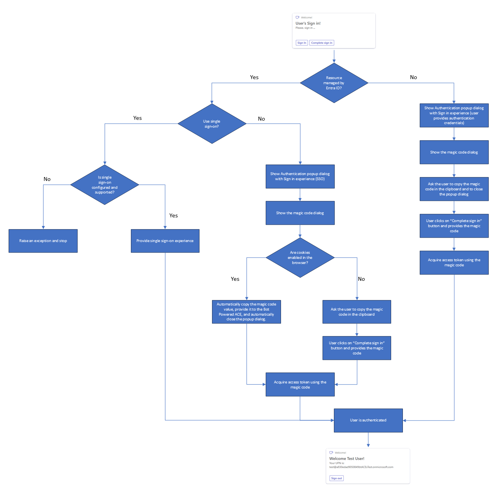

# Authentication and Authorization in Bot Powered Adaptive Card Extensions

Bot Powered Adaptive Card Extensions (ACEs) often require a security context. In fact, whenever you need to identify the consumer tenant and/or the user consuming your ACE you need to rely on Authentication. Whenever you need to enable functionalities based on the current user's profile, you need to rely on Authorization.
Being the Bot Powered ACEs based on the Azure Bot technology, also Authentication and Authorization use the same security architecture of regular Azure Bots.
To secure a Bot Powered ACE, there are some configuration steps that you need to accomplish. You also need to write some code in your implementation to handle the sign-in and sign out flows. In this article, you learn about the architecture of Bot Powered ACEs from a security point of view.

## Understanding the Bot Powered ACE authentication options

Before digging into the actual development of the authentication logic in the Bot Powered ACEs, it's important to understand how the authentication flow works.

In fact, you can support different scenarios:
- [Microsoft Entra ID Single Sign-on (SSO)](#microsoft-entra-id-single-sign-on-sso)
- [Other OAuth Identity Providers with Bot Framework magic code](#other-oauth-identity-providers-with-bot-framework-magic-code)

The following diagram explains how the authentication flow works.

In the following sections, you can find additional information about each of the available options.

### Microsoft Entra ID Single Sign-on (SSO)

If you choose to support Microsoft Entra ID (previously known as Azure Active Directory v2) single sign-on, the user's authentication is automatic and transparent to the user. Your code automatically gets the security context and you can easily access information about who the current user is. You can also retrieve an access token to consume Microsoft Graph or any other third party APIs on behalf of the current user. Indeed, in order to get an access token the Microsoft App behind the scenes of your Bot Powered ACE needs to be granted permissions accordingly.

To support Microsoft Entra ID SSO, there are some configuration requirements that you need to accomplish and you need to provide specific logic in the code of the Bot Powered ACE. You can find detailed explanation of this scenario reading the article ["Building Bot Powered Adaptive Card Extensions with Microsoft Entra ID and Single Sign-on."](./AuthN-and-AuthZ-in-Bot-Powered-ACEs-Entra.md)

If your code has single sign-on logic but the application isn't set up correctly in Microsoft Azure, the Bot Powered ACE doesn't show up. If that is the case, users see an error when adding the Bot Powered ACE to the dashboard.

### Other OAuth Identity Providers with Bot Framework magic code

Another option that you have is to rely on external OAuth Identity Providers, which can still be Microsoft Entra ID or any other third party Identity Provider. For example, the third party Identity Provider can be: GitHub, Facebook, Live, Google, etc. If that is the case, the authentication requires you to manually handle a magic code value provided by the user during the authentication phase, based on how the bot framework authentication works. 

In this scenario, when the user signs in there's a popup dialog (both on desktop and on mobile) taking care of the actual authentication. The dialog allows the user to authenticate against the target Identity Provider. Then, the bot framework returns a magic code (a sequence of numbers), which you can then use in your own Bot code to acquire a token through an OAuth connection. The user needs to copy the value of the magic code and provide it manually to your ACE. It's up to you to provide a custom button to do so. When the user selects the button, you can show a custom UI and collect the magic code in the logic. Once you have the magic code, you can acquire an actual access token. At the time of this writing, you need to manually define the UI to collect the magic code value. In fact, there isn't any native component, Card View template, or Quick View template to do that.

When the Identity Provider is Microsoft Entra ID and the user is on a desktop environment, the flow is handled automatically. In this scenario, you just need to use the magic code in your custom logic to get a token. However, there are situations where the automatic handling of the magic code isn't supported. For example, on smartphone and tablet devices, or when the browser doesn't support cookies, etc. there's no automatic handling of the magic code. In the scenarios where there isn't automatic authentication for Microsoft Entra ID, the user still needs to copy the value of the magic code and provide it manually to your ACE.

You can find implementation details about this scenario reading the article ["Building Bot Powered Adaptive Card Extensions with Magic Code authentication."](./AuthN-and-AuthZ-in-Bot-Powered-ACEs-Magic-Code.md)

## Important things to know

There are some architectural things that are worth being aware of, when developing custom Bot Powered ACEs with authentication and authorization:

1. If you rely on single sign-on for all of your Bot Powered ACEs, all of the ACEs automatically authenticate the user when opening the dashboard both on desktop and mobile devices (smartphone or tablet).
1. If you have multiple instances of the same card in a Viva Connections Dashboard, when a user signs in through one of those instances, the security context is shared across all of the instances. Moreover, the user is authenticated in all of the devices and all of the experiences (for example desktop and mobile). However, you need to refresh the page to let the other instances know that there's a security context. In fact, Bot Powered ACEs are a **pull** technology and currently isn't possible to notify card instances about changes of the security context.
1. For the same reason as before, also when a user signs out, all the instances of the same card loose the security context, but you need to refresh the page to make the other instances aware of the new security context.
1. When you have Microsoft Entra ID authentication with single sign-on configured for an ACE, it isn't possible to sign out the current user, because whenever the user signs out then the automatic authentication logic signs the user in again.
1. If you have different Bot Powered ACEs in the same dashboard with support for authentication but without single sign-on, users need to sign in and sign out individually on each of them. In fact, the security context is shared only across ACEs of the same type.
1. As already stated in the article, the experience to collect the magic code value is mandatory, when you rely on magic code, and is required for Microsoft Entra ID authentication, too. In fact, if the user's browser blocks cookies, the end user needs to manually copy the magic code value in the clipboard and provide it to the ACE custom logic.
1. When you rely on single sign-on, on the contrary, you don't need to implement any experience to collect the magic code value.
