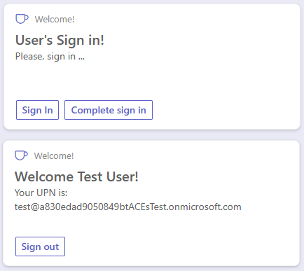
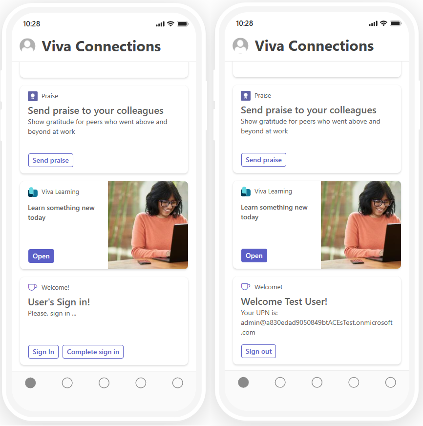
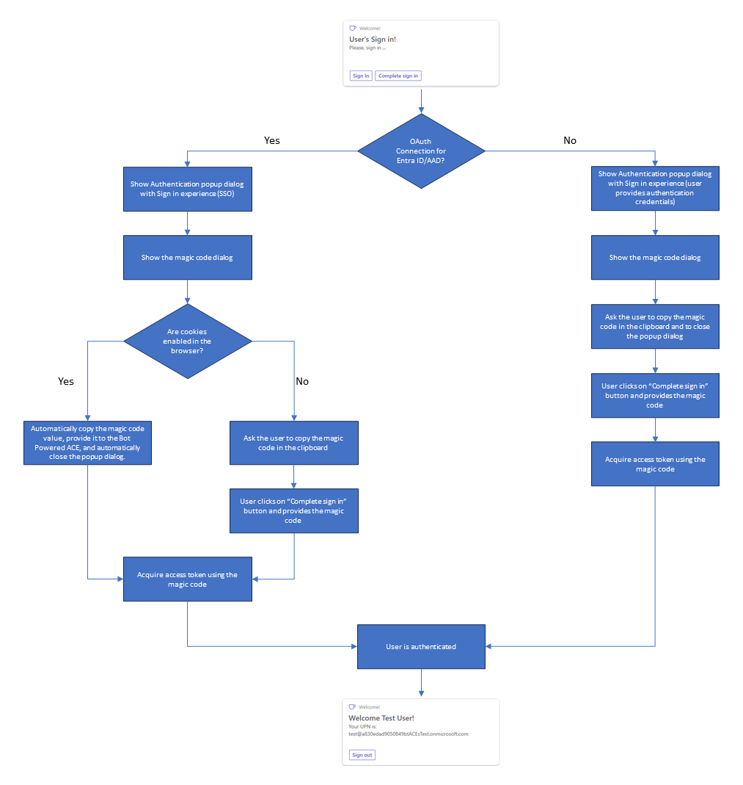

# Authentication and Authorization in Bot Powered Adaptive Card Extensions

Bot Powered Adaptive Card Extensions (ACEs) often require a security context. In fact, whenever you need to identify the consumer tenant and/or the user you need to rely on Authentication. Whenever you need to enable functionalities based on the current user's profile, you need to rely on Authorization.
Being the Bot Powered ACEs based on the Azure Bot technology, also Authentication and Authorization use the same security architecture of regular Azure Bots.
To secure a Bot Powered ACE, there are some configuration steps that you need to accomplish. You also need to write some code in your implementation to handle the sign-in and sign out flows. In this article, you learn how to secure a Bot Powered ACE in order to authenticate and authorize a user.

## Understanding the sample scenario

Let's assume that you want to create a Bot Powered ACE to write a welcome message for users, writing their name and the user principal name in a Card View. You want to authenticate users via OAuth with Microsoft Entra ID. Following picture, you can see how the Adaptive Card Extension looks like in the Viva Connections desktop experience.



Following picture you can see how the Adaptive Card Extension looks like in the Viva Connections mobile experience.



From a developer point of view, you build the ACE once and you benefit of it in both desktop and mobile experiences.
The whole source code of the .NET sample is available in the following GitHub repository: [Welcome User Bot Powered ACE](https://github.com/pnp/viva-dev-bot-powered-aces/tree/main/samples/dotnet/WelcomeUserBotPoweredAce).

## Developing a Secured Bot Powered ACE with Microsoft .NET

First of all, you should create a Bot Powered ACE following the guidance provided in article ["Building your first Bot Powered Adaptive Card Extension."](./Building-Your-First-Bot-Powered-ACE.md)
For the sake of simplicity, assume that the Bot Powered ACE project name is "WelcomeUserBotPoweredAce" and register the Azure Bot accordingly to the above guidance. Stop before the section ["Implement the actual Bot Powered ACE."](./Building-Your-First-Bot-Powered-ACE.md#implement-the-actual-bot-powered-ace)

### Configuring security for a Bot Powered ACE

Before starting to develop the actual Bot Powered ACE, you need to slightly enrich the configuration of the Azure Bot.
Open the "Configuration" panel of the Azure Bot and select the "Manage Password" link, to access the Microsoft App behind the scenes of the Azure Bot. In the Microsoft Entra ID application, select the Authentication panel and add the following URL as another "Redirect URI" for the application.

```http
https://token.botframework.com/.auth/web/redirect
```

Select the "Save" button of the Authentication page when you're done configuring the extra URL. Go back to the "Configuration" panel of the Azure Bot and select the "Add OAuth Connection Settings" button to configure an OAuth connection.


You're prompted with a panel to configure the name of the new OAuth connection and the service provider that you want to use. The name can be whatever text you like, but you need to save it in a safe place because you need it later. Let's name the connection "WelcomeUserBot-EntraID." The service provider defines the Identity Provider to use for the actual OAuth connection. There are plenty of options. Choose "Azure Active Directory v2" in order to rely on Microsoft Entra ID.
After selecting the service provider, you have to configure it. For "Azure Active Directory v2" you have to provide:

* Client ID: the client ID of the Microsoft App behind the scenes of your Azure Bot. It's the value that you get while registering the Azure Bot.
* Client secret: the client secret of the Microsoft App behind the scenes of your Azure Bot. It's the value that you get while registering the Azure Bot.
* Token exchange URL: the URL to retrieve an OAuth token for your Microsoft App. For a multitenant application, it should be like: *https://login.microsoftonline.com/common/oauth2/v2.0/token*. Notice the *common* part, which for a single-tenant application should be replaced with the actual tenant ID of the target tenant.
* Tenant ID: the tenant ID of the Microsoft App behind the scenes of your Azure Bot. For a multitenant application, it should be *common*. For a single-tenant application, it's the tenant ID of the target tenant.
* Scopes: space separated list of delegated permission scopes that you want to have in the OAuth Access Token when the user signs-in to your ACE. They must be configured and granted in the "API permissions" panel of the Microsoft App behind the scenes of your Azure Bot.

Once configured the new OAuth connection, select the "Save" button, and eventually select also the "Test Connection" button to test the connection. Following picture shows the OAuth connection panel properly configured.


If you select the "Test Connection" button, you can get a preview of an OAuth Access Token for your Azure Bot for the current user. Following picture shows how the "Test Connection" functionality gives you access to the Access Token.


If you select the "Copy Token" button, you can then open the [https://jwt.ms](https://jwt.ms) web site in a web browser, paste the token value, and have a look at its content for learning and debugging purposes only.

> [!NOTE]
> If you inspect the claims of the token, you can see the `aud` (Audience, which is the Client ID of the Microsoft Graph) `app_displayname` (App display name), `iss` (Token issuer), `appid` (Client ID), `tid` (Tenant ID), `scp` (Permission scopes). You can also double-check that they refer to the application that you just configured.

## Understanding the Bot Powered ACE authentication flow

Before digging into the actual development of the authentication logic in the Bot Powered ACE, it's important to understand how the authentication flow works.
Whenever you configure an OAuth connection for your Bot, when the user signs in there's a popup dialog (both on desktop and on mobile) taking care of the actual authentication. The dialog allows the user to authenticate against the target Identity Provider. Then, it returns a magic code (a sequence of numbers), which you can then use in your own Bot code to acquire a token through the OAuth connection.
When the configured Identity Provider is Microsoft Entra ID (also known as Azure Active Directory) the handling of the magic code is automatic and you need to use it in your code to acquire a token. For other Identity Providers, the user needs to copy the value of the magic code and provide it manually to your ACE. It's up to you to provide a custom button to do so. When the user selects the button, you can show a custom UI and collect the magic code in the logic. Once you have the magic code, you can acquire an actual access token. At the time of this writing, you need to manually define the UI to collect the magic code value. In fact, there isn't any native component or Card View template to do that.
Even when you use Microsoft Entra ID, in case the user's browser blocks cookies, the end user needs to manually copy the magic code value in the clipboard. Then, they need to provide it to the Bot Powered ACE via a custom "Complete sign in" button and a custom developed user experience.
The following diagram explains how the authentication flow works.



Let's move to the actual implementation of the Bot Powered ACE to implement the above flow.

### Implementing security in your Bot

Go back to the Visual Studio project that you created before. Open the **appsettings.json** file and add a new setting called "ConnectionName" and set its value to the name of the OAuth connection that you created. Here you can see how the settings file should look like.

```JSON
{
  "MicrosoftAppType": "MultiTenant",
  "MicrosoftAppId": "<App-Client-ID>",
  "MicrosoftAppPassword": "<Client-Secret>",
  "MicrosoftAppTenantId": "<Tenant-ID>",
  "ConnectionName": "<Connection-Name>"
}
```

Rename the **EmptyBot.cs** file into **WelcomeUserBot.cs**, change the base class from `ActivityHandler` to `SharePointActivityHandler` and import the namespace `Microsoft.Bot.Builder.SharePoint`.
Follow the instructions provided in the ["Implement the actual Bot Powered ACE"](./Building-Your-First-Bot-Powered-ACE.md#implement-the-actual-bot-powered-ace) section of the reference article ["Building your first Bot Powered Adaptive Card Extension"](./Building-Your-First-Bot-Powered-ACE.md) to implement the basic code of the Bot Powered ACE. Specifically, implement four Card Views:

* Welcome: it's the Card View that shows the welcome message with user display name and user principal name of the currently authenticated user.
* Sign-In: it's the Card View to allow an end user to sign-in via Microsoft Entra ID.
* Signed-Out: it's the Card View to confirm when an authenticated user signed out.
* Error: it's the Card View to show an error message, in case an error occurs.

In the following code excerpt, you can see how the welcome Card View is defined in the constructor of the Bot.

```CSharp
// Prepare ACE data for all Card Views
var aceData = new AceData()
{
    Title = "Welcome!",
    CardSize = AceData.AceCardSize.Large,
    DataVersion = "1.0",
    Id = adaptiveCardExtensionId
};

// Home Card View (Primary Text Card View)
CardViewResponse homeCardViewResponse = new CardViewResponse();
homeCardViewResponse.AceData = aceData;
homeCardViewResponse.CardViewParameters = CardViewParameters.PrimaryTextCardViewParameters(
    new CardBarComponent()
    {
        Id = "HomeCardView",
    },
    new CardTextComponent()
    {
        Text = "Welcome <displayName>!"
    },
    new CardTextComponent()
    {
        Text = "Your UPN is: <upn>"
    },
    new List<BaseCardComponent>()
    {
        new CardButtonComponent()
        {
            Id = "SignOut",
            Title = "Sign out",
            Action = new SubmitAction()
        }

    });
homeCardViewResponse.ViewId = HomeCardView_ID;

cardViews.TryAdd(homeCardViewResponse.ViewId, homeCardViewResponse);
```

As you can see, it's a Primary Text Card View, which simply renders a text with the current user display name in the header. There's also another text with the user principal name in the body. Additionally there's a "Sign out" button that allows the user to sign out, when there's a current authenticated session.

The Sign-In card is a bit more challenging:

```CSharp
// SignIn Card View (Sign-In Card View)
CardViewResponse signInCardViewResponse = new CardViewResponse();
signInCardViewResponse.AceData = aceData;
signInCardViewResponse.CardViewParameters = CardViewParameters.SignInCardViewParameters(
    new CardBarComponent()
    {
        Id = "SignInCardView",
    },
    new CardTextComponent()
    {
        Text = "User's Sign in!"
    },
    new CardTextComponent()
    {
        Text = "Please, sign in ..."
    },
    new CardButtonComponent()
    {
        Id = "CompleteSignInButton",
        Title = "Complete sign in",
        Action = new QuickViewAction()
        {
            Parameters = new QuickViewActionParameters()
            {
                View = SignInQuickView_ID
            }
        }
    }
    );
signInCardViewResponse.CardViewParameters.CardViewType = "signIn";
signInCardViewResponse.ViewId = SignInCardView_ID;

cardViews.TryAdd(signInCardViewResponse.ViewId, signInCardViewResponse);
```

First of all, you need to use the `SignInCardViewParameters` factory method to create a Sign In Card View, which is designed to implement the sign in logic. The Sign In Card View looks like a Primary Text Card View, in fact there are text components both in the header and in the body. However, the footer requires you to provide a button to implement extra logic to handle the completion of the sign in flow. By default, any Sign In Card View has a Sign in button that is provided out of the box in the Card View template. The extra button defined in the Card View is the one to implement the "Complete sign in" logic, which is needed as explained in the flow diagram in section ["Understanding the Bot Powered ACE authentication flow."](#understanding-the-bot-powered-ace-authentication-flow)
In the sample implementation, when the user selects the "Complete sign in" button a custom Quick View is rendered in order to collect the magic code and process it to acquire the access token.
One last important thing to notice is the setting of the `CardViewType` property for the Card View object to value `signIn`.

In the following code excerpt you can see the SignedOut card implementation, which defines a card that confirms to the user that the sign out was completed:

```CSharp
// Signed out Card View (Basic Card View)
CardViewResponse signedOutCardViewResponse = new CardViewResponse();
signedOutCardViewResponse.AceData = aceData;
signedOutCardViewResponse.CardViewParameters = CardViewParameters.BasicCardViewParameters(
    new CardBarComponent()
    {
        Id = "SignedOutCardView",
    },
    new CardTextComponent()
    {
        Text = "You are now signed out!"
    },
    new List<BaseCardComponent>()
    {
        new CardButtonComponent()
        {
            Id = "OkSignedOut",
            Title = "Ok",
            Action = new SubmitAction()
            {
                Parameters = new Dictionary<string, object>()
                {
                    { "viewToNavigateTo", HomeCardView_ID }
                }
            }
        }
    });
signedOutCardViewResponse.ViewId = SignedOutCardView_ID;

cardViews.TryAdd(signedOutCardViewResponse.ViewId, signedOutCardViewResponse);
```

The Signed out Card View is a basic card with a simple text message in the body and a button to go back to the home Card View.
In the sample solution, there's also an Error Card View, which for the sake of simplicity isn't illustrated in the article but is available in the [reference solution](https://github.com/pnp/viva-dev-bot-powered-aces/tree/main/samples/dotnet/WelcomeUserBotPoweredAce).

Here follows the definition of the Quick View used to implement the "Complete sign in" logic.

```CSharp
// Complete Sign In Quick View
QuickViewResponse signInQuickViewResponse = new QuickViewResponse();
signInQuickViewResponse.Title = "Sign In";
signInQuickViewResponse.Template = new AdaptiveCard("1.5");

AdaptiveContainer signInContainer = new AdaptiveContainer();
signInContainer.Separator = true;

AdaptiveTextBlock signInTitleText = new AdaptiveTextBlock
{
    Text = "Complete Sign In",
    Color = AdaptiveTextColor.Dark,
    Weight = AdaptiveTextWeight.Bolder,
    Size = AdaptiveTextSize.Medium,
    Wrap = true,
    MaxLines = 1,
    Spacing = AdaptiveSpacing.None
};
signInContainer.Items.Add(signInTitleText);

AdaptiveTextBlock signInDescriptionText = new AdaptiveTextBlock
{
    Text = "Input the magic code from Microsoft Entra ID to complete sign in.",
    Color = AdaptiveTextColor.Dark,
    Size = AdaptiveTextSize.Default,
    Wrap = true,
    MaxLines = 6,
    Spacing = AdaptiveSpacing.None
};
signInContainer.Items.Add(signInDescriptionText);

AdaptiveNumberInput signInMagicCodeInputField = new AdaptiveNumberInput
{
    Placeholder = "Enter Magic Code",
    Id = "magicCode"
};
signInContainer.Items.Add(signInMagicCodeInputField);

AdaptiveSubmitAction signInSubmitAction = new AdaptiveSubmitAction
{
    Title = "Submit",
    Id = "SubmitMagicCode"
};
signInQuickViewResponse.Template.Actions.Add(signInSubmitAction);

signInQuickViewResponse.Template.Body.Add(signInContainer);
signInQuickViewResponse.ViewId = SignInQuickView_ID;

quickViews.TryAdd(signInQuickViewResponse.ViewId, signInQuickViewResponse);
```

It's a Quick View with a number input field with ID **magicCode** and a submit button with ID **SubmitMagicCode**. The following picture shows the Quick View in action.


> [!IMPORTANT]
> Being the "Complete sign in" user experience developed by you, it is completely customizable. So the layout, text messages, buttons, etc. are up to you and you can freely design them.

### Handling the magic code

Once you have the magic code, either automatically with Microsoft Entra ID single sign-on or manually with any other Identity Provider, you need to process its value to acquire an actual access token. Depending on the sign in flow, you can handle the magic code while rendering a Card View in the `OnSharePointTaskGetCardViewAsync` method, or in the `OnSharePointTaskHandleActionAsync` method when the user submits the magic code via the "Complete sign in" experience.

#### Automatically handling the magic code

In the following code excerpt, you can see how to process the magic code automatically submitted by the Microsoft Entra ID SSO experience.

```CSharp
protected async override Task<CardViewResponse> OnSharePointTaskGetCardViewAsync(ITurnContext<IInvokeActivity> turnContext, AceRequest aceRequest, CancellationToken cancellationToken)
{
    JObject aceData = aceRequest.Data as JObject;
    string magicCode = null;
    if (aceData["magicCode"] != null)
    {
        magicCode = aceData["magicCode"].ToString();
    }
    // Check to see if the user has already signed in
    var (displayName, upn) = await GetAuthenticatedUser(magicCode, turnContext, cancellationToken);
    if (displayName != null && upn != null)
    {
        var homeCardView = cardViews[HomeCardView_ID];
        if (homeCardView != null)
        {
            ((homeCardView.CardViewParameters.Header.ToList())[0] as CardTextComponent).Text = $"Welcome {displayName}!";
            ((homeCardView.CardViewParameters.Body.ToList())[0] as CardTextComponent).Text = $"Your UPN is: {upn}";
            return homeCardView;
        }
    }
    else
    {
        var signInCardView = cardViews[SignInCardView_ID];
        if (signInCardView != null)
        {
            var signInResource = await GetSignInResource(turnContext, cancellationToken);
            var signInLink = signInResource != null ? new Uri(signInResource.SignInLink) : new Uri(string.Empty);

            signInCardView.AceData.Properties = Newtonsoft.Json.Linq.JObject.FromObject(new Dictionary<string, object>() {
                { "uri", signInLink },
                { "connectionName", this._connectionName }
            });
            return signInCardView;
        }
    }

    return cardViews[ErrorCardView_ID];
}
```

You can retrieve the value of the magic code from the object of type `AceRequest` provided to the `OnSharePointTaskGetCardViewAsync` method. The magic code value is a property of the property of type `JObject` with name `Data`. Once you have the magic code value, you need to provide it to an infrastructural service of type `UserTokenClient`, which is available via dependency injection in the Bot logic.
To properly handle the user token, which is a JWT (JSON Web Token) object, you can use the `System.IdentityModel.Tokens.Jwt` NuGet package. As such, add the package to your project and implement the following infrastructural methods like in the following code excerpt.

```CSharp
private async Task<(string displayName, string upn)> GetAuthenticatedUser(string magicCode, ITurnContext<IInvokeActivity> turnContext, CancellationToken cancellationToken)
{
    string displayName = null;
    string upn = null;

    try
    {
        var response = await GetUserToken(magicCode, turnContext, cancellationToken).ConfigureAwait(false);
        if (response != null && !string.IsNullOrEmpty(response.Token))
        {
            var token = new System.IdentityModel.Tokens.Jwt.JwtSecurityToken(response.Token);
            displayName = token.Claims.FirstOrDefault(c => c.Type == "name")?.Value;
            upn = token.Claims.FirstOrDefault(c => c.Type == "upn")?.Value;
        }
    }
    catch (Exception ex)
    {
        _logger.LogError(ex, "Error while trying to retrieve current user's displayName and UPN!");
    }

    return (displayName, upn);
}

private async Task<TokenResponse> GetUserToken(string magicCode, ITurnContext<IInvokeActivity> turnContext, CancellationToken cancellationToken)
{
    // Get the UserTokenClient service instance
    var userTokenClient = turnContext.TurnState.Get<UserTokenClient>();

    // Assuming the bot is already configured for SSO and the user has been authenticated
    return await userTokenClient.GetUserTokenAsync(
        turnContext.Activity.From.Id,
        _connectionName, // The name of your Azure AD connection
        turnContext.Activity.ChannelId,
        magicCode,
        cancellationToken).ConfigureAwait(false);
}
```

The `GetAuthenticatedUser` method accepts the magic code value and the Bot `TurnContext` instance. Internally it uses the `GetUserToken` method to retrieve the actual access token value and then uses the `JwtSecurityToken` class of `System.IdentityModel.Tokens.Jwt` to decode the token and get access to the user's display name and user principal name.

> [!NOTE]
> Using the same technique and reading the **scp** claim (Scope) or any other claim of your interest, you can eventually implement custom authorization logic for your Bot Powered ACE.

The `GetUserToken` method retrieves an instance of the `UserTokenClient` service and makes the actual request for the token using the `GetUserTokenAsync`, which accepts the following input arguments:

* the ID of the sender (From) for the current Activity of the Bot instance
* the name of the OAuth connection defined in the configuration of the Azure Bot
* the ID of the Channel for the Bot instance
* the magic code value
* the cancellation token for the asynchronous request

The result of the `GetUserTokenAsync` method is an instance of the `TokenResponse` type that includes a `Token` property with the actual value of the access token.
Once you have the access token and you extracted the display name and the user principal name, you can render them in the welcome Card View.

In case there's no magic code value in the request object there could be two different scenarios:

* the user is already signed in: the backend infrastructure of the Azure Bot automatically provides a token for the current user, without the need to provide the magic code
* the user isn't yet signed in: the Bot Powered ACE needs to render the Sign In Card View to invite the user to sign in

In the latter scenario, the Sign In Card View needs to be configured with a couple of properties to instruct the Bot infrastructure about how to handle the sign in flow. Specifically, you need to provide to custom properties through the `AceData.Properties` of the card.

```CSharp
var signInResource = await GetSignInResource(turnContext, cancellationToken);
var signInLink = signInResource != null ? new Uri(signInResource.SignInLink) : new Uri(string.Empty);

signInCardView.AceData.Properties = Newtonsoft.Json.Linq.JObject.FromObject(new Dictionary<string, object>() {
    { "uri", signInLink },
    { "connectionName", this._connectionName }
});
return signInCardView;
```

The **uri** property represents the URL to trigger the sign in flow and needs to be retrieved using the `UserTokenClient` service. Here you can see how to do that with the custom method `GetSignInResource`.

```CSharp
private async Task<SignInResource> GetSignInResource(ITurnContext<IInvokeActivity> turnContext, CancellationToken cancellationToken)
{
    // Get the UserTokenClient service instance
    var userTokenClient = turnContext.TurnState.Get<UserTokenClient>();

    // Retrieve the Sign In Resource from the UserTokenClient service instance
    var signInResource = await userTokenClient.GetSignInResourceAsync(_connectionName, (Microsoft.Bot.Schema.Activity)turnContext.Activity, null, cancellationToken).ConfigureAwait(false);
    return signInResource;
}
```

While the **connectionName** property contains the name of the OAuth connection configured for the Azure Bot.

#### Manually handling the magic code with the "Complete sign in" custom logic

In case you need to manually handle the magic code, you need to implement some custom logic in the `OnSharePointTaskHandleActionAsync` method. Here follows a code excerpt of the method.

```CSharp
protected async override Task<BaseHandleActionResponse> OnSharePointTaskHandleActionAsync(ITurnContext<IInvokeActivity> turnContext, AceRequest aceRequest, CancellationToken cancellationToken)
{
    if (turnContext != null)
    {
        if (cancellationToken.IsCancellationRequested)
        {
            cancellationToken.ThrowIfCancellationRequested();
        }
    }
    JObject actionParameters = aceRequest.Data as JObject;

    if (actionParameters != null)
    {
        var actionId = actionParameters["id"].ToString();
        if (actionId == "SubmitMagicCode")
        {
            var magicCode = actionParameters["data"]["magicCode"].ToString();
            var (displayName, upn) = await GetAuthenticatedUser(magicCode, turnContext, cancellationToken);

            var homeCardView = cardViews[HomeCardView_ID];
            if (homeCardView != null && displayName != null && upn != null)
            {
                ((homeCardView.CardViewParameters.Header.ToList())[0] as CardTextComponent).Text = $"Welcome {displayName}!";
                ((homeCardView.CardViewParameters.Body.ToList())[0] as CardTextComponent).Text = $"Your UPN is: {upn}";

                return new CardViewHandleActionResponse
                {
                    RenderArguments = homeCardView
                };
            }
        }
        else if (actionId == "SignOut")
        {
            await SignOutUser(turnContext, cancellationToken);

            return new CardViewHandleActionResponse
            {
                RenderArguments = cardViews[SignedOutCardView_ID]
            };
        }
        else if (actionId == "OkSignedOut")
        {
            return new CardViewHandleActionResponse
            {
                RenderArguments = cardViews[SignInCardView_ID]
            };
        }
        else if (actionId == "OkError")
        {
            return new CardViewHandleActionResponse
            {
                RenderArguments = cardViews[HomeCardView_ID]
            };
        }
    }

    return new CardViewHandleActionResponse
    {
        RenderArguments = cardViews[ErrorCardView_ID]
    };
}
```

The key part of the method is still the processing of the object of type `AceRequest`. If the user selects the "Submit" button in the "Complete sign in" Quick View, you can extract the magic code value from the `Data` property of the request and then you can go through the same process as before, invoking the `GetAuthenticatedUser` method.

In the above code excerpt, you can also see how the sign out is handled, invoking the `SignOutUser` method, which is illustrated in the following code excerpt.

```CSharp
private async Task SignOutUser(ITurnContext<IInvokeActivity> turnContext, CancellationToken cancellationToken)
{
    // Get the UserTokenClient service instance
    var userTokenClient = turnContext.TurnState.Get<UserTokenClient>();

    // Sign out the current user
    await userTokenClient.SignOutUserAsync(
        turnContext.Activity.From.Id,
        _connectionName, // The name of your Azure AD connection
        turnContext.Activity.ChannelId,
        cancellationToken).ConfigureAwait(false);
}
```

The method uses the `UserTokenClient` service to invoke its `SignOutUserAsync` method.

### Configuring the manifest

The implementation of the Bot Powered ACE is now complete and you just need to create a manifest file and deploy it into the target tenant SharePoint Online App Catalog. You can find step by step instructions about how to do that in the section ["Define the **manifest.json** file for the solution"](./Building-Your-First-Bot-Powered-ACE.md#define-the-manifestjson-file-for-the-solution) section of the reference article ["Building your first Bot Powered Adaptive Card Extension."](./Building-Your-First-Bot-Powered-ACE.md)

To properly support authentication, you need to add a `webApplicationInfo` section to the **manifest.json** file, like illustrated in the following excerpt.

```JSON
  "webApplicationInfo": {
    "id": "<App-Client-ID>",
    "resource": "api://<your-ngrok-reverse-proxy-name>.ngrok.io/<App-Client-ID>"
  },
```

The `id` property is the actual Client ID of the Microsoft App behind the scenes of your Azure Bot. The `resource` property is the unique URI that you configured for that Microsoft App.

You're now ready to package the solution, deploy it on the SharePoint Online App Catalog, and play with. You can follow the instructions provided in section ["Run and test the solution"](./Building-Your-First-Bot-Powered-ACE.md#run-and-test-the-solution) of the reference article ["Building your first Bot Powered Adaptive Card Extension."](./Building-Your-First-Bot-Powered-ACE.md)


## Important things to know

There are some architectural things that are worth being aware of when developing custom Bot Powered ACEs with authentication and authorization:

1. If you have multiple instances of the same card in a Viva Connections Dashboard, when a user signs in through one of those instances, the security context is shared across all of the instances. Moreover, the user is authenticated in all of the devices and all of the experiences (for example desktop and mobile). However, you need to refresh the page to let the other instances know that there's a security context. In fact, Bot Powered ACEs are a **pull** technology and currently isn't possible to notify card instances about changes of the security context.
1. For the same reason as before, also when a user signs out, all the instances of the same card loose the security context, but you need to refresh the page to make the other instances aware of the new security context.
1. If you have multiple Bot Powered ACEs with support for authentication in the same dashboard, users need to sign in and sign out individually on each of them. In fact, the security context is shared only across ACEs of the same type.
1. As already stated in the article, the "Complete sign in" experience is mandatory in the Sign In Card View template and is required for Microsoft Entra ID authentication, too. In fact, if user's browser blocks cookies, the end user needs to manually copy the magic code value in the clipboard and provide it to the ACE custom logic.
