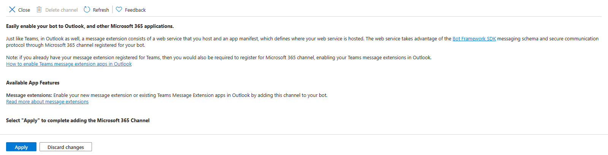

# Building your first Bot Powered Adaptive Card Extension with Microsoft Teams Toolkit and TypeScript

Bot Powered Adaptive Card Extensions (ACEs) for Microsoft Viva Connections enable extending the Microsoft Viva Connections Dashboard using the Bot development model.

From a development point of view, a Bot Powered ACE behaves like a regular client-side ACE built with SharePoint Framework (SPFx). As such, you can render Card Views, Quick Views, you can provide properties configurable via a Property Pane, and you can implement specific behaviors to handle actions in the user interface of the ACE. You can learn more about the basics of client-side Adaptive Card Extensions for Microsoft Viva Connections by reading the tutorial [Build your first SharePoint Adaptive Card Extension](../get-started/build-first-sharepoint-adaptive-card-extension.md).

You can build Bot Powered ACEs either using C# and .NET or using TypeScript and Node.js. In this tutorial, you learn how to build a basic Bot Powered ACE using the Microsoft Teams Toolkit in Visual Studio Code and TypeScript, with a step-by-step approach.

You can learn more about the architecture of the Bot Powered ACEs by reading the article [Understanding Bot Powered Adaptive Card Extensions](./Understanding-Bot-Powered-ACEs.md).

## Developing a Bot Powered ACE with Microsoft Teams Toolkit

In this tutorial, you're going to build a basic Bot Powered ACE to collect the user's feedback via a Card View with a textbox and a submission button. In the following picture, you can see how the Adaptive Card Extension looks like in the Viva Connections desktop experience.


In the following picture, you can see how the Adaptive Card Extension looks like in the Viva Connections mobile experience.


From a developer point of view, you build the ACE once and you benefit from it in both desktop and mobile experiences.

### Prerequirements

First of all, in order to develop a Bot Powered ACE with Microsoft Teams Toolkit and TypeScript, you need to have the following tools and packages installed on your development machine:

* Microsoft Visual Studio Code
* Microsoft Teams Toolkit version 5.10.0 or higher

You also need to have an active and valid Microsoft Azure subscription to host the Azure Bot.

## Creating the Bot solution in Visual Studio Code with Microsoft Teams Toolkit

Start Visual Studio Code and select the Microsoft Teams Toolkit icon on the command bar. Select the **Create a New App** button to start scaffolding the solution, as illustrated in the following screenshot:

.

Select the option **Bot** and then **Basic Bot**, to create a basic scaffolding of a Bot with the Bot Framework for JavaScript.


Select to use **TypeScript** as the language for the Bot and select a target folder to store the source code of the solution. Provide a name for the solution, for example, **collect-feedback-ts**. The new solution gets scaffolded and Visual Studio Code opens a new window targeting the project folder. In case Visual Studio asks you to trust the folder, select the option **Yes, I trust the authors**.


It's important to understand the structure of the project created by the Microsoft Teams Toolkit. Here are the main elements:

- **appPackage** folder: contains the **manifest.json** file and a couple of icons for the Microsoft 365 application. 
- **env** folder: contains the configuration files for all the environments supported by the solution. Using the Microsoft Teams Toolkit you can create and manage the environments.
- **infra** folder: contains a set of Bicep files used to provision on Microsoft Azure the resources and services used to host the actual solution for the Bot.
- **index.ts**: the main entry point of the Bot solution. Here, the Bot gets created and the HTTP server listens for API messages targeting the Bot. 
- **teamsBot.ts**: implements the actual logic of the Bot.

.

First of all, rename the **teamsBot.ts** file into **collectFeedbackBot.ts**. Accept to update the imports in code, and to rename the class `TeamsBot` into `CollectFeedbackBot` using the "Rename Symbol" functionality of Visual Studio Code. 

Then, upgrade the package with name **botbuilder** to version 4.23.1 or higher. You can use the npm command line tool using the following command:

```console
npm i botbuilder --save
```

Install also all the other packages needed by the solution using the following command:

```console
npm i
```

Once all the packages are installed, you can proceed with the actual implementation of the Bot Powered ACE.

## Update the Bot code to support Bot Powered ACEs

Open the bot source code file (**collectFeedbackBot.ts**) and replace the base class `TeamsActivityHandler` with the base class `SharePointActivityHandler`. Empty the content of the constructor and remove any other code. Add a set of overrides for all the methods with name starting with `onSharePointTask*` and so far leave them with the default implementation.

Update the import of types accordingly to the new methods declarations, at the top of the source code file. 

Here follows the resulting class implementation.

```TypeScript
import { 
    SharePointActivityHandler, TurnContext, AceRequest, AceData,
    CardViewResponse, QuickViewResponse, HandleActionResponse, CardViewHandleActionResponse, 
    GetPropertyPaneConfigurationResponse, SetPropertyPaneConfigurationResponse,
    ImageCardView    
} from "botbuilder";
import * as AdaptiveCards from "adaptivecards";
  
export class CollectFeedbackBot extends SharePointActivityHandler {

    constructor() {
        super();        
    }

    protected override onSharePointTaskGetCardViewAsync(_context: TurnContext, _aceRequest: AceRequest): Promise<CardViewResponse> {
        return Promise.resolve(null);
    }

    protected override onSharePointTaskGetQuickViewAsync(_context: TurnContext, _aceRequest: AceRequest): Promise<QuickViewResponse> {
        return Promise.resolve(null);
    }

    protected override onSharePointTaskGetPropertyPaneConfigurationAsync(_context: TurnContext, _aceRequest: AceRequest): Promise<GetPropertyPaneConfigurationResponse>
    {
        return Promise.resolve(null);
    }

    protected override onSharePointTaskSetPropertyPaneConfigurationAsync(_context: TurnContext, _aceRequest: AceRequest): Promise<SetPropertyPaneConfigurationResponse>
    {
        return Promise.resolve(null);    
    }

    protected override onSharePointTaskHandleActionAsync(_context: TurnContext, _aceRequest: AceRequest): Promise<HandleActionResponse> {
        return Promise.resolve(null);
    }
}
```

Here follows a brief explanation of the overridable methods:

* `onSharePointTaskGetCardViewAsync`: handles the rendering of a Card View, returning a `CardViewResponse` instance.
* `onSharePointTaskGetQuickViewAsync`: handles the rendering of a Quick View, returning a `QuickViewResponse` instance.
* `onSharePointTaskGetPropertyPaneConfigurationAsync`: allows rendering the Property Pane of the ACE, returning a `GetPropertyPaneConfigurationResponse` instance.
* `onSharePointTaskSetPropertyPaneConfigurationAsync`: allows saving the settings configured using the Property Pane of the ACE, returning a `HandleActionResponse` instance.
* `onSharePointTaskHandleActionAsync`: handles a custom action in the ACE like the select on a button in a Card View or any custom action in the UI of a Quick View, returning a `HandleActionResponse` instance.

> [!NOTE]
> You can dig into the details of how Bot Powered ACEs work by reading the article [Understanding Bot Powered Adaptive Card Extensions](./Understanding-Bot-Powered-ACEs.md).

To implement the Collect Feedback ACE, you can only focus on `onSharePointTaskGetCardViewAsync` and `onSharePointTaskGetQuickViewAsync` to render the Card Views and the Quick View, as well as on the `onSharePointTaskHandleActionAsync` to handle the actual submission of the feedback. So far, you can remove the two methods for handling the property pane, which is covered in another article. You can now also remove the import of types `GetPropertyPaneConfigurationResponse` and `SetPropertyPaneConfigurationResponse`.

Every Bot Powered ACE has a unique ID, which is a string that identifies uniquely the ACE instance in the Viva Connections Dashboard. For that unique ID you can, for example, use a `Guid` value converted into a string or a unique string value. You can define such a value as a private readonly string variable in the Bot class definition.

Add to the Bot class definition also a few strings to define the IDs of the card views rendered by the ACE and a dictionary of items of type `CardViewResponse` to hold all the different card view definitions. Here follows the updated definition of the **collectFeedbackBot.ts** class.

```TypeScript
export class CollectFeedbackBot extends SharePointActivityHandler {

  private readonly _botId: string = 'CollectFeedbackBot';
  private _cardViews: { [key: string]: CardViewResponse } = {};

  private COLLECT_FEEDBACK_CARD_VIEW_ID: string = 'GET_FEEDBACK_CARD_VIEW';
  private OK_FEEDBACK_CARD_VIEW_ID: string = 'OK_FEEDBACK_CARD_VIEW';
  private SHOW_FEEDBACK_QUICK_VIEW_ID: string = 'FEEDBACK_QUICK_VIEW';

  // The remainder part of the class is omitted for the sake of simplicity...
}
```

### Rendering Card Views

Every `CardViewResponse` instance is made of a property named `aceData` that defines some aesthetic settings like the size of the card, its icon, the title, and the description. It also defines the unique ID of the card and a JSON object to represent some custom `properties`, if there's need. Every `CardViewResponse` provides a `viewId` string property, which declares a unique ID to identify the specific Card View instance for the ACE and which is mandatory to assign a value to. There's also an event with the name `onCardSelection`, which can be used to handle custom actions when the user selects the Card View.

Moreover, the `CardViewResponse` instance provides a property named `cardViewParameters` that defines the actual outline of the Card View. The content of the `cardViewParameters` property defines the structure of the components model used to render the card. The **botbuilder** package defines a set of functions to define different flavors of Card Views:

* `BasicCardView`: factory method to create a Basic Text Card View.
* `PrimaryTextCardView`: factory method to create a Primary Text Card View.
* `ImageCardView`: factory method to create an Image Card View.
* `TextInputCardView`: factory method to create a Text Input Card View.
* `SearchCardView`: factory method to create a Search Card View.
* `SignInCardView`: factory method to create a Sign-in Card View.

For instance, in order to create the Card View to collect user's feedback you can use the `TextInputCardView` factory method and define the components that make up the Card View. Furthermore, the Card View to confirm that the feedback was collected can be created using the `ImageCardView` method. It's a common habit to define the Card Views, and the Quick Views as well, in the constructor of the Bot, storing them in a static dictionary, where the item key is the `viewId` of the card. Then, based on the requested Card View, you can return the corresponding item of the dictionary as the result of the `onSharePointTaskGetCardViewAsync` method.

Here follows a sample implementation of the Bot constructor, defining all the card views needed by the actual implementation.

```TypeScript
constructor() {
    super();

    // Prepare the ACE data for all the card views and quick views.
    const aceData: AceData = {
        id: this._botId,
        title: 'Your feedback matters!',
        description: 'Please provide your feedback below.',
        cardSize: 'Large',
        iconProperty: 'Feedback',
        properties: {},
        dataVersion: '1.0',
    }; 
    
    // Collect Feedback Card View (Input Text Card View manual)
    const feedbackCardView: CardViewResponse = {
        aceData: aceData,
        cardViewParameters: {
            cardViewType: 'textInput',
            cardBar: [
                {
                    componentName: 'cardBar',
                    title: 'Feedback'
                }
            ],
            header: [
                {
                    componentName: 'text',
                    text: 'Please provide your feedback below.'
                }
            ],
            body: [
                {
                    componentName: 'textInput',
                    id: 'feedbackValue',
                    placeholder: 'Your feedback ...'
                }
            ],
            footer: [
                {
                    componentName: 'cardButton',
                    id: 'SendFeedback',
                    title: 'Submit',
                    action: {
                        type: 'Submit',
                        parameters: {
                            viewToNavigateTo: this.OK_FEEDBACK_CARD_VIEW_ID
                        }
                    }
                }
            ],
            image: {
                url: `https://${process.env.BOT_DOMAIN}/assets/Collect-Feedback.png`,
                altText: 'Feedback'
            }        
        },
        viewId: this.COLLECT_FEEDBACK_CARD_VIEW_ID,
        onCardSelection: {
            type: 'QuickView',
            parameters: {
                view: this.SHOW_FEEDBACK_QUICK_VIEW_ID
            }
        }
    };
    this._cardViews[this.COLLECT_FEEDBACK_CARD_VIEW_ID] = feedbackCardView;
    
    // OK Feedback Card View (Image Card View)
    const okFeedbackCardViewResponse: CardViewResponse = {
        aceData: aceData,
        cardViewParameters: ImageCardView(
            {
                componentName: 'cardBar',
                title: 'Feedback Collected'
            },
            {
                componentName: 'text',
                text: 'Here is your feedback \'<feedback>\' collected on \'<dateTimeFeedback>\''
            },
            {
                url: `https://${process.env.BOT_DOMAIN}/assets/Ok-Feedback.png`,
                altText: "Feedback collected"
            },
            [
                {
                componentName: 'cardButton',
                title: 'Ok',
                id: 'OkButton',
                action: {
                    type: 'Submit',
                    parameters: {
                        viewToNavigateTo: this.COLLECT_FEEDBACK_CARD_VIEW_ID
                        }
                    }
                }
            ]
        ),
        viewId: this.COLLECT_FEEDBACK_CARD_VIEW_ID,
        onCardSelection: {
        type: 'QuickView',
        parameters: {
                view: this.SHOW_FEEDBACK_QUICK_VIEW_ID
            }
        }
    };
    this._cardViews[this.OK_FEEDBACK_CARD_VIEW_ID] = okFeedbackCardViewResponse;
}
```

In the following picture, you can see a diagram that explains the structure of a component-based Card View rendered in "Large" format.

![A diagram with the structure of a component based Card View in "Large" format. The shape of the Card View is divided into two main sections, the left one is made of a CardBarComponent, a CardTextComponent, a component that varies depending on the kind of Card View template selected, and a CardViewActionsFooterParameters that can be made of one, two, or zero instances of CardButtonComponent, to provide zero, one, or two buttons. On the right section there can be an instance of CardImage to render an image, if any, depending on the kind of Card View template selected.](./images/ACE-Component-Based-Structure-TS.png)

A component-based Card View in "Large" format does have a shape divided into two main sections, the left one is made of a `CardBarComponent`, a `CardTextComponent`, a component that varies depending on the kind of Card View template selected, and a `CardViewActionsFooterParameters` that is made of a list of `BaseCardComponent` objects to provide zero, one, or two buttons. On the right section, there can be an instance of `CardImage` to render an image, if any, depending on the kind of Card View template selected

For example, the `TextInputCardViewParameters` instance is made of the following components:

* `CardBarComponent`: defines the top bar of the Card View, including the icon and the title.
* `CardTextComponent`: defines a text component with some informative text for the user.
* `CardTextInputComponent`: defines the input text field to collect feedback. Here, the `Id` property is fundamental because you need it later to retrieve the value of the textbox.
* `CardViewActionsFooterParameters`: defines a list of zero, one, or two action buttons. Each action button does have an `Id` property that is fundamental to identify the button pressed by the user. A button can also have a set of custom properties, which are provided to the Bot upon submission of the form.
* `CardImage`: defines an image that is rendered in the right side of the Card View.

In the code excerpt, the images used to render the Card Views are downloaded from the website hosted in the Bot project. To do so, create a new folder named **assets** in the root folder of the solution. In that folder, you should upload the image files that you find in the **Media** folder that you can find in the [samples folder of the reference GitHub repository](https://github.com/SharePoint/sp-dev-docs/tree/main/assets/bot-powered/Media). Moreover, to enable the Bot serving images and not only the API messages defined by the Bot Framework, you need to modify the **index.ts** file adding it at the end of the following excerpt.

```TypeScript
// Listen for assets requests
server.get("/assets/*", restify.plugins.serveStatic({ directory: "../" }));
```

### Serving Card Views requests

To serve the card views, you need to implement the `onSharePointTaskGetCardViewAsync` method so that it returns the instance of the card view to collect feedback that you created in the constructor. Here follows the method implementation.

```TypeScript
protected override onSharePointTaskGetCardViewAsync(_context: TurnContext, _aceRequest: AceRequest): Promise<CardViewResponse> {
    return Promise.resolve(this._cardViews[this.COLLECT_FEEDBACK_CARD_VIEW_ID]);
}
```

### Handling user's tasks and actions

When the user selects the submit action in a Card View, the `onSharePointTaskHandleActionAsync` method is triggered and you can handle the submission event. In the following code excerpt, you can see how the ACE collects the feedback submission.

```TypeScript
protected override onSharePointTaskHandleActionAsync(_context: TurnContext, _aceRequest: AceRequest): Promise<HandleActionResponse> {

    const requestData = _aceRequest.data;
    
    if (requestData.type === 'Submit' && requestData.id === 'SendFeedback') {
    
        const viewToNavigateTo = requestData.data.viewToNavigateTo;
        const feedbackValue = requestData.data.feedbackValue;
        const dateTimeFeedback = new Date();
    
        const nextCard = this._cardViews[viewToNavigateTo];
        const textContent = `Here is your feedback '${feedbackValue}' collected on '${dateTimeFeedback.toLocaleString()}'`;
        nextCard.cardViewParameters.header[0].text = textContent;
    
        const response: CardViewHandleActionResponse = {
        responseType: 'Card',
        renderArguments: nextCard,
        };
    
        return Promise.resolve(response);
    
    } else if (requestData.type === 'Submit' && requestData.id === 'OkButton') {
    
        const viewToNavigateTo = requestData.data.viewToNavigateTo;
    
        const response: CardViewHandleActionResponse = {
        responseType: 'Card',
        renderArguments: this._cardViews[viewToNavigateTo],
        };
        
        return Promise.resolve(response);
    }
}
```

Inside the input argument of type `AceRequest`, there's all the needed information to properly handle the user's action. For example, there's the `data` property that contains a dictionary of properties to understand the type of action and the `Id` of the source component for the action.

In the code excerpt, when the action type is **Submit** and the `Id` of the action is **SendFeedback**, it means that the user selected the submit button defined in the `TextInputCardViewParameters` instance, which is the one to collect the feedback. The actual value of the feedback is available in the data field with name equal to the `Id` of the textbox defined in the `CardTextInputComponent` component instance. The handling of the feedback is up to you. In the code excerpt, the sample configures an instance of the second Card View defined in the constructor, and then instructs the ACE to render the new Card View via the `CardViewHandleActionResponse` return value.

### Rendering Quick Views

While the Card Views are rendered based on a set of predefined component based templates, the Quick Views are rendered based on an Adaptive Card definition. The Adaptive Card can be defined either using a declarative and code-based approach or reading a JSON file with an Adaptive Card definition.

Here follows a sample implementation of the `onSharePointTaskGetQuickViewAsync` method, rendering a Quick View using a code-based and declarative model.

```TypeScript
protected override onSharePointTaskGetQuickViewAsync(_context: TurnContext, _aceRequest: AceRequest): Promise<QuickViewResponse> {

    // Prepare the AdaptiveCard for the Quick View
    const card = new AdaptiveCards.AdaptiveCard();
    card.version = new AdaptiveCards.Version(1, 5);
    const cardPayload = {
      type: 'AdaptiveCard',
      $schema: "http://adaptivecards.io/schemas/adaptive-card.json",
      body: [
          {
              type: 'TextBlock',
              text: 'Thanks for your feedback!',
              weight: 'Bolder',
              size: 'Large',
              wrap: true,
              maxLines: 1,
              spacing: 'None',
              color: 'Dark'
          },
          {
            type: 'TextBlock',
            text: 'We truly appreciate your effort in providing valuable feedback to us. Thanks!',
            weight: 'Normal',
            size: 'Medium',
            wrap: true,
            maxLines: 3,
            spacing: 'None',
            color: 'Dark'
        }
      ]
    };
    card.parse(cardPayload);

    // Add the Feedback QuickViews
    const feedbackQuickViewResponse: QuickViewResponse = {
      viewId: this.SHOW_FEEDBACK_QUICK_VIEW_ID,
      title: 'Your feedback',
      template: card,
      data: {},
      externalLink: null,
      focusParameters: null
    };

    return Promise.resolve(feedbackQuickViewResponse);
}
```

The code relies on the `AdaptiveCard` type defined in the `adaptivecards` package and builds the content of the Adaptive Card nesting various blocks of content into a hierarchy of elements. In the code excerpt, the body of the Adaptive Card is made of two `TextBlock` instances.

## Define the **manifest.json** file for the solution

Now that the Bot Powered ACE is fully implemented, you need to update the manifest of the Microsoft 365 app to define the ACE.

Open the **manifest.json** file defined in the **appPackage** folder. Right after the `bots` section, add the following excerpt.

```JSON
"dashboardCards": [
    {
    "id": "${{BOT_ID}}",
    "pickerGroupId": "8cd406cc-7a66-42b5-bda5-9576abe7a818",
    "displayName": "Collect Feedaback TTK",
    "description": "Bot Powered ACE to collect user's feedback",
    "icon": {
        "officeUIFabricIconName": "Feedback"
    },
    "contentSource": {
        "sourceType": "bot",
        "botConfiguration": {
        "botId": "${{BOT_ID}}"
        }
    },
    "defaultSize": "medium"
    }
],
```

The `dashboardCards` section defines the actual settings for your Bot Powered ACEs. In particular, through this section you can configure the `id` of the Microsoft App backing your Azure Bot, which is the ID of your Bot, the `displayName` and `description` of the ACE, as well as the `icon` as a Fluent UI Icon, the Bot that handles the requests and that must be configured in the `bots` section of the **manifest.json**, and last but not least the `defaultSize` for your ACE in the Viva Connections Dashboard.

Then, update the `validDomains` section according to the following excerpt.

```JSON
"validDomains": [
    "${{BOT_DOMAIN}}"
]
```

The setting includes the domain of the bot in the list of valid domains so that any resource published by the Bot web application is trusted by Microsoft 365.

## Provision, deploy, and publish the solution

Before being able to run and test the Bot Powered ACE, you need to provision resources in Microsoft Azure, deploy the solution in the Teams Developer Portal, and publish it.

The Microsoft Teams Toolkit takes care of provisioning, deploying, and publishing the Bot solution for you.

You need to go through the following stages:

- **Provision:** creates an app in Microsoft Entra ID, provisions a Web App in Microsoft Azure, and provisions the Azure Bot. Validates and packages the **manifest.json** file and the icons into a ZIP package and uploads it into the Teams Developer Portal.
- **Deploy:** installs all the npm dependencies, builds the solution, and deploys the solution on the Web App on Microsoft Azure.
- **Publish:** Validates and packages the **manifest.json** file and the icons into a ZIP package and updates the generated package into the Teams Developer Portal.

You can find the above actions in the "Lifecycle" section of the Microsoft Teams Toolkit extension, as illustrated in the following screenshot.


However, before running the lifecycle actions, you need to slightly update the provisioning templates to support another configuration setting, needed to support the publishing of custom images with the Bot web application. Open the **azure.parameters.json** file in the **infra** folder and add one item with the name `botDomain` to the list of parameters. Here follows what the updated **azure.parameters.json** file should look like.

```JSON
{
  "$schema": "https://schema.management.azure.com/schemas/2015-01-01/deploymentParameters.json#",
  "contentVersion": "1.0.0.0",
  "parameters": {
    "resourceBaseName": {
      "value": "bot${{RESOURCE_SUFFIX}}"
    },
    "webAppSKU": {
      "value": "B1"
    },
    "botDomain": {
      "value": "${{BOT_DOMAIN}}"
    },
    "botDisplayName": {
      "value": "collect-feedback-ts"
    }
  }
}
```

Now, open the **azure.bicep** file in the **infra** folder and update its content to support the new parameter and to use it in the settings of the provisioned web app in Microsoft Azure.
At the top of the file, where there's the list of input parameters, add a parameter with name `botDomain` and type `string`, right after the `webAppSKU` parameter.

```Bicep
param botDomain string
```

Then, in the list `appSettings` for the `webApp` resource, add a new setting like the following one.

```Bicep
{
    name: 'BOT_DOMAIN'
    value: botDomain
}
```

Now, you can select the **Provision** action in the **Lifecycle** of the application. Once the provisioning is successfully completed, you can select **Deploy**. Once deployment is completed, select **Publish**. Wait up to 24 hours and the new Bot Powered ACE shows up in the Microsoft Viva Connections Dashboard.

## Configure the Bot in Azure

While waiting for the ACE to become available in the Dashboard, you need to slightly update the configuration of the Azure Bot. Open a web browser and navigate to the [Azure Management Portal](https://portal.azure.com/). From the Azure Management Portal home page, select "Azure Bot" and choose the Bot that you provisioned with the Microsoft Teams Toolkit.

Open the **Configuration** panel of the Bot. Notice that the Microsoft Teams Toolkit configured the Bot to run with a **User-Assigned Managed Identity**. Here you can see what the available options are:

- **User-Assigned Managed Identity**: if your Bot app doesn't need to access resources outside of its home tenant and if your Bot app is hosted on an Azure resource that supports Managed Identities.
- **Single Tenant**: if your Bot app doesn't need to access resources outside of its home tenant, but your Bot app isn't hosted on an Azure resource that supports Managed Identities.
- **Multi-Tenant**: if your Bot app needs to access resources outside of its home tenant or serves multiple tenants.

Notice also that the "Messaging endpoint" URL for your Bot targets the URL of the Web App provisioned on Microsoft Azure by the Microsoft Teams Toolkit.


### Configuring the Microsoft 365 Channel

You can now select the panel **Channels** in the Azure Bot to configure a new channel for Microsoft 365. In the **Available Channels** section of the page, you need to select the channel with the name **Microsoft 365** to enable it.


A new page shows up, explaining the purpose of the **Microsoft 365** channel. Select the **Apply** button to enable the new channel and go back to the list of channels configured for your Azure Bot.



Right after that, your Azure Bot is fully configured and ready to be used.


You're now ready to run and test your Bot Powered ACE built with Microsoft Teams Toolkit and TypeScript.

## Additional readings

Now that you have built your first Bot Powered ACE with Microsoft Teams Toolkit and TypeScript, you are ready to dig into additional details by reading the following article(s). 
 
* [Authentication and Authorization in Bot Powered Adaptive Card Extensions](./AuthN-and-AuthZ-in-Bot-Powered-ACEs.md)
