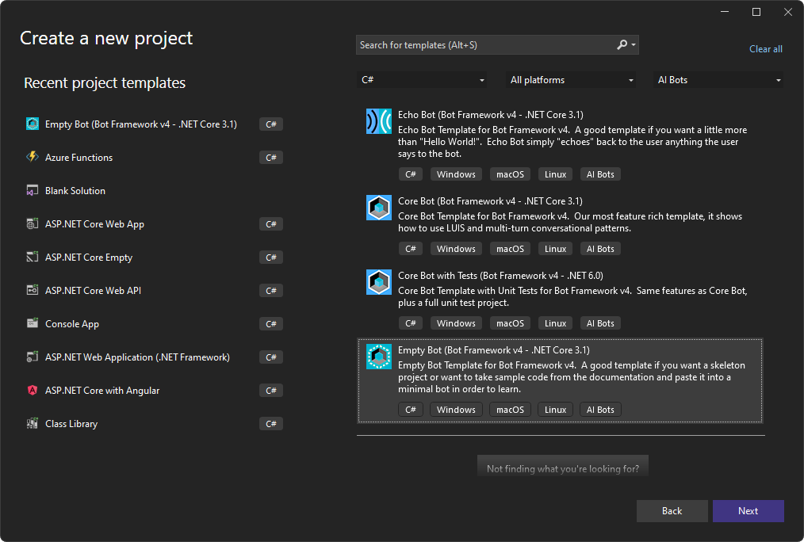
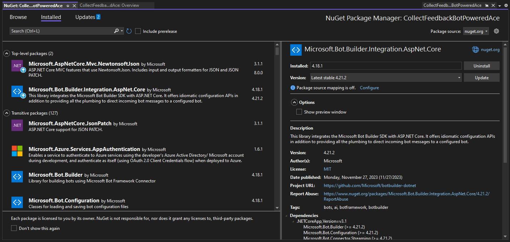
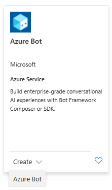
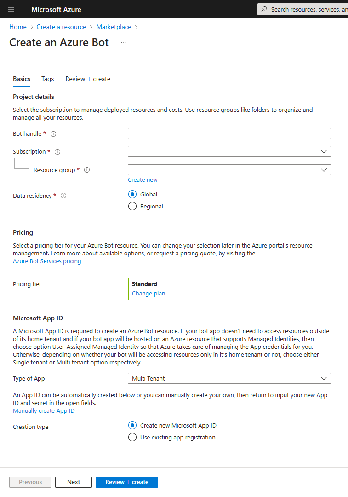
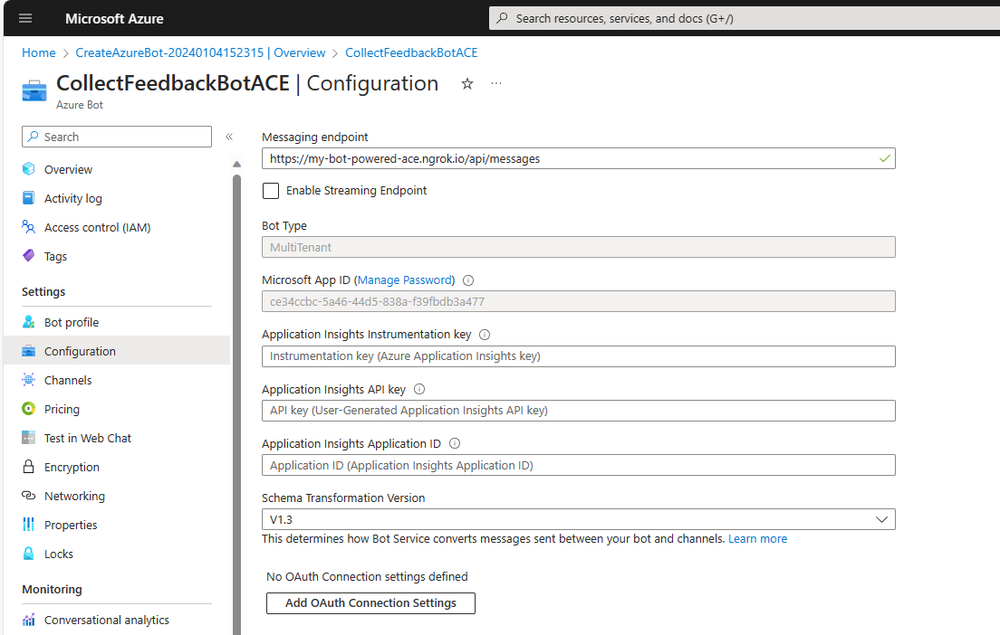
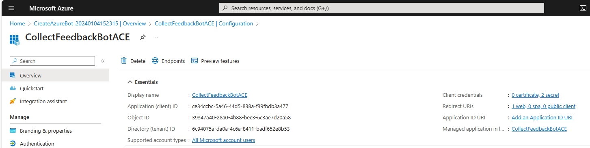
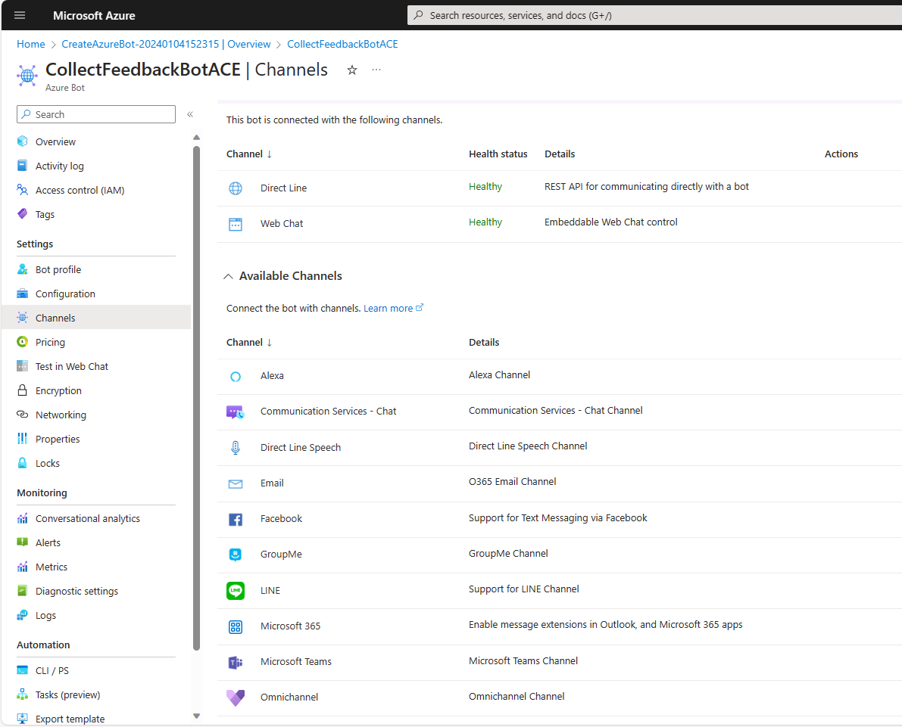
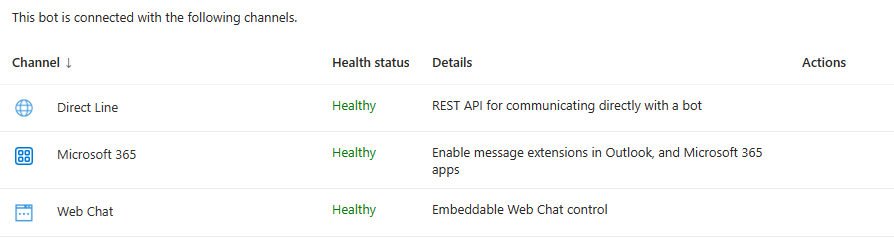
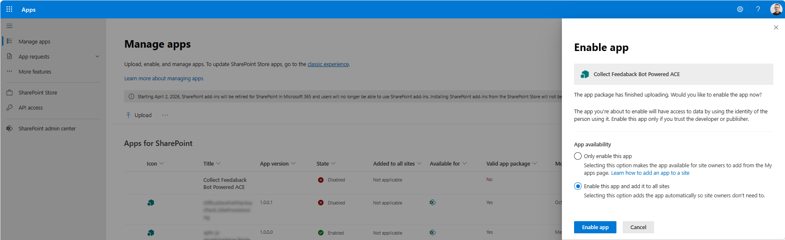

# Building your first Bot Powered Adaptive Card Extension

Bot Powered Adaptive Card Extensions (ACEs) for Microsoft Viva Connections are a new technology to extend the Microsoft Viva Connections Dashboard leveraging the Bot development model. 

From a development point of view, a Bot Powered ACE behaves like a regular client-side ACE built with SharePoint Framework. As such, you can render Card Views, Quick Views, you can provide properties configurable via a Property Pane, and you can implement specific behaviors to handle actions in the user interface of the ACE. You can learn more about the basics of client-side Adaptive Card Extensions for Microsoft Viva Connections by reading the tutorial ["Build your first SharePoint Adaptive Card Extension"](/sharepoint/dev/spfx/viva/get-started/build-first-sharepoint-adaptive-card-extension).

In this tutorial you will learn how to build a basic Bot Powered ACE with a step by step approach. You can build Bot Powered ACEs either using C# and .NET or using TypeScript and Node.js.

You can learn more about the architecture of the Bot Powered ACEs by reading the article ["Understanding Bot Powered Adaptive Card Extensions"](./Understanding-Bot-Powered-ACEs.md).

## Developing a Bot Powered ACE with Microsoft .NET
In this tutorial, you are going to build a basic Bot Powered ACE to collect user's feedback via a Card View with a textbox and a submission button. In the following picture you can see how the Adaptive Card Extension looks like in the Viva Connections desktop experience.


While in the following picture you can see how the Adaptive Card Extension looks like in the Viva Connections mobile experience.


From a developer point of view, you build the ACE once and you benefit of it in both desktop and mobile experiences.

### Pre-requirements
First of all, in order to develop a Bot Powered ACE with C# and .NET, you need to have the following tools and frameworks installed on your development machine:

* Microsoft .NET 6.0 or higher versions
* Microsoft Visual Studio 2022
* Bot Builder Extensions for Microsoft Visual Studio 2022
* Optionally, the Bot Framework Emulator

You will also need to have an active and valid Microsoft Azure subscription to host the Azure Bot.

Last but not least, for local testing and debugging, you will also need a reverse proxy tool like ngrok, Localtunnel, Serveo, YARP, etc. In this tutorial we are going to use ngrok.

### Creating the Bot solution in Visual Studio 2022
Once you have installed the Bot Builder Extensions for Microsoft Visual Studio 2022, start Visual Studio and choose to create a new project of type "Empty Bot (Bot Framework v4 - .NET Core 3.1)" like it is illustrated in the following screenshot.



Give a name to your project (for example "CollectFeedbackBotPoweredAce") and choose a folder to store the project files, as well as the related solution. Despite the name of the project template, you will get a .NET 6.0 project.

Then, the very first thing to do is to upgrade the NuGet package with name "Microsoft.Bot.Builder.Integration.AspNet.Core" to version 4.21.2 or higher. You can do it using the user interface of Visual Studio, right clicking on the project and choosing "Manage NuGet packages ..." like you see in the following image.



Or you can also use the .NET CLI and run the following command in the Package Manager Console, to update the package to the latest release.

```
dotnet add package Microsoft.Bot.Builder.Integration.AspNet.Core
```

In the automatically scaffolded solution you will find a bunch of auto-generated files. Those that really matter to create a Bot Powered ACE are the following:

* `Startup.cs`: here you can configure services via Dependency Injection.
* `EmptyBot.cs`: this is the actual Bot implementation, where you will write the real code of your Bot Powered ACE.
* `appsettings.json`: here you can configure the settings of your Bot Powered ACE, including the parameters about the Azure Bot.

### Registering the Bot in Azure
Before proceeding with the actual implementation of the Bot Powered ACE, we need to register a Bot in Microsoft Azure. 

Open a web browser and navigate to the [Azure Management Portal](https://portal.azure.com/). From the Azure Management Portal home page, select "Create a resource" and choose to create an "Azure Bot" service.



Provide a handle for your Bot, which must be compliant with the following rules:
* String between 4 and 42 characters long
* Supported characters are: a-z, A-Z, 0-9, - and _
* Must start with a letter or digit
* It has to be unique

The Bot handle will also become the display name of the Bot. However, you can change the display name later, while the Bot Handle will be immutable, once registered.

Choose a target subscription and resource group, as well a data residency policy. From a pricing point of view, while you are developing and testing with Bot Powered ACEs, you can select the "F0 - Free" pricing tier. Once you will be ready to release your Bot in production, you can upgrade the pricing tier to "S1 - Standard".

A Microsoft App ID is required to register an Azure Bot, and depending on your solution you can select a different type of application through the "Type of App" option, where you can choose any of the following:
* User-Assigned Managed Identity: if your Bot app doesn't need to access resources outside of its home tenant and if your Bot app will be hosted on an Azure resource that supports Managed Identities.
* Single Tenant: if your Bot app doesn't need to access resources outside of its home tenant, but your Bot app will not be hosted on an Azure resource that supports Managed Identities.
* Multi Tenant: if your Bot app needs to access resources outside of its home tenant or will serve multiple tenants.

Choose "Multi Tenant" in order to follow the steps of this tutorial.

You can also choose whether to create a new Microsoft Entra ID app or to reuse an already existing one.

In the following screenshot you can see all the available configuration options.



Once you are done with the settings, click on the "Review + create" button, review the selected settings and register your Azure Bot by clicking on the "Create" button.

### Configure the Bot in Azure
Once the Azure Bot is registered, click on the "Go to resource" button, or simply open the Azure Bot configuration from the Azure Management Portal. 

#### Messaging endpoint URL configuration
Open the "Configuration" panel of the Azure Bot and configure the "Messaging endpoint" URL for your Bot.
In this configuration field you should provide the base URL of your Bot. For example, if you are planning to run the Bot locally, for testing and debugging purposes, and you plan to use ngrok as the reverse proxy, the URL should be something like the following one:

```
https://<your-ngrok-reverse-proxy-name>.ngrok.io/api/messages
```

For instance, if you plan to use the name *my-bot-powered-ace* with ngrok, the "Messaging endpoint" URL should be

```
https://my-bot-powered-ace.ngrok.io/api/messages
```

and the command to run ngrok on your local machine as a reverse proxy for the Bot should be:

```
ngrok http --host-header=localhost --hostname=my-bot-powered-ace.ngrok.io 3978 
```

Click "Apply" when you are done configuring the "Messaging endpoint" URL.



Once you have configured the URL for your Bot, you need to configure few additional settings from the "Configuration" panel. Click on the "Manage Password" link, just beside the "Microsoft App ID" setting.

#### Microsoft App configuration
You will be brought to the "Certificates & secrets" configuration page of the Microsoft App registered in Microsoft Entra ID for your Bot. From within this page you can configure a new client secret. Copy the value of the new client secret in a safe place, you will reuse it later in this tutorial.

Now select the "Overview" panel and save in a safe place, together with the client secret, the values of the following settings:
* Application (client) ID
* Directory (tenant) ID



Now select the "Authentication" panel of the Microsoft App and under the "Platform configurations" section, click on "Add a platform" and select to add a *Web* platform. Then configure the following value for the "Redirect URIs" setting field.

```
https://<your-ngrok-reverse-proxy-name>.ngrok.io/auth-end
```

One more time, if you plan to use the name *my-bot-powered-ace* with ngrok, the "Redirect URI" should be:

```
https://my-bot-powered-ace.ngrok.io/auth-end
```

You should also enable "Implicit grant and hybrid flows" by selecting the options to issue "Access tokens" and "ID tokens". Click on the "Configure" button and your new Web platform will be configured.


Now select the "API permissions" panel and configure the app with the following delegated permissions:
* email
* offline_access
* openid
* profile
* User.Read

Click on the "Grant admin consent for ..." button, in order to grant the permissions at tenant level.


Now move to the "Expose an API" panel and configure a unique URI for your application clicking on the "Add" link just beside the "Application ID URI" label. Here you need to configure a value for the "Application ID URI" that matches the following rule:

```
api://<your-ngrok-reverse-proxy-name>.ngrok.io/<App-Client-ID>
```

For example, if you plan to use the name *my-bot-powered-ace* with ngrok, and the Client ID of your application is *ce34ccbc-5a46-44d5-838a-f39fbdb3a477* the "Application ID URI" should be:

```
api://my-bot-powered-ace.ngrok.io/ce34ccbc-5a46-44d5-838a-f39fbdb3a477
```

> [!NOTE]
> Mind the api:// moniker at the beginning of the Application ID URI value, and be careful to not use http:// or https:// unless you want to use a verified domain of the organization or its subdomain.

Now in the "Scopes defined by this API" section add a new scope by clicking on the "Add a scope" button. Provide the following settings for the new scope:

* Scope name: *access_as_user*.
* Who can consent?: Admins and users.
* Admin consent display name: Teams can access the user's profile.
* Admin consent description: Allow Teams to call the app's web APIs as the current user.
* User consent display name: Teams can access the user's profile and make requests on the user's behalf.
* User consent description: Enables Teams to call this app's APIs with the same rights as the user.
* State: Enabled.


Lastly, in the "Authorized client applications" section, you need to configure the client ID of the Teams clients and authorize them to consume your Microsoft App, so that users should not be asked to consent when the Teams client call your API. The client IDs of the Teams client apps are the following:
* 1fec8e78-bce4-4aaf-ab1b-5451cc387264: for the Teams mobile and desktop application.
* 5e3ce6c0-2b1f-4285-8d4b-75ee78787346: for the Teams web application.

For each of them, you should select the permission scope that you just configured for the API.


At the end of this stage, the "Expose an API" panel should look like in the following picture.


#### Configuring the Microsoft 365 Channel
You can now go back to the configuration of your Azure Bot and select the panel "Channels" to configure a new channel for Microsoft 365. In the "Available Channels" section of the page you need to click on the channel with name "Microsoft 365" to enable it.



A new page will show up, explaining you the purpose of the "Microsoft 365" channel. Click the "Apply" button to enable the new channel and go back to the list of channels configured for your Azure Bot.


Right after that, your Azure Bot is fully configured and ready to be used.



> [!IMPORTANT]
> If you are using ngrok and you have a free license, you will have to rely on a dynamic URL for your local development environment, rather than on a fixed and named URL. As such, whenever you will start ngrok you will get a new URL that you will have to configure in all the places where you have been instructed to configure the URL in this tutorial. Specifically, you will have to re-configure the URL in the "Messaging endpoint URL" of the Azure Bot, in the "Redirect URIs" of the Microsoft App, and in the "Application ID URI" of the Microsoft App. Then wait few seconds before running the Bot, to allow the new URLs to apply across the Microsoft Azure services.

### Configure the project accordingly to the Azure Bot settings
Go back to Visual Studio and open the `appsettings.json` file to configure the settings for the Azure Bot. Here follows a code excerpt of the settings file, where you can see how to configure the Azure Bot parameters.

```JSON
{
  "MicrosoftAppType": "MultiTenant",
  "MicrosoftAppId": "<App-Client-ID>",
  "MicrosoftAppPassword": "<Client-Secret>",
  "MicrosoftAppTenantId": "<Tenant-ID>"
}
```

Replace the content of the above placeholders with the actual values that you stored before.

> [!NOTE]
> You can also consider using the user's secrets functionality of Visual Studio to store the secret securely and avoid to accidentally share them with unauthorized people.

### Implement the actual Bot Powered ACE
Now, rename the `EmptyBot.cs` file with name `CollectFeedbackBot.cs`, open it and replace the base class from `ActivityHandler` to `SharePointActivityHandler` and empty the content of the class itself. You will also have to add an import for the namespace `Microsoft.Bot.Builder.SharePoint`. Then add a set of overrides for all the methods with name starting with `OnSharePointTask*`.
Here follows the resulting class implementation.

```CSharp
// Copyright (c) Microsoft Corporation. All rights reserved.
// Licensed under the MIT License.

using Microsoft.Bot.Builder;
using Microsoft.Bot.Builder.SharePoint;
using Microsoft.Bot.Schema;
using Microsoft.Bot.Schema.SharePoint;
using System.Collections.Generic;
using System.Threading;
using System.Threading.Tasks;

namespace CollectFeedbackBotPoweredAce
{
    public class CollectFeedbackBot : SharePointActivityHandler
    {
        protected override Task<CardViewResponse> OnSharePointTaskGetCardViewAsync(ITurnContext<IInvokeActivity> turnContext, AceRequest aceRequest, CancellationToken cancellationToken)
        {
            return base.OnSharePointTaskGetCardViewAsync(turnContext, aceRequest, cancellationToken);
        }

        protected override Task<QuickViewResponse> OnSharePointTaskGetQuickViewAsync(ITurnContext<IInvokeActivity> turnContext, AceRequest aceRequest, CancellationToken cancellationToken)
        {
            return base.OnSharePointTaskGetQuickViewAsync(turnContext, aceRequest, cancellationToken);
        }

        protected override Task<GetPropertyPaneConfigurationResponse> OnSharePointTaskGetPropertyPaneConfigurationAsync(ITurnContext<IInvokeActivity> turnContext, AceRequest aceRequest, CancellationToken cancellationToken)
        {
            return base.OnSharePointTaskGetPropertyPaneConfigurationAsync(turnContext, aceRequest, cancellationToken);
        }

        protected override Task<BaseHandleActionResponse> OnSharePointTaskSetPropertyPaneConfigurationAsync(ITurnContext<IInvokeActivity> turnContext, AceRequest aceRequest, CancellationToken cancellationToken)
        {
            return base.OnSharePointTaskSetPropertyPaneConfigurationAsync(turnContext, aceRequest, cancellationToken);
        }

        protected override Task<BaseHandleActionResponse> OnSharePointTaskHandleActionAsync(ITurnContext<IInvokeActivity> turnContext, AceRequest aceRequest, CancellationToken cancellationToken)
        {
            return base.OnSharePointTaskHandleActionAsync(turnContext, aceRequest, cancellationToken);
        }
    }
}
```

Here follows a brief explanation of the overridable methods:

* `OnSharePointTaskGetCardViewAsync`: handles the rendering of a Card View.
* `OnSharePointTaskGetQuickViewAsync`: handles the rendering of a Quick View.
* `OnSharePointTaskGetPropertyPaneConfigurationAsync`: allows to render the Property Pane of the ACE.
* `OnSharePointTaskSetPropertyPaneConfigurationAsync`: allows to save the settings configured using the Property Pane of the ACE.
* `OnSharePointTaskHandleActionAsync`: handles a custom action in the ACE like the click on a button in a Card View or any custom action in the UI of a Quick View.

> [!NOTE]
> You can dig into the details of how Bot Powered ACEs work by reading the article ["Understanding Bot Powered Adaptive Card Extensions"](./Understanding-Bot-Powered-ACEs.md).

In order to implement the Collect Feedback ACE, you can only focus on `OnSharePointTaskGetCardViewAsync` and `OnSharePointTaskGetQuickViewAsync` to render the Card Views and the Quick View, as well as on the `OnSharePointTaskHandleActionAsync` to handle the actual submission of the feedback. So far, you can remove the two methods for handling the property pane, which will be covered in article ["Handling custom settings for Bot Powered Adaptive Card Extensions"](./Handling-Custom-Settings-in-Bot-Powered-ACEs.md).

Every Bot Powered ACE does have a unique ID, which is a string that identifies uniquely the ACE instance in the Viva Connections Dashboard. For that unique ID you can for example use a `Guid` value converted into a string. You can define such a value as a private static string variable in the Bot class definition.

```CSharp
private static string adaptiveCardExtensionId = Guid.NewGuid().ToString();
```

The `OnSharePointTaskGetCardViewAsync` asynchronous method returns an instance of type `CardViewResponse`, while the `OnSharePointTaskGetQuickViewAsync` method returns an instance of type `QuickViewResponse`. Both `CardViewResponse` and `QuickViewResponse` are defined in the `Microsoft.Bot.Schema.SharePoint` namespace.

#### Rendering Card Views
Every `CardViewResponse` instance is made of a property named `AceData` that defines some aestetic settings like the size of the card, its icon, the title, and the description. It also defines the unique ID of the card and a JSON object to represent some custom `Properties`, in case of need. Every `CardViewResponse` instance also provides a `ViewId` string property, which declares a unique ID to identify the specific Card View instance for the ACE and which is mandatory to assign a value to. There is also an event with name `OnCardSelection`, which can be used to handle custom action when the user clicks on the Card View.

Moreover, the `CardViewResponse` instance provides a property named `CardViewParameters` that defines the actual outline of the Card View. The content of the `CardViewParameters` property defines the structure of the components model used to render the card. Using the `CardViewParameters` factory type you can define different flavors of Card Views using the following methods:
* `BasicCardViewParameters`: factory method to create a Basic Text Card View.
* `ImageCardViewParameters`: factory method to create an Image Card View.
* `PrimaryTextCardViewParameters`: factory method to create a Primary Text Card View.
* `SignInCardViewParameters`: factory method to create a Sign-in Card View.
* `SearchCardViewParameters`: factory method to create a Search Card View.
* `TextInputCardViewParameters`: factory method to create a Text Input Card View.

For instance, in order to create the Card View to collect user's feedback you can use the `TextInputCardViewParameters` method of `CardViewParameters` and define the components that make up the Card View. Furthermore, the Card View to confirm that the feedback was collected can be created using the `ImageCardViewParameters` method. It is a common habit to define the Card Views, and the Quick Views as well, in the constructor of the Bot, storing them in a static dictionary, where the item key is the `ViewId` of the card. Then, based on the requested Card View, you can return the corresponding item of the dictionary as the result of the `OnSharePointTaskGetCardViewAsync` method.

Here follows a sample implementation of the Bot constructor, also relying on Dependency Injection to retrieve some settings from the `appsettings.json` file via the `IConfiguration` service implementation.

```CSharp
public class CollectFeedbackBot : SharePointActivityHandler
{
    private static string adaptiveCardExtensionId = Guid.NewGuid().ToString();
    private readonly IConfiguration _configuration = null;
    public readonly string _baseUrl;

    private static ConcurrentDictionary<string, CardViewResponse> cardViews = new ConcurrentDictionary<string, CardViewResponse>();

    private static string CollectFeedbackCardView_ID = "GET_FEEDBACK_CARD_VIEW";
    private static string OkFeedbackCardView_ID = "OK_FEEDBACK_CARD_VIEW";
    private static string FeedbackQuickView_ID = "FEEDBACK_QUICK_VIEW";

    public CollectFeedbackBot(IConfiguration configuration): base()
    {
        this._configuration = configuration;
        this._baseUrl = configuration["BaseUrl"];

        // ************************************
        // Add the CardViews
        // ************************************
    
        // Prepare ACE data for all Card Views
        var aceData = new AceData()
        {
            Title = "Your voice matters!",
            CardSize = AceData.AceCardSize.Large,
            DataVersion = "1.0",
            Id = adaptiveCardExtensionId
        };

        // Collect Feedback Card View (Input Text Card View)
        CardViewResponse feedbackCardViewResponse = new CardViewResponse();
        feedbackCardViewResponse.AceData = aceData;
        feedbackCardViewResponse.CardViewParameters = CardViewParameters.TextInputCardViewParameters(
            new CardBarComponent()
            {
                Id = "FeedbackCardView",
            },
            new CardTextComponent()
            {
                Text = "Please, provide feedback"
            },
            new CardTextInputComponent()
            {
                Id = "feedbackValue",
                Placeholder = "Your feedback ..."
            },
            new List<CardButtonComponent>()
            {
                new CardButtonComponent()
                {
                    Id = "SendFeedback",
                    Title = "Submit",
                    Action = new SubmitAction()
                    {
                        Parameters = new Dictionary<string, object>()
                        {
                            {"viewToNavigateTo", OkFeedbackCardView_ID}
                        }
                    }
                }
            },
            new Microsoft.Bot.Schema.SharePoint.CardImage()
            {
                Image = $"{_baseUrl}/Media/Collect-Feedback.png",
                AltText = "Collect feedback picture"
            });
        feedbackCardViewResponse.ViewId = CollectFeedbackCardView_ID;

        feedbackCardViewResponse.OnCardSelection = new QuickViewAction()
        {
            Parameters = new QuickViewActionParameters()
            {
                View = FeedbackQuickView_ID
            }
        };

        cardViews.TryAdd(feedbackCardViewResponse.ViewId, feedbackCardViewResponse);

        // OK Feedback Card View (Image Card View)
        CardViewResponse okFeedbackCardViewResponse = new CardViewResponse();
        okFeedbackCardViewResponse.AceData = aceData;
        okFeedbackCardViewResponse.CardViewParameters = CardViewParameters.ImageCardViewParameters(
            new CardBarComponent()
            {
                Id = "OkFeedbackCardView",
            },
            new CardTextComponent()
            {
                Text = "Here is your feedback '<feedback>' collected on '<dateTimeFeedback>'"
            },
            new List<BaseCardComponent>()
            {
                new CardButtonComponent()
                {
                    Id = "OkButton",
                    Title = "Ok",
                    Action = new SubmitAction()
                    {
                        Parameters = new Dictionary<string, object>()
                        {
                            {"viewToNavigateTo", CollectFeedbackCardView_ID}
                        }
                    }
                }
            },
            new Microsoft.Bot.Schema.SharePoint.CardImage()
            {
                Image = $"{_baseUrl}/Media/Ok-Feedback.png",
                AltText = "Feedback collected"
            });
        okFeedbackCardViewResponse.ViewId = OkFeedbackCardView_ID;

        okFeedbackCardViewResponse.OnCardSelection = new QuickViewAction()
        {
            Parameters = new QuickViewActionParameters()
            {
                View = FeedbackQuickView_ID
            }
        };

        cardViews.TryAdd(okFeedbackCardViewResponse.ViewId, okFeedbackCardViewResponse);
    }
}
```

Notice how the constructor relies on a `ConcurrentDictionary` to store the Card View definitions, to support multi-threaded access to the static dictionary. Notice also how the various components are used to define the outline of the `TextInputCardViewParameters` and of the `ImageCardViewParameters`.
In the following picture you can see a digram that explains the structure of a component based Card View rendered in "Large" format.

![A diagram with the structure of a component based Card View in "Large" format. The shape of the Card View is divided into two main sections, the left one is made of a CardBarComponent, a CardTextComponent, a component that varies depending on the kind of Card View template selected, and a list CardButtonComponent to provide zero, one, or two buttons. On the right section there can be an instance of Microsoft.Bot.Schema.SharePoint.CardImage to render an image, if any, depending on the kind of Card View template selected.](./images/ACE-Component-Based-Structure.png)

A component based Card View in "Large" format does have a shape divided into two main sections, the left one is made of a `CardBarComponent`, a `CardTextComponent`, a component that varies depending on the kind of Card View template selected, and a list of `BaseCardComponent` objects to provide zero, one, or two buttons. On the right section there can be an instance of `Microsoft.Bot.Schema.SharePoint.CardImage` to render an image, if any, depending on the kind of Card View template selected

For example, the `TextInputCardViewParameters` instance is made of the following components:
* `CardBarComponent`: defines the top bar of the Card View, including the icon and the title.
* `CardTextComponent`: defines a text component with some informative text for the user.
* `CardTextInputComponent`: defines the input text field to collect feedback. Here, the `Id` property is fundamental because you will need it later to retrieve the value of the textbox.
* `List<CardButtonComponent>`: defines a list of zero, one, or two action buttons. Each action button does have an `Id` property that is fundamental to identify the button pressed by the user. A button can also have a set of custom properties, which will be provided to the Bot upon submission of the form.
* `Microsoft.Bot.Schema.SharePoint.CardImage`: defines an image that will be rendered in the right side of the Card View.

In the code excerpt, the images used to render the Card Viewes are downloaded from the web site hosted in the Bot project, and available under the `wwwroot` folder of the project. In that folder, you should upload the `Media` subfolder that you can find in the [samples folder of the reference GitHub repository](https://github.com/pnp/viva-dev-bot-powered-aces/tree/main/support-files/Media). 

#### Handling user's tasks and actions
When the user clicks on the submit action in a Card View, the `OnSharePointTaskHandleActionAsync` method is triggered and you can handle the submission event. In the following code excerpt you can see how the ACE collects the feedback submission.

```CSharp
protected override Task<BaseHandleActionResponse> OnSharePointTaskHandleActionAsync(ITurnContext<IInvokeActivity> turnContext, AceRequest aceRequest, CancellationToken cancellationToken)
{
    if (turnContext != null)
    {
        if (cancellationToken.IsCancellationRequested)
        {
            cancellationToken.ThrowIfCancellationRequested();
        }
    }
    Trace.Write("\n\n\nStarted to handle action.\n\n\n");
    JObject actionParameters = aceRequest.Data as JObject;

    if (actionParameters["type"].ToString().Equals("Submit", StringComparison.InvariantCultureIgnoreCase) &&
        actionParameters["id"].ToString().Equals("SendFeedback", StringComparison.InvariantCultureIgnoreCase))
    {
        CardViewHandleActionResponse response = new CardViewHandleActionResponse();

        string viewToNavigateTo = actionParameters["data"]["viewToNavigateTo"].ToString();
        var feedbackValue = actionParameters["data"]["feedbackValue"].ToString();
        var dateTimeFeedback = DateTime.Now;

        var nextCard = cardViews[viewToNavigateTo];

        // Configure the text content for the Card View
        var textContent = $"Here is your feedback '{feedbackValue}' collected on '{dateTimeFeedback}'";
        ((nextCard.CardViewParameters.Header.ToList())[0] as CardTextComponent).Text = textContent;

        // Set the response for the action
        response.RenderArguments = nextCard;

        Trace.Write("\n\n\nFinished handling action.\n\n\n");
        return Task.FromResult<BaseHandleActionResponse>(response);
    }
    else if (actionParameters["type"].ToString().Equals("Submit", StringComparison.InvariantCultureIgnoreCase) &&
        actionParameters["id"].ToString().Equals("OkButton", StringComparison.InvariantCultureIgnoreCase))
    {
        CardViewHandleActionResponse response = new CardViewHandleActionResponse();

        string viewToNavigateTo = actionParameters["data"]["viewToNavigateTo"].ToString();

        // Set the response for the action
        response.RenderArguments = cardViews[viewToNavigateTo];

        Trace.Write("\n\n\nFinished handling action.\n\n\n");
        return Task.FromResult<BaseHandleActionResponse>(response);
    }

    Trace.Write("\n\n\nFinished handling action.\n\n\n");
    return Task.FromResult<BaseHandleActionResponse>(new NoOpHandleActionResponse());
}
```

First of all, the method checks if there is a proper instance of the `TurnContext`, and if the asynchronous operation has been cancelled by the user. Inside the `TurnContext` instance there are all the needed information to properly handle the user's action. For example, there is the `turnContext.Activity.Value` property that represents a `JObject` instance with a property named "data" that contains a dictionary of properties to understand the type of action and the `Id` of the source component for the action.
In the code excerpt, when the action type is "Submit" and the `Id` of the action is "SendFeedback", it means that the user pressed the submit button defined in the `TextInputCardViewParameters` instance, which is the one to collect the feedback. The actual value of the feedback is available in the data field with name equal to the `Id` of the textbox defined in the `CardTextInputComponent` component instance. The handling of the feedback is up to you. In the code excerpt, the sample configures an instance of the second Card View defined in the constructor, and then instructs the ACE to render the new Card View via the `BaseHandleActionResponse` return value.

#### Rendering Quick Views
While the Card Views are rendered based on a set of pre-defined component based templates, the Quick Views are rendered based on an Adaptive Card definition. The Adaptive Card can be defined either using a declarative and code based approach, or using the `AdaptiveCards.Templating` NuGet package and reading a JSON file with an Adaptive Card definition.


> [!IMPORTANT]
> Keep into account that the `AdaptiveCards.Templating` NuGet package can parse and process JSON files with Adaptive Card definitions up to Adaptive Card schema v. 1.2, while using the declarative and code based model you can leverage any version of the Adaptive Card schema.

Here follows a sample implementation of the `OnSharePointTaskGetQuickViewAsync` method, rendering a Quick View using a code based and declarative model.

```CSharp
protected override Task<QuickViewResponse> OnSharePointTaskGetQuickViewAsync(ITurnContext<IInvokeActivity> turnContext, AceRequest aceRequest, CancellationToken cancellationToken)
{
    // Add the Feedback QuickViews
    QuickViewResponse feedbackQuickViewResponse = new QuickViewResponse();
    feedbackQuickViewResponse.Title = "Your feedback";
    feedbackQuickViewResponse.Template = new AdaptiveCard("1.5");

    AdaptiveContainer container = new AdaptiveContainer();
    container.Separator = true;
    AdaptiveTextBlock titleText = new AdaptiveTextBlock();
    titleText.Text = "Thanks for your feedback!";
    titleText.Color = AdaptiveTextColor.Dark;
    titleText.Weight = AdaptiveTextWeight.Bolder;
    titleText.Size = AdaptiveTextSize.Large;
    titleText.Wrap = true;
    titleText.MaxLines = 1;
    titleText.Spacing = AdaptiveSpacing.None;
    container.Items.Add(titleText);

    AdaptiveTextBlock dateTimeCollectedText = new AdaptiveTextBlock();
    dateTimeCollectedText.Text = $"We truly appreciate your effort in providing valuable feedback to us. Thanks!";
    dateTimeCollectedText.Color = AdaptiveTextColor.Dark;
    dateTimeCollectedText.Size = AdaptiveTextSize.Medium;
    dateTimeCollectedText.Wrap = true;
    dateTimeCollectedText.MaxLines = 3;
    dateTimeCollectedText.Spacing = AdaptiveSpacing.None;
    container.Items.Add(dateTimeCollectedText);

    feedbackQuickViewResponse.Template.Body.Add(container);

    feedbackQuickViewResponse.ViewId = FeedbackQuickView_ID;

    return Task.FromResult(feedbackQuickViewResponse);
}
```

The code relies on the `AdaptiveCard` type defined in the `AdaptiveCards` NuGet package and builds the content of the Adaptive Card nesting various blocks of content into a hierarchy of elements. In the code excerpt there is an `AdaptiveContainer` made of two `AdaptiveTextBlock` instances.

### Define the manifest.json file for the solution
Now create a new folder with name `TeamsAppManifest` in the root folder of your project and add a couple of image files for the icons of the Microsoft 365 application that you are defining and a `manifest.json` file.

The image files should be the following:
* icon-color.png: a 192x192 pixel PNG colored image with transparent background.
* icon-outline.png: a 32x32 pixel PNG wireframe image with transparent background.

The manifest file should look like the following one:

```JSON
{
  "$schema": "https://developer.microsoft.com/en-us/json-schemas/teams/v1.14/MicrosoftTeams.schema.json",
  "manifestVersion": "1.16",
  "version": "1.0.0",
  "id": "<App-Client-ID>",
  "packageName": "collectfeedback.botpoweredace",
  "developer": {
    "name": "<Your Company name>",
    "websiteUrl": "<Your Company WebSite>",
    "privacyUrl": "<Your Company Privacy Policy>",
    "termsOfUseUrl": "<Your Company Terms of Use>",
    "mpnId": "<Your MPN ID>"
  },
  "name": {
    "short": "Collect Feedaback Bot Powered ACE",
    "full": "This is a basic sample of a Bot Powered ACE for Microsoft Viva Connections Dashboard to collect user's feedback"
  },
  "description": {
    "short": "Basic sample of a Bot Powered ACE for Microsoft Viva Connections Dashboard to collect user's feedback",
    "full": "Basic sample of how to use the latest release of the Bot Framework SDK to build a Bot Powered ACE for Microsoft Viva Connections Dashboard to collect user's feedback"
  },
  "icons": {
    "outline": "icon-outline.png",
    "color": "icon-color.png"
  },
  "accentColor": "#FFFFFF",
  "bots": [
    {
      "botId": "<App-Client-ID>",
      "needsChannelSelector": false,
      "isNotificationOnly": false,
      "supportsCalling": false,
      "supportsVideo": false,
      "supportsFiles": false,
      "scopes": [
        "team",
        "personal",
        "groupchat"
      ]
    }
  ],
  "dashboardCards": [
    {
      "id": "<App-Client-ID>",
      "displayName": "Collect Feedaback",
      "description": "Bot Powered ACE to collect user's feedback",
      "icon": {
        "officeUIFabricIconName": "Feedback"
      },
      "contentSource": {
        "sourceType": "bot",
        "botConfiguration": {
          "botId": "<App-Client-ID>"
        }
      },
      "defaultSize": "medium"
    }
  ],
  "permissions": [
    "identity"
  ],
  "validDomains": [
    "<your-ngrok-reverse-proxy-name>.ngrok.io"
  ]
}
```

In the `manifest.json` file you should replace `<App-Client-ID>` with the actual Client ID of your Microsoft App. You should also configure the actual URL of your Bot in the `validDomains` section of the manifest. Lastly, you should consider providing real values for the settings in the `developer` section.

Notice the `dashboardCards` section that defines the actual settings for your Bot Powered ACEs. In particular, through this section you can configure the `id` of the Microsoft App backing your Azure Bot, the `displayName` and `description` of the ACE, as well as the `icon` as a Fluent UI Icon, the Bot that handles the requests and that must be configured in the `bots` section of the `manifest.json`, and last but not least the `defaultSize` for your ACE in the Viva Connections Dashboard.

You can consider copying and reusing the images and the `manifest.json` templates from the [samples folder of the reference GitHub repository](https://github.com/pnp/viva-dev-bot-powered-aces/tree/main/support-files/TeamsAppManifest) associated with this tutorial.

### Run and test the solution
You are now ready to package and deploy your custom solution. You simply need to package the `manifest.json` file and the two images into a .ZIP file, like you would do with any other Microsoft Teams or Microsoft 365 custom application. Name the .ZIP file with whatever name you like, open the App Catalog of your target SharePoint Online tenant, and upload the .ZIP file as a new application package.
The SharePoint Online server-side infrastructure will recognize the manifest structure and prompt you to enable and deploy the solution on the tenant.



Make the solution tenant-wide available, by chooising the option "Enable this app and add it to all sites", and the Bot Powered ACE will become available in the Viva Connections Dashboard.


> [!NOTE]
>Remember to start ngrok, or any other reverse proxy of your choice, before testing the Bot Powered ACE. 

Now, run the Visual Studio project in debug mode (by pressing F5) and open the Microsoft Viva Connections Dashboard, edit its content and search for the new Bot Powered ACE that you just installed.


In the next articles of this guidance you will also learn how to publish and host the Bot Powered ACEs in a real hosting environemnt on Microsoft Azure, rather than running them locally on a development environment.

## Additional readings
Now that you have built your first Bot Powered ACE, you are ready to dig into additional details reading the following articles. 
 
* [Handling custom settings for Bot Powered Adaptive Card Extensions](Handling-Custom-Settings-in-Bot-Powered-ACEs.md)
* [Authentication and Authorization in Bot Powered Adaptive Card Extensions](./AuthN-and-AuthZ-in-Bot-Powered-ACEs.md)
* [Consuming Microsoft Graph and 3rd party APIs on behalf of the user in Bot Powered Adaptive Card Extensions](./Consuming-Microsoft-Graph-and-3rd-Party-APIs-in-Bot-Powered-ACEs.md)
* [Deploying Bot Powered Adaptive Card Extensions](Deploying-Bot-Powered-ACEs.md)
