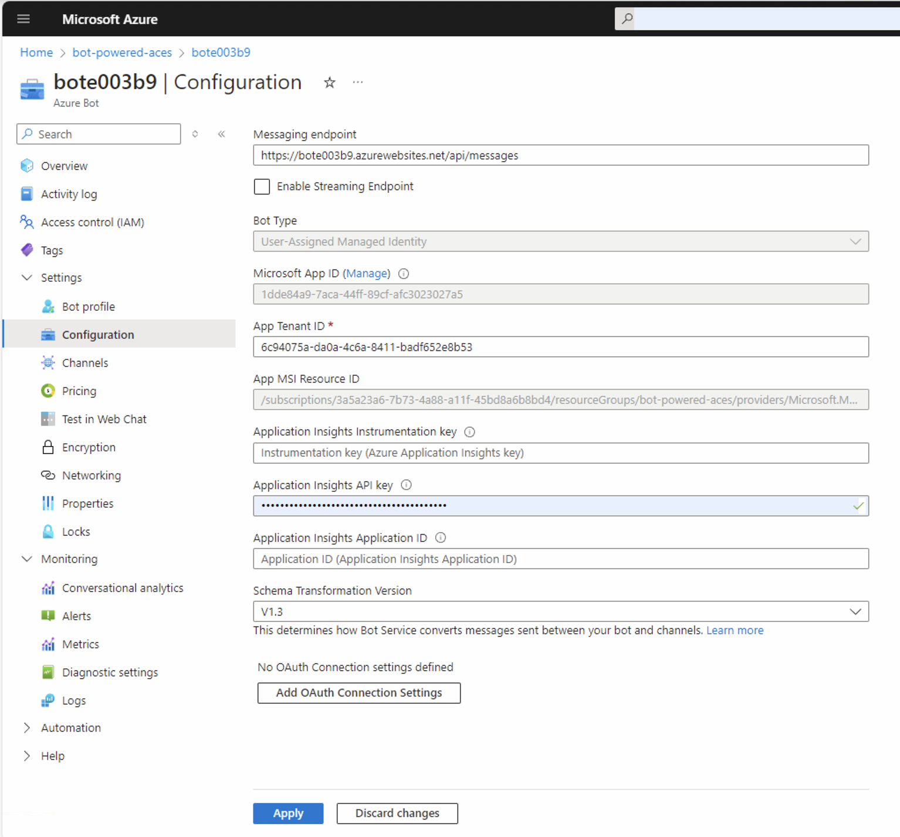
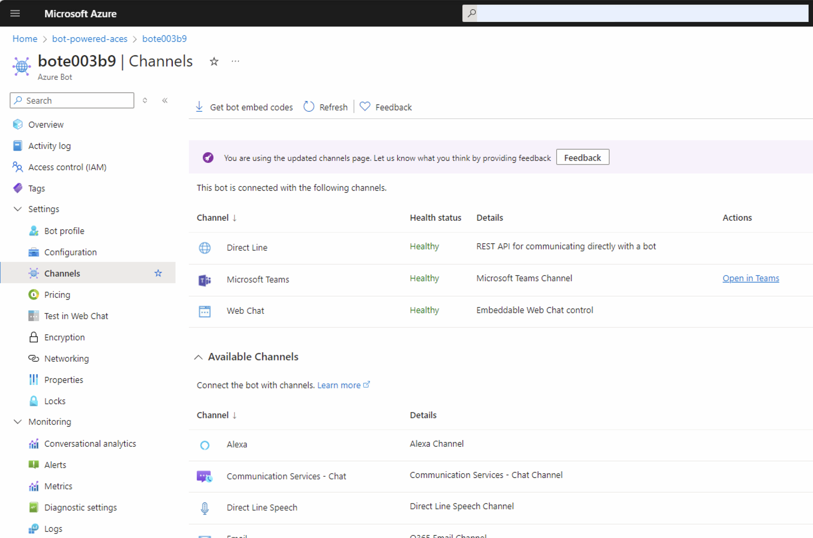
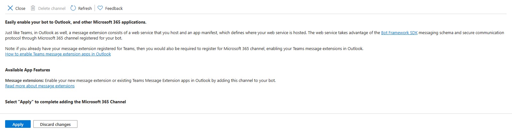
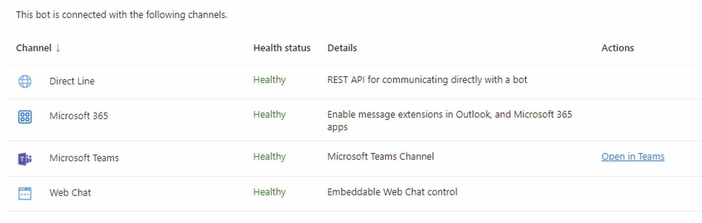
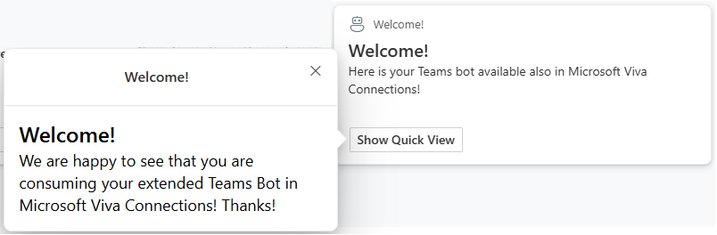

# Extending an existing Teams Bot to become a Bot Powered Adaptive Card Extension

The main purpose of having the new Bot Powered Adaptive Card Extensions (ACEs) for Microsoft Viva Connections is to make it possible to reuse already existing bots, enriching their user experience with the support for Microsoft Viva Connections Dashboard. In fact, the return on investment that you can achieve by using and extending an already existing effort is a fundamental benefit of the Bot Powered ACEs.

In this article, you'll learn how to upgrade an already existing Teams Bot into a Bot Powered Adaptive Card Extension (ACE) experience.

## Updating the code of an already existing bot

So, let's assume that you created a bot for Microsoft Teams, using the Microsoft Teams Toolkit, using the **Bot | Basic Bot** template. The first thing to do is to upgrade the **botbuilder** reference in **package.json** to version 4.23.1 or higher. You can use the following command.

```console
npm i botbuilder --save
```

You also need to import the **adaptivecards** package with version 1.2.3, executing the following command.

```console
npm i adaptivecards@1.2.3 --save
```

Then, open the **teamsBot.ts** file (or whatever name you gave to the main bot source code file) and add an import statement to import all the types needed by Bot Powered ACEs. The updated source code file should look like the following one.

```TypeScript
import { 
    AceData,
    AceRequest, 
    ActivityHandler, 
    CardViewResponse, 
    PrimaryTextCardView,
    GetPropertyPaneConfigurationResponse, 
    HandleActionResponse, 
    InvokeResponse,
    QuickViewResponse, 
    SetPropertyPaneConfigurationResponse, 
    TeamsActivityHandler, 
    TurnContext } 
from "botbuilder";
import * as AdaptiveCards from 'adaptivecards';
```

Then, you need to initialize some infrastructural data in the bot constructor, to support the rendering of the Bot Powered ACE. It's a common habit to define a set of Card Views and Quick Views in the constructor of the Bot Powered ACE. You can then reuse them while rendering the actual user experience of the ACE. You can learn more about implementing Bot Powered ACEs by reading the article [Building your first Bot Powered Adaptive Card Extension with Microsoft Teams Toolkit and TypeScript](./Building-Your-First-Bot-Powered-ACE-TTK-TS.md).

In the following code excerpt, you can see the updated constructor of the bot.

```TypeScript
export class TeamsBot extends TeamsActivityHandler {

    private readonly _botId: string = 'AceFromExistingBot';
    private _cardViews: { [key: string]: CardViewResponse } = {};

    private WELCOME_CARD_VIEW_ID: string = 'WELCOME_CARD_VIEW';
    private WELCOME_QUICK_VIEW_ID: string = 'WELCOME_QUICK_VIEW';
    
    constructor() {
        super();

        // Prepare the ACE data for all the card views and quick views.
        const aceData: AceData = {
            id: this._botId,
            title: 'Your extended bot!',
            description: 'Welcome to your extended bot.',
            cardSize: 'Large',
            iconProperty: 'Robot',
            properties: {},
            dataVersion: '1.0',
        }; 

        // Welcome Card View (Primary Text Card View)
        const welcomeCardViewResponse: CardViewResponse = {
            aceData: aceData,
            cardViewParameters: PrimaryTextCardView(
                {
                    componentName: 'cardBar',
                    title: 'Welcome!'
                },
                {
                    componentName: 'text',
                    text: 'Welcome!'
                },
                {
                    componentName: 'text',
                    text: 'Here is your Teams bot available also in Microsoft Viva Connections!'
                },
                [
                    {
                        componentName: 'cardButton',
                        title: 'Show Quick View',
                        id: 'ShowQuickView',
                        action: {
                            type: 'QuickView',
                            parameters: {
                                view: this.WELCOME_QUICK_VIEW_ID
                                }
                            }
                    }
                ]
            ),
            viewId: this.WELCOME_CARD_VIEW_ID,
            onCardSelection: {
                type: 'QuickView',
                parameters: {
                        view: this.WELCOME_QUICK_VIEW_ID
                    }
            }
        };
        this._cardViews[this.WELCOME_CARD_VIEW_ID] = welcomeCardViewResponse;
        
        this.onMessage(async (context, next) => {
            console.log("Running with Message Activity.");
            const removedMentionText = TurnContext.removeRecipientMention(context.activity);
            const txt = removedMentionText.toLowerCase().replace(/\n|\r/g, "").trim();
            await context.sendActivity(`Echo: ${txt}`);
            // By calling next() you ensure that the next BotHandler is run.
            await next();
        });

        this.onMembersAdded(async (context, next) => {
            const membersAdded = context.activity.membersAdded;
            for (let cnt = 0; cnt < membersAdded.length; cnt++) {
                if (membersAdded[cnt].id) {
                    await context.sendActivity(
                    `Hi there! I'm a Teams bot that will echo what you said to me.`
                    );
                    break;
                }
            }
            await next();
        });
    }
}
```

Then, you need to add some new custom logic to the bot to support rendering as a Bot Powered ACE. Override the `onInvokeActivity` method of the base class and provide support for any of the following actions:

- **cardExtension/getCardView**: handles the rendering of a Card View.
- **cardExtension/getQuickView**: handles the rendering of a Quick View.
- **cardExtension/getPropertyPaneConfiguration**: allows rendering the Property Pane of the ACE.
- **cardExtension/setPropertyPaneConfiguration**: allows saving the settings configured using the Property Pane of the ACE.
- **cardExtension/handleAction**: handles a custom action in the ACE like the select on a button in a Card View or any custom action in the UI of a Quick View.

Here follows a sample implementation of the **onInvokeActivity** method.

```TypeScript
/**
 * Invoked when an invoke activity is received from the connector.
 * Invoke activities can be used to communicate many different things.
 * * Invoke activities communicate programmatic commands from a client or channel to a bot.
 *
 * @param context A strongly-typed context object for this turn
 * @returns A task that represents the work queued to execute
 */
protected async onInvokeActivity(context: TurnContext): Promise<InvokeResponse> {
    try {
        switch (context.activity.name) {
            case 'cardExtension/getCardView':
                return ActivityHandler.createInvokeResponse(
                    await this.onSharePointTaskGetCardViewAsync(context, context.activity.value as AceRequest)
                );
            case 'cardExtension/getQuickView':
                return ActivityHandler.createInvokeResponse(
                    await this.onSharePointTaskGetQuickViewAsync(context, context.activity.value as AceRequest)
                );
            case 'cardExtension/getPropertyPaneConfiguration':
                return ActivityHandler.createInvokeResponse(
                    await this.onSharePointTaskGetPropertyPaneConfigurationAsync(
                        context,
                        context.activity.value as AceRequest
                    )
                );
            case 'cardExtension/setPropertyPaneConfiguration':
                return ActivityHandler.createInvokeResponse(
                    await this.onSharePointTaskSetPropertyPaneConfigurationAsync(
                        context,
                        context.activity.value as AceRequest
                    )
                );
            case 'cardExtension/handleAction':
                return ActivityHandler.createInvokeResponse(
                    await this.onSharePointTaskHandleActionAsync(context, context.activity.value as AceRequest)
                );
            default:
                return super.onInvokeActivity(context);
        }
    } catch (err) {
        if (err.message === 'NotImplemented') {
            return { status: 501 };
        } else if (err.message === 'BadRequest') {
            return { status: 400 };
        }
        throw err;
    }
}
```

You can read the article [Overview of Bot Powered Adaptive Card Extensions](Overview-Bot-Powered-ACEs.md), to learn about the basic requirement for a Bot Powered ACE to provide at least one Card View. You can optionally provide more Card Views and one or more Quick Views, in case you want to have a better and more personalized user experience.

In this article, you'll add both a Card View and a Quick View. As such, you're going to implement the actions **cardExtension/getCardView** and **cardExtension/getQuickView**, respectively with methods `onSharePointTaskGetCardViewAsync` and `onSharePointTaskGetQuickViewAsync`. While you don't need to implement all the other methods.

```TypeScript
/**
 * Override this in a derived class to provide logic for when a card view is fetched
 *
 * @param _context - A strongly-typed context object for this turn
 * @param _aceRequest - The Ace invoke request value payload
 * @returns A Card View Response for the request
 */
protected async onSharePointTaskGetCardViewAsync(
    _context: TurnContext,
    _aceRequest: AceRequest
): Promise<CardViewResponse> {
    return this._cardViews[this.WELCOME_CARD_VIEW_ID];
}

/**
 * Override this in a derived class to provide logic for when a quick view is fetched
 *
 * @param _context - A strongly-typed context object for this turn
 * @param _aceRequest - The Ace invoke request value payload
 * @returns A Quick View Response for the request
 */
protected async onSharePointTaskGetQuickViewAsync(_context: TurnContext, _aceRequest: AceRequest): Promise<QuickViewResponse> {

    // Prepare the AdaptiveCard for the Quick View
    const card = new AdaptiveCards.AdaptiveCard();
    card.version = new AdaptiveCards.Version(1, 5);
    const cardPayload = {
        type: 'AdaptiveCard',
        $schema: "http://adaptivecards.io/schemas/adaptive-card.json",
        body: [
            {
                type: 'TextBlock',
                text: 'Welcome!',
                weight: 'Bolder',
                size: 'Large',
                wrap: true,
                maxLines: 1,
                spacing: 'None',
                color: 'Dark'
            },
            {
            type: 'TextBlock',
            text: 'We are happy to see that you are consuming your extended Teams Bot in Microsoft Viva Connections! Thanks!',
            weight: 'Normal',
            size: 'Medium',
            wrap: true,
            maxLines: 3,
            spacing: 'None',
            color: 'Dark'
        }
        ]
    };
    card.parse(cardPayload);

    // Add the Feedback QuickViews
    const welcomeQuickViewResponse: QuickViewResponse = {
        viewId: this.WELCOME_QUICK_VIEW_ID,
        title: 'Welcome!',
        template: card,
        data: {},
        externalLink: null,
        focusParameters: null
    };

    return Promise.resolve(welcomeQuickViewResponse);
}

/**
 * Override this in a derived class to provide logic for getting configuration pane properties.
 *
 * @param _context - A strongly-typed context object for this turn
 * @param _aceRequest - The Ace invoke request value payload
 * @returns A Property Pane Configuration Response for the request
 */
protected async onSharePointTaskGetPropertyPaneConfigurationAsync(
    _context: TurnContext,
    _aceRequest: AceRequest
): Promise<GetPropertyPaneConfigurationResponse> {
    throw new Error('NotImplemented');
}

/**
 * Override this in a derived class to provide logic for setting configuration pane properties.
 *
 * @param _context - A strongly-typed context object for this turn
 * @param _aceRequest - The Ace invoke request value payload
 * @returns A Card view or no-op action response
 */
protected async onSharePointTaskSetPropertyPaneConfigurationAsync(
    _context: TurnContext,
    _aceRequest: AceRequest
): Promise<SetPropertyPaneConfigurationResponse> {
    throw new Error('NotImplemented');
}

/**
 * Override this in a derived class to provide logic for setting configuration pane properties.
 *
 * @param _context - A strongly-typed context object for this turn
 * @param _aceRequest - The Ace invoke request value payload
 * @returns A handle action response
 */
protected async onSharePointTaskHandleActionAsync(
    _context: TurnContext,
    _aceRequest: AceRequest
): Promise<HandleActionResponse> {
    throw new Error('NotImplemented');
}
```

The `onSharePointTaskGetCardViewAsync` method returns the Card View defined in the constructor as the only element in the dictionary of Card Views. The `onSharePointTaskGetQuickViewAsync` method creates an Adaptive Card using the **adaptivecards** package that you imported previously and then returns the card into a Quick View object.

## Updating the manifest of an already existing bot

Your bot is now ready to support rendering as a Bot Powered ACE in Microsoft Viva Connection. However, to make it available as a new ACE in the Viva Connections Dashboard, you need to update the **manifest.json** file of the solution to declare this new capability. Specifically, you need to add a section `dashboardCards`, for example right after the `bots` configured as follows. Here you can see an excerpt of the **manifest.json** file.

```JSON
"dashboardCards": [
    {
        "id": "${{BOT_ID}}",
        "pickerGroupId": "8cd406cc-7a66-42b5-bda5-9576abe7a818",
        "displayName": "Teams Bot Extended",
        "description": "Bot Powered ACE created from an already existing Teams bot",
        "icon": {
        "officeUIFabricIconName": "Robot"
        },
        "contentSource": {
        "sourceType": "bot",
        "botConfiguration": {
            "botId": "${{BOT_ID}}"
        }
        },
        "defaultSize": "large"
    }
]
```

Then, update the `validDomains` section according to the following excerpt.

```JSON
"validDomains": [
    "${{BOT_DOMAIN}}"
]
```

The setting includes the domain of the bot in the list of valid domains so that Microsoft 365 can trust any resource published by the Bot web application.

## Deploying the updated bot

You can now package and deploy the solution using the out-of-the-box capabilities of Microsoft Teams Toolkit. You simply need to trigger the actions to **Provision**, **Deploy**, and **Publish** the bot in Microsoft Teams. After no more than 24 hours, your bot becomes available in Microsoft Viva Connections as a new Bot Powered ACE.

## Configure the Bot in Azure

While waiting for the ACE to become available in the Dashboard, you need to slightly update the configuration of the Azure Bot. Open a web browser and navigate to the [Azure Management Portal](https://portal.azure.com/). From the Azure Management Portal home page, select "Azure Bot" and choose the Bot that you provisioned with the Microsoft Teams Toolkit.

Open the **Configuration** panel of the Bot. Notice that the Microsoft Teams Toolkit configured the Bot to run with a **User-Assigned Managed Identity**. Here you can see what the available options are:

- **User-Assigned Managed Identity**: if your Bot app doesn't need to access resources outside of its home tenant and if your Bot app is hosted on an Azure resource that supports Managed Identities.
- **Single Tenant**: if your Bot app doesn't need to access resources outside of its home tenant, but your Bot app isn't hosted on an Azure resource that supports Managed Identities.
- **Multi-Tenant**: if your Bot app needs to access resources outside its home tenant or serves multiple tenants.

Notice also that the "Messaging endpoint" URL for your Bot targets the URL of the Web App provisioned on Microsoft Azure by the Microsoft Teams Toolkit.



### Configuring the Microsoft 365 Channel

You can now select the panel **Channels** in the Azure Bot to configure a new channel for Microsoft 365. In the **Available Channels** section of the page, you need to select the channel with the name **Microsoft 365** to enable it.



A new page shows up, explaining the purpose of the **Microsoft 365** channel. Select the **Apply** button to enable the new channel and go back to the list of channels configured for your Azure Bot.



Right after that, your Azure Bot is fully configured and ready to be used.



You're now ready to run and test your Bot Powered ACE built with Microsoft Teams Toolkit and TypeScript.
In the following screenshot, you can see the output of the Bot Powered ACE in the Microsoft Viva Connections Dashboard.


