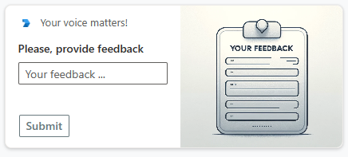

# Overview of Bot Powered Adaptive Card Extensions
Bot Powered Adaptive Card Extensions (ACEs) for Microsoft Viva Connections are a new technology to extend the Microsoft Viva Connections Dashboard using the Bot development model. Bot Powered ACEs are an addition to the already existing Viva Connections extensibility model, which is based on SharePoint Framework (SPFx) components. While with SPFx components you create client-side solutions to extend Viva Connections, using the Bot Powered ACEs you can apply server-side solutions. Depending on your goals, expertise, and scenario you can choose between these two options that are complementary and not alternative.

In the following picture, you can see an Adaptive Card Extension to collect user's feedback in action in the desktop experience of Viva Connection Dashboard. The ACE was implemented as a Bot Powered ACE.

While in the following picture you can see the same ACE rendered inside the mobile experience of the Viva Connections Dashboard.

From a developer point of view, you build the ACE once and you can benefit of it in both desktop and mobile experiences.

## Start building Bot Powered ACEs for Microsoft Viva Connections
In this series of articles, you can understand what Bot Powered Adaptive Card Extensions (ACEs) for Microsoft Viva Connections are, their architecture, and how to build real-life solutions.

The series of articles covers the following articles:
1. [Building your first Bot Powered Adaptive Card Extension](./Building-Your-First-Bot-Powered-ACE.md)
1. [Understanding Bot Powered Adaptive Card Extensions](Understanding-Bot-Powered-ACEs.md)

By reading the above articles, you're able to manage the development of Bot Powered ACEs for Microsoft Viva Connections and to apply the potential of this new technology.

In order to understand the content of this series of articles, you need to have a good understanding of how a Bot works in Microsoft Azure and in Microsoft Teams, as well as to have a basic knowledge of either .NET and C# development or TypeScript and Node.js development.
